ĐẠI HỌC PHENIKAA

**TRƯỜNG CÔNG NGHỆ THÔNG TIN PHENIKAA** 

**XÂY DỰNG NỀN TẢNG KẾT NỐI LƯU TRÚ VÀ TRẢI NGHIỆM DU LỊCH TẠI CÁC ĐIỂM DU LỊCH Ở VIỆT NAM**

**Giảng viên hướng dẫn:** *TS. Mai Thúy Nga*

**Sinh viên thực hiện:** Cao Đức Trung (23010018)

`	                               `Nguyễn Thành Nhân (23010011)

`	                               `Lê Đức Long (23010016)			

**Khoá:** K17 – 2024 – 2028

**Lớp tín chỉ:** CSE702131-1-3-25(N01)

**Chương trình đào tạo:** Chính quy

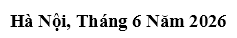

**LỜI CẢM ƠN**

Chúng tôi xin cảm ơn TS. Nguyễn Văn A đã tận tình hướng dẫn, giúp đỡ chúng tôi hoàn thành đồ án cơ sở …

**
# **LỜI CAM ĐOAN**
Chúng tôi cam đoan Đồ án cơ sở là sản phẩm trí tuệ của tập thể chúng tôi. Mọi thông tin, dữ liệu, hình ảnh, etc. được sử dụng từ các nguồn khác đều được trích dẫn đầy đủ và có thể tìm thấy các tài liệu liên quan thông qua mục tài liệu tham khảo.

Chúng tôi xin chịu trách nhiệm hoàn toàn về nội dung của Đồ án cơ sở mà chúng tôi đã nộp.

Hà Nội, ngày … tháng … năm

`  `Trần Văn A, Nguyễn Thị B (ký tên)

**
# **PHÂN CÔNG NHIỆM VỤ ĐỒ ÁN**

|**Danh sách các công việc/nhiệm vụ**|**Mô tả tóm tắt công việc**|
| :-: | :-: |
|Công việc 1|Thu thập dữ liệu|
|Công việc 2|Phân tích thiết kế|
|Công việc 3|Triển khai giải pháp|
|….||

|**TT**|**Mã sinh viên**|**Tên công việc**|**Nhiệm vụ phân công**|**Nội dung đã thực hiện**|**Đánh giá hoàn thành**|**Đánh giá đóng góp cả dự án**|
| :-: | :-: | :-: | :-: | :-: | :-: | :-: |
|1|Trần Văn A – 1234|Công việc 1|||50%|20%|
|||Công việc 2|||50%||
|||Công việc 3|||50%||
|2|Nguyễn Văn B|….|…||||

# **MỤC LỤC**
[**LỜI CAM ĐOAN	**iii****](#_toc229782119)

[**PHÂN CÔNG NHIỆM VỤ ĐỒ ÁN	**iv****](#_toc229782120)

[**DANH MỤC BẢNG BIỂU, HÌNH VẼ	**vi****](#_toc229782121)

[**CHƯƠNG 1. GIỚI THIỆU	**1****](#_toc229782122)

[**1.1**	**Đặt vấn đề	**1****](#_toc229782123)

[1.1.1	Trải nghiệm người dùng bị gặp rắc rối:	1](#_toc229782124)

[1.1.2	Hạn chế trong phương thức tìm kiếm truyền thống:	1](#_toc229782125)

[1.1.3	Thiếu sự liên kết và bỏ lỡ cơ hội bán chéo:	2](#_toc229782126)

[1.1.4	Khó khăn trong việc quản lý các tổ hợp du lịch quy mô lớn:	2](#_toc229782127)

[1.1.5	Thách thức về khả năng chịu tải của hệ thống:	2](#_toc229782128)

[**1.2**	**Các giải pháp đã có	**2****](#_toc229782129)

[1.2.1	Mô hình đại lý du lịch trực tuyến truyền thống (Booking.com, Agoda, Traveloka):	3](#_toc229782130)

[1.2.2	Mô hình nền tảng chia sẻ không gian lưu trú (như Airbnb):	3](#_toc229782131)

[1.2.3	Nền tảng chuyên biệt về vé tham quan và hoạt động (như Klook, KKday):	4](#_toc229782132)

[1.2.4	Hạn chế về mặt kiến trúc phần mềm (Kiến trúc Nguyên khối - Monolithic)	4](#_toc229782133)

[**1.3**	**Giải pháp đề xuất	**6****](#_toc229782134)

[1.3.1	Khám phá du lịch lấy địa danh làm trung tâm:	6](#_toc229782135)

[1.3.2	Tính năng giỏ hàng du lịch:	6](#_toc229782136)

[1.3.3	Gợi ý chéo thông minh:	7](#_toc229782137)

[1.3.4	Quản lý đối tác cung cấp theo phân cấp:	7](#_toc229782138)

[1.3.5	Ví điện tử trung gian và đối soát minh bạch:	7](#_toc229782139)

[1.3.6	Lựa chọn kiến trúc công nghệ	7](#_toc229782140)

[**CHƯƠNG 2. CƠ SỞ LÝ THUYẾT VÀ CÔNG NGHỆ	**9****](#_toc229782141)

[**2.1**	**Tổng quan về kiến trúc Microservices	**9****](#_toc229782142)

[**2.2**	**Mô hình CQRS (Command Query Responsibility Segregation)	**10****](#_toc229782143)

[**2.3**	**Cơ chế bảo mật bất đối xứng với JWT kết hợp RSA Keys	**10****](#_toc229782144)

[**2.4**	**Phân tích và lựa chọn công nghệ.	**11****](#_toc229782145)

[2.4.1	Node.js	11](#_toc229782146)

[2.4.2	Java và Spring Boot	13](#_toc229782147)

[2.4.3	Hệ quản trị CSDL PostgreSQL và PostGIS	14](#_toc229782148)

[2.4.4	Framework Frontend Next.js (Dựa trên React)	15](#_toc229782149)

[**2.5**	**Sơ đồ Kiến trúc hệ thống	**16****](#_toc229782150)

[**CHƯƠNG 3. PHÂN TÍCH YÊU CẦU VÀ QUY TRÌNH NGHIỆP VỤ	**17****](#_toc229782151)

[**3.1**	**Các yêu cầu và ràng buộc của hệ thống	**17****](#_toc229782152)

[3.1.1	Yêu cầu chức năng (Functional Requirements)	17](#_toc229782153)

[3.1.2	Yêu cầu phi chức năng (Non-functional Requirements)	19](#_toc229782154)

[3.1.3	Các ràng buộc của dự án (Constraints)	20](#_toc229782155)

[**3.2**	**Phân rã chức năng và Nhận diện tác nhân	**21****](#_toc229782156)

[3.2.1	Các tác nhân trong hệ thống	22](#_toc229782157)

[3.2.2	Biểu đồ phân rã chức năng (FDD - Functional Decomposition Diagram)	25](#_toc229782158)

[**3.3**	**Mô hình hóa quy trình nghiệp vụ	**29****](#_toc229782159)

[3.3.1	Bảng danh sách các quy trình nghiệp vụ cốt lõi	29](#_toc229782160)

[3.3.2	Biểu đồ hoạt động (Activity Diagram) và giải thích luồng quy trình	32](#_toc229782161)

[**3.4**	**Sơ đồ UseCase	**46****](#_toc229782162)

[3.4.1	Biểu đồ Use Case tổng quan toàn hệ thống.	47](#_toc229782163)

[3.4.2	Biểu đồ Use Case chi tiết theo đối tượng.	51](#_toc229782164)

[3.4.3	Danh sách tất cả các Use Case	60](#_toc229782165)

[**3.5**	**Đặc tả chi tiết Use Case	**67****](#_toc229782166)

[3.5.1	Phân hệ Quản lý Danh tính & Truy cập (Identity & Access Service)	68](#_toc229782167)

[3.5.2	Phân hệ Danh mục & Địa danh (Catalog & Listing Service)	101](#_toc229782168)

[3.5.3	Phân hệ Tìm kiếm & Gợi ý (Search & Recommendation Service)	139](#_toc229782169)

[3.5.4	Phân hệ Giỏ hàng & Đơn hàng (Cart & Order Service)	154](#_toc229782170)

[3.5.5	Phân hệ Tồn kho & Đặt chỗ (Booking & Inventory Service)	182](#_toc229782171)

[3.5.6	Phân hệ Thanh toán & Ví điện tử (Payment & Wallet Service)	198](#_toc229782172)

[**PHỤ LỤC *(nếu có)*	**228****](#_toc229782173)

# **DANH MỤC BẢNG BIỂU, HÌNH VẼ**

BM.CNTT.01.07 (01-…/…/2025)-BL: 5 năm

1. # **GIỚI THIỆU**
   1. ## **Đặt vấn đề**
Trong bối cảnh toàn cầu hóa và sự phát triển mạnh mẽ của công nghệ thông tin, ngành du lịch đang trải qua một cuộc chuyển đổi số toàn diện. Tại Việt Nam, xu hướng du lịch tự túc ngày càng trở nên phổ biến. Du khách hiện đại không còn ưa chuộng các chuyến đi đóng gói sẵn với lịch trình cứng nhắc; thay vào đó, họ mong muốn tự do cá nhân hóa hành trình của mình, từ việc chọn nơi lưu trú, phương tiện di chuyển cho đến các hoạt động trải nghiệm, dịch vụ văn hóa bản địa.

Tuy nhiên, quá trình tự lên kế hoạch và đặt trước các dịch vụ du lịch hiện nay đang vấp phải một rào cản lớn: “**sự phân mảnh của hệ sinh thái dịch vụ”**. Cụ thể, các vấn đề mà người dùng gặp phải gồm:
1. ### **Trải nghiệm người dùng bị gặp rắc rối:** 
Khách du lịch thường phải sử dụng quá nhiều nền tảng khác nhau để hoàn thiện một chuyến đi. Họ có thể phải dùng một ứng dụng để đặt phòng khách sạn, một ứng dụng khác để mua vé tham quan, và phải liên hệ qua mạng xã hội để thuê xe máy. Quá trình này không chỉ làm mất thời gian mà còn gây khó khăn trong việc theo dõi lịch trình tổng thể và kiểm soát chi phí.
1. ### **Hạn chế trong phương thức tìm kiếm truyền thống:** 
Hầu hết các nền tảng hiện nay tổ chức dữ liệu tìm kiếm dựa trên ranh giới hành chính (Thành phố, Tỉnh, Quận). Điều này gây khó khăn lớn khi du khách muốn tìm các dịch vụ tập trung xung quanh một "địa danh" cụ thể. Ví dụ, khi một du khách muốn khám phá Thác Bản Giốc, họ rất khó để quét và tìm ra toàn bộ các nhà nghỉ, dịch vụ thuê xe hay điểm cắm trại nằm trong bán kính 5km quanh thác trên cùng một giao diện duy nhất.
1. ### **Thiếu sự liên kết và bỏ lỡ cơ hội bán chéo:** 
Do các dịch vụ bị phân mảnh ở nhiều nơi, các nhà cung cấp dịch vụ địa phương bỏ lỡ cơ hội bán chéo sản phẩm cho nhau. Khi một khách hàng đặt phòng tại một khu vực, họ thường không nhận được các gợi ý kịp thời về các hoạt động vui chơi hoặc dịch vụ ăn uống nằm gần khách sạn và phù hợp với lịch trình của họ.
1. ### **Khó khăn trong việc quản lý các tổ hợp du lịch quy mô lớn:** 
Các tập đoàn du lịch sở hữu những siêu tổ hợp nghỉ dưỡng và vui chơi thường gặp khó khăn khi đưa hệ sinh thái của mình lên các nền tảng đại lý trực tuyến hiện tại. Các nền tảng này thường chỉ hỗ trợ mô hình cung cấp dịch vụ đơn lẻ, thiếu đi cấu trúc quản lý phân cấp để nhóm nhiều loại hình (khách sạn, cáp treo, nhà hàng) vào chung một tổ hợp quản lý.

Xuất phát từ những thực tiễn trên, việc xây dựng một nền tảng thương mại điện tử du lịch tích hợp, lấy địa danh làm điểm tựa trung tâm để kết nối liền mạch giữa lưu trú và trải nghiệm là một bài toán cấp thiết và mang tính ứng dụng thực tiễn cao.
1. ### **Thách thức về khả năng chịu tải của hệ thống:**
Đặc thù của các nền tảng OTA (Online Travel Agent) là tỷ lệ đọc và ghi cực kỳ chênh lệch. Lượng truy cập tìm kiếm, lướt xem phòng có thể cao gấp hàng trăm lần so với số lượng giao dịch thanh toán thực tế. Các hệ thống phần mềm truyền thống gặp rất nhiều khó khăn trong việc duy trì tốc độ tìm kiếm nhanh chóng mà vẫn phải đảm bảo tính toàn vẹn dữ liệu, chống đặt trùng phòng trong các dịp lễ Tết.
1. ## **Các giải pháp đã có**
Trên thị trường hiện nay đã có nhiều giải pháp và đại lý du lịch trực tuyến (OTA) hỗ trợ việc đặt dịch vụ. Dưới đây là những phân tích về các giải pháp tiêu biểu cùng những tồn tại của chúng khi áp dụng vào nhu cầu thực tế:
1. ### ` `**Mô hình đại lý du lịch trực tuyến truyền thống (Booking.com, Agoda, Traveloka):**
- *Ưu điểm:* Đây là những nền tảng lớn mạnh, sở hữu mạng lưới cơ sở lưu trú khổng lồ trên toàn cầu, giao diện chuyên nghiệp và quy trình thanh toán minh bạch, an toàn.
- *Hạn chế:* Các nền tảng này coi các dịch vụ lưu trú là giá trị cốt lõi, phần lớn bỏ qua mảng trải nghiệm bản địa của các cá nhân kinh doanh nhỏ lẻ. Hơn nữa, phương thức tìm kiếm hoàn toàn bị bó hẹp trong một cụm khu vực hành chính lớn như tỉnh hoặc thành phố, không hỗ trợ công cụ để khám phá hệ sinh thái dịch vụ xoay quanh một điểm mốc địa lý hay danh lam thắng cảnh.
  1. ### ` `**Mô hình nền tảng chia sẻ không gian lưu trú (như Airbnb):**
- *Ưu điểm:* Thúc đẩy mạnh mẽ mô hình kết nối trực tiếp giữa cá nhân với cá nhân, mang lại cho du khách cảm giác gắn kết với văn hóa bản địa sâu sắc. Hệ thống cũng đã bắt đầu mở rộng sang lĩnh vực trải nghiệm du lịch.
- *Hạn chế:*
- **Luồng thanh toán đơn lẻ:** Khách hàng đặt phòng xong bắt buộc phải thanh toán ngay. Nếu muốn đặt thêm một trải nghiệm khác, họ lại phải lặp lại thao tác thanh toán từ đầu. Nền tảng thiếu tính năng "giỏ hàng" để gom nhiều loại hình dịch vụ khác nhau để người dùng thanh toán cùng lúc.
- **Hạn chế với khách hàng doanh nghiệp:** Kiến trúc hệ thống được thiết kế chủ yếu cho các cá nhân. Các doanh nghiệp lớn không thể nhóm các dịch vụ đa dạng của họ vào chung trên nền tảng này.
  1. ### **Nền tảng chuyên biệt về vé tham quan và hoạt động (như Klook, KKday):**
- *Ưu điểm:* Giải quyết rất tốt bài toán đặt vé các khu vui chơi, tour du lịch ngắn ngày, thẻ sim và dịch vụ đưa đón.
- *Hạn chế:* Tách biệt hoàn toàn khỏi mảng dịch vụ lưu trú. Người dùng vẫn phải tự giải quyết bài toán tìm phòng nghỉ ở một nền tảng khác, làm mất đi tính đồng bộ và xuyên suốt của toàn bộ hành trình.
  1. ### **Hạn chế về mặt kiến trúc phần mềm (Kiến trúc Nguyên khối - Monolithic)**
Phần lớn các nền tảng du lịch trực tuyến (OTA – Online Travel Agency) ở giai đoạn khởi đầu thường được xây dựng dựa trên kiến trúc nguyên khối (Monolithic Architecture), trong đó toàn bộ chức năng của hệ thống được triển khai trong cùng một mã nguồn và sử dụng chung một cơ sở dữ liệu. Mô hình này giúp đơn giản hóa quá trình phát triển ban đầu, thuận tiện trong việc triển khai và giảm chi phí vận hành đối với các hệ thống quy mô nhỏ.

Tuy nhiên, khi số lượng người dùng và lưu lượng truy cập tăng mạnh, đặc biệt đối với các nền tảng có lượng truy vấn lớn như Airbnb hay Booking.com, kiến trúc nguyên khối dần bộc lộ nhiều hạn chế về khả năng mở rộng, hiệu năng và tính ổn định của hệ thống. Theo chia sẻ từ đội ngũ kỹ thuật của Airbnb, hệ thống ban đầu được xây dựng theo mô hình monolithic Ruby on Rails, tuy nhiên khi quy mô người dùng toàn cầu tăng nhanh, việc mở rộng độc lập từng chức năng và triển khai hệ thống trở nên khó khăn hơn, buộc doanh nghiệp phải chuyển dần sang mô hình service-oriented và microservice. Tương tự, Netflix cũng từng gặp các vấn đề liên quan đến khả năng mở rộng và “single point of failure” khi sử dụng kiến trúc nguyên khối trước khi chuyển đổi sang microservice để tăng khả năng chịu tải và tính linh hoạt của hệ thống.

Như đã biết, đặc thù của các nền tảng OTA là lượng truy vấn tìm kiếm và xem thông tin thường lớn hơn rất nhiều so với số lượng giao dịch đặt phòng thực tế, khiến hệ thống phải xử lý đồng thời khối lượng lớn các tác vụ đọc dữ liệu trong thời gian ngắn. Điều này làm cho các hạn chế của kiến trúc nguyên khối ngày càng rõ rệt khi hệ thống mở rộng quy mô. Một số điểm yếu tiêu biểu của kiến trúc này bao gồm:

- **Lãng phí tài nguyên khi mở rộng:** Khi lượng tìm kiếm tăng đột biến, hệ thống bắt buộc phải nhân bản toàn bộ ứng dụng, gây tiêu tốn tài nguyên máy chủ. 
  - **Ví dụ:** Đặc thù của ngành du lịch là tỷ lệ xem cao hơn rất nhiều so với tỷ lệ đặt phòng thực tế, có thể lên tới mức 1000:1. Trong các dịp cao điểm lễ Tết, nếu chỉ cần mở rộng module Tìm kiếm để đáp ứng lượng khách lướt xem, kiến trúc nguyên khối bắt buộc phải nhân bản cả những module nặng nề không cần thiết như Thanh toán hay Quản lý hóa đơn, gây lãng phí RAM và CPU.
- **Nút thắt cổ chai cơ sở dữ liệu:** Mọi luồng truy vấn tìm kiếm và giao dịch ghi dữ liệu đều đổ dồn vào một cơ sở dữ liệu duy nhất. 
  - **Ví dụ:** Khi hàng ngàn người dùng cùng thực hiện truy vấn lọc phòng trống, đồng thời có hàng chục người dùng khác nhấn thanh toán đặt phòng, CSDL chung sẽ gặp hiện tượng khóa dữ liệu, dẫn đến nghẽn cổ chai làm treo toàn bộ hệ thống.
- **Rủi ro điểm lỗi duy nhất:** Do các chức năng phụ thuộc chặt chẽ vào nhau, lỗi ở một tính năng nào đó có thể khiến toàn bộ hệ thống hoạt động không ổn định. 
  - **Ví dụ:** Một bản cập nhật bị lỗi hoặc tràn bộ nhớ ở tính năng tải ảnh đánh giá của người dùng hoàn toàn có thể làm sập toàn bộ tiến trình cấp phát phòng và luồng đặt phòng, gây thiệt hại nghiêm trọng về doanh thu.

**Tóm lại:** Nhìn chung, các nền tảng hiện tại đều thực hiện tốt một mảnh ghép riêng biệt trong bức tranh tổng thể của ngành du lịch. Tuy nhiên, thị trường vẫn đang thiếu vắng một nền tảng "tất cả trong một" thực sự. Một nơi mà người dùng có thể bắt đầu hành trình bằng nguồn cảm hứng từ một địa danh, sau đó tự do lắp ghép nơi ở, trải nghiệm và dịch vụ thành một giỏ hàng duy nhất và thanh toán tập trung.
1. ## **Giải pháp đề xuất**
Để giải quyết triệt để những hạn chế nêu trên, đồ án đề xuất xây dựng **GoTravel - Nền tảng kết nối lưu trú và trải nghiệm du lịch lấy địa danh làm trung tâm**.

Giải pháp không đi theo lối mòn của các đại lý trực tuyến truyền thống, mà hoạt động dựa trên triết lý: *"Khách hàng đến vì địa danh, và nền tảng cung cấp toàn bộ hệ sinh thái để họ thuộc về nơi đó"*. Dưới đây là mô tả tổng quan về các đặc điểm nổi bật của giải pháp đề xuất:
1. ### **Khám phá du lịch lấy địa danh làm trung tâm:**
Thay vì sử dụng thanh tìm kiếm theo tên tỉnh thành khô khan, hệ thống tiếp cận người dùng bằng hình ảnh trực quan của các địa danh nổi tiếng. Khi người dùng chọn một địa danh, hệ thống sẽ sử dụng thuật toán truy vấn không gian để quét và hiển thị toàn bộ khách sạn, tour du lịch và dịch vụ tiện ích nằm trong bán kính xung quanh địa danh đó.
1. ### **Tính năng giỏ hàng du lịch:**
Hệ thống cho phép người dùng tự do lắp ghép các phần của chuyến đi. Họ có thể thêm một phòng nghỉ (tính tiền theo đêm), hai vé tham quan (tính theo sức chứa) và dịch vụ thuê xe máy (tính theo lượt) vào chung một giỏ hàng. Giải pháp cung cấp luồng thanh toán chung một lần, đi kèm với cơ chế khóa chỗ tạm thời trong cơ sở dữ liệu để ngăn chặn tình trạng đặt trùng phòng hoặc bán vượt quá số lượng.
1. ### **Gợi ý chéo thông minh:**
Tận dụng cơ sở dữ liệu về vị trí và thời gian, hệ thống sẽ đưa ra các gợi ý dịch vụ bổ trợ ngay trong quá trình khách hàng thêm sản phẩm vào giỏ. Nếu du khách vừa chọn một khách sạn, hệ thống tự động chắt lọc và đề xuất các trải nghiệm diễn ra trong cùng khoảng thời gian và có vị trí địa lý gần với khách sạn đó nhất.
1. ### **Quản lý đối tác cung cấp theo phân cấp:**
Giải pháp cung cấp công cụ quản lý chuyên biệt cho hai nhóm cung cấp dịch vụ:

- **Cá nhân:** Được hỗ trợ tính năng định danh điện tử và quản lý các dịch vụ đơn lẻ một cách linh hoạt.
- **Doanh nghiệp:** Được cung cấp công cụ để khởi tạo nhiều dịch vụ trong trang doanh nghiệp, cho phép nhóm nhiều khách sạn, khu vui chơi và nhà hàng trực thuộc vào chung một hệ thống quản lý tổng thể.
  1. ### **Ví điện tử trung gian và đối soát minh bạch:**
Để đảm bảo an toàn tài chính cho cả người mua và người bán, hệ thống đóng vai trò trung gian giữ tiền của khách hàng. Dòng tiền chỉ được đối soát, trừ phí hoa hồng và giải ngân vào tài khoản của nhà cung cấp sau khi du khách đã sử dụng dịch vụ hoàn tất và không có tranh chấp phát sinh.
1. ### **Lựa chọn kiến trúc công nghệ**
Để đáp ứng các yêu cầu nghiệp vụ phức tạp và lưu lượng truy cập lớn, hệ thống GoTravel đề xuất không sử dụng kiến trúc nguyên khối (Monolithic) truyền thống, mà áp dụng mô hình phân tán hiện đại với các đặc điểm sau:

- **Kiến trúc vi dịch vụ (Microservices):** Hệ thống được chia nhỏ thành các phân hệ nghiệp vụ hoạt động độc lập, bao gồm: Quản lý tài khoản và phân quyền, thanh toán và ví điện tử, lưu trữ và truyền thông, quản lý danh mục, quản lý tồn kho, xử lý đơn hàng và tìm kiếm không gian. Việc phân rã này giúp hệ thống dễ dàng mở rộng và cô lập lỗi, đảm bảo sự cố ở một dịch vụ không làm gián đoạn toàn bộ nền tảng. 
- **Mô hình phân tách luồng Đọc và Ghi:** Để tối ưu hiệu năng, hệ thống tách biệt hoàn toàn luồng xử lý dữ liệu. Luồng Ghi xử lý các giao dịch tài chính, khóa phòng phức tạp sẽ được đảm nhiệm bởi Java Spring Boot để đảm bảo tính toàn vẹn dữ liệu. Ngược lại, luồng đọc và tìm kiếm đòi hỏi tốc độ truy xuất cao sẽ do Node.js xử lý, giúp khắc phục tình trạng quá tải cơ sở dữ liệu thường gặp ở các nền tảng OTA.
- **Tối ưu SEO và Trải nghiệm người dùng (UX):** Nền tảng sử dụng Framework Next.js (cơ chế SSR) cho phía Frontend. Điều này giúp hệ thống khắc phục điểm yếu của React truyền thống, cho phép các công cụ tìm kiếm (Google) dễ dàng lập chỉ mục các "Địa danh" và "Dịch vụ", thu hút lượng lớn khách hàng tự nhiên đồng thời mang lại trải nghiệm mượt mà trên mọi thiết bị.

|**Tiêu chí**|**Kiến trúc Monolithic**|**Kiến trúc Microservices**|
| :- | :- | :- |
|**Khả năng mở rộng**|Phải mở rộng toàn bộ hệ thống, tốn kém tài nguyên.|Chỉ mở rộng các Service bị nghẽn (ví dụ: Node.js Search), tiết kiệm chi phí tối đa.|
|**Độ tin cậy**|Một lỗi nhỏ có thể đánh sập toàn bộ hệ thống.|Lỗi được cô lập. Khi một service bị sập hoặc lỗi thì các service khác vẫn hoạt động bình thường.|
|**Quản lý Dữ liệu**|Một DataBase duy nhất gánh toàn bộ tải toàn bộ đọc và viết.|Áp dụng phân mảnh database cho từng Service (Mỗi service sẽ có 1 database) và CQRS tách biệt đọc và ghi dữ liệu, phân tải truy vấn và dữ liệu.|
|**Tính linh hoạt Công nghệ**|Bị khóa chặt vào một ngôn ngữ lập trình duy nhất.|Đa dạng công nghệ: Java Spring Boot xử lý logic lõi, Node.js xử lý tìm kiếm tốc độ cao.|

*Bảng 1.1: So sánh hiệu quả giữa kiến trúc Monolithic truyền thống và Microservices đề xuất*

1. # **CƠ SỞ LÝ THUYẾT VÀ CÔNG NGHỆ**
Chương này trình bày các cơ sở lý thuyết làm nền tảng cho việc thiết kế và phát triển hệ thống GoTravel. Đồng thời, chương cũng đi sâu phân tích lý do lựa chọn các công nghệ cốt lõi nhằm giải quyết bài toán đặc thù của nền tảng thương mại điện tử du lịch (OTA) có lưu lượng truy cập cao.
1. ## **Tổng quan về kiến trúc Microservices**
Kiến trúc vi dịch vụ (Microservices Architecture) là một phương pháp phát triển phần mềm trong đó một ứng dụng lớn được chia nhỏ thành một tập hợp các dịch vụ độc lập. Mỗi dịch vụ chạy trong một tiến trình riêng biệt, giao tiếp với nhau qua các giao thức (thường là HTTP RESTful API) và chịu trách nhiệm cho một nghiệp vụ duy nhất.

Đối với hệ thống GoTravel, kiến trúc Microservices được áp dụng dựa trên các nguyên tắc cốt lõi sau:

- **Phân tách theo miền nghiệp vụ:** Hệ thống được chia thành các miền độc lập bao gồm: Quản lý Tài khoản và Phân quyền, Thanh toán và Ví điện tử, Lưu trữ hình ảnh, Quản lý Danh mục, Quản lý Tồn kho, Xử lý Đơn hàng, Tìm kiếm Không gian và Hệ thống Gợi ý dịch vụ.
- **Cơ sở dữ liệu độc lập:** Mỗi Microservice sở hữu một Database riêng biệt. Việc Inventory Service bị quá tải khi cập nhật số lượng phòng trống sẽ không làm ảnh hưởng đến tốc độ truy xuất dữ liệu người dùng của Identity Service.
- **Tính biệt lập và khả năng chịu lỗi:** Nếu một dịch vụ gặp sự cố (ví dụ: Service Gợi ý bị sập), người dùng vẫn có thể thực hiện thao tác thanh toán đặt phòng một cách bình thường.
  1. ## **Mô hình CQRS (Command Query Responsibility Segregation)**
- Đặc thù của một nền tảng OTA là sự chênh lệch khổng lồ giữa số lượng yêu cầu Đọc (Khách hàng lướt xem phòng, tìm kiếm địa danh) và yêu cầu Ghi (Khách hàng nhấn nút thanh toán đặt phòng). Tỷ lệ này thường rơi vào mức 1000:1. Nếu sử dụng chung một mô hình dữ liệu cho cả đọc và ghi, hệ thống sẽ gặp phải tình trạng khóa dữ liệu và suy giảm hiệu năng nghiêm trọng.
- Để giải quyết vấn đề này, hệ thống này áp dụng mô hình CQRS – Phân tách trách nhiệm đọc và ghi:
- **Luồng Command (Ghi/Sửa/Xóa):** Chịu trách nhiệm thực thi các logic kinh doanh phức tạp, kiểm tra tính hợp lệ và đảm bảo tính toàn vẹn dữ liệu. Trong GoTravel, luồng này được xử lý bởi các Core Service.
- **Luồng Query (Đọc/Tìm kiếm):** Chịu trách nhiệm truy xuất dữ liệu cực nhanh để hiển thị cho người dùng. Dữ liệu ở luồng Query thường được phi chuẩn hóa hoặc đồng bộ từ luồng command để tối ưu tốc độ đọc.
- Sự kết hợp giữa Microservices và CQRS giúp GoTravel tối ưu hóa tài nguyên phần cứng một cách triệt để, chỉ mở rộng những luồng thực sự cần thiết.
  1. ## **Cơ chế bảo mật bất đối xứng với JWT kết hợp RSA Keys**
- Trong kiến trúc Monolithic, xác thực người dùng thường dùng Session tập trung. Tuy nhiên, trong Microservices, các request từ người dùng sẽ đi qua API Gateway và phân tán đến hàng loạt các service khác nhau. Nếu các service này liên tục gọi về Identity Service để kiểm tra quyền hạn, Identity Service sẽ trở thành điểm nghẽn cổ chai.
- Để giải quyết, đồ án sử dụng **JSON Web Token (JWT) kết hợp thuật toán mã hóa bất đối xứng RSA** thông qua cơ chế JWKS (JSON Web Key Set).
- **Quá trình cấp phát:** Khi người dùng đăng nhập thành công, Identity Service như là người gác cổng sẽ sử dụng khóa riêng tư gọi là private key để ký số lên JWT
- **Quá trình xác thực:** Khóa công khai gọi là public key được Identity Service công bố qua một endpoint công khai (/.well-known/jwks.json). Các service khác như: Catalog, Inventory, Order tự động tải Public Key này về và cache lại trong bộ nhớ. Khi nhận được request mang theo JWT, các service đích sẽ dùng public key để tự xác thực tính hợp lệ của token ngay tại cục bộ mà không cần gọi network về Identity Service.
- Cơ chế này mang lại độ bảo mật ở mức doanh nghiệp, đảm bảo nguyên tắc Zero-Trust giữa các Microservices nhưng vẫn giữ được tốc độ phản hồi tính bằng mili-giây.
  1. ## **Phân tích và lựa chọn công nghệ.**
- Việc lựa chọn công nghệ trong kiến trúc Microservices không tuân theo quy tắc "Một kích cỡ vừa cho tất cả". Hệ thống GoTravel áp dụng triết lý **“Sử dụng đa ngôn ngữ và đa cơ sở dữ liệu”**, trong đó mỗi công nghệ được lựa chọn dựa trên sự cân bằng giữa ưu điểm, nhược điểm và đặc thù của từng Service.
  1. ### **Node.js**
**a. Ưu điểm:**

- **Xử lý nhiều yêu cầu cùng lúc mà không bị nghẽn:** Node.js sở hữu cơ chế hoạt động cực kỳ linh hoạt, cho phép hệ thống duy trì và phục vụ hàng chục ngàn người dùng kết nối tại cùng một thời điểm với mức tiêu hao bộ nhớ rất thấp.
- **Tốc độ khởi động nhanh:** Nhẹ, triển khai nhanh, rất phù hợp cho các microservice cần nhân bản service liên tục khi 1 service gặp vấn đề liên tục.
- **Cùng ngôn ngữ với Frontend:** Sử dụng chung JavaScript hoặc TypeScript với ReactJS, giúp Fullstack và Frontend Developer dễ dàng tham gia phát triển.

**b. Nhược điểm:**

- **Đơn luồng:** Không phù hợp cho các tác vụ tính toán nặng về CPU như xử lý thuật toán phức tạp, mã hóa video, vì sẽ làm "nghẽn" luồng chính.
- **Quản lý luồng giao dịch yếu:** Thiếu các framework hỗ trợ quản lý giao dịch ACID mạnh mẽ như Spring Boot của Java.

**Tóm lại:** Từ sự phân tích trên, Node.js được chỉ định đảm nhận các Service thiên về **Điều hướng mạng** và **Truy xuất dữ liệu** với tốc độ cao:

- **Cổng giao tiếp hệ thống:** Đây là điểm tiếp nhận toàn bộ lưu lượng truy cập của người dùng. Nhờ khả năng xử lý luồng dữ liệu vào và ra (I/O) mạnh mẽ, Node.js giúp cổng giao tiếp luôn duy trì trạng thái ổn định, không bị tắc nghẽn ngay cả khi hệ thống phải chịu tải cao.
- **Dịch vụ tìm kiếm và định vị:** Đặc thù của tác vụ tìm kiếm là việc liên tục gửi các truy vấn xuống cơ sở dữ liệu và nhận kết quả trả về. Node.js tỏ ra vô cùng vượt trội khi xử lý các thao tác truy xuất dữ liệu này với tốc độ rất cao.
- **Hệ thống gợi ý dịch vụ:** Tác vụ này đòi hỏi tốc độ phản hồi gần như tức thì để hiển thị các dịch vụ liên quan ngay thời điểm khách hàng thêm sản phẩm vào giỏ. Việc ứng dụng Node.js giúp luồng xử lý diễn ra trơn tru, đảm bảo không làm chậm trễ độ trễ (latency) của quy trình thanh toán chính.
- **Dịch vụ truyền thông và lưu trữ:** Tác vụ truyền tải các tệp tin hình ảnh từ thiết bị của người dùng lên các nền tảng đám mây hoạt động vô cùng hiệu quả nhờ vào cơ chế truyền phát dữ liệu liên tục đặc trưng của Node.js.
  1. ### **Java và Spring Boot**
**a. Ưu điểm:**

- **Đa luồng thực sự:** Tận dụng tối đa sức mạnh của CPU đa nhân, xử lý các tác vụ logic phức tạp song song rất tốt.
- **Quản trị Giao dịch xuất sắc:** Framework Spring Boot với thư viện Spring Data JPA cung cấp annotation @Transactional, giúp đảm bảo tính toàn vẹn dữ liệu (ACID) cực kỳ nghiêm ngặt. Nếu có lỗi giữa chừng, toàn bộ dữ liệu tự động Rollback.

**b. Nhược điểm:**

- **Tiêu tốn bộ nhớ:** Java Virtual Machine (JVM) cần nhiều RAM để chạy. Khởi động chậm hơn Node.js.
- **Mã nguồn cồng kềnh:** Thời gian phát triển tính năng thường lâu hơn do phải tuân thủ nghiêm ngặt các quy tắc hướng đối tượng, Interface, DTO.

**Tóm lại:** Java được chọn làm "Trái tim" của hệ thống, gánh vác toàn bộ **Luồng ghi** và **Nghiệp vụ tài chính cốt lõi**:

- **Identity và Access Service:** Quản lý vòng đời tài khoản, xác thực bảo mật và phân quyền phức tạp (RBAC) cho 4 nhóm đối tượng. Nơi xử lý logic mã hóa mật khẩu và cấp phát JWT kết hợp RSA Keys đảm bảo an toàn tuyệt đối.
- **Booking và Inventory Service:** Phân hệ chuyên trách giải quyết bài toán chống đặt trùng phòng. Điểm cốt lõi của phân hệ này là việc áp dụng cơ chế khóa lạc quan thông qua tính năng @Version của Spring JPA, giúp cơ sở dữ liệu tự động phát hiện và ngăn chặn các giao dịch đặt trùng khe thời gian.
- **Cart & Order Service và Payment Service:** Nơi dòng tiền chảy qua. Đòi hỏi tính chính xác của số thập phân và sự toàn vẹn giao dịch (ACID). Một đơn hàng lỗi phải được Rollback ngay lập tức.
- **Catalog và Listing Service:** Nơi quản lý dữ liệu gốc khổng lồ với các nghiệp vụ duyệt và phân quyền chặt chẽ.
  1. ### **Hệ quản trị CSDL PostgreSQL và PostGIS**
**a. Ưu điểm:**

- Là CSDL quan hệ mã nguồn mở mạnh nhất thế giới, tuân thủ ACID tuyệt đối.
- Hỗ trợ kiểu dữ liệu **JSONB** từ phiên bản 17 trở lên, cho phép lưu trữ dữ liệu phi cấu trúc (NoSQL-like) ngay trong lòng CSDL quan hệ. Rất phù hợp cho việc lưu trữ các thuộc tính linh hoạt của Khách sạn, Tour, Dịch vụ mà không cần tạo hàng chục bảng rời rạc.
- **Extension PostGIS:** Biến PostgreSQL thành một hệ thống CSDL Không gian thực thụ, hỗ trợ Index không gian (GiST) và tính toán khoảng cách tọa độ GPS siêu tốc.

**b. Nhược điểm:**

- Khó mở rộng theo chiều ngang (Horizontal Scaling và Sharding) hơn so với các CSDL thuần NoSQL như MongoDB.

**Tóm lại:**

- **Phân chia kho dữ liệu độc lập:** Hệ thống sử dụng chung một máy chủ quản lý dữ liệu nhưng được chia thành **5 phân vùng lưu trữ hoàn toàn tách biệt** cho từng phân hệ nghiệp vụ là: (auth\_db, catalog\_db, inventory\_db, order\_db, payment\_db). Cơ chế này giúp dữ liệu được quản lý rành mạch, bảo mật và không bị can thiệp chéo lẫn nhau.
- **Tối ưu hóa khả năng tìm kiếm theo không gian:** Phân hệ Tìm kiếm được cấp quyền "chỉ đọc" để truy cập trực tiếp vào kho dữ liệu danh mục. Thay vì tìm kiếm máy móc theo từ khóa văn bản thông thường, hệ thống **sử dụng công cụ tính toán tọa độ địa lý** để quét và khoanh vùng chính xác các dịch vụ nằm trong **bán kính thực tế xung quanh một địa danh**
  1. ### **Framework Frontend Next.js (Dựa trên React)**
**a. Ưu điểm:**

- **Kết xuất phía máy chủ (SSR) và Tạo trang tĩnh (SSG):** Đây là "vũ khí tối thượng" của Next.js, khắc phục nhược điểm chí mạng của các ứng dụng React thông thường là kém thân thiện với công cụ tìm kiếm. Next.js kết xuất sẵn mã HTML từ máy chủ trước khi gửi về trình duyệt, giúp trang web tải nhanh hơn và đạt điểm SEO tối đa.
- **Hệ sinh thái mạnh mẽ và Tối ưu trải nghiệm (UX/UI):** Kế thừa toàn bộ sức mạnh cốt lõi của React, đồng thời cung cấp sẵn các thành phần tối ưu hóa nâng cao như next/image (tự động nén và thay đổi kích thước ảnh theo thiết bị) hay next/font, giúp ứng dụng luôn mượt mà ngay cả trên mạng 3G/4G.

` `**b. Nhược điểm:**

- **Đòi hỏi tài nguyên máy chủ để vận hành:** Khác với một ứng dụng React tĩnh có thể lưu trữ miễn phí ở bất cứ đâu, Next.js khi sử dụng cơ chế SSR bắt buộc phải có một máy chủ Node.js chạy ngầm liên tục để kết xuất mã HTML, làm tăng chi phí và độ phức tạp khi triển khai hạ tầng.
- **Đường cong học tập (Learning Curve) cao:** Đòi hỏi lập trình viên phải có tư duy rạch ròi, phân biệt rõ ràng giữa các thành phần chạy trên máy chủ (Server Components) và các thành phần tương tác trên trình duyệt (Client Components).

**Tóm lại:**

- **Tối ưu hóa SEO cho mô hình Landmark-Centric:** Đảm bảo các trang chi tiết về "Địa danh nổi tiếng" (Landmarks) và "Dịch vụ" (Listings) được Google lập chỉ mục (index) dễ dàng, giúp nền tảng thu hút được lượng lớn khách hàng tự nhiên.
- **Trải nghiệm người dùng (UX) liền mạch:** Xây dựng giao diện tương tác cho cả 4 nhóm đối tượng, giao tiếp trực tiếp với cổng API Gateway của Node.js để hiển thị dữ liệu Giỏ hàng, Bản đồ và Gợi ý chéo theo thời gian thực.
  1. ## **Sơ đồ Kiến trúc hệ thống**
Dựa trên việc phân tích và lựa chọn công nghệ, dưới đây là sơ đồ kiến trúc tổng thể của hệ thống GoTravel, thể hiện rõ sự phân tách giữa nhóm nền tảng và nghiệp vụ doanh nghiệp, cũng như luồng giao tiếp giữa các Service.

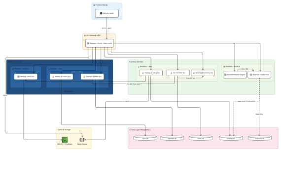\
*Hình 2.1: Sơ đồ kiến trúc tổng quan hệ thống*

1. # **PHÂN TÍCH YÊU CẦU VÀ QUY TRÌNH NGHIỆP VỤ**
   1. ## **Các yêu cầu và ràng buộc của hệ thống**
Để đảm bảo hệ thống GoTravel giải quyết triệt để bài toán kinh doanh của một nền tảng OTA (Online Travel Agent) đa dịch vụ, đồng thời duy trì sự ổn định dưới áp lực truy cập lớn, các yêu cầu và ràng buộc của hệ thống được định nghĩa một cách nghiêm ngặt từ giai đoạn phân tích thiết kế.
1. ### **Yêu cầu chức năng (Functional Requirements)**
Yêu cầu chức năng mô tả những hành động mà hệ thống phải thực hiện, được phân chia theo 5 nhóm đối tượng (Actor) tham gia vào nền tảng:

**a. Nhóm Khách vãng lai (Guest)**

- **Tìm kiếm và Khám phá:** Cho phép tìm kiếm Khách sạn, Trải nghiệm (Tour) và Dịch vụ tiện ích xung quanh một Địa danh (Landmark) thay vì chỉ tìm theo Tỉnh/Thành phố thông thường.
- **Lọc và Sắp xếp:** Có khả năng lọc theo giá, hạng sao, loại hình dịch vụ, và sắp xếp theo độ phổ biến hoặc đánh giá tốt nhất.
- **Xem chi tiết:** Xem thông tin chi tiết dịch vụ, hình ảnh, tiện ích, và đọc các đánh giá (Review) từ những người dùng trước.

**b. Nhóm Khách hàng có tài khoản (User)**

- **Quản lý tài khoản:** Đăng ký, đăng nhập, quên mật khẩu và quản lý hồ sơ cá nhân.
- **Giỏ hàng hợp nhất (Universal Cart):** Cho phép người dùng thêm nhiều loại hình dịch vụ khác nhau (Lưu trú, Tour, Dịch vụ tiện ích) vào chung một giỏ hàng và thanh toán tập trung trong một lần duy nhất.
- **Đặt phòng và Thanh toán (Booking & Checkout):** Thực hiện giao dịch đặt chỗ, hệ thống phải giữ chỗ tạm thời (soft-lock) trong 15 phút để người dùng hoàn tất thanh toán.
- **Đánh giá và Phản hồi:** Được quyền để lại điểm đánh giá (Rating) và bình luận (Review) cho những dịch vụ đã trải nghiệm thành công. Có quyền sửa/xóa đánh giá trong khoảng thời gian quy định.
- **Xem lịch sử chuyến đi:** Quản lý danh sách các đơn hàng (đang chờ, đã hoàn thành, đã hủy).

**c. Nhóm Chủ cung cấp dịch vụ cá nhân (Host)**

- **Nâng cấp tài khoản:** Gửi hồ sơ đăng ký trở thành Host để Ban quản trị xét duyệt.
- **Quản lý Dịch vụ (Catalog Management):** Thêm, sửa, vô hiệu hóa các sản phẩm kinh doanh (Phòng, Tour, Dịch vụ) với các thuộc tính động (Ví dụ: Phòng thì có số giường, Tour thì có lịch trình).
- **Quản lý Đơn hàng:** Xem danh sách khách hàng đã đặt dịch vụ, xác nhận hoặc theo dõi trạng thái thanh toán.
- **Quản lý Doanh thu và Dòng tiền (Financial Management):** Theo dõi tổng doanh thu thực nhận theo thời gian thực. Thống kê chi tiết dòng tiền vào từ các đơn hàng thành công. Quản lý Ví điện tử (Escrow Wallet) để theo dõi số dư đang bị hệ thống đóng băng (chờ khách hoàn tất trải nghiệm) và số dư khả dụng để đặt lệnh rút tiền (Payout) về tài khoản ngân hàng.
- **Tương tác khách hàng:** Có quyền trả lời (Reply) các bài đánh giá của khách hàng để bảo vệ uy tín thương hiệu.

**d. Nhóm Doanh nghiệp quản lý Tổ hợp (Enterprise)**

- Kế thừa toàn bộ quyền hạn của Host.
- **Quản lý Tổ hợp (Complex):** Được phép tạo và quản lý một Tổ hợp sinh thái (Ví dụ: Khu du lịch sinh thái bao gồm nhiều Khách sạn và Khu vui chơi bên trong).
- **Quản lý tập trung:** Quản lý các dịch vụ (Listing) theo từng Tổ hợp tương ứng.
- **Phân tích Doanh thu chuyên sâu (Advanced Revenue Analytics):** Cung cấp hệ thống báo cáo tài chính tổng hợp cho toàn bộ siêu tổ hợp, hoặc bóc tách chi tiết doanh thu, dòng tiền theo từng dịch vụ/khách sạn con. Hỗ trợ tính năng đối soát doanh nghiệp và yêu cầu xuất hóa đơn (VAT) cho các khoản phí nền tảng.

**e. Nhóm Quản trị viên (Admin)**

- **Kiểm duyệt Dữ liệu:** Phê duyệt hoặc từ chối hồ sơ đăng ký Host/Enterprise của người dùng.
- **Quản lý Địa danh (Landmark):** Phê duyệt các Đề xuất địa danh mới từ người dùng, cập nhật tọa độ GPS để hỗ trợ công cụ tìm kiếm không gian.
- **Quản lý Vi phạm:** Khóa (Ban) các tài khoản vi phạm chính sách và ẩn các bài đánh giá có ngôn từ thô tục.
  1. ### **Yêu cầu phi chức năng (Non-functional Requirements)**
Đây là các tiêu chuẩn về mặt chất lượng kiến trúc mà hệ thống phải đạt được, tận dụng tối đa thế mạnh của kiến trúc Microservices và mô hình CQRS.

- **Hiệu năng và Thời gian phản hồi (Performance & Latency):** \*
- ` `Các luồng truy vấn đọc (Tìm kiếm, Gợi ý) phải đạt thời gian phản hồi dưới 200ms thông qua việc tối ưu I/O bất đồng bộ của Node.js.
- Tốc độ đồng bộ dữ liệu giữa luồng Command (Java) và luồng Query (Node.js) phải diễn ra gần như theo thời gian thực (Near real-time).
- **Tính bảo mật (Security):**
- Áp dụng xác thực không trạng thái (Stateless Authentication) bằng **JWT (JSON Web Token)** kết hợp thuật toán mã hóa bất đối xứng **RSA**. Public Keys được chia sẻ nội bộ giúp các dịch vụ tự xác thực mà không làm nghẽn Identity Service.
- Mật khẩu người dùng phải được băm (hash) bằng thuật toán Bcrypt trước khi lưu vào CSDL.
- **Khả năng mở rộng (Scalability):**
- Áp dụng nguyên lý *Database-per-service*, cho phép từng microservice được scale độc lập. Ví dụ, trong mùa cao điểm du lịch, hệ thống chỉ cần nhân bản các container của Node.js Search Service mà không cần cấp thêm tài nguyên thừa cho Payment Service.
- **Khả năng chịu lỗi và Tính sẵn sàng (Fault Tolerance & Availability):**
- Hệ thống phải hoạt động theo nguyên tắc "Cô lập lỗi". Nếu dịch vụ Gợi ý (Recommendation Engine) gặp sự cố, khách hàng vẫn có thể tìm kiếm và đặt phòng bình thường.
- **Tính toàn vẹn dữ liệu (Data Integrity):**
- Các luồng thay đổi trạng thái nhạy cảm (như Khóa phòng chống Overbooking, Trừ tiền) bắt buộc phải tuân thủ chuẩn giao dịch ACID, được quản lý chặt chẽ thông qua @Transactional và Optimistic Locking của Java Spring Boot.
  1. ### **Các ràng buộc của dự án (Constraints)**
Trong quá trình phát triển và vận hành, hệ thống phải tuân thủ các giới hạn và quy định sau:

- **Ràng buộc về Triển khai và Vận hành (Server & Network):**
- Ứng dụng phải được thiết kế theo chuẩn Native-Cloud, ưu tiên đóng gói bằng Docker (Containerization) để đảm bảo tính đồng nhất giữa môi trường Development và Production.
- Mọi luồng giao tiếp từ Client bắt buộc phải đi qua một điểm duy nhất là **API Gateway** để kiểm soát định tuyến và giới hạn tần suất (Rate Limiting). Tuyệt đối không để lộ các cổng (port) của các service nội bộ ra Internet.
- **Ràng buộc về Kinh tế (Chi phí):**
- Do là dự án đồ án thực nghiệm, hệ thống bị giới hạn về ngân sách duy trì máy chủ Cloud. Giải pháp là tối đa hóa việc sử dụng các công nghệ mã nguồn mở, miễn phí (Java, Node.js, PostgreSQL, ReactJS) thay vì dùng các dịch vụ trả phí đắt đỏ.
- Kiến trúc Microservices mặc dù tiêu tốn RAM ban đầu để chạy nhiều process, nhưng phải được cấu hình tối ưu để có thể chạy được trên các cụm máy chủ cấu hình tầm trung.
- **Ràng buộc về Đạo đức và Pháp lý (Ethical & Legal Constraints):**
- **Bảo vệ dữ liệu cá nhân:** Tuân thủ quy định về bảo vệ dữ liệu cá nhân (tham chiếu Nghị định 13/2023/NĐ-CP của Chính phủ Việt Nam). Mật khẩu và thông tin định danh của người dùng không được phép tiết lộ hoặc lưu trữ dạng rõ (plaintext).
- **Tính minh bạch:** Luồng đặt phòng và tính tiền phải hiển thị rõ ràng các chi phí phát sinh, phí dịch vụ. Các đánh giá (Review) phải xuất phát từ người dùng đã thực sự trải nghiệm dịch vụ (Xác minh thông qua Order Service) để chống lại nạn đánh giá ảo (Fake reviews).
  1. ## **Phân rã chức năng và Nhận diện tác nhân**
Việc phân rã chức năng và nhận diện chính xác các tác nhân (Actors) là bước cơ sở để thiết kế luồng quy trình nghiệp vụ và xây dựng kiến trúc phân quyền (Role-Based Access Control - RBAC) cho toàn bộ hệ thống. Hệ thống GoTravel áp dụng mô hình kiến trúc **Account - Profile**, trong đó mỗi người dùng đều sở hữu một tài khoản định danh (Account) cấp độ hệ thống, sau đó được ánh xạ với các hồ sơ (Profile) khác nhau để cấp quyền và truy xuất dữ liệu chuyên biệt.
1. ### **Các tác nhân trong hệ thống**
Dưới đây là 5 nhóm tác nhân chính tham gia vào nền tảng:

**a. Khách vãng lai (Guest)**

- **Đặc điểm:** Là những người dùng truy cập vào nền tảng nhưng chưa đăng nhập hoặc chưa đăng ký tài khoản.
- **Vai trò & Hành vi:** Đây là nhóm đối tượng tiềm năng mang lại lưu lượng truy cập (traffic) cho hệ thống. Guest có quyền trải nghiệm toàn bộ các tính năng "Khám phá" như: Tương tác với Hero Banner, tìm kiếm dịch vụ xung quanh địa danh, xem chi tiết thông tin phòng/tour, xem bảng giá và đọc các đánh giá của người dùng trước.
- **Giới hạn:** Guest không có quyền thêm dịch vụ vào giỏ hàng, không được thanh toán và không được để lại đánh giá. Hệ thống sẽ yêu cầu Guest đăng nhập hoặc đăng ký tài khoản khi họ thực hiện các hành động này.

**b. Khách du lịch có tài khoản (End-User)**

- **Đặc điểm:** Là người dùng cuối, nhóm đối tượng trực tiếp tạo ra doanh thu cho nền tảng và các nhà cung cấp. Yêu cầu hệ thống phải mang lại trải nghiệm mượt mà, ít rào cản thao tác.
- **Vai trò & Hành vi:** 
- Quản lý hồ sơ cá nhân và lịch sử chuyến đi.
  - Tương tác với **Giỏ hàng hợp nhất (Universal Cart)**: Thêm, sửa, xóa các đa dịch vụ (Lưu trú, Trải nghiệm, Dịch vụ tiện ích).
  - Thực hiện thanh toán gộp một lần (Single Checkout) thông qua cổng thanh toán điện tử (VNPay).
  - Đánh giá và xếp hạng (Rating & Review) độc lập cho từng dịch vụ sau khi chuyến đi hoàn tất.

**c. Chủ cung cấp dịch vụ cá nhân (Individual Host)**

- **Đặc điểm:** Là các cá nhân kinh doanh vừa và nhỏ (ví dụ: chủ homestay độc lập, người dẫn tour địa phương, thợ chụp ảnh tự do). Quản lý theo mô hình 1-1 (1 Tài khoản quản lý 1 Hồ sơ kinh doanh).
- **Vai trò & Hành vi:**
  - **Định danh điện tử (e-KYC):** Bắt buộc phải cung cấp Căn cước công dân (CCCD) và thông tin tài khoản ngân hàng chính chủ để hệ thống và Admin xác thực trước khi kinh doanh.
  - **Quản lý Dịch vụ đơn lẻ (POI):** Đăng tải, chỉnh sửa, ẩn/xóa các dịch vụ của mình. Hệ thống cung cấp công cụ để Host cá nhân thiết lập lịch trống (Availability) và giá động (Dynamic Pricing) nhằm tối ưu lợi nhuận.
  - **Quản lý Tài chính (Escrow Wallet):** Theo dõi ví điện tử trung gian, xem số dư đang bị hệ thống đóng băng chờ đối soát và số dư khả dụng. Đặt lệnh rút tiền (Payout) về tài khoản ngân hàng.

**d. Doanh nghiệp quản lý Tổ hợp (Enterprise Host)**

- **Đặc điểm:** Là các tập đoàn, công ty quản lý chuỗi resort, khu du lịch sinh thái quy mô lớn (ví dụ: Vinpearl, Sun World). Đây là tác nhân có cấu trúc dữ liệu phức tạp nhất nhưng được vận hành tập trung qua một tài khoản doanh nghiệp (Organization Account).
- **Vai trò & Hành vi:**
  - **Xác thực B2B (Business-to-Business):** Cung cấp hồ sơ pháp lý (Giấy phép kinh doanh, Mã số thuế) để hệ thống xác minh pháp nhân.
  - **Quản lý Siêu tổ hợp (Complex Management):** Có đặc quyền khởi tạo các Tổ hợp (Complex). Sau đó, Enterprise Host có thể đăng tải hàng loạt các dịch vụ con (Khách sạn, Cáp treo, Buffet) và "gắn" chúng vào Tổ hợp cha để người dùng dễ dàng tìm kiếm trọn gói.
  - **Đối soát Doanh nghiệp:** Truy xuất các báo cáo doanh thu tổng hợp của toàn bộ tổ hợp, xem báo cáo doanh thu của các dịch vụ đơn lẻ, xem số dư trên hệ thống, đặt lệnh rút tiền

**e. Quản trị viên hệ thống (Admin System)**

- **Đặc điểm:** Là đội ngũ nhân sự vận hành (Back-office) của nền tảng GoTravel. Tác nhân này có đặc quyền cao nhất để can thiệp vào dữ liệu, đảm bảo nền tảng hoạt động tuân thủ pháp luật, nội dung sạch và minh bạch về tài chính.
- **Vai trò & Hành vi (được chia theo các Sub-roles):**
  - **Kiểm duyệt viên (Moderator):** Phê duyệt hoặc từ chối hồ sơ e-KYC của Host cá nhân và hồ sơ pháp lý của Doanh nghiệp. Kiểm duyệt nội dung dịch vụ mới và ẩn các bình luận vi phạm tiêu chuẩn cộng đồng.
  - **Kế toán hệ thống (Accountant):** Cấu hình tỷ lệ hoa hồng (Commission Rate) cho từng ngành hàng. Quản lý dòng tiền Escrow, duyệt lệnh rút tiền của Host và xử lý hoàn tiền (Refund).
  - **Nhân viên CSKH (Customer Support):** Xử lý tranh chấp (Dispute Resolution) giữa Khách và Host.
  - **Quản trị cấp cao (Super Admin):** Cấu hình danh mục "Địa danh nổi tiếng" (Landmarks gốc) để làm mỏ neo định hướng tìm kiếm cho toàn hệ thống. Quản lý và phân quyền cho các tài khoản Admin cấp dưới.
    1. ### **Biểu đồ phân rã chức năng (FDD - Functional Decomposition Diagram)**
Biểu đồ phân rã chức năng (FDD) dưới đây cung cấp cái nhìn tổng thể về kiến trúc nghiệp vụ (Business Architecture) của nền tảng GoTravel. Hệ thống được thiết kế theo tư duy Domain-Driven Design (Thiết kế hướng miền), phân tách một bài toán lớn thành 5 phân hệ nghiệp vụ độc lập. Sự rành mạch trong biểu đồ này chính là cơ sở cốt lõi để áp dụng kiến trúc Microservices ở các giai đoạn thiết kế kỹ thuật tiếp theo.
1. #### ***Biểu đồ phân rã chức năng (FDD)***
   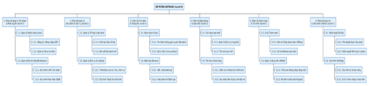

1. #### ***Danh sách phân rã chức năng chi tiết***
   *(Danh sách này diễn giải chi tiết các node trong biểu đồ trên, phục vụ việc tra cứu và lập kế hoạch phát triển phần mềm)*

   **a. Phân hệ Quản lý Tài khoản & Phân quyền (Identity & Access Module)**

- *Chỉ tập trung vào định danh và hồ sơ người dùng.*
- 1.1. Đăng ký, đăng nhập và cấp phát Token (JWT).
- 1.2. Quản lý hồ sơ cá nhân và ảnh đại diện.
- 1.3. Định danh điện tử (e-KYC) qua CCCD cho Host Cá nhân.
- 1.4. Xác minh pháp nhân (Giấy phép KD) cho Host Doanh nghiệp.

**b. Phân hệ Quản lý Sản phẩm & Dịch vụ (Catalog & Listing Module)**

- 2.1. Đề xuất Địa danh và xem bản đồ vệ tinh.
- 2.2. Khởi tạo và quản lý cấu trúc Siêu tổ hợp (Complex).
- 2.3. Tạo và cập nhật thông tin đa dịch vụ (Phòng/Tour/Dịch vụ).
- 2.4. Cấu hình giá động và lịch trống.

**c. Phân hệ Tìm kiếm & Tương tác (Search & Interaction Module)**

- 3.1. Tìm kiếm không gian (Spatial Search) theo bán kính địa danh.
- 3.2. Thuật toán gợi ý chéo (Cross-selling) dựa trên hành vi mua sắm.
- 3.3. Xem chi tiết thông tin và chính sách dịch vụ.
- 3.4. Quản lý vòng đời Đánh giá (Review) và Phản hồi.

**d. Phân hệ Đặt phòng & Giao dịch (Booking & Order Module)**

- 4.1. Thêm/Sửa/Xóa dịch vụ trong Giỏ hàng hợp nhất.
- 4.2. Khóa chỗ tạm thời (Soft-lock 15 phút) chống Overbooking.
- 4.3. Chốt hóa đơn và theo dõi trạng thái Đơn hàng (Order Lifecycle).
- 4.4. Gửi email xác nhận và vé điện tử (QR Code).

**e. Phân hệ Thanh toán & Tài chính (Payment & Wallet Module)**

- *Quản lý hoàn toàn đường đi của dòng tiền (Cash-flow).*
- 5.1. Khởi tạo phiên thanh toán qua cổng VNPay/MoMo.
- 5.2. Quản lý Ví trung gian (Escrow Wallet) - Đóng băng tiền khi khách thanh toán.
- 5.3. Chuyển tiền vào Ví khả dụng khi chuyến đi hoàn tất.
- 5.4. Xử lý các lệnh Rút tiền (Payout) của Host về ngân hàng.

**f. Phân hệ Quản trị & Vận hành (Admin Dashboard)**

- 6.1. Phê duyệt hồ sơ đăng ký Host và Đề xuất Địa danh.
- 6.2. Ẩn/xóa các đánh giá vi phạm tiêu chuẩn cộng đồng.
- 6.3. Cấu hình tỷ lệ hoa hồng (Commission Rate) cho nền tảng.
- 6.4. Xử lý tranh chấp và Hoàn tiền (Refund) bắt buộc.
  1. #### ***Mô tả chi tiết các phân hệ nghiệp vụ***
     Vai trò và ý nghĩa của từng phân hệ được định nghĩa chi tiết như sau:

     **a. Phân hệ Quản lý Tài khoản & Phân quyền (Identity & Access Module)** Đây là "người gác cổng" của toàn bộ hệ thống, tuân thủ nguyên tắc đơn trách nhiệm: chỉ giải quyết bài toán định danh (Authentication) và phân quyền (Authorization). Phân hệ này tách biệt hoàn toàn luồng đăng ký nhanh của Khách du lịch (nhanh chóng, ít rào cản) với luồng xác minh danh tính khắt khe của Đối tác (đòi hỏi tính pháp lý cao).

- Đối với Host cá nhân, hệ thống yêu cầu xác minh danh tính điện tử (e-KYC) qua Căn cước công dân.
- Đối với Host doanh nghiệp, hệ thống yêu cầu xác minh pháp nhân (B2B) qua Giấy phép kinh doanh.

**b. Phân hệ Quản lý Sản phẩm & Dịch vụ (Catalog & Listing Module)** Đóng vai trò là kho dữ liệu nền tảng, chứa toàn bộ "tài sản" kinh doanh của hệ thống. Sự đột phá của phân hệ này nằm ở cấu trúc dữ liệu phân cấp và đa hình (Polymorphic):

- **Tính Landmark-Centric:** Quản lý danh mục các "Địa danh" để làm mỏ neo định vị không gian cho toàn hệ thống.
- **Tính Tổ hợp (Complex):** Cho phép các tập đoàn lớn (Enterprise) tạo ra một Siêu tổ hợp (VD: Sun World, Vinpearl) và quản lý tập trung hàng chục khách sạn, khu vui chơi bên trong nó.
- **Tính Đa hình:** Một công cụ quản lý chung nhưng đáp ứng được đặc thù của 3 loại hình dịch vụ khác nhau: Lưu trú (STAY), Trải nghiệm (EXP) và Dịch vụ lẻ (SVC). Kèm theo đó là bộ công cụ thiết lập giá cả và lịch trống.

**c. Phân hệ Tìm kiếm & Tương tác (Search & Interaction Module)** Phân hệ này hướng tới việc tối ưu hóa "Trải nghiệm Khám phá" của người dùng cuối.

- Thay vì bộ lọc tìm kiếm theo tỉnh/thành phố truyền thống, phân hệ này cung cấp khả năng tìm kiếm không gian (Spatial Search) theo bán kính xung quanh một Địa danh cụ thể.
- Được tích hợp **Động cơ gợi ý (Recommendation Engine)** chạy ngầm để thực hiện các chiến dịch bán chéo (Cross-selling), tự động đề xuất dịch vụ vệ tinh quanh khu vực khách hàng đang quan tâm, từ đó tăng giá trị trung bình trên mỗi đơn hàng (AOV).

**d. Phân hệ Đặt phòng & Giao dịch (Booking & Order Module)** Là bộ não điều phối giao dịch mua sắm, giải quyết 2 bài toán nghiệp vụ hóc búa nhất:

- **Giỏ hàng hợp nhất (Universal Cart):** Cho phép khách hàng gom phòng nghỉ, vé tour, dịch vụ thuê xe vào chung một giỏ và thanh toán gộp 1 lần duy nhất, loại bỏ hoàn toàn sự đứt gãy trong trải nghiệm.
- **Chống đặt trùng (Overbooking):** Cung cấp cơ chế Khóa chỗ tạm thời (Soft-lock) trong vòng 15 phút ngay khi khách hàng nhấn thanh toán để bảo vệ tính toàn vẹn của tồn kho (Inventory).

**e. Phân hệ Thanh toán & Tài chính (Payment & Wallet Module)** Đây là phân hệ chuyên trách về quản lý luồng tiền (Cash-flow). Việc tách biệt tài chính khỏi thông tin người dùng giúp hệ thống an toàn và dễ kiểm toán (audit) hơn.

- Tích hợp cổng thanh toán bên thứ ba (VNPay).
- Vận hành hệ thống **Ví trung gian (Escrow Wallet)**: Nền tảng sẽ "giữ hộ" tiền của khách hàng và chỉ giải ngân (Payout) cho Host sau khi chuyến đi kết thúc tốt đẹp, đảm bảo quyền lợi tuyệt đối cho du khách.

**f. Phân hệ Quản trị & Vận hành (Admin Backoffice Module)** Công cụ dành riêng cho ban quản trị nền tảng GoTravel. Phân hệ này số hóa toàn bộ quy trình vận hành thủ công:

- Kiểm duyệt tính hợp lệ của hồ sơ đối tác (e-KYC) và nội dung dịch vụ để đảm bảo môi trường kinh doanh trong sạch.
- Cấu hình tỷ lệ hoa hồng (Commission Rate) linh hoạt cho từng ngành hàng.
- Cung cấp công cụ đối soát tài chính cấp cao và xử lý hoàn tiền (Refund) khi xảy ra tranh chấp giữa người mua và người bán.
  1. ## **Mô hình hóa quy trình nghiệp vụ**
Phần này mô tả luồng chảy của dữ liệu và các bước tương tác giữa các tác nhân (Actors) với hệ thống. Việc mô hình hóa quy trình nghiệp vụ giúp làm rõ cách GoTravel giải quyết các bài toán kinh doanh đặc thù (như Giỏ hàng, Khóa chỗ tạm thời, Đối soát dòng tiền) trước khi bước vào thiết kế kiến trúc phần mềm.
1. ### **Bảng danh sách các quy trình nghiệp vụ cốt lõi**
Hệ thống GoTravel được vận hành bởi 7 quy trình nghiệp vụ (Business Processes - QT) xuyên suốt, bao phủ toàn bộ vòng đời tương tác của Khách hàng, Đối tác và Ban quản trị.

|**Mã QT**|**Tên quy trình nghiệp vụ**|**Tác nhân tham gia**|**Phân hệ (Module) liên quan**|**Mô tả tóm tắt**|
| :- | :- | :- | :- | :- |
|**QT-01**|**Định danh và Nâng cấp Đối tác (Host Onboarding & KYC)**|User, Admin|
Identity Module,

Admin Module
|Quy trình người dùng nộp hồ sơ giấy tờ (CCCD cho Cá nhân hoặc Giấy phép kinh doanh cho Doanh nghiệp). Admin kiểm duyệt, nâng cấp Role và hệ thống tự động khởi tạo Ví Escrow cho đối tác.|
|**QT-02**|**Đề xuất và Phê duyệt Địa danh (Landmark Management)**|Host, Admin|
Catalog Module,

Admin Module
|Quy trình Host gửi tọa độ, hình ảnh đề xuất một Địa danh mới (Landmark). Admin kiểm tra vệ tinh, phê duyệt và biến nó thành "điểm mỏ neo" không gian chính thức của hệ thống.|
|**QT-03**|**Khởi tạo và Quản lý đa dịch vụ (Listing Management)**|Host / Enterprise|Catalog Module|Quy trình nhà cung cấp thiết lập Siêu tổ hợp (Complex) hoặc đăng tải Dịch vụ lẻ (Stay, Exp, Svc). Bao gồm việc cấu hình các thuộc tính động, thiết lập giá và mở lịch trống (Availability).|
|**QT-04**|**Tìm kiếm không gian và Gợi ý chéo (Spatial Search & Cross-selling)**|Guest, User|
Search Module,

Order Module
|Khách hàng chọn một Địa danh, hệ thống quét bán kính để trả về dịch vụ. Khi khách thêm 1 dịch vụ vào giỏ, Động cơ gợi ý (Recommendation Engine) chạy ngầm để đề xuất các dịch vụ vệ tinh liên quan.|
|**QT-05**|**Đặt dịch vụ và Thanh toán gộp (Universal Checkout)**|User, Cổng VNPay|
Order Module,

Inventory Module,

Payment Module
|**(Quy trình phức tạp nhất)**: Khách chốt Giỏ hàng -> Hệ thống kiểm tra kho -> **Khóa chỗ tạm thời (Soft-lock 15 phút)** -> Chuyển hướng VNPay -> Nhận Webhook -> Chốt đơn và xuất vé điện tử.|
|**QT-06**|**Hoàn tất chuyến đi và Đối soát dòng tiền (Escrow Reconciliation)**|Host, Admin|
Payment Module,

Order Module
|Sau khi khách sử dụng xong dịch vụ, Host xác nhận hoàn thành. Hệ thống tính toán hoa hồng (Commission), trừ phí và chuyển tiền từ Ví đóng băng (Escrow) sang Ví khả dụng để Host rút tiền (Payout) về ngân hàng.|
|**QT-07**|**Quản lý Đánh giá và Xử lý tranh chấp (Review & Dispute)**|User, Host, Admin|
Catalog Module,

Admin Module
|Khách hàng để lại đánh giá sau chuyến đi. Host có quyền phản hồi. Nếu có tranh chấp (Booking ảo, lừa đảo), Admin can thiệp, ẩn đánh giá vi phạm hoặc ra lệnh hoàn tiền (Refund).|

*Ghi chú: Bảng trên thể hiện sự liên kết chặt chẽ giữa Nghiệp vụ (Quy trình) và Hệ thống (Phân hệ). Một quy trình nghiệp vụ thực tế thường đòi hỏi sự phối hợp của 2-3 phân hệ phần mềm khác nhau.*
1. ### **Biểu đồ hoạt động (Activity Diagram) và giải thích luồng quy trình** 
Để làm rõ cách hệ thống vi dịch vụ (Microservices) vận hành đằng sau các thao tác của người dùng, đồ án tiến hành phân tích sâu 7 quy trình nghiệp vụ cốt lõi đã định nghĩa.
1. #### ***Quy trình QT-01: Định danh và Nâng cấp Đối tác (Host Onboarding & KYC)***
   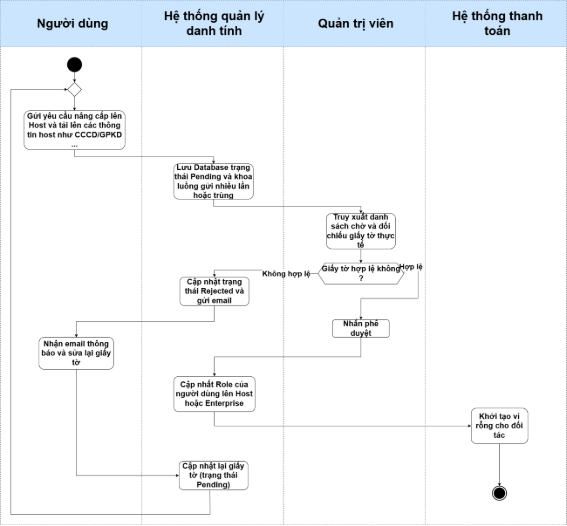

   **Giải thích chi tiết quy trình:**

- **Bước 1 (Gửi yêu cầu):** Người dùng (Role: USER) gửi yêu cầu nâng cấp lên Host (Cá nhân hoặc Doanh nghiệp). Họ tải lên hình ảnh định danh (CCCD/Giấy phép kinh doanh) qua Media Service.
- **Bước 2 (Ghi nhận tạm thời):** Identity Service (Java) tiếp nhận form dữ liệu, lưu vào database với trạng thái PENDING và khóa luồng, không cho user gửi thêm yêu cầu trùng lặp.
- **Bước 3 (Admin Kiểm duyệt):** Quản trị viên truy cập Admin Dashboard, hệ thống truy xuất danh sách PENDING. Admin đối chiếu hình ảnh giấy tờ với thông tin khai báo.
- **Bước 4 (Từ chối - Tùy chọn):** Nếu giấy tờ không hợp lệ, Admin nhấn từ chối kèm lý do. Hệ thống cập nhật trạng thái REJECTED, gửi email thông báo để User sửa lại.
- **Bước 5 (Phê duyệt & Cấp quyền):** Nếu hợp lệ, Admin nhấn Phê duyệt. Hệ thống thực hiện một Transaction (Giao dịch) quan trọng: Đổi Role từ USER sang HOST hoặc ENTERPRISE, đồng thời kích hoạt lệnh khởi tạo "Ví Escrow" (Ví trung gian) rỗng cho đối tác này tại Payment Service, sẵn sàng cho việc nhận tiền.
  1. #### ***Quy trình QT-02: Đề xuất và Phê duyệt Địa danh (Landmark Management)*** 
     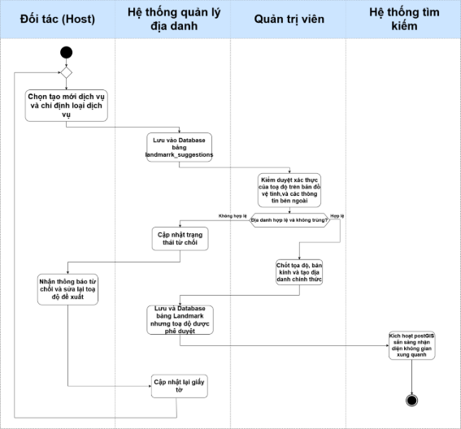

     **Giải thích chi tiết quy trình:**

- **Bước 1 (Đề xuất):** Host truy cập bản đồ, gửi tọa độ GPS và hình ảnh để đề xuất một "Địa danh" mới (ví dụ: Suối Lê Nin). Catalog Service lưu đề xuất vào bảng landmark\_suggestions (Trạng thái PENDING).
- **Bước 2 (Kiểm duyệt):** Admin xem xét đề xuất, kiểm tra tính xác thực của tọa độ trên bản đồ vệ tinh. Nếu địa danh bị trùng hoặc tọa độ sai, Admin từ chối.
- **Bước 3 (Khởi tạo Landmark):** Nếu hợp lệ, Admin chốt tọa độ, bán kính (radius) và tạo "Địa danh chính thức" (Landmark).
- **Bước 4 (Kích hoạt Search Engine):** Ngay khi Landmark được lưu vào PostgreSQL với cột địa lý GEOGRAPHY, Search Service (Node.js) lập tức có thể sử dụng PostGIS để nhận diện không gian xung quanh địa danh này, cho phép các Host khác bắt đầu gắn dịch vụ của họ xung quanh tọa độ này.
  1. #### ***Quy trình QT-03: Khởi tạo và Quản lý đa dịch vụ (Listing Management)***
     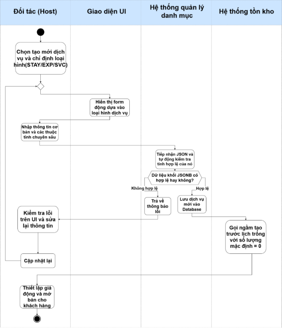

     **Giải thích chi tiết quy trình:**

- **Bước 1 (Chọn phân loại):** Host chọn tạo mới Dịch vụ và chỉ định loại hình: Lưu trú (STAY), Trải nghiệm (EXP) hoặc Tiện ích (SVC).
- **Bước 2 (Nhập liệu):** Dựa vào loại hình, Frontend hiển thị form động. Host nhập thông tin cơ bản và các thuộc tính chuyên sâu (Ví dụ: Phòng thì nhập số giường, Tour thì nhập lịch trình).
- **Bước 3 (Xử lý Backend):** Catalog Service (Java) tiếp nhận JSON. Nhờ thư viện Jackson Polymorphism và Hibernate, hệ thống tự động kiểm tra tính hợp lệ (Validation) của khối JSONB attributes tùy theo loại dịch vụ.
- **Bước 4 (Đồng bộ Tồn kho):** Nếu lưu thành công, hệ thống tiếp tục gọi ngầm sang Inventory Service để tạo trước một "Lịch trống" (Calendar Bucket) với số lượng mặc định bằng 0, cho phép Host bắt đầu thiết lập giá động (Dynamic Pricing) và mở bán cho khách.
  1. #### ***Quy trình QT-04: Tìm kiếm không gian và Gợi ý chéo (Spatial Search & Cross-selling)***
     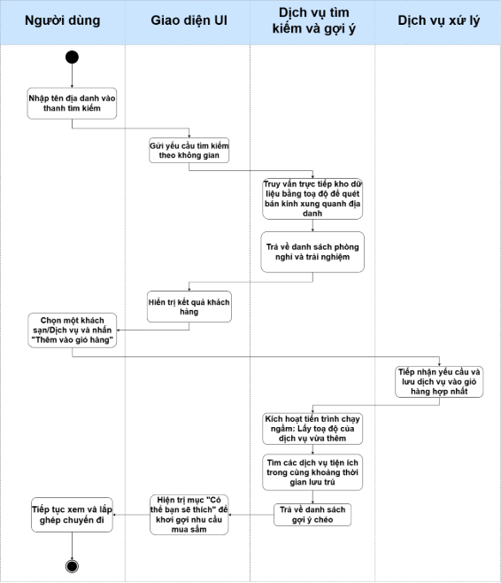

     **Giải thích chi tiết quy trình:**

- **Bước 1 (Tìm kiếm Landmark):** Guest/User tìm kiếm một Địa danh trên thanh Search. Frontend gọi API của Node.js Search Service.
- **Bước 2 (Truy vấn PostGIS):** Node.js sử dụng hàm ST\_DWithin của PostGIS chọc thẳng vào bản sao đọc (Read-replica) của Catalog DB, quét bán kính 5km quanh tọa độ Địa danh đó và trả về danh sách Phòng/Tour.
- **Bước 3 (Thêm Giỏ hàng):** Khách chọn một Khách sạn và nhấn "Thêm vào giỏ". Dữ liệu được đẩy vào Cart Service (Java).
- **Bước 4 (Gợi ý chéo - Background):** Ngay khi khách sạn vào giỏ, Recommendation Engine (Node.js) chạy ngầm để lấy tọa độ của khách sạn đó, quét tìm các dịch vụ Thuê xe/Nhà hàng gần nhất trong cùng khung ngày lưu trú, và đẩy kết quả về UI dưới dạng "Có thể bạn sẽ thích", tối ưu tỷ lệ bán chéo (Cross-sell).
  1. #### ***Quy trình QT-05: Đặt dịch vụ và Thanh toán gộp (Universal Checkout)***
     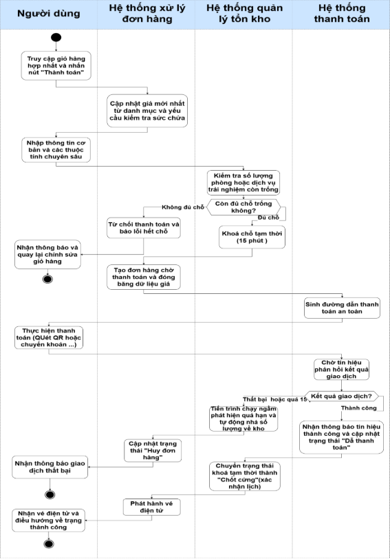

     **Giải thích chi tiết quy trình (Luồng cốt lõi nhất hệ thống):**

- **Bước 1 (Chốt giỏ hàng):** Khách hàng vào Giỏ hàng, hệ thống gọi Catalog lấy giá mới nhất. Khách bấm "Thanh toán".
- **Bước 2 (Kiểm tra & Khóa Slot):** Order Service (Java) gọi nội bộ (FeignClient) sang Inventory Service. Inventory kiểm tra số lượng trống.
- Nếu hết chỗ: Từ chối thanh toán (Ném lỗi 409 Overbooking).
- Nếu đủ chỗ: Thực hiện **Soft-lock (Khóa tạm 15 phút)**. Database sử dụng @Version (Optimistic Locking) để đảm bảo không ai khác chiếm được slot này.
- **Bước 3 (Tạo đơn & Sinh link):** Order Service đóng băng dữ liệu giá, tạo đơn hàng PENDING\_PAY, và gọi Payment Service sinh URL thanh toán VNPay. Khách hàng thực hiện quẹt thẻ.
- **Bước 4 (Xử lý Webhook):** \* **Trường hợp Khách không trả tiền/Quá hạn:** Background Job của Inventory Service quét thấy Khóa 15 phút hết hạn, tự động nhả số lượng về kho. Đơn hàng bị CANCELLED.
- **Trường hợp Thành công:** VNPay gửi IPN Webhook về. Payment Service cập nhật trạng thái đơn thành PAID, ra lệnh cho Inventory chuyển Soft-lock thành Chốt cứng (Confirmed), xuất vé QR Code gửi cho khách, và điều hướng về trang Thành công.
  1. #### ***Quy trình QT-06: Hoàn tất chuyến đi và Đối soát dòng tiền (Escrow Reconciliation)***
     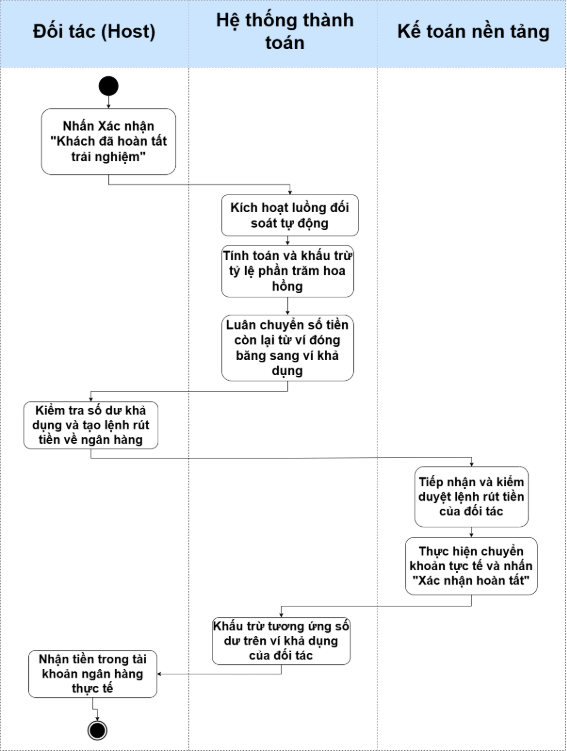

     **Giải thích chi tiết quy trình:**

- **Bước 1 (Khách trải nghiệm):** Tiền thanh toán của khách hiện đang nằm trong trạng thái "Đóng băng" tại Ví Escrow của Host (thuộc Payment Service).
- **Bước 2 (Xác nhận hoàn tất):** Sau khi khách trả phòng/đi tour xong, Host bấm xác nhận "Khách đã hoàn tất trải nghiệm".
- **Bước 3 (Chia tiền tự động):** Hệ thống Payment Service kích hoạt luồng đối soát: Trừ tỷ lệ phần trăm hoa hồng (Commission Fee) của nền tảng, sau đó luân chuyển số tiền còn lại từ Ví Đóng băng (Escrow Balance) sang Ví Khả dụng (Available Balance).
- **Bước 4 (Rút tiền - Payout):** Host thấy tiền khả dụng, bấm tạo lệnh Rút tiền. Lệnh này được gửi cho Kế toán (Admin) duyệt. Sau khi Kế toán chuyển khoản thực tế thành công, Admin bấm hoàn tất, hệ thống trừ số dư trên Ví Khả dụng của Host, kết thúc vòng đời dòng tiền.
  1. #### ***Quy trình QT-07: Quản lý Đánh giá và Xử lý tranh chấp (Review & Dispute)***
     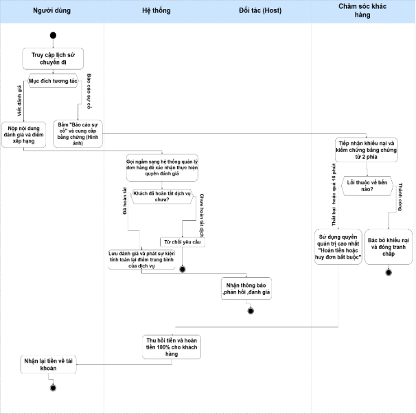

     **Giải thích chi tiết quy trình:**

- **Bước 1 (Kiểm tra quyền đánh giá):** Khách hàng vào viết Review. Catalog Service gọi ngầm Order Service kiểm tra xem khách đã thực sự mua và hoàn thành dịch vụ này chưa (Chống Review ảo).
- **Bước 2 (Lưu & Tính điểm):** Khách hàng nộp Review. Review được lưu. Hệ thống phát ra một Async Event (Sự kiện bất đồng bộ) để Java tính toán lại điểm average\_rating trên toàn bộ DB và cập nhật lại Listing. Host có quyền vào phản hồi (Reply) đánh giá này.
- **Bước 3 (Báo cáo Tranh chấp):** Nếu khách hàng đến nơi mà Host từ chối phục vụ hoặc dịch vụ quá tệ, khách bấm nút "Báo cáo / Tranh chấp".
- **Bước 4 (Admin can thiệp):** Đội ngũ CSKH (Admin) sẽ vào kiểm tra bằng chứng từ cả 2 bên. Nếu lỗi do Host, Admin dùng quyền Super User bấm "Hủy đơn bắt buộc".

**Bước 5 (Hoàn tiền):** Payment Service nhận lệnh hủy, thu hồi tiền từ Ví Escrow của Host và khởi tạo luồng Hoàn tiền (Refund) 100% về tài khoản gốc cho Khách hàng.

1. ## **Sơ đồ UseCase**
   1. ### **Biểu đồ Use Case tổng quan toàn hệ thống.**

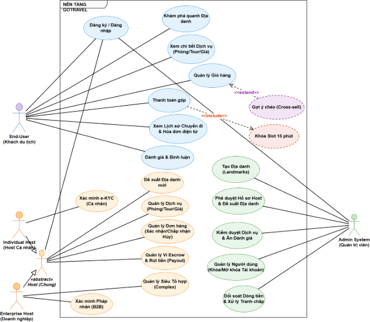

- **Giải thích chi tiết Biểu đồ Use Case Tổng quan**

Biểu đồ Use Case tổng quan mô tả bức tranh tương tác toàn diện giữa các tác nhân (Actors) và hệ thống GoTravel. Nhằm làm rõ quyền hạn và luồng nghiệp vụ, các thành phần trong biểu đồ được định nghĩa chi tiết như sau:

- ` `**Danh sách các Tác nhân (Actors)**

Hệ thống được vận hành bởi 4 nhóm tác nhân thực tế và 1 tác nhân trừu tượng, được phân quyền chặt chẽ:

- **End-User (Khách du lịch):** Người sử dụng nền tảng để tìm kiếm, đặt các dịch vụ du lịch và trực tiếp tạo ra dòng tiền cho hệ thống.
- **Host chung (Tác nhân trừu tượng):** Nhóm đối tượng đại diện cho tất cả các nhà cung cấp dịch vụ. Việc sử dụng tác nhân trừu tượng giúp gom nhóm các quyền hạn kinh doanh cốt lõi (Tạo dịch vụ, quản lý đơn hàng, rút tiền) mà không cần vẽ lặp lại nhiều lần trên sơ đồ.
- **Individual Host (Host cá nhân):** Kế thừa từ *Host chung*. Đại diện cho các cá nhân kinh doanh vừa và nhỏ (chủ homestay, thợ chụp ảnh). Bắt buộc phải xác minh danh tính điện tử (e-KYC) qua Căn cước công dân.
- **Enterprise Host (Host doanh nghiệp):** Kế thừa từ *Host chung*. Đại diện cho các tập đoàn/công ty du lịch. Bắt buộc xác minh pháp nhân (Giấy phép kinh doanh) và được cấp đặc quyền tạo các Siêu tổ hợp (Complex).
- **Admin System (Quản trị viên):** Đội ngũ vận hành nền tảng, nắm quyền kiểm duyệt dữ liệu, bảo vệ sự trong sạch của hệ thống và đối soát tài chính. Admin không có quyền can thiệp vào việc thiết lập giá hay tạo phòng của Host.
- **Giải thích các Use Case tổng quan**

Dưới đây là diễn giải chi tiết cho các chức năng lớn của hệ thống, bao gồm tác nhân thực hiện và mô tả tổng quan luồng nghiệp vụ.

- **Đăng ký / Đăng nhập (Xác thực OAuth2/JWT)**
  - **Tác nhân:** End-User, Host (Chung), Admin.
  - **Tổng quan:** Cho phép người dùng truy cập vào hệ thống. Hệ thống cấp phát token (JWT) để duy trì phiên đăng nhập và định danh quyền hạn (Role) cho các thao tác tiếp theo.
- **Khám phá quanh Địa danh & Xem chi tiết Dịch vụ**
  - **Tác nhân:** End-User.
  - **Tổng quan:** Khách hàng tương tác với Hero Banner hoặc gõ tên một Địa danh (Landmark) để hệ thống quét bán kính không gian, trả về danh sách các Khách sạn/Tour/Dịch vụ xung quanh. Khách hàng có thể bấm vào để xem chi tiết hình ảnh, giá cả, lịch trống.
- **Quản lý Giỏ hàng**
  - **Tác nhân:** End-User.
  - **Tổng quan:** Khách hàng thêm các dịch vụ khác nhau (Lưu trú, Trải nghiệm, Dịch vụ) vào chung một giỏ hàng, điều chỉnh số lượng và ngày tháng.
  - **Quan hệ mở rộng <<extend>> (Gợi ý chéo):** Khi khách hàng thêm một dịch vụ vào giỏ, hệ thống sẽ chạy ngầm và *tự động kích hoạt* chức năng "Gợi ý chéo" để đề xuất thêm các dịch vụ vệ tinh lân cận.
- **Thanh toán gộp (Universal Checkout)**
  - **Tác nhân:** End-User.
  - **Tổng quan:** Khách hàng tiến hành thanh toán một lần cho toàn bộ các dịch vụ có trong giỏ hàng thông qua cổng thanh toán VNPay.
  - **Quan hệ bao hàm <<include>> (Khóa Slot 15 phút):** Bắt buộc kích hoạt khi thanh toán. Hệ thống gọi sang phân hệ Tồn kho để trừ tạm thời số lượng và khóa lại trong 15 phút, ngăn chặn triệt để rủi ro bán lố phòng (Overbooking).
- **Xem Lịch sử Chuyến đi & Đánh giá**
  - **Tác nhân:** End-User.
  - **Tổng quan:** Khách hàng theo dõi danh sách các đơn hàng đã đặt, xem mã vé điện tử. Sau khi hoàn tất chuyến đi, khách hàng có quyền chấm điểm (Rating) và viết bình luận (Review).
- **Xác minh e-KYC / B2B**
  - **Tác nhân:** Individual Host, Enterprise Host.
  - **Tổng quan:** Bước bắt buộc trước khi kinh doanh. Cá nhân tải lên CCCD, doanh nghiệp tải lên Giấy phép kinh doanh để hệ thống trích xuất thông tin, đảm bảo tính pháp lý.
- **Đề xuất Địa danh mới**
  - **Tác nhân:** Host (Chung).
  - **Tổng quan:** Host đóng góp các địa điểm du lịch mới chưa có trên nền tảng bằng cách gửi tọa độ và hình ảnh cho Admin phê duyệt.
- **Quản lý Dịch vụ (Phòng/Tour/Giá)**
  - **Tác nhân:** Host (Chung).
  - **Tổng quan:** Nơi Host đăng tải sản phẩm kinh doanh lên sàn. Cho phép điều chỉnh thông tin, thiết lập lịch trống (Calendar) và cài đặt giá động (Dynamic Pricing) theo ngày.
- **Quản lý Đơn hàng (Khách đặt)**
  - **Tác nhân:** Host (Chung).
  - **Tổng quan:** Host theo dõi danh sách khách hàng chuẩn bị đến, xác nhận khi khách hoàn tất dịch vụ hoặc phê duyệt các yêu cầu hủy đơn.
- **Quản lý Ví Escrow & Rút tiền**
  - **Tác nhân:** Host (Chung).
  - **Tổng quan:** Host theo dõi doanh thu. Tiền khách trả sẽ bị "đóng băng" (Escrow). Sau khi khách dùng dịch vụ xong, tiền chuyển sang trạng thái "Khả dụng" để Host đặt lệnh rút về tài khoản ngân hàng.
- **Quản lý Siêu Tổ hợp (Complex)**
  - **Tác nhân:** Enterprise Host.
  - **Tổng quan:** Đặc quyền của tổ chức. Cho phép tạo ra một cấu trúc quản lý (Ví dụ: Sun World) để gom nhóm hàng loạt khách sạn, cáp treo, nhà hàng trực thuộc vào chung một danh mục.
- **Tạo Địa danh mỏ neo (Landmarks)**
- **Tác nhân:** Admin System.
- **Tổng quan:** Trực tiếp tạo và định vị tọa độ vệ tinh cho các điểm đến nổi tiếng. Đây là dữ liệu mỏ neo lõi của hệ thống để công cụ tìm kiếm không gian (Spatial Search) hoạt động.
- **Phê duyệt Hồ sơ & Kiểm duyệt Nội dung**
  - **Tác nhân:** Admin System.
  - **Tổng quan:** Admin kiểm duyệt giấy tờ e-KYC của Host, phê duyệt địa danh mới. Đồng thời đi tuần tra, ẩn/xóa các dịch vụ kinh doanh sai sự thật hoặc các bình luận có ngôn từ vi phạm tiêu chuẩn cộng đồng.
- **Đối soát Dòng tiền & Xử lý Tranh chấp**
- **Tác nhân:** Admin System.
- **Tổng quan:** Quản lý cấu hình phần trăm hoa hồng của nền tảng, duyệt các lệnh rút tiền (Payout) của Host, và dùng quyền cao nhất để ra lệnh hoàn tiền (Refund) cho khách hàng khi có sự cố lừa đảo hoặc dịch vụ kém chất lượng.
  1. ### ` `**Biểu đồ Use Case chi tiết theo đối tượng.**
     1. #### ***Use Case chi tiết đối tượng khách hàng (User)***
        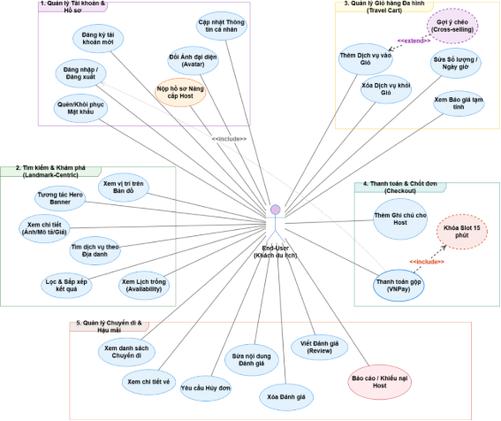

- **Giải thích chi tiết Biểu đồ Use Case - Phân hệ (User)**

Biểu đồ Use Case trên mô tả chi tiết mức độ thao tác của tác nhân **người dùng (User)** khi tương tác với nền tảng GoTravel. Thay vì chỉ hiển thị các luồng nghiệp vụ lớn, biểu đồ này phân rã toàn bộ hành vi của người dùng thành 5 nhóm chức năng lõi, làm cơ sở trực tiếp cho việc thiết kế Giao diện người dùng (UI/UX) và xây dựng các API Backend.

Chi tiết các nhóm chức năng được đặc tả như sau:

**a. Quản lý Tài khoản & Hồ sơ (Account Management)**

Nhóm này bao bọc vòng đời của một tài khoản định danh trên hệ thống.

- Bao gồm các thao tác cơ bản: *Đăng ký, Đăng nhập/Đăng xuất, Quên/Khôi phục mật khẩu, Cập nhật thông tin cá nhân* và *Đổi ảnh đại diện*.
- **Nút thắt nghiệp vụ:** Use Case *Nộp hồ sơ Nâng cấp Host* đóng vai trò là điểm giao thoa quyền hạn (Role Transition). Người dùng bình thường thông qua thao tác này để nộp giấy tờ (e-KYC) nhằm kích hoạt luồng chuyển đổi sang vai trò Nhà cung cấp (Host).

  **b. Tìm kiếm & Khám phá (Landmark-Centric Search)**

Thể hiện đặc thù thiết kế "Lấy địa danh làm trung tâm" của nền tảng OTA.

- Người dùng bắt đầu hành trình bằng việc *Tương tác Hero Banner* (các quảng cáo nổi bật) hoặc *Tìm dịch vụ theo Địa danh*.
- Cung cấp các công cụ ra quyết định chuyên sâu: *Lọc & Sắp xếp kết quả, Xem vị trí trên Bản đồ, Xem chi tiết (Ảnh/Mô tả/Giá)* và đặc biệt là *Xem Lịch trống (Availability)* để biết chính xác ngày nào có thể đặt chỗ trước khi đưa vào giỏ hàng.

  **c. Quản lý Giỏ hàng (Travel Cart)**

Giải quyết bài toán gom nhóm dịch vụ du lịch phức tạp.

- Cung cấp các thao tác tương tác với giỏ hàng: *Thêm, Sửa (số lượng/ngày giờ)* và *Xóa* dịch vụ khỏi giỏ. Trong quá trình thao tác, hệ thống liên tục tính toán và cho phép *Xem báo giá tạm tính* (bao gồm thuế, phí).
- **Luồng mở rộng ngầm <<extend>>:** Use Case *Gợi ý chéo (Cross-selling)* có mối quan hệ <<extend>> trỏ về *Thêm Dịch vụ vào Giỏ*. Điều này quy định rạch ròi về mặt hệ thống: Tính năng gợi ý không do người dùng chủ động bấm, mà được **kích hoạt tự động (trigger)** chạy ngầm ngay khi có một dịch vụ mới được ném vào giỏ, nhằm tối ưu hóa doanh thu bán chéo.

  **d. Nhóm Thanh toán & Chốt đơn (Checkout)**

Đây là chốt chặn quan trọng nhất tạo ra dòng tiền cho nền tảng.

- Khách hàng có thể *Thêm ghi chú cho Host* (VD: Yêu cầu phòng không hút thuốc) trước khi tiến hành *Thanh toán gộp* toàn bộ giỏ hàng qua cổng VNPay.
- **Luồng bao hàm bắt buộc <<include>>:** \* Thứ nhất, *Thanh toán gộp* <<include>> *Đăng nhập/Đăng xuất*: Bắt buộc người dùng phải ở trạng thái đã đăng nhập (có token hợp lệ) mới được phép khởi tạo giao dịch thanh toán.
  - Thứ hai, *Thanh toán gộp* <<include>> *Khóa Slot 15 phút*: Bắt buộc hệ thống phải gọi sang Database để trừ tạm thời số lượng tồn kho và khóa lại trong vòng 15 phút, bảo vệ tính toàn vẹn dữ liệu và triệt tiêu rủi ro bán lố (Overbooking) trong lúc khách hàng đang nhập mã thẻ ngân hàng.

**e. Nhóm Quản lý Chuyến đi & Hậu mãi (Trips & After-sales)**

Quản lý vòng đời đơn hàng sau khi thanh toán thành công và bảo vệ quyền lợi người tiêu dùng.

- **Quản lý đơn:** Khách hàng có thể *Xem danh sách chuyến đi*, *Xem chi tiết vé (Mã QR)* để check-in, hoặc *Yêu cầu Hủy đơn* nếu thay đổi kế hoạch.
- **Hệ thống Đánh giá (Review System):** Cung cấp bộ thao tác CRUD đầy đủ cho vòng đời của một bài đánh giá: *Viết đánh giá, Sửa nội dung* và *Xóa đánh giá*.
- **Xử lý sự cố:** Use Case *Báo cáo / Khiếu nại Host* cho phép người dùng kích hoạt luồng điều tra từ Admin nếu gặp phải tình trạng Host lừa đảo hoặc chất lượng dịch vụ không đúng cam kết, làm cơ sở để đòi hoàn tiền (Refund).
  1. #### ***Use Case chi tiết đối tượng đối tác (Host)***
     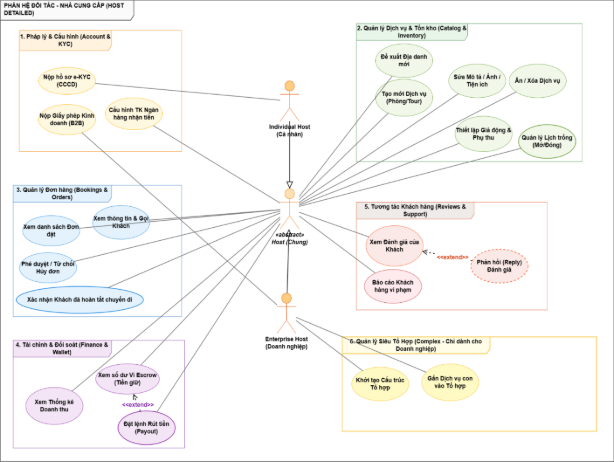

- **Giải thích chi tiết Biểu đồ Use Case - Phân hệ Đối tác (Host & Enterprise)**

Biểu đồ mô tả toàn diện các thao tác quản trị kinh doanh của giới chủ (Nhà cung cấp) trên nền tảng GoTravel. Dữ liệu được bóc tách đến mức độ thao tác hạt hạt (CRUD và State Management), phục vụ trực tiếp cho việc thiết kế các API giao tiếp ở tầng Backend.

Sơ đồ sử dụng kỹ thuật **Kế thừa Tác nhân (Actor Generalization)**: Tác nhân trừu tượng *Host (Chung)* sẽ nắm giữ các quyền kinh doanh cốt lõi. *Individual Host* (Cá nhân) và *Enterprise Host* (Doanh nghiệp) sẽ kế thừa các quyền này, đồng thời có thêm các luồng định danh và quản lý đặc thù riêng.

Các Use Case được phân bổ logic theo 6 nhóm nghiệp vụ cốt lõi như sau:

**a. Nhóm Pháp lý & Cấu hình (Account & KYC)**

Thể hiện sự tuân thủ pháp luật chặt chẽ của hệ thống trước khi cho phép kinh doanh.

- **Nộp hồ sơ e-KYC (CCCD):** Tính năng dành riêng cho Host cá nhân để xác minh danh tính điện tử.
- **Nộp Giấy phép Kinh doanh (B2B):** Tính năng dành riêng cho Host doanh nghiệp để xác minh tính hợp pháp của tổ chức.
- **Cấu hình TK Ngân hàng nhận tiền:** Thao tác bắt buộc đối với mọi Host (Chung) để hệ thống có cơ sở giải ngân (Payout) tự động sau này.

  **b. Nhóm Quản lý Dịch vụ & Tồn kho (Catalog & Inventory)**

Đây là không gian làm việc chính của Host, nơi họ quản lý các "tài sản số" của mình trên nền tảng.

- **Các thao tác CRUD tiêu chuẩn:** Cho phép Host *Tạo mới Dịch vụ (Phòng/Tour)*, *Sửa Mô tả / Ảnh / Tiện ích*, và *Ẩn / Xóa Dịch vụ* khi ngừng kinh doanh.
- **Đề xuất Địa danh mới:** Host đóng góp thông tin và tọa độ để mở rộng danh mục mỏ neo (Landmarks) của hệ thống.
- **Vũ khí tối ưu doanh thu:** Cung cấp hai thao tác cực kỳ quan trọng là *Thiết lập Giá động & Phụ thu* (thay đổi giá theo mùa vụ lễ tết) và *Quản lý Lịch trống (Mở/Đóng)*. Các thao tác này sẽ can thiệp trực tiếp vào Inventory Service để kiểm soát số lượng phòng/vé bán ra.

  **c. Nhóm Quản lý Đơn hàng (Bookings & Orders)**

Thể hiện vòng đời tương tác với đơn đặt phòng sau khi khách hàng đã thanh toán.

- **Quản lý danh sách:** Host được quyền *Xem danh sách Đơn đặt*, *Xem thông tin & Gọi Khách* để hỗ trợ việc check-in.
- **Xử lý ngoại lệ:** Chủ động *Phê duyệt / Từ chối Hủy đơn* đối với các yêu cầu hủy sát giờ của khách hàng.
- **Nút thắt sinh tử:** Use Case **Xác nhận Khách đã hoàn tất chuyến đi**. Hành động này không chỉ để chuyển trạng thái đơn hàng thành "Hoàn thành", mà nó còn đóng vai trò là một "Trigger" (cò súng) kích hoạt tự động luồng đối soát và mở khóa dòng tiền tại Payment Service.

  **d. Nhóm Tài chính & Đối soát (Finance & Wallet)**

Bảo đảm tính minh bạch về dòng tiền cho nhà cung cấp.

- **Xem Thống kê Doanh thu:** Xem các biểu đồ và báo cáo hiệu quả kinh doanh.
- **Xem số dư Ví Escrow (Tiền giữ):** Theo dõi số tiền khách hàng đã thanh toán nhưng đang bị hệ thống "đóng băng" (chưa được phép rút) cho đến khi chuyến đi kết thúc an toàn.
- **Luồng mở rộng ngầm <<extend>>:** Tính năng **Đặt lệnh Rút tiền (Payout)** là một luồng mở rộng của việc xem Ví Escrow. Hệ thống chỉ cho phép Host thực hiện thao tác rút tiền (kích hoạt API chuyển khoản) khi số dư khả dụng thực tế lớn hơn hạn mức tối thiểu.

  **e. Nhóm Tương tác Khách hàng (Reviews & Support)**

Giải quyết bài toán chăm sóc khách hàng và bảo vệ uy tín thương hiệu.

- Host có quyền theo dõi mức độ hài lòng thông qua việc *Xem Đánh giá của Khách*.
- **Báo cáo Khách hàng vi phạm:** Cung cấp công cụ để Host "Report" những người dùng ảo, khách hàng quậy phá hoặc có hành vi gian lận.
- **Luồng mở rộng ngầm <<extend>>:** Tính năng **Phản hồi (Reply) Đánh giá** được thiết kế dưới dạng <<extend>> mở rộng từ thao tác Xem đánh giá. Cho phép Host đính chính thông tin hoặc gửi lời cảm ơn công khai đến người đánh giá.

  **f. Nhóm Quản lý Siêu Tổ Hợp (Complex)**

Đây là đặc quyền cấp cao chỉ dành riêng cho tác nhân **Enterprise Host** (Các tập đoàn lớn như Sun Group, Vinpearl).

- **Khởi tạo Cấu trúc Tổ hợp:** Cho phép tạo ra một thương hiệu mẹ (Ví dụ: Vinpearl Nha Trang Resort).
- **Gắn Dịch vụ con vào Tổ hợp:** Nhóm các dịch vụ phân mảnh (Khách sạn A, Khu vui chơi B, Cáp treo C) vào chung Tổ hợp mẹ vừa tạo. Tính năng này giúp doanh nghiệp quản lý báo cáo tài chính tập trung và tạo hiệu ứng bán chéo nội bộ cực kỳ mạnh mẽ.
  1. #### ***Use Case chi tiết đối tượng quản trị viên (Admin)***
     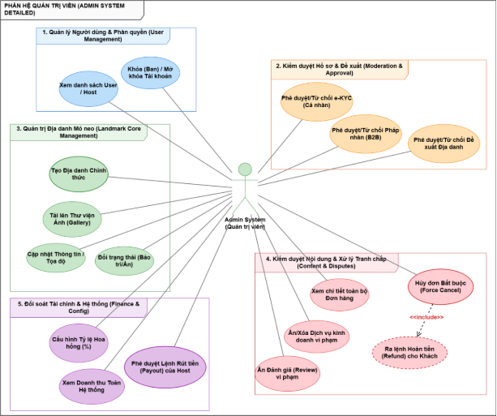

- **Giải thích chi tiết Biểu đồ Use Case - Phân hệ Quản trị viên (Admin System)**

Biểu đồ trên mô tả chi tiết các thao tác của đội ngũ vận hành nền tảng (Back-office). Khác với Khách du lịch hay Nhà cung cấp, Quản trị viên (Admin) không trực tiếp tạo ra giao dịch kinh doanh (không mua hàng, không tạo phòng bán). Thay vào đó, Admin đóng vai trò là "Người cầm cân nảy mực", thực thi các Use Case mang tính kiểm soát rủi ro (Risk Management), bảo vệ hệ sinh thái và điều phối tài chính.

Các tính năng của Admin được phân rã đến mức độ thao tác hạt hạt và gom thành 5 nhóm nghiệp vụ cốt lõi:

**a. Nhóm Quản lý Người dùng & Phân quyền (User Management)**

Đảm bảo môi trường người dùng trong sạch và an toàn.

- **Xem danh sách User / Host:** Quản lý toàn bộ danh tính trên nền tảng (Giao tiếp trực tiếp với Schema auth\_db thông qua Identity Service).
- **Khóa (Ban) / Mở khóa Tài khoản:** Cấp quyền cho Admin vô hiệu hóa ngay lập tức các tài khoản có dấu hiệu lừa đảo. Khi tài khoản bị khóa, token JWT của họ sẽ bị từ chối ngay từ tầng API Gateway, chặn đứng mọi nỗ lực truy cập trái phép vào hệ thống.

  **b. Nhóm Kiểm duyệt Hồ sơ & Đề xuất (Moderation & Approval)**

Đóng vai trò là "nút thắt an toàn pháp lý" trước khi cho phép bất kỳ ai kinh doanh trên nền tảng.

- **Phê duyệt/Từ chối e-KYC (Cá nhân) & Pháp nhân (B2B):** Admin kiểm tra chéo (Cross-check) giấy tờ pháp lý do Host tải lên (CCCD, Giấy phép kinh doanh được lưu trữ trong phân vùng bảo mật Private của Cloudinary). Thao tác phê duyệt sẽ kích hoạt Trigger đổi Role của người dùng từ USER sang HOST hoặc ENTERPRISE.
- **Phê duyệt/Từ chối Đề xuất Địa danh:** Lọc bỏ các đề xuất rác, sai tọa độ hoặc trùng lặp do cộng đồng Host gửi lên.

  **c. Nhóm Quản trị Địa danh Mỏ neo (Landmark Core Management)**

Đây là nhóm chức năng **độc quyền** của Admin, phục vụ trực tiếp cho triết lý "Landmark-centric" (Lấy địa danh làm trung tâm) của hệ thống GoTravel.

- **Tạo Địa danh Chính thức:** Admin chốt tọa độ vệ tinh chuẩn xác (Latitude/Longitude) và lưu vào cơ sở dữ liệu. Dữ liệu này được chuẩn hóa dưới dạng GEOGRAPHY(Point) để công cụ PostGIS của Node.js Search Service có thể quét bán kính không gian tốc độ cao.
- **Cập nhật Thông tin / Tọa độ:** Chỉnh sửa thông tin khi có sai sót.
- **Tải lên Thư viện Ảnh (Gallery):** Bơm dữ liệu hình ảnh chất lượng cao để hiển thị lên giao diện Hero Banner, thu hút người dùng ngay khi truy cập trang chủ.
- **Đổi trạng thái (Bảo trì/Ẩn):** Sử dụng cơ chế Xóa mềm (Soft-delete). Việc bảo trì/ẩn địa danh không làm đứt gãy dữ liệu (Foreign Keys) của các khách sạn/tour đang bám quanh địa danh đó.

  **d. Nhóm Kiểm duyệt Nội dung & Xử lý Tranh chấp (Content & Disputes)**

Bảo vệ trải nghiệm người dùng cuối khi xảy ra sự cố hoặc có nội dung xấu.

- **Xem chi tiết toàn bộ Đơn hàng:** Tra cứu lịch trình, lịch sử giao dịch để làm bằng chứng khi có khiếu nại.
- **Ẩn/Xóa Dịch vụ & Ẩn Đánh giá vi phạm:** Khi phát hiện Host "treo đầu dê bán thịt chó" hoặc Review chứa ngôn từ thô tục, Admin can thiệp ẩn dữ liệu. Việc ẩn đánh giá sẽ kích hoạt một sự kiện ngầm (Async Event) yêu cầu hệ thống tính toán lại điểm số (Average Rating) của dịch vụ đó.
- **Nút thắt sinh tử (Hủy đơn Bắt buộc <<include>> Ra lệnh Hoàn tiền):** Áp dụng khi Khách hàng và Host xảy ra tranh chấp không thể tự hòa giải (Ví dụ: Khách đến nơi nhưng Host không giao phòng). Admin dùng quyền tối cao để **Hủy đơn Bắt buộc**. Use Case này có mũi tên <<include>> trỏ sang **Ra lệnh Hoàn tiền (Refund)**. Ý nghĩa về mặt kiến trúc: Khi Admin bấm Hủy, Order Service *bắt buộc* phải gọi một lệnh S2S (Server-to-Server) sang Payment Service để tự động thu hồi tiền từ Ví Escrow của Host và hoàn trả (Refund) về tài khoản gốc của Khách hàng.

  **e. Nhóm Đối soát Tài chính & Hệ thống (Finance & Config)**

Quản trị dòng tiền khổng lồ chảy qua nền tảng.

- **Cấu hình Tỷ lệ Hoa hồng (%):** Thiết lập tỷ lệ chiết khấu linh hoạt để hệ thống Payment tự động trừ tiền khi khách hoàn tất chuyến đi.
- **Xem Doanh thu Toàn Hệ thống:** Truy xuất dữ liệu báo cáo cấp cao (Dashboard) cho Ban giám đốc.
- **Phê duyệt Lệnh Rút tiền (Payout) của Host:** Đóng vai trò là chốt chặn Kế toán. Đối với các lệnh rút tiền từ Ví Khả dụng của Host, Admin sẽ phê duyệt thủ công trước khi hệ thống tạo lệnh chuyển khoản ngân hàng thực tế, đảm bảo không xảy ra thất thoát hoặc gian lận tài chính.

1. ### **Danh sách tất cả các Use Case**
Dựa trên biểu đồ Use Case tổng quan và chi tiết của các đối tượng (User, Host, Admin), toàn bộ các chức năng của hệ thống GoTravel được định nghĩa và phân rã. Để phục vụ cho việc thiết kế kiến trúc phân tán ở các chương sau, danh sách Use Case dưới đây được gom nhóm dựa trên các cụm Microservices cốt lõi của nền tảng.
1. #### ***Nhóm Dịch vụ Quản lý Danh tính & Truy cập (Identity & Access Service)***
   Chịu trách nhiệm quản lý vòng đời tài khoản, xác thực (JWT), phân quyền và hồ sơ định danh (e-KYC) của toàn bộ người dùng.

   |**STT**|**Tên Use Case**|**Mô tả**|
   | :- | :- | :- |
   |1|UC1.1 Đăng ký tài khoản mới|Khách hàng nhập thông tin (hoặc dùng OAuth2) để tạo tài khoản User. Hệ thống kiểm tra trùng lặp và lưu trữ.|
   |2|UC1.2 Đăng nhập / Đăng xuất|Người dùng (User, Host, Admin) nhập thông tin xác thực. Hệ thống kiểm tra và cấp phát/thu hồi token (JWT) để duy trì phiên làm việc.|
   |3|UC1.3 Quên/Khôi phục mật khẩu|Người dùng yêu cầu khôi phục mật khẩu thông qua Email/OTP.|
   |4|UC1.4 Cập nhật Thông tin & Avatar|User/Host thay đổi thông tin cá nhân cơ bản và tải lên ảnh đại diện mới.|
   |5|UC1.5 Nộp hồ sơ Nâng cấp Host|User điền form và nộp yêu cầu chuyển đổi quyền (Role) từ Khách hàng sang Nhà cung cấp.|
   |6|UC1.6 Nộp hồ sơ e-KYC (Cá nhân)|Individual Host tải lên hình ảnh Căn cước công dân để hệ thống định danh điện tử.|
   |7|UC1.7 Nộp GPKD (Doanh nghiệp)|Enterprise Host tải lên Giấy phép kinh doanh (B2B) để xác minh pháp nhân.|
   |8|UC1.8 Xem danh sách User/Host|Admin truy xuất, tìm kiếm và phân trang danh sách toàn bộ tài khoản trên hệ thống.|
   |9|UC1.9 Khóa / Mở khóa Tài khoản|Admin thực hiện vô hiệu hóa (Ban) hoặc mở khóa tài khoản vi phạm. Khóa luồng đăng nhập ngay lập tức.|
   |10|UC1.10 Phê duyệt e-KYC / B2B|Admin kiểm tra chéo giấy tờ pháp lý của Host và phê duyệt cấp quyền kinh doanh.|
1. #### ***Nhóm Dịch vụ Danh mục & Địa danh (Catalog & Listing Service)***
   Kho lưu trữ dữ liệu lõi, quản lý thông tin Địa danh (Landmark), cấu trúc Tổ hợp và toàn bộ thông tin Dịch vụ (Khách sạn/Tour/Tiện ích).

   |**STT**|**Tên Use Case**|**Mô tả**|
   | :- | :- | :- |
   |11|UC2.1 Tạo Địa danh Chính thức|Admin chốt tọa độ GPS, tạo mới và lưu Địa danh mỏ neo để làm cơ sở cho tìm kiếm không gian.|
   |12|UC2.2 Cập/Đổi trạng thái Địa danh|Admin sửa thông tin hoặc ẩn/bảo trì (Soft-delete) một Địa danh trên hệ thống.|
   |13|UC2.3 Đề xuất Địa danh mới|Host gửi tọa độ và hình ảnh đề xuất một địa điểm mới chưa có trên hệ thống.|
   |14|UC2.4 Phê duyệt Đề xuất Địa danh|Admin kiểm tra vệ tinh và duyệt đề xuất địa danh do Host gửi lên.|
   |15|UC2.5 Khởi tạo Cấu trúc Tổ hợp|Enterprise Host tạo một danh mục Siêu Tổ hợp (Complex) để làm thương hiệu mẹ (VD: Vinpearl).|
   |16|UC2.6 Tạo mới / Sửa Dịch vụ|Host tạo hoặc cập nhật mô tả, hình ảnh, tiện ích cho Phòng/Tour/Dịch vụ lẻ. Có thể gắn vào Tổ hợp (nếu là Doanh nghiệp).|
   |17|UC2.7 Ẩn / Xóa Dịch vụ|Host chủ động ẩn hoặc xóa dịch vụ của mình khỏi sàn khi ngừng kinh doanh.|
   |18|UC2.8 Xem chi tiết Dịch vụ|User xem thông tin, hình ảnh, chính sách và giá cả của một dịch vụ.|
   |19|UC2.9 Quản lý Đánh giá (Review)|User thực hiện viết, sửa (trong thời gian quy định) hoặc xóa Đánh giá/Rating sau chuyến đi.|
   |20|UC2.10 Tương tác Đánh giá|Host xem đánh giá, báo cáo vi phạm, hoặc viết Phản hồi (Reply) lại bình luận của Khách.|
   |21|UC2.11 Ẩn/Xóa Dịch vụ & Đánh giá|Admin dùng quyền cao nhất để xóa/ẩn các dịch vụ lừa đảo hoặc đánh giá chứa ngôn từ thô tục.|
1. #### ***Nhóm Dịch vụ Tìm kiếm & Gợi ý (Search & Recommendation Service - Node.js)***
   Tối ưu hóa khả năng đọc (Read-heavy), quét bán kính không gian và chạy thuật toán gợi ý thời gian thực.

   |**STT**|**Tên Use Case**|**Mô tả**|
   | :- | :- | :- |
   |22|UC3.1 Tìm dịch vụ theo Địa danh|User gõ từ khóa, hệ thống quét bán kính quanh Địa danh (PostGIS) và trả về kết quả tốc độ cao.|
   |23|UC3.2 Lọc & Sắp xếp kết quả|User thu hẹp tìm kiếm theo khoảng giá, hạng sao, tiện nghi và sắp xếp kết quả.|
   |24|UC3.3 Xem vị trí trên Bản đồ|User chuyển đổi giao diện sang dạng bản đồ tương tác để xem phân bổ dịch vụ.|
   |25|UC3.4 Gợi ý chéo (Cross-selling)|Khi User thêm đồ vào giỏ, hệ thống ngầm phân tích và hiển thị các dịch vụ vệ tinh lân cận cùng khung ngày.|
1. #### ***Nhóm Dịch vụ Giỏ hàng & Đơn hàng (Cart & Order Service)***
   Quản lý vòng đời đơn hàng, từ lúc còn là giỏ hàng tạm thời cho đến khi hoàn tất chuyến đi hoặc xảy ra tranh chấp hủy đơn.

   |**STT**|**Tên Use Case**|**Mô tả**|
   | :- | :- | :- |
   |26|UC4.1 Thêm / Sửa / Xóa Giỏ hàng|User thao tác thêm dịch vụ, chỉnh sửa số lượng, ngày giờ hoặc xóa khỏi giỏ hàng đa hình.|
   |27|UC4.2 Xem báo giá tạm tính|Hệ thống tính toán tổng tiền, bao gồm thuế phí dựa trên các mục có trong giỏ hàng hiện tại.|
   |28|UC4.3 Xem danh sách Đơn đặt|User (xem chuyến đi của mình), Host (xem khách sắp đến), Admin (xem toàn bộ) để tra cứu lịch sử giao dịch.|
   |29|UC4.4 Xem chi tiết & Vé QR|User lấy mã QR vé điện tử. Host xem thông tin liên hệ để chủ động gọi khách hỗ trợ check-in.|
   |30|UC4.5 Yêu cầu / Duyệt Hủy đơn|User bấm yêu cầu hủy đơn. Host tiếp nhận và quyết định Phê duyệt hoặc Từ chối dựa trên chính sách.|
   |31|UC4.6 Xác nhận Hoàn tất chuyến đi|Host bấm xác nhận khi khách trả phòng. Hành động này kích hoạt luồng đối soát dòng tiền.|
   |32|UC4.7 Hủy đơn Bắt buộc|Admin can thiệp hủy đơn ngay lập tức khi phát hiện Host lừa đảo hoặc sự cố khẩn cấp.|
1. #### ***Nhóm Dịch vụ Tồn kho & Đặt chỗ (Booking & Inventory Service)***
   Nút thắt kỹ thuật quan trọng nhất, bảo vệ tính toàn vẹn của dữ liệu phòng/vé bán ra.

   |**STT**|**Tên Use Case**|**Mô tả**|
   | :- | :- | :- |
   |33|UC5.1 Xem Lịch trống|User xem trực quan ngày nào còn phòng/còn vé trên giao diện lịch (Calendar).|
   |34|UC5.2 Quản lý Lịch trống|Host chủ động Mở/Đóng các ngày cụ thể, không nhận khách trong một khoảng thời gian.|
   |35|UC5.3 Thiết lập Giá động|Host thay đổi, cài đặt giá tăng/giảm theo từng ngày cụ thể (Lễ, Tết, Cuối tuần).|
   |36|UC5.4 Khóa Slot 15 phút (Soft-lock)|Hệ thống tự động kích hoạt trừ tạm tồn kho trong 15 phút khi User bắt đầu bấm Thanh toán gộp.|
1. #### ***Nhóm Dịch vụ Thanh toán & Ví điện tử (Payment & Wallet Service)***
   Xử lý giao dịch với ngân hàng, giữ tiền trung gian (Escrow) và giải ngân, đảm bảo tính ACID nghiêm ngặt.

   |**STT**|**Tên Use Case**|**Mô tả**|
   | :- | :- | :- |
   |37|UC6.1 Thanh toán gộp (VNPay)|User thêm ghi chú và xác nhận thanh toán toàn bộ giỏ hàng qua cổng VNPay/MoMo.|
   |38|UC6.2 Cấu hình TK Ngân hàng|Host nhập thông tin STK chính chủ để hệ thống làm cơ sở đối soát chuyển tiền.|
   |39|UC6.3 Xem số dư Ví Escrow|Host theo dõi số tiền đang bị hệ thống đóng băng (khách đã trả nhưng chưa đi xong).|
   |40|UC6.4 Đặt lệnh Rút tiền (Payout)|Host thao tác rút số dư từ Ví Khả dụng về thẻ ngân hàng thực tế.|
   |41|UC6.5 Cấu hình Tỷ lệ Hoa hồng|Admin cài đặt mức phí phần trăm (%) nền tảng thu trên mỗi giao dịch thành công.|
   |42|UC6.6 Thống kê Doanh thu|Host xem báo cáo cá nhân. Admin xem biểu đồ tổng doanh thu của toàn hệ thống.|
   |43|UC6.7 Phê duyệt Lệnh Rút tiền|Kế toán (Admin) duyệt thủ công các lệnh Payout của Host trước khi tiền thực sự rời khỏi hệ thống.|
   |44|UC6.8 Ra lệnh Hoàn tiền (Refund)|Admin kích hoạt luồng trả lại tiền về thẻ gốc cho khách hàng khi có tranh chấp hoặc lỗi hệ thống.|
1. #### ***Nhóm Dịch vụ Lưu trữ & Truyền thông (Media & Comm Service - Node.js)***
   Chịu trách nhiệm nhận, nén, xử lý ảnh đẩy lên Cloudinary và gửi các thông báo (Email/SMS) cho người dùng.

   |**STT**|**Tên Use Case**|**Mô tả**|
   | :- | :- | :- |
   |45|UC7.1 Upload Ảnh đơn|User/Host tải lên Avatar, Admin tải lên Thumbnail cho Địa danh. Dữ liệu trả về URL public.|
   |46|UC7.2 Upload Album ảnh (Gallery)|Host tải lên cùng lúc nhiều ảnh chi tiết cho Khách sạn, Tour, Dịch vụ của mình.|
   |47|UC7.3 Upload Tài liệu Bảo mật|Host nộp hình ảnh CCCD, Giấy phép kinh doanh (e-KYC). File được lưu ở vùng Private Cloud, chống truy cập trái phép.|
   |48|UC7.4 Xóa Ảnh / File rác|Host/User chủ động xóa các ảnh đã tải lên để tiết kiệm không gian lưu trữ của hệ thống.|
   |49|UC7.5 Gửi Email / Thông báo|Hệ thống (chạy ngầm) gửi email vé điện tử (QR code) hoặc thông báo duyệt hồ sơ thành công cho người dùng.|

1. ## **Đặc tả chi tiết Use Case**

1. ### **Phân hệ Quản lý Danh tính & Truy cập (Identity & Access Service)**
**Đặc tả UC1.1 – Đăng ký tài khoản mới**

|**Trường thông tin**|**Nội dung chi tiết**|
| :- | :- |
|**Số và tên UC**|UC1.1 – Đăng ký tài khoản mới|
|**Người tạo UC**|Cao Đức Trung|
|**Ngày tạo UC**|15/05/2026|
|**Mô tả**|Chức năng Đăng ký cho phép người dùng mới tạo tài khoản để sử dụng hệ thống nền tảng du lịch trực tuyến GoTravel. Người dùng nhập các thông tin cần thiết bao gồm họ tên, email, số điện thoại, mật khẩu và xác nhận mật khẩu. Sau khi đăng ký thành công, hệ thống lưu thông tin tài khoản vào cơ sở dữ liệu và chuyển người dùng đến trang đăng nhập.|
|**Tác nhân chính**|Khách hàng (End-User)|
|**Tác nhân phụ**|Hệ thống (Identity Service)|
|**Sự kiện kích hoạt**|Người dùng chọn chức năng “Đăng ký” từ thanh điều hướng (Header) hoặc màn hình Đăng nhập của hệ thống.|
|**Tiền điều kiện**|
● Người dùng chưa đăng nhập vào hệ thống.

● Người dùng chưa có tài khoản tương ứng với Email trên hệ thống.
|
|**Hậu điều kiện**|
● Tài khoản người dùng (Role: USER) được tạo thành công và lưu vào cơ sở dữ liệu auth\_db.

● Mật khẩu được mã hóa an toàn.

● Người dùng được chuyển đến trang đăng nhập.
|
|**Luồng thông thường**|
**Luồng chính**

Chức năng này bắt đầu khi Khách hàng truy cập nền tảng GoTravel và có nhu cầu tạo tài khoản để sử dụng các chức năng như đặt phòng, đặt tour trực tuyến.

➢ Người dùng truy cập vào trang Đăng ký tài khoản.

➢ Hệ thống hiển thị form đăng ký tài khoản gồm các trường thông tin:

- Họ và tên

- Email

- Số điện thoại

- Mật khẩu

- Xác nhận mật khẩu

➢ Người dùng nhập đầy đủ thông tin theo yêu cầu vào các trường trên.

➢ Người dùng nhấn nút “Đăng ký” để gửi thông tin lên hệ thống.

➢ Hệ thống thực hiện kiểm tra tính hợp lệ của thông tin đăng ký (định dạng email, độ dài mật khẩu, sự trùng khớp mật khẩu).

➢ Hệ thống kiểm tra sự tồn tại của Email trong cơ sở dữ liệu.

➢ Nếu thông tin hợp lệ và Email chưa tồn tại, hệ thống thực hiện băm (hash) mật khẩu bằng thuật toán Bcrypt.

➢ Hệ thống lưu thông tin tài khoản mới vào cơ sở dữ liệu.

➢ Hệ thống hiển thị thông báo "Đăng ký thành công" và tự động chuyển người dùng về trang Đăng nhập.
|
|**Luồng thay thế / Ngoại lệ**|
**Luồng ngoại lệ A1: Bỏ trống hoặc sai định dạng trường thông tin**

➢ Tại bước kiểm tra tính hợp lệ, nếu hệ thống phát hiện có trường bị bỏ trống hoặc sai định dạng (ví dụ: Email thiếu @, mật khẩu dưới 8 ký tự).

➢ Hệ thống bôi đỏ trường tương ứng và hiển thị dòng chữ cảnh báo lỗi ngay bên dưới trường đó.

➢ Hệ thống vô hiệu hóa nút "Đăng ký" hoặc chặn không cho gửi dữ liệu, yêu cầu người dùng nhập lại.

**Luồng ngoại lệ A2: Email đã tồn tại**

➢ Tại bước kiểm tra sự tồn tại của Email, nếu hệ thống phát hiện Email đã được đăng ký.

➢ Hệ thống hiển thị một hộp thoại (Popup/Toast) thông báo: "Email này đã được sử dụng. Vui lòng đăng nhập hoặc sử dụng Email khác".

➢ Người dùng ở lại trang Đăng ký để thao tác lại.
|
|**Độ ưu tiên**|Cao|
|**Các quy tắc nghiệp vụ**|
● Mật khẩu bắt buộc mã hóa 1 chiều trước khi lưu xuống cơ sở dữ liệu.

● Mặc định tài khoản tạo ra có phân quyền là USER.
|
|**Các giả thuyết**|
● Người dùng có kết nối Internet ổn định.

● Hệ thống máy chủ đang hoạt động bình thường để tiếp nhận request.
|
|**Giao diện minh họa**|
*[Chèn Hình ảnh 1.1: Giao diện Form Đăng ký tài khoản với các trường thông tin trống]*

*[Chèn Hình ảnh 1.2: Giao diện Form Đăng ký hiển thị báo lỗi màu đỏ khi nhập sai định dạng email (Luồng ngoại lệ A1)]*

*[Chèn Hình ảnh 1.3: Giao diện hộp thoại thông báo Email đã tồn tại (Luồng ngoại lệ A2)]*

*[Chèn Hình ảnh 1.4: Giao diện hộp thoại/toast báo Đăng ký thành công và chuyển hướng]*
|

**Đặc tả UC1.2 – Đăng nhập / Đăng xuất**

|**Trường thông tin**|**Nội dung chi tiết**|
| :- | :- |
|**Số và tên UC**|UC1.2 – Đăng nhập / Đăng xuất|
|**Người tạo UC**|Cao Đức Trung|
|**Ngày tạo UC**|15/05/2026|
|**Mô tả**|Chức năng cho phép người dùng (User, Host, Admin) xác thực danh tính để truy cập vào hệ thống. Hệ thống cấp phát JWT (JSON Web Token) để duy trì phiên làm việc, đồng thời cung cấp chức năng đăng xuất để thu hồi phiên làm việc nhằm bảo mật tài khoản.|
|**Tác nhân chính**|Người dùng (Khách hàng, Đối tác, Quản trị viên)|
|**Tác nhân phụ**|Hệ thống (Identity Service)|
|**Sự kiện kích hoạt**|Người dùng chọn chức năng “Đăng nhập” ở góc phải màn hình, hoặc nhấn nút "Đăng xuất" trong menu tài khoản cá nhân.|
|**Tiền điều kiện**|
**Đối với Đăng nhập:**

● Người dùng chưa đăng nhập.

● Người dùng đã có tài khoản hợp lệ trên hệ thống.

**Đối với Đăng xuất:**

● Người dùng đang có phiên đăng nhập hợp lệ (có token) trên trình duyệt.
|
|**Hậu điều kiện**|
**Đối với Đăng nhập:**

● Hệ thống cấp phát JWT Token lưu vào trình duyệt của người dùng.

● Giao diện hệ thống thay đổi dựa theo phân quyền (Role) của người đăng nhập.

**Đối với Đăng xuất:**

● Token bị xóa khỏi trình duyệt, phiên đăng nhập kết thúc.
|
|**Luồng thông thường**|
**Luồng chính (Đăng nhập)**

Chức năng bắt đầu khi người dùng muốn truy cập vào các tính năng yêu cầu bảo mật của hệ thống.

➢ Người dùng nhấn vào nút "Đăng nhập".

➢ Hệ thống hiển thị form đăng nhập gồm các trường:

- Email

- Mật khẩu

➢ Người dùng điền Email và Mật khẩu.

➢ Người dùng nhấn nút "Đăng nhập" để gửi thông tin.

➢ Hệ thống đối chiếu thông tin với cơ sở dữ liệu (auth\_db).

➢ Nếu thông tin khớp, hệ thống kiểm tra trạng thái hoạt động của tài khoản.

➢ Hệ thống khởi tạo và ký JWT Token chứa ID người dùng và Quyền hạn.

➢ Hệ thống hiển thị thông báo "Đăng nhập thành công", trả Token về trình duyệt và chuyển hướng người dùng vào Trang chủ (hoặc Dashboard nếu là Admin).

**Luồng con 1 (Đăng xuất)**

Chức năng bắt đầu khi người dùng muốn thoát khỏi hệ thống để bảo vệ thông tin.

➢ Người dùng nhấn vào ảnh đại diện (Avatar) góc phải màn hình.

➢ Hệ thống hiển thị menu thả xuống (Dropdown menu).

➢ Người dùng nhấn chọn "Đăng xuất".

➢ Hệ thống xóa JWT Token đã lưu trong trình duyệt (Local Storage / Cookie).

➢ Hệ thống chuyển hướng người dùng về Trang đăng nhập hoặc Trang chủ khách vãng lai.
|
|**Luồng thay thế / Ngoại lệ**|
**Luồng ngoại lệ A1: Nhập sai thông tin đăng nhập**

➢ Tại bước đối chiếu thông tin, nếu Email không tồn tại hoặc Mật khẩu không khớp.

➢ Hệ thống hiển thị thông báo lỗi: "Tài khoản hoặc mật khẩu không chính xác".

➢ Người dùng thao tác nhập lại thông tin.

**Luồng ngoại lệ A2: Tài khoản bị khóa (Banned)**

➢ Tại bước kiểm tra trạng thái hoạt động, nếu hệ thống phát hiện cờ status = BANNED.

➢ Hệ thống từ chối cấp Token và hiển thị cảnh báo: "Tài khoản của bạn đã bị khóa do vi phạm chính sách. Vui lòng liên hệ Admin".

➢ Luồng đăng nhập bị hủy bỏ.
|
|**Độ ưu tiên**|Cao|
|**Các quy tắc nghiệp vụ**|● Nếu người dùng nhập sai mật khẩu quá 5 lần liên tiếp, tài khoản sẽ bị tạm khóa trong vòng 15 phút để chống Brute-force attack.|
|**Các giả thuyết**|● Khóa mã hóa (Secret Key) để ký JWT Token được cấu hình chính xác và bảo mật trên máy chủ.|
|**Giao diện minh họa**|
*[Chèn Hình ảnh 2.1: Giao diện màn hình Đăng nhập (Luồng chính)]*

*[Chèn Hình ảnh 2.2: Giao diện hiển thị thông báo lỗi "Tài khoản hoặc mật khẩu không chính xác" (Luồng ngoại lệ A1)]*

*[Chèn Hình ảnh 2.3: Giao diện cảnh báo "Tài khoản bị khóa" màu đỏ (Luồng ngoại lệ A2)]*

*[Chèn Hình ảnh 2.4: Giao diện menu thả xuống hiển thị nút Đăng xuất (Luồng con 1)]*
|

**Đặc tả UC1.3 – Quên / Khôi phục mật khẩu**

|**Trường thông tin**|**Nội dung chi tiết**|
| :- | :- |
|**Số và tên UC**|UC1.3 – Quên / Khôi phục mật khẩu|
|**Người tạo UC**|Cao Đức Trung|
|**Ngày tạo UC**|15/05/2026|
|**Mô tả**|Chức năng cung cấp cơ chế bảo mật cho phép người dùng lấy lại quyền truy cập tài khoản trong trường hợp không nhớ mật khẩu cũ, thông qua việc nhận mã xác thực (OTP) gửi về Email đã đăng ký.|
|**Tác nhân chính**|Người dùng (Khách hàng, Đối tác)|
|**Tác nhân phụ**|Hệ thống, Dịch vụ Email (SMTP/SendGrid)|
|**Sự kiện kích hoạt**|Người dùng nhấn vào liên kết "Quên mật khẩu?" tại màn hình Đăng nhập.|
|**Tiền điều kiện**|
● Người dùng chưa đăng nhập hệ thống.

● Người dùng phải cung cấp đúng Email đã được xác thực trước đó trong hệ thống.
|
|**Hậu điều kiện**|
● Mật khẩu cũ bị vô hiệu hóa.

● Mật khẩu mới được cập nhật, băm (hash) và lưu vào cơ sở dữ liệu.
|
|**Luồng thông thường**|
**Luồng chính**

Chức năng bắt đầu khi người dùng không nhớ mật khẩu để đăng nhập.

➢ Người dùng nhấn vào liên kết "Quên mật khẩu?".

➢ Hệ thống hiển thị form yêu cầu khôi phục gồm trường:

- Email đăng ký

➢ Người dùng nhập Email và nhấn nút "Gửi yêu cầu".

➢ Hệ thống kiểm tra sự tồn tại của Email trong cơ sở dữ liệu.

➢ Nếu hợp lệ, hệ thống tự động sinh một mã OTP (6 chữ số) lưu vào bộ nhớ tạm (Redis) với hạn dùng 5 phút.

➢ Hệ thống gửi mã OTP này đến địa chỉ Email của người dùng.

➢ Hệ thống chuyển sang màn hình nhập mã xác thực.

➢ Người dùng mở Email, lấy mã OTP và nhập vào màn hình hệ thống.

➢ Hệ thống xác thực mã OTP khớp và còn hiệu lực.

➢ Hệ thống hiển thị form Đặt lại mật khẩu gồm:

- Mật khẩu mới

- Xác nhận mật khẩu mới

➢ Người dùng nhập thông tin và nhấn "Lưu thay đổi".

➢ Hệ thống lưu mật khẩu mới vào cơ sở dữ liệu, hiển thị thông báo "Đổi mật khẩu thành công" và chuyển về trang Đăng nhập.

**Luồng con 1 (Gửi lại mã OTP)**

Chức năng bắt đầu nếu người dùng không nhận được Email.

➢ Tại màn hình nhập mã xác thực, người dùng chờ 60 giây đếm ngược.

➢ Người dùng nhấn nút "Gửi lại mã".

➢ Hệ thống tạo mã OTP mới, ghi đè lên mã cũ và gửi lại Email.
|
|**Luồng thay thế / Ngoại lệ**|
**Luồng ngoại lệ A1: Email không tồn tại**

➢ Tại bước gửi yêu cầu, nếu hệ thống không tìm thấy Email trong database.

➢ Hệ thống hiển thị cảnh báo: "Email không tồn tại trong hệ thống. Vui lòng kiểm tra lại".

➢ Quá trình gửi OTP bị hủy bỏ.

**Luồng ngoại lệ A2: Mã OTP sai hoặc hết hạn**

➢ Tại bước xác thực mã OTP, nếu người dùng nhập sai hoặc mã đã quá hạn 5 phút.

➢ Hệ thống báo lỗi: "Mã xác thực không chính xác hoặc đã hết hạn".

➢ Người dùng phải thực hiện thao tác theo Luồng con 1 để lấy mã mới.
|
|**Độ ưu tiên**|Trung bình|
|**Các quy tắc nghiệp vụ**|● Mã OTP chỉ có giá trị sử dụng duy nhất 1 lần (One-Time Password) và có giới hạn thời gian tồn tại (TTL) là 5 phút.|
|**Các giả thuyết**|● Dịch vụ gửi Email (SMTP Server) hoạt động bình thường, thư không bị đánh dấu là Spam.|
|**Giao diện minh họa**|
*[Chèn Hình ảnh 3.1: Giao diện Form nhập Email để yêu cầu khôi phục (Luồng chính)]*

*[Chèn Hình ảnh 3.2: Giao diện hiển thị cảnh báo Email không tồn tại (Luồng ngoại lệ A1)]*

*[Chèn Hình ảnh 3.3: Giao diện Form nhập mã OTP 6 số và nút đếm ngược gửi lại mã (Luồng chính & Luồng con 1)]*

*[Chèn Hình ảnh 3.4: Giao diện Form thiết lập Mật khẩu mới]*
|

**Đặc tả UC1.4 – Cập nhật Thông tin cá nhân & Avatar**

|**Trường thông tin**|**Nội dung chi tiết**|
| :- | :- |
|**Số và tên UC**|UC1.4 – Cập nhật Thông tin cá nhân & Avatar|
|**Người tạo UC**|Cao Đức Trung|
|**Ngày tạo UC**|15/05/2026|
|**Mô tả**|Chức năng cho phép người dùng (User, Host) xem lại và chỉnh sửa các thông tin trong hồ sơ cá nhân của mình, bao gồm việc thay đổi các thông tin cơ bản và tải lên hình ảnh đại diện (Avatar) mới.|
|**Tác nhân chính**|Người dùng có tài khoản (User, Host)|
|**Tác nhân phụ**|Hệ thống, Dịch vụ Lưu trữ (Media Service / Cloudinary)|
|**Sự kiện kích hoạt**|Người dùng truy cập vào mục "Hồ sơ cá nhân" từ menu quản lý tài khoản.|
|**Tiền điều kiện**|● Người dùng đã đăng nhập thành công vào hệ thống.|
|**Hậu điều kiện**|
● Dữ liệu hồ sơ mới được cập nhật vào bảng user\_profiles hoặc host\_profiles.

● File ảnh đại diện mới được lưu trên hệ thống Cloudinary, trả về đường dẫn URL và lưu vào cơ sở dữ liệu.
|
|**Luồng thông thường**|
**Luồng chính**

Chức năng bắt đầu khi người dùng muốn cập nhật thông tin để hồ sơ được đầy đủ và chính xác hơn.

➢ Người dùng nhấn chọn mục "Hồ sơ cá nhân".

➢ Hệ thống truy xuất cơ sở dữ liệu và hiển thị form chứa các thông tin hiện tại, bao gồm:

- Hình đại diện (Avatar)

- Họ và tên

- Số điện thoại

- Ngày sinh

- Giới tính

- Email (Chỉ đọc, không cho sửa)

➢ Người dùng thực hiện chỉnh sửa nội dung văn bản ở các trường mong muốn.

➢ (Tùy chọn) Người dùng nhấn vào biểu tượng máy ảnh trên Avatar để chọn một tệp hình ảnh từ máy tính/điện thoại.

➢ (Nếu có chọn ảnh) Hệ thống nén ảnh, gửi yêu cầu sang Media Service để đẩy ảnh lên Cloudinary và nhận lại URL ảnh mới.

➢ Người dùng nhấn nút "Lưu cập nhật".

➢ Hệ thống kiểm tra tính hợp lệ của dữ liệu (không bỏ trống tên, số điện thoại đúng định dạng).

➢ Hệ thống lưu các thay đổi vào cơ sở dữ liệu.

➢ Hệ thống hiển thị thông báo "Cập nhật hồ sơ thành công" và tải lại dữ liệu mới lên màn hình.
|
|**Luồng thay thế / Ngoại lệ**|
**Luồng ngoại lệ A1: Lỗi định dạng hoặc kích thước ảnh**

➢ Tại bước chọn ảnh tải lên, nếu người dùng chọn tệp không phải là ảnh (.pdf, .doc) hoặc ảnh lớn hơn 5MB.

➢ Hệ thống chặn việc tải lên, hiển thị cảnh báo: "Chỉ hỗ trợ tệp ảnh JPG, PNG dưới 5MB".

➢ Hình đại diện giữ nguyên như cũ.

**Luồng ngoại lệ A2: Trùng lặp số điện thoại**

➢ Tại bước hệ thống lưu thay đổi, nếu hệ thống phát hiện số điện thoại mới đã được gắn cho tài khoản khác.

➢ Hệ thống hủy giao dịch lưu, hiển thị báo lỗi: "Số điện thoại này đã được sử dụng. Vui lòng nhập số khác".

➢ Người dùng chỉnh sửa lại số điện thoại.
|
|**Độ ưu tiên**|Trung bình|
|**Các quy tắc nghiệp vụ**|
● Để bảo vệ tính toàn vẹn của cơ sở dữ liệu, không cho phép người dùng tự ý thay đổi Email đăng nhập gốc.

● Hình ảnh tải lên hệ thống tự động crop theo tỷ lệ 1:1.
|
|**Các giả thuyết**|● Băng thông mạng của người dùng đủ tốt để việc tải ảnh lên Cloud không bị gián đoạn (timeout).|
|**Giao diện minh họa**|
*[Chèn Hình ảnh 4.1: Giao diện màn hình Hồ sơ cá nhân với các trường đã được điền sẵn dữ liệu cũ]*

*[Chèn Hình ảnh 4.2: Giao diện thông báo lỗi "Chỉ hỗ trợ tệp ảnh dưới 5MB" (Luồng ngoại lệ A1)]*

*[Chèn Hình ảnh 4.3: Giao diện hiển thị thông báo lỗi trùng số điện thoại (Luồng ngoại lệ A2)]*

*[Chèn Hình ảnh 4.4: Giao diện Toast thông báo "Cập nhật hồ sơ thành công" (Luồng chính)]*
|

**Đặc tả UC1.5 – Nộp hồ sơ Nâng cấp Host**

|**Trường thông tin**|**Nội dung chi tiết**|
| :- | :- |
|**Số và tên UC**|UC1.5 – Nộp hồ sơ Nâng cấp Host|
|**Người tạo UC**|Cao Đức Trung|
|**Ngày tạo UC**|15/05/2026|
|**Mô tả**|Chức năng cho phép Khách hàng (End-User) gửi yêu cầu nâng cấp quyền hạn tài khoản lên thành Nhà cung cấp (Host) để có thể thực hiện kinh doanh đăng phòng, đăng tour bán trên nền tảng. Đây là bước đầu tiên trong quy trình định danh (Onboarding).|
|**Tác nhân chính**|Khách hàng (End-User)|
|**Tác nhân phụ**|Hệ thống|
|**Sự kiện kích hoạt**|Người dùng nhấn vào nút "Trở thành Đối tác" trên thanh Menu chính hoặc thanh Sidebar.|
|**Tiền điều kiện**|
● Người dùng đã đăng nhập hệ thống và đang mang phân quyền là USER.

● Người dùng không có bất kỳ yêu cầu nâng cấp nào đang ở trạng thái Chờ duyệt (Pending) trong cơ sở dữ liệu.
|
|**Hậu điều kiện**|
● Hệ thống sinh ra một bản ghi yêu cầu nâng cấp tài khoản với trạng thái PENDING\_KYC.

● Người dùng được chuyển hướng vào luồng tải lên giấy tờ pháp lý tương ứng.
|
|**Luồng thông thường**|
**Luồng chính**

Chức năng bắt đầu khi một khách hàng bình thường có nhu cầu chuyển đổi sang kinh doanh trên nền tảng.

➢ Người dùng nhấn vào nút "Trở thành Đối tác".

➢ Hệ thống hiển thị một trang đích (Landing Page) giới thiệu quyền lợi và yêu cầu người dùng chọn loại hình kinh doanh (Host Type):

○ Cá nhân (Kinh doanh độc lập)

○ Doanh nghiệp (Kinh doanh siêu tổ hợp)

➢ Người dùng tích chọn 1 trong 2 loại hình trên.

➢ Người dùng nhấn nút "Tiếp tục".

➢ Hệ thống ghi nhận yêu cầu sơ bộ vào cơ sở dữ liệu auth\_db, tạo một Profile tạm với trạng thái PENDING\_KYC (Chờ cập nhật giấy tờ).

➢ Hệ thống chuyển hướng người dùng sang giao diện điền Form e-KYC (Nếu chọn Cá nhân) hoặc Form khai báo Mã số thuế (Nếu chọn Doanh nghiệp) để thực hiện bước tiếp theo.
|
|**Luồng thay thế / Ngoại lệ**|
**Luồng ngoại lệ A1: Hồ sơ nâng cấp đang bị treo chờ duyệt**

➢ Ngay khi người dùng nhấn nút "Trở thành Đối tác", hệ thống truy vấn cơ sở dữ liệu kiểm tra cờ trạng thái.

➢ Nếu phát hiện đã có một yêu cầu tồn tại đang ở trạng thái PENDING (Chờ Admin duyệt) hoặc PENDING\_KYC (Chờ nộp giấy tờ).

➢ Hệ thống chặn luồng thực thi, hiển thị màn hình thông báo: "Bạn đã có một hồ sơ đang chờ xử lý. Không thể tạo thêm yêu cầu mới".

➢ Hệ thống cung cấp nút "Xem tiến độ hồ sơ hiện tại" để chuyển hướng người dùng đi tiếp bài làm đang dang dở.
|
|**Độ ưu tiên**|Cao|
|**Các quy tắc nghiệp vụ**|● Đây là bước chuyển giao quyền (Role Transition) bắt buộc. Người dùng phải xác định rõ loại hình ngay từ bước này để hệ thống áp dụng luồng Form nhập liệu phù hợp ở bước sau.|
|**Các giả thuyết**|● Người dùng hiểu rõ sự khác biệt về mặt pháp lý giữa việc kinh doanh theo tư cách Cá nhân và tư cách Doanh nghiệp.|
|**Giao diện minh họa**|
*[Chèn Hình ảnh 5.1: Giao diện trang Landing Page giới thiệu "Trở thành Đối tác"]*

*[Chèn Hình ảnh 5.2: Giao diện Modal/Màn hình yêu cầu tích chọn Loại hình Đối tác (Cá nhân / Doanh nghiệp)]*

*[Chèn Hình ảnh 5.3: Giao diện màn hình thông báo chặn luồng "Bạn đã có một hồ sơ đang chờ xử lý" (Luồng ngoại lệ A1)]*
|

**Đặc tả UC1.6 – Nộp hồ sơ định danh e-KYC (Cá nhân)**

|**Trường thông tin**|**Nội dung chi tiết**|
| :- | :- |
|**Số và tên UC**|UC1.6 – Nộp hồ sơ định danh e-KYC (Cá nhân)|
|**Người tạo UC**|Cao Đức Trung|
|**Ngày tạo UC**|15/05/2026|
|**Mô tả**|Chức năng bắt buộc dành riêng cho Người dùng cá nhân muốn trở thành Nhà cung cấp (Host). Người dùng tải lên hình ảnh giấy tờ tùy thân (Căn cước công dân) và ảnh chân dung để hệ thống lưu trữ bảo mật, làm cơ sở pháp lý cho Quản trị viên xét duyệt cấp quyền kinh doanh.|
|**Tác nhân chính**|Người dùng (Đang trong luồng nâng cấp Host Cá nhân)|
|**Tác nhân phụ**|Hệ thống, Dịch vụ Lưu trữ Đám mây (Cloudinary)|
|**Sự kiện kích hoạt**|Người dùng hoàn tất việc chọn loại hình "Cá nhân" ở bước Nộp hồ sơ Nâng cấp Host (UC1.5).|
|**Tiền điều kiện**|
● Người dùng đã đăng nhập và đang có một yêu cầu nâng cấp ở trạng thái PENDING\_KYC.

● Người dùng đã chọn loại hình kinh doanh là "Cá nhân".
|
|**Hậu điều kiện**|
● Hình ảnh CCCD và chân dung được tải lên thành công và lưu trữ tại vùng bảo mật (Private Cloud) của hệ thống.

● Trạng thái hồ sơ chuyển từ PENDING\_KYC sang WAITING\_FOR\_ADMIN (Chờ Admin duyệt).
|
|**Luồng thông thường**|
**Luồng chính**

Chức năng bắt đầu khi người dùng được chuyển hướng vào trang Cập nhật hồ sơ pháp lý.

➢ Hệ thống hiển thị form yêu cầu thông tin định danh e-KYC gồm các phần tải ảnh và điền chữ:

- Nơi tải ảnh CCCD (Mặt trước)

- Nơi tải ảnh CCCD (Mặt sau)

- Nơi tải ảnh Chân dung chụp cùng CCCD

- Họ và tên (Tự động điền từ Profile)

- Số CCCD

- Ngày cấp

- Nơi cấp

➢ Người dùng nhấn vào các ô tải ảnh và chọn hình ảnh tương ứng từ thiết bị.

➢ Người dùng nhập thủ công Số CCCD, Ngày cấp và Nơi cấp vào các trường văn bản

➢ Người dùng đánh dấu tích vào ô "Tôi cam kết các thông tin và hình ảnh trên là chính xác và hợp pháp".

➢ Người dùng nhấn nút "Gửi hồ sơ xét duyệt".

➢ Hệ thống gửi các tệp hình ảnh sang Media Service để đẩy lên Cloudinary (chế độ Private).

➢ Hệ thống nhận lại URL bảo mật, tiến hành đóng gói dữ liệu thành JSON và lưu vào trường identity\_info trong cơ sở dữ liệu auth\_db.

➢ Hệ thống cập nhật trạng thái hồ sơ thành WAITING\_FOR\_ADMIN.

➢ Hệ thống hiển thị thông báo "Nộp hồ sơ thành công. Vui lòng chờ Admin phê duyệt trong vòng 24h" và chuyển hướng người dùng về trang Dashboard đang bị khóa tạm thời.
|
|**Luồng thay thế / Ngoại lệ**|
**Luồng ngoại lệ A1: Thiếu tệp hoặc thông tin bắt buộc**

➢ Tại bước người dùng nhấn "Gửi hồ sơ xét duyệt", nếu hệ thống phát hiện một trong ba bức ảnh chưa được tải lên hoặc bỏ trống số CCCD.

➢ Hệ thống bôi đỏ các trường bị thiếu và hiển thị cảnh báo: "Vui lòng cung cấp đầy đủ hình ảnh 2 mặt CCCD và thông tin liên quan".

➢ Luồng gửi dữ liệu bị chặn lại để người dùng bổ sung.

**Luồng ngoại lệ A2: Lỗi tải ảnh lên Cloud (Timeout)**

➢ Tại bước hệ thống gửi ảnh sang Media Service, nếu máy chủ Cloudinary phản hồi lỗi hoặc rớt mạng.

➢ Hệ thống hủy giao dịch lưu Database, hiển thị thông báo lỗi: "Lỗi kết nối máy chủ lưu trữ. Vui lòng thử lại sau ít phút".
|
|**Độ ưu tiên**|Cao|
|**Các quy tắc nghiệp vụ**|● Đây là dữ liệu nhạy cảm (PII), hình ảnh tải lên bắt buộc phải được thiết lập quyền riêng tư (Private) trên Cloudinary, không được phép truy cập qua URL public thông thường.|
|**Các giả thuyết**|● Người dùng cung cấp ảnh chụp rõ nét, không bị chói sáng hay mất góc để Admin có thể đối chiếu.|
|**Giao diện minh họa**|
*[Chèn Hình ảnh 6.1: Giao diện Form tải lên e-KYC với 3 khung hình chữ nhật để chọn ảnh và các ô điền text (Luồng chính)]*

*[Chèn Hình ảnh 6.2: Giao diện báo lỗi chữ đỏ khi người dùng quên chưa tải ảnh mặt sau CCCD (Luồng ngoại lệ A1)]*

*[Chèn Hình ảnh 6.3: Giao diện màn hình thông báo hoàn tất "Nộp hồ sơ thành công" với biểu tượng đồng hồ cát]*
|

**Đặc tả UC1.7 – Nộp Giấy phép kinh doanh (Doanh nghiệp)**

|**Trường thông tin**|**Nội dung chi tiết**|
| :- | :- |
|**Số và tên UC**|UC1.7 – Nộp Giấy phép kinh doanh (Doanh nghiệp)|
|**Người tạo UC**|Cao Đức Trung|
|**Ngày tạo UC**|15/05/2026|
|**Mô tả**|Quy trình nộp hồ sơ pháp lý (B2B) dành riêng cho Host Doanh nghiệp. Người dùng đại diện cho doanh nghiệp cung cấp Mã số thuế và bản scan Giấy phép đăng ký kinh doanh để chứng minh tư cách pháp nhân hợp lệ trước khi được phép vận hành Siêu tổ hợp trên nền tảng.|
|**Tác nhân chính**|Người dùng (Đang trong luồng nâng cấp Host Doanh nghiệp)|
|**Tác nhân phụ**|Hệ thống, Dịch vụ Lưu trữ Đám mây|
|**Sự kiện kích hoạt**|Người dùng hoàn tất việc chọn loại hình "Doanh nghiệp" ở bước Nộp hồ sơ Nâng cấp Host (UC1.5).|
|**Tiền điều kiện**|
● Người dùng đã đăng nhập và có yêu cầu ở trạng thái PENDING\_KYC.

● Người dùng đã chọn loại hình kinh doanh là "Doanh nghiệp".
|
|**Hậu điều kiện**|
● Dữ liệu pháp nhân được lưu vào cơ sở dữ liệu.

● Trạng thái hồ sơ chuyển sang WAITING\_FOR\_ADMIN.
|
|**Luồng thông thường**|
**Luồng chính**

Chức năng bắt đầu khi đại diện doanh nghiệp được chuyển hướng vào trang Cập nhật hồ sơ Pháp nhân.

➢ Hệ thống hiển thị form thông tin Doanh nghiệp gồm:

○ Tên Doanh nghiệp

○ Mã số thuế (MST)

○ Người đại diện pháp luật

○ Nơi tải lên Bản scan Giấy phép kinh doanh (PDF/JPG)

➢ Người dùng nhập đầy đủ văn bản vào các trường thông tin.

➢ Người dùng nhấn chọn tải tệp tin Giấy phép kinh doanh lên hệ thống.

➢ Người dùng nhấn nút "Gửi hồ sơ Doanh nghiệp".

➢ Hệ thống kiểm tra tính duy nhất của Mã số thuế trong cơ sở dữ liệu auth\_db.

➢ Hệ thống gửi tệp scan sang Media Service để lưu trữ bảo mật.

➢ Hệ thống đóng gói dữ liệu và URL tệp tin lưu vào trường identity\_info (định dạng JSONB).

➢ Hệ thống cập nhật trạng thái hồ sơ thành WAITING\_FOR\_ADMIN và thông báo nộp thành công.
|
|**Luồng thay thế / Ngoại lệ**|
**Luồng ngoại lệ A1: Mã số thuế đã tồn tại**

➢ Tại bước kiểm tra tính duy nhất, nếu hệ thống phát hiện MST này đã được một tài khoản khác đăng ký.

➢ Hệ thống chặn quá trình lưu, hiển thị báo lỗi: "Mã số thuế này đã tồn tại trên hệ thống. Một doanh nghiệp chỉ được sử dụng một tài khoản quản trị duy nhất".

➢ Người dùng phải kiểm tra lại hoặc liên hệ bộ phận hỗ trợ.
|
|**Độ ưu tiên**|Cao|
|**Các quy tắc nghiệp vụ**|● Mã số thuế (Tax Code) là trường dữ liệu bắt buộc và phải là Unique (Duy nhất) trên toàn hệ thống để chống việc giả mạo hoặc tạo nhiều tài khoản cho cùng một công ty.|
|**Các giả thuyết**|● Bản scan tải lên dưới định dạng PDF hoặc hình ảnh chất lượng cao để Admin đọc được mã vạch/con dấu.|
|**Giao diện minh họa**|
*[Chèn Hình ảnh 7.1: Giao diện Form khai báo thông tin Doanh nghiệp B2B (Luồng chính)]*

*[Chèn Hình ảnh 7.2: Giao diện cảnh báo lỗi "Mã số thuế đã tồn tại" (Luồng ngoại lệ A1)]*
|

**Đặc tả UC1.8 – Xem danh sách Người dùng / Đối tác (Admin)**

|**Trường thông tin**|**Nội dung chi tiết**|
| :- | :- |
|**Số và tên UC**|UC1.8 – Xem danh sách Người dùng / Đối tác|
|**Người tạo UC**|Cao Đức Trung|
|**Ngày tạo UC**|15/05/2026|
|**Mô tả**|Chức năng cung cấp cho Quản trị viên (Admin) một màn hình hiển thị toàn bộ danh sách tài khoản đang hoạt động hoặc bị khóa trên nền tảng. Bao gồm các công cụ lọc, tìm kiếm và phân trang để phục vụ việc quản lý hàng ngàn tài khoản một cách dễ dàng.|
|**Tác nhân chính**|Quản trị viên (Admin System)|
|**Tác nhân phụ**|Hệ thống|
|**Sự kiện kích hoạt**|Admin nhấn vào menu "Quản lý Người dùng" trên thanh điều hướng bên trái của Admin Dashboard.|
|**Tiền điều kiện**|● Người dùng phải đăng nhập bằng tài khoản có Role là ADMIN.|
|**Hậu điều kiện**|● Dữ liệu cơ sở dữ liệu không bị thay đổi (Đây là luồng Read-only).|
|**Luồng thông thường**|
**Luồng chính**

Chức năng bắt đầu khi Admin có nhu cầu kiểm tra, tra cứu thông tin tài khoản của khách hàng hoặc đối tác.

➢ Admin truy cập vào menu "Quản lý Người dùng".

➢ Hệ thống gửi yêu cầu lấy dữ liệu danh sách tài khoản (mặc định trang số 1, kích thước 20 bản ghi/trang).

➢ Hệ thống truy xuất dữ liệu từ bảng accounts kết hợp thông tin tên/số điện thoại từ bảng user\_profiles / host\_profiles.

➢ Hệ thống hiển thị giao diện bảng (Table/DataGrid) bao gồm các cột:

- ID Tài khoản

- Địa chỉ Email

- Họ và tên

- Phân quyền (USER / HOST / ENTERPRISE)

- Trạng thái (ACTIVE / BANNED)

- Cột thao tác (Nút Khóa/Mở khóa)

**Luồng con 1: Tìm kiếm & Lọc dữ liệu**

➢ Admin nhập Email hoặc Tên vào ô tìm kiếm, hoặc chọn Bộ lọc "Chỉ hiện tài khoản Host".

➢ Admin nhấn "Tìm kiếm" (hoặc Enter).

➢ Hệ thống truy vấn lại cơ sở dữ liệu theo từ khóa và bộ lọc, tải lại bảng dữ liệu mới khớp với điều kiện.
|
|**Luồng thay thế / Ngoại lệ**|
**Luồng ngoại lệ A1: Không tìm thấy kết quả**

➢ Tại Luồng con 1, nếu từ khóa tìm kiếm không khớp với bất kỳ tài khoản nào.

➢ Hệ thống hiển thị bảng trống kèm theo dòng chữ thông báo: "Không tìm thấy dữ liệu tài khoản phù hợp với điều kiện lọc".
|
|**Độ ưu tiên**|Trung bình|
|**Các quy tắc nghiệp vụ**|
● API trả về danh sách tuyệt đối không bao giờ được chứa thông tin Mật khẩu (Password Hash) của người dùng.

● Bắt buộc phải áp dụng phân trang (Pagination) ở tầng Backend để tránh treo cơ sở dữ liệu khi số lượng bản ghi quá lớn.
|
|**Các giả thuyết**|● Admin biết sử dụng các công cụ tìm kiếm trên DataGrid.|
|**Giao diện minh họa**|
*[Chèn Hình ảnh 8.1: Giao diện màn hình Admin Dashboard - Tab Quản lý người dùng với một bảng danh sách và thanh tìm kiếm (Luồng chính)]*

*[Chèn Hình ảnh 8.2: Giao diện bảng danh sách trống kèm dòng chữ "Không tìm thấy dữ liệu" (Luồng ngoại lệ A1)]*
|

**Đặc tả UC1.9 – Khóa / Mở khóa Tài khoản (Ban / Unban)**

|**Trường thông tin**|**Nội dung chi tiết**|
| :- | :- |
|**Số và tên UC**|UC1.9 – Khóa / Mở khóa Tài khoản|
|**Người tạo UC**|Cao Đức Trung|
|**Ngày tạo UC**|15/05/2026|
|**Mô tả**|Chức năng cho phép Admin thực hiện biện pháp chế tài mạnh nhất: Vô hiệu hóa (Ban) tài khoản của người dùng/đối tác khi phát hiện gian lận, lừa đảo, hoặc khôi phục (Unban) khi có sự nhầm lẫn. Việc khóa tài khoản sẽ thu hồi quyền đăng nhập ngay lập tức.|
|**Tác nhân chính**|Quản trị viên (Admin System)|
|**Tác nhân phụ**|Hệ thống (Identity Service & Catalog Service)|
|**Sự kiện kích hoạt**|Admin nhấn vào biểu tượng "Hành động" (Dấu 3 chấm) cạnh tên một tài khoản trong danh sách (UC1.8) và chọn "Khóa tài khoản" hoặc "Mở khóa".|
|**Tiền điều kiện**|
● Admin đang ở màn hình Danh sách Người dùng (UC1.8).

● Tài khoản mục tiêu tồn tại trên hệ thống.
|
|**Hậu điều kiện**|
● Trạng thái tài khoản được cập nhật thành BANNED (nếu khóa) hoặc ACTIVE (nếu mở khóa).

● Nếu là tài khoản Host bị khóa, toàn bộ dịch vụ của họ trên Marketplace tự động bị ẩn.
|
|**Luồng thông thường**|
**Luồng chính (Khóa tài khoản)**

Chức năng bắt đầu khi Admin phát hiện một tài khoản có hành vi vi phạm chính sách nền tảng.

➢ Admin nhấn vào nút "Khóa tài khoản" tương ứng với tài khoản vi phạm.

➢ Hệ thống hiển thị hộp thoại (Modal) xác nhận khóa, yêu cầu Admin điền vào ô "Lý do khóa" (Bắt buộc).

➢ Admin nhập lý do (VD: "Phát hiện lừa đảo tiền cọc") và nhấn "Xác nhận Khóa".

➢ Hệ thống cập nhật trạng thái bản ghi tài khoản trong auth\_db thành BANNED.

➢ Hệ thống đưa các JWT Token hiện tại của người dùng này vào danh sách đen (Blacklist).

➢ Hệ thống gửi một luồng sự kiện (Event) báo cho Catalog Service tự động ẩn (HIDDEN) toàn bộ Dịch vụ/Phòng của Host này đang hiển thị trên sàn.

➢ Hệ thống hiển thị thông báo "Khóa tài khoản thành công", thẻ trạng thái của user trên bảng tự động chuyển sang màu Đỏ.
|
|**Luồng thay thế / Ngoại lệ**|
**Luồng ngoại lệ A1: Bỏ trống lý do khóa**

➢ Tại bước nhập lý do, nếu Admin bỏ trống và nhấn Xác nhận.

➢ Hệ thống hiển thị báo lỗi: "Bắt buộc phải cung cấp lý do để lưu lịch sử kiểm toán (Audit Log)". Chặn hành động khóa.

**Luồng ngoại lệ A2: Cố gắng khóa một Admin khác**

➢ Nếu Admin thao tác khóa một tài khoản cũng có Role là ADMIN.

➢ Hệ thống báo lỗi: "Bạn không có đủ thẩm quyền để khóa tài khoản cùng cấp quản trị".
|
|**Độ ưu tiên**|Cao|
|**Các quy tắc nghiệp vụ**|
● Tài khoản bị khóa sẽ không thể vượt qua bước xác thực JWT tại cổng API Gateway ở những lần gọi API tiếp theo.

● Host bị khóa thì tài sản kinh doanh (Listings) cũng bị ẩn để bảo vệ khách du lịch khác.
|
|**Các giả thuyết**|● Admin hiểu rõ sự nghiêm trọng của việc khóa một đối tác kinh doanh đang có đơn hàng.|
|**Giao diện minh họa**|
*[Chèn Hình ảnh 9.1: Giao diện Modal xác nhận "Khóa tài khoản" kèm ô nhập lý do (Luồng chính)]*

*[Chèn Hình ảnh 9.2: Giao diện thông báo lỗi khi không có quyền khóa tài khoản Admin khác (Luồng ngoại lệ A2)]*
|

**Đặc tả UC1.10 – Phê duyệt Hồ sơ Đối tác (Approve / Reject KYC)**

|**Trường thông tin**|**Nội dung chi tiết**|
| :- | :- |
|**Số và tên UC**|UC1.10 – Phê duyệt Hồ sơ Đối tác|
|**Người tạo UC**|Cao Đức Trung|
|**Ngày tạo UC**|15/05/2026|
|**Mô tả**|Chức năng quy trình xét duyệt hồ sơ, nơi Admin kiểm tra hình ảnh giấy tờ (e-KYC hoặc B2B) do khách hàng gửi lên so với thông tin khai báo. Admin quyết định phê duyệt để nâng cấp quyền cho họ thành Đối tác (Host) hoặc từ chối nếu phát hiện sai sót, giả mạo.|
|**Tác nhân chính**|Quản trị viên (Admin System)|
|**Tác nhân phụ**|Hệ thống, Dịch vụ Email|
|**Sự kiện kích hoạt**|Admin nhấn vào menu "Duyệt hồ sơ Đối tác", sau đó nhấn "Xem chi tiết" một hồ sơ đang chờ duyệt.|
|**Tiền điều kiện**|● Có ít nhất một hồ sơ nâng cấp đang ở trạng thái WAITING\_FOR\_ADMIN trong hệ thống.|
|**Hậu điều kiện**|
● Trạng thái hồ sơ chuyển thành APPROVED (Được duyệt) hoặc REJECTED (Từ chối).

● Nếu duyệt, Role của người dùng được nâng cấp và Ví Escrow được khởi tạo.
|
|**Luồng thông thường**|
**Luồng chính (Phê duyệt thành công)**

Chức năng bắt đầu khi Admin thực hiện công việc kiểm duyệt định kỳ hàng ngày.

➢ Admin chọn một hồ sơ e-KYC từ danh sách chờ duyệt để mở xem chi tiết.

➢ Hệ thống tải hình ảnh scan từ Cloudinary (vùng Private) và hiển thị song song cạnh các thông tin văn bản (Số CCCD, Mã số thuế) do người dùng điền.

➢ Admin đối chiếu bằng mắt thường, xác nhận thông tin hợp lệ và hình ảnh không có dấu hiệu chỉnh sửa.

➢ Admin nhấn nút "Phê duyệt (Approve)".

➢ Hệ thống cập nhật trạng thái hồ sơ thành APPROVED.

➢ Hệ thống thay đổi Role của tài khoản này từ USER thành HOST (hoặc ENTERPRISE tùy loại hình).

➢ Hệ thống kích hoạt API gọi sang Payment Service để tự động khởi tạo Ví điện tử Escrow (Số dư: 0đ) cho Host này.

➢ Hệ thống tự động gửi Email thông báo "Chúc mừng bạn đã trở thành Đối tác của GoTravel".

➢ Hệ thống hiển thị thông báo "Duyệt thành công" và đưa Admin quay lại danh sách hồ sơ.
|
|**Luồng thay thế / Ngoại lệ**|
**Luồng ngoại lệ A1: Từ chối hồ sơ (Reject)**

➢ Tại bước đối chiếu, Admin phát hiện ảnh bị mờ, mất góc hoặc số CCCD gõ sai lệch so với ảnh chụp.

➢ Admin nhấn nút "Từ chối (Reject)".

➢ Hệ thống hiển thị hộp thoại yêu cầu nhập lý do từ chối (VD: "Hình ảnh mặt trước CCCD bị lóa sáng không đọc được số").

➢ Admin nhấn "Xác nhận từ chối".

➢ Hệ thống cập nhật trạng thái hồ sơ thành REJECTED. Role tài khoản giữ nguyên là USER.

➢ Hệ thống gửi Email chứa nguyên văn lý do từ chối để người dùng biết đường sửa lại hồ sơ và nộp lại.
|
|**Độ ưu tiên**|Cao|
|**Các quy tắc nghiệp vụ**|● Để tuân thủ Luật An toàn thông tin, màn hình hiển thị ảnh CCCD/Giấy phép kinh doanh của Admin không được phép thiết kế chức năng tải xuống (Download) hoặc nhấp chuột phải lưu ảnh.|
|**Các giả thuyết**|● Admin có chuyên môn để nhận diện các điểm bất thường trên giấy tờ tùy thân.|
|**Giao diện minh họa**|
*[Chèn Hình ảnh 10.1: Giao diện màn hình Chi tiết duyệt hồ sơ (Bên trái là hình ảnh scan, bên phải là form text) với 2 nút Duyệt/Từ chối]*

*[Chèn Hình ảnh 10.2: Giao diện Modal yêu cầu nhập lý do khi nhấn nút Từ chối (Luồng ngoại lệ A1)]*
|

1. ### **Phân hệ Danh mục & Địa danh (Catalog & Listing Service)**
**Đặc tả UC2.1 – Tạo Địa danh Chính thức (Landmark)**

|**Trường thông tin**|**Nội dung chi tiết**|
| :- | :- |
|**Số và tên UC**|UC2.1 – Tạo Địa danh Chính thức|
|**Người tạo UC**|Cao Đức Trung|
|**Ngày tạo UC**|15/05/2026|
|**Mô tả**|Chức năng độc quyền của Quản trị viên (Admin) để khởi tạo các "Địa danh mỏ neo" (Landmarks) trên hệ thống. Dữ liệu này bao gồm tọa độ GPS chuẩn xác, bán kính quét và hình ảnh chất lượng cao. Đây là dữ liệu nền tảng để công cụ tìm kiếm không gian (Spatial Search) của Node.js hoạt động và điều hướng khách hàng.|
|**Tác nhân chính**|Quản trị viên (Admin System)|
|**Tác nhân phụ**|Hệ thống (Catalog Service), Dịch vụ Lưu trữ (Media Service)|
|**Sự kiện kích hoạt**|Admin nhấn vào nút "Tạo Địa danh mới" trong menu Quản lý Địa danh.|
|**Tiền điều kiện**|● Admin đã đăng nhập thành công vào hệ thống với phân quyền ADMIN.|
|**Hậu điều kiện**|
● Bản ghi Địa danh mới được lưu vào bảng landmarks trong catalog\_db với tọa độ chuẩn GEOGRAPHY(Point, 4326).

● Các Host có thể bắt đầu đăng tải dịch vụ xung quanh địa danh này.
|
|**Luồng thông thường**|
**Luồng chính**

Chức năng bắt đầu khi Admin muốn thêm một danh lam thắng cảnh mới vào hệ thống để thu hút du lịch.

➢ Admin truy cập trang Quản lý Địa danh và nhấn "Tạo Địa danh mới".

➢ Hệ thống hiển thị Form khởi tạo địa danh bao gồm các trường:

○ Tên địa danh

○ Tỉnh / Thành phố

○ Mô tả chi tiết

○ Vĩ độ (Latitude)

○ Kinh độ (Longitude)

○ Bán kính quét mặc định (Radius - mét)

○ Tải lên Ảnh đại diện (Thumbnail)

○ Tải lên Thư viện ảnh (Gallery)

○ Đặt làm nổi bật (Is Featured)

➢ Admin nhập đầy đủ các thông tin văn bản.

➢ Admin nhấn nút Tải ảnh và chọn các tệp hình ảnh tương ứng.

➢ Hệ thống gửi ảnh qua Media Service để lấy URL an toàn từ Cloudinary.

➢ Admin nhấn nút "Khởi tạo Địa danh".

➢ Hệ thống kiểm tra tính hợp lệ của dữ liệu (đặc biệt là tọa độ GPS phải nằm trong giới hạn chuẩn).

➢ Nếu hợp lệ, hệ thống chuyển đổi Vĩ độ/Kinh độ thành kiểu dữ liệu Không gian (Point) và lưu vào cơ sở dữ liệu.

➢ Hệ thống hiển thị thông báo "Tạo Địa danh thành công" và đưa Admin về trang danh sách.
|
|**Luồng thay thế / Ngoại lệ**|
**Luồng ngoại lệ A1: Tọa độ GPS không hợp lệ**

➢ Tại bước kiểm tra tính hợp lệ, nếu hệ thống phát hiện Vĩ độ (Latitude) nằm ngoài khoảng [-90, 90] hoặc Kinh độ (Longitude) nằm ngoài khoảng [-180, 180].

➢ Hệ thống chặn quá trình lưu, bôi đỏ ô nhập liệu và hiển thị cảnh báo: "Tọa độ GPS không hợp lệ. Vui lòng kiểm tra lại".

➢ Admin phải sửa lại tọa độ trước khi gửi tiếp.

**Luồng ngoại lệ A2: Thiếu ảnh đại diện**

➢ Tại bước gửi dữ liệu, nếu Admin chưa tải lên Ảnh đại diện (Thumbnail).

➢ Hệ thống báo lỗi: "Bắt buộc phải có ảnh đại diện để hiển thị trên giao diện trang chủ".
|
|**Độ ưu tiên**|Cao|
|**Các quy tắc nghiệp vụ**|● Tọa độ tạo ra phải tuân thủ hệ quy chiếu không gian SRID 4326 để đồng bộ với thuật toán tìm kiếm PostGIS.|
|**Các giả thuyết**|● Admin có khả năng sử dụng Google Maps để lấy tọa độ (Lat/Lng) chuẩn xác của một địa điểm thực tế.|
|**Giao diện minh họa**|
*[Chèn Hình ảnh 11.1: Giao diện Form Tạo Địa danh mới với bản đồ mini hỗ trợ chọn tọa độ (Luồng chính)]*

*[Chèn Hình ảnh 11.2: Giao diện Form báo lỗi chữ đỏ khi nhập tọa độ sai (Luồng ngoại lệ A1)]*

*[Chèn Hình ảnh 11.3: Giao diện Toast thông báo "Tạo Địa danh thành công"]*
|

**Đặc tả UC2.2 – Cập nhật / Đổi trạng thái Địa danh**

|**Trường thông tin**|**Nội dung chi tiết**|
| :- | :- |
|**Số và tên UC**|UC2.2 – Cập nhật / Đổi trạng thái Địa danh|
|**Người tạo UC**|Cao Đức Trung|
|**Ngày tạo UC**|15/05/2026|
|**Mô tả**|Chức năng cho phép Admin sửa đổi thông tin của một Địa danh đã tồn tại (tên, hình ảnh, tọa độ) hoặc thay đổi trạng thái của nó (Chuyển sang Bảo trì hoặc Ẩn) thay vì xóa hoàn toàn để bảo vệ tính toàn vẹn của dữ liệu hệ thống.|
|**Tác nhân chính**|Quản trị viên (Admin System)|
|**Tác nhân phụ**|Hệ thống|
|**Sự kiện kích hoạt**|Admin nhấn vào nút "Chỉnh sửa" hoặc "Đổi trạng thái" tại một dòng Địa danh trong bảng danh sách.|
|**Tiền điều kiện**|
● Admin đang đăng nhập hợp lệ.

● Địa danh cần thao tác đang tồn tại trong hệ thống.
|
|**Hậu điều kiện**|
● Thông tin bản ghi Địa danh được cập nhật trong catalog\_db.

● Nếu trạng thái đổi thành HIDDEN hoặc MAINTENANCE, địa danh này sẽ biến mất khỏi kết quả tìm kiếm của Khách hàng.
|
|**Luồng thông thường**|
**Luồng chính (Cập nhật thông tin)**

➢ Admin chọn "Chỉnh sửa" tại một Địa danh cụ thể.

➢ Hệ thống truy xuất cơ sở dữ liệu và hiển thị Form với dữ liệu cũ đã được điền sẵn.

➢ Admin thay đổi nội dung (VD: Thay đổi bán kính quét từ 3000m lên 5000m).

➢ Admin nhấn "Lưu thay đổi".

➢ Hệ thống validate dữ liệu và ghi đè bản ghi mới vào cơ sở dữ liệu.

➢ Hệ thống thông báo "Cập nhật thành công".

**Luồng con 1 (Đổi trạng thái - Soft Delete)**

Chức năng dùng khi địa danh đang có bão lụt, cần tạm ẩn khỏi hệ thống.

➢ Admin nhấn nút "Đổi trạng thái" trên thanh công cụ.

➢ Hệ thống hiển thị hộp thoại Modal với danh sách thả xuống gồm: ACTIVE, MAINTENANCE (Bảo trì), HIDDEN (Ẩn).

➢ Admin chọn trạng thái MAINTENANCE và nhấn Xác nhận.

➢ Hệ thống cập nhật trường status trong DB.

➢ Hệ thống thông báo thành công và cập nhật lại màu sắc thẻ trạng thái trên bảng danh sách.
|
|**Luồng thay thế / Ngoại lệ**|
**Luồng ngoại lệ A1: Lỗi kết nối mạng khi tải dữ liệu cũ**

➢ Tại bước hệ thống truy xuất dữ liệu cũ để đưa lên Form, nếu có lỗi mất kết nối DB.

➢ Hệ thống hiển thị màn hình trống kèm thông báo: "Không thể lấy dữ liệu địa danh lúc này. Vui lòng tải lại trang".
|
|**Độ ưu tiên**|Trung bình|
|**Các quy tắc nghiệp vụ**|● Tuyệt đối KHÔNG cung cấp tính năng "Xóa cứng" (Hard-delete) cho Địa danh. Việc xóa một địa danh sẽ làm hỏng hàng loạt các khóa ngoại logic của các phòng/tour đang bám theo địa danh đó. Chỉ sử dụng Xóa mềm (Soft-delete).|
|**Các giả thuyết**|● Admin thay đổi thông tin một cách có trách nhiệm để không làm ảnh hưởng đến trải nghiệm tìm kiếm của User.|
|**Giao diện minh họa**|
*[Chèn Hình ảnh 12.1: Giao diện Form Chỉnh sửa Địa danh với dữ liệu cũ (Luồng chính)]*

*[Chèn Hình ảnh 12.2: Giao diện Modal Đổi trạng thái Địa danh thành Bảo trì (Luồng con 1)]*
|

**Đặc tả UC2.3 – Đề xuất Địa danh mới**

|**Trường thông tin**|**Nội dung chi tiết**|
| :- | :- |
|**Số và tên UC**|UC2.3 – Đề xuất Địa danh mới|
|**Người tạo UC**|Cao Đức Trung|
|**Ngày tạo UC**|15/05/2026|
|**Mô tả**|Chức năng thu thập nguồn dữ liệu cộng đồng (Crowdsourcing). Cho phép các Đối tác (Host) đóng góp thông tin, tọa độ và hình ảnh về một địa điểm du lịch mới nổi chưa có trên hệ thống để Admin xem xét thêm vào.|
|**Tác nhân chính**|Đối tác (Host / Enterprise)|
|**Tác nhân phụ**|Hệ thống|
|**Sự kiện kích hoạt**|Host nhấn vào nút "Đề xuất Địa danh" trên thanh Sidebar của Host Dashboard.|
|**Tiền điều kiện**|● Host đã đăng nhập và tài khoản ở trạng thái ACTIVE.|
|**Hậu điều kiện**|● Một bản ghi đề xuất được tạo trong bảng landmark\_suggestions với trạng thái PENDING.|
|**Luồng thông thường**|
**Luồng chính**

Chức năng bắt đầu khi Host muốn mở rộng điểm bán hàng ở một khu vực mới.

➢ Host truy cập trang Đề xuất và nhấn "Tạo đề xuất mới".

➢ Hệ thống hiển thị Form điền thông tin đề xuất gồm:

○ Tên địa danh đề xuất

○ Tỉnh / Thành phố

○ Mô tả ngắn gọn

○ Vĩ độ / Kinh độ đề xuất (Hoặc ghim trên bản đồ)

○ Tải lên 1 Hình ảnh tham chiếu (Reference Image)

➢ Host điền đầy đủ thông tin và kéo thả ghim trên bản đồ để chốt tọa độ.

➢ Host nhấn "Gửi Đề xuất".

➢ Hệ thống gọi API Upload đẩy ảnh tham chiếu lên Cloudinary.

➢ Hệ thống lưu toàn bộ dữ liệu vào cơ sở dữ liệu cùng với host\_id của người đề xuất.

➢ Hệ thống hiển thị thông báo "Gửi đề xuất thành công. Vui lòng chờ Admin xét duyệt" và chuyển về màn hình danh sách các đề xuất cá nhân.
|
|**Luồng thay thế / Ngoại lệ**|
**Luồng ngoại lệ A1: Bỏ trống thông tin tọa độ**

➢ Nếu Host điền tên nhưng không ghim vị trí trên bản đồ (Vĩ độ/Kinh độ trống).

➢ Hệ thống bôi đỏ phần bản đồ và báo lỗi: "Bắt buộc phải cung cấp tọa độ cụ thể của địa danh".

➢ Giao dịch lưu bị chặn.
|
|**Độ ưu tiên**|Thấp|
|**Các quy tắc nghiệp vụ**|● Đề xuất của Host chỉ mang tính chất tham khảo, không làm thay đổi trực tiếp luồng tìm kiếm của hệ thống cho đến khi Admin tự tay chuyển nó thành Địa danh chính thức.|
|**Các giả thuyết**|● Google Maps API tích hợp trong hệ thống hoạt động tốt để Host có thể ghim tọa độ.|
|**Giao diện minh họa**|
*[Chèn Hình ảnh 13.1: Giao diện Form Đề xuất Địa danh dành cho Host (Luồng chính)]*

*[Chèn Hình ảnh 13.2: Giao diện thông báo thành công và danh sách lịch sử đề xuất của Host]*
|

**Đặc tả UC2.4 – Phê duyệt Đề xuất Địa danh**

|**Trường thông tin**|**Nội dung chi tiết**|
| :- | :- |
|**Số và tên UC**|UC2.4 – Phê duyệt Đề xuất Địa danh|
|**Người tạo UC**|Cao Đức Trung|
|**Ngày tạo UC**|15/05/2026|
|**Mô tả**|Quy trình dành cho Admin để kiểm tra các đề xuất địa danh do Host gửi lên. Admin có thể từ chối nếu địa danh ảo/trùng lặp, hoặc phê duyệt và chuyển đổi đề xuất đó thành một "Địa danh mỏ neo" chính thức của hệ thống.|
|**Tác nhân chính**|Quản trị viên (Admin System)|
|**Tác nhân phụ**|Hệ thống|
|**Sự kiện kích hoạt**|Admin vào mục "Duyệt Đề xuất Địa danh" và chọn xem chi tiết một yêu cầu.|
|**Tiền điều kiện**|● Có ít nhất một bản ghi đề xuất đang ở trạng thái PENDING.|
|**Hậu điều kiện**|
● Trạng thái của đề xuất chuyển thành RESOLVED (Đã xử lý) hoặc REJECTED (Bị từ chối).

● Nếu duyệt, một bản ghi mới được tạo ngầm trong bảng landmarks.
|
|**Luồng thông thường**|
**Luồng chính (Phê duyệt và Tạo mới)**

➢ Admin mở xem chi tiết một đề xuất đang chờ duyệt.

➢ Hệ thống hiển thị song song 2 màn hình: (1) Thông tin Host gửi và (2) Form Tạo Địa danh chính thức (giống UC2.1) được điền sẵn (Auto-fill) dựa trên dữ liệu Host gửi.

➢ Admin kiểm tra thông tin, xem xét tọa độ vệ tinh có hợp lý không.

➢ Admin tinh chỉnh lại tên cho chuẩn mực và bổ sung bán kính quét.

➢ Admin nhấn nút "Duyệt & Tạo Địa danh".

➢ Hệ thống thực hiện Giao dịch (Transaction) kép:

1\. Tạo mới một bản ghi trong bảng landmarks (Hệ thống tự nhận diện đây là mỏ neo mới).

2\. Cập nhật bản ghi đề xuất thành RESOLVED.

➢ Hệ thống hiển thị thông báo "Duyệt thành công". Gửi thông báo đến Host đã đề xuất.

**Luồng con 1 (Từ chối Đề xuất)**

➢ Admin nhận thấy địa danh này đã tồn tại trong hệ thống.

➢ Admin nhấn nút "Từ chối".

➢ Hệ thống hiển thị Modal yêu cầu nhập lý do.

➢ Admin nhập "Địa danh đã tồn tại" và bấm Xác nhận.

➢ Hệ thống cập nhật trạng thái thành REJECTED, lưu lý do và thông báo cho Host.
|
|**Luồng thay thế / Ngoại lệ**|
**Luồng ngoại lệ A1: Lỗi gián đoạn giao dịch (Transaction Failure)**

➢ Tại bước Phê duyệt kép, nếu việc tạo Địa danh chính thức bị lỗi (do lỗi DB), nhưng việc đổi trạng thái Đề xuất lại thành công.

➢ Lệnh @Transactional của Spring Boot phát huy tác dụng, tự động Rollback (thu hồi) toàn bộ thao tác, giữ nguyên trạng thái PENDING.

➢ Báo lỗi "Hệ thống bận, duyệt thất bại" cho Admin.
|
|**Độ ưu tiên**|Trung bình|
|**Các quy tắc nghiệp vụ**|● Khi Admin phê duyệt, hệ thống cho phép Admin sửa đổi thông tin của Host gửi (vì Host có thể gõ sai chính tả hoặc tọa độ bị lệch vài mét so với thực tế). Quyền quyết định cuối cùng thuộc về Admin.|
|**Các giả thuyết**|● Admin có hiểu biết về địa lý để xác thực địa danh.|
|**Giao diện minh họa**|
*[Chèn Hình ảnh 14.1: Giao diện màn hình Phê duyệt chia làm 2 nửa (Dữ liệu Host gửi vs Form chỉnh sửa của Admin)]*

*[Chèn Hình ảnh 14.2: Giao diện Modal nhập lý do Từ chối (Luồng con 1)]*
|

**Đặc tả UC2.5 – Khởi tạo Cấu trúc Siêu Tổ hợp (Complex)**

|**Trường thông tin**|**Nội dung chi tiết**|
| :- | :- |
|**Số và tên UC**|UC2.5 – Khởi tạo Cấu trúc Siêu Tổ hợp|
|**Người tạo UC**|Cao Đức Trung|
|**Ngày tạo UC**|15/05/2026|
|**Mô tả**|Tính năng đặc quyền dành riêng cho Doanh nghiệp (Enterprise). Cho phép họ tạo ra một cấu trúc quản lý cấp cao "Siêu tổ hợp" (Ví dụ: Khu du lịch Sun World). Sau khi có tổ hợp, họ có thể gom nhóm nhiều dịch vụ nhỏ lẻ (khách sạn, vé cáp treo) vào bên trong nó.|
|**Tác nhân chính**|Đối tác Doanh nghiệp (Enterprise Host)|
|**Tác nhân phụ**|Hệ thống|
|**Sự kiện kích hoạt**|Host chọn menu "Quản lý Tổ hợp" và nhấn "Tạo Tổ hợp mới".|
|**Tiền điều kiện**|● Người dùng đăng nhập phải có Role là ENTERPRISE (Host Cá nhân không thấy menu này).|
|**Hậu điều kiện**|● Một bản ghi tổ hợp mới được tạo trong bảng complexes, liên kết trực tiếp với account\_id của doanh nghiệp đó.|
|**Luồng thông thường**|
**Luồng chính**

Chức năng bắt đầu khi Tập đoàn du lịch muốn thiết lập hệ sinh thái của mình lên sàn.

➢ Doanh nghiệp truy cập menu "Quản lý Tổ hợp" và nhấn "Tạo Tổ hợp mới".

➢ Hệ thống hiển thị Form khởi tạo Tổ hợp bao gồm:

○ Tên Tổ hợp

○ Tỉnh / Thành phố

○ Tọa độ trung tâm (Lat/Lng)

○ Mô tả chung về hệ sinh thái

○ Tải lên Ảnh đại diện Tổ hợp

○ Tải lên Thư viện ảnh cảnh quan Tổ hợp

➢ Doanh nghiệp điền các thông tin và tải ảnh lên.

➢ Nhấn nút "Tạo Siêu Tổ hợp".

➢ Hệ thống kiểm tra quyền hạn (Bắt buộc phải là ENTERPRISE).

➢ Hệ thống lưu dữ liệu vào cơ sở dữ liệu catalog\_db.

➢ Hệ thống thông báo "Tạo Tổ hợp thành công" và chuyển về màn hình quản lý chi tiết của tổ hợp đó, gợi ý Doanh nghiệp bắt đầu thêm các dịch vụ con vào tổ hợp.
|
|**Luồng thay thế / Ngoại lệ**|
**Luồng ngoại lệ A1: Vi phạm phân quyền (Bypass Rule)**

➢ Nếu một Host cá nhân (INDIVIDUAL) cố tình dùng công cụ post API (như Postman) gọi trực tiếp vào Endpoint tạo Complex để lách luật.

➢ Hệ thống Backend kiểm tra Token, phát hiện Role không hợp lệ.

➢ Hệ thống trả về lỗi 403 Forbidden: "Chỉ tài khoản Doanh nghiệp (ENTERPRISE) mới được phép tạo Tổ hợp". Chặn luồng thực thi.
|
|**Độ ưu tiên**|Trung bình|
|**Các quy tắc nghiệp vụ**|● Tổ hợp (Complex) không phải là thứ để bán. Tổ hợp là một "cái túi" để chứa các Dịch vụ (Listings). Khách hàng không thể bấm "Mua Tổ hợp", họ chỉ mua Khách sạn/Vé nằm bên trong Tổ hợp đó.|
|**Các giả thuyết**|● Doanh nghiệp chuẩn bị sẵn tư liệu hình ảnh cảnh quan chất lượng cao để quảng bá thương hiệu mẹ.|
|**Giao diện minh họa**|
*[Chèn Hình ảnh 15.1: Giao diện Form Tạo Siêu Tổ hợp (Luồng chính)]*

*[Chèn Hình ảnh 15.2: Giao diện Báo lỗi 403 Forbidden chặn quyền Host cá nhân (Luồng ngoại lệ A1)]*
|

**Đặc tả UC2.6 – Tạo mới / Sửa Dịch vụ (Đa hình)**

|**Trường thông tin**|**Nội dung chi tiết**|
| :- | :- |
|**Số và tên UC**|UC2.6 – Tạo mới / Sửa Dịch vụ (Phòng/Tour/Dịch vụ)|
|**Người tạo UC**|Cao Đức Trung|
|**Ngày tạo UC**|15/05/2026|
|**Mô tả**|Chức năng cho phép Nhà cung cấp (Host) đăng tải các sản phẩm kinh doanh lên nền tảng. Do hệ thống hỗ trợ đa dạng loại hình (Lưu trú, Trải nghiệm, Dịch vụ), giao diện biểu mẫu sẽ thay đổi linh hoạt tùy theo phân loại (Category) mà Host chọn. Dữ liệu chuyên sâu được hệ thống xử lý và lưu trữ dưới dạng JSONB.|
|**Tác nhân chính**|Đối tác (Host / Enterprise)|
|**Tác nhân phụ**|Hệ thống (Catalog Service), Dịch vụ Lưu trữ (Media Service)|
|**Sự kiện kích hoạt**|Host chọn nút "Thêm Dịch vụ mới" hoặc biểu tượng "Chỉnh sửa" tại màn hình Quản lý Dịch vụ.|
|**Tiền điều kiện**|
● Người dùng đã đăng nhập với phân quyền HOST hoặc ENTERPRISE.

● Tài khoản đang ở trạng thái ACTIVE.
|
|**Hậu điều kiện**|
● Một bản ghi dịch vụ mới được tạo hoặc cập nhật trong bảng listings của cơ sở dữ liệu catalog\_db.

● Trạng thái mặc định của dịch vụ mới là ACTIVE.
|
|**Luồng thông thường**|
**Luồng chính (Tạo mới Dịch vụ)**

Chức năng bắt đầu khi Host muốn đăng bán một sản phẩm mới trên nền tảng.

➢ Host truy cập trang Quản lý Dịch vụ và nhấn nút "Thêm Dịch vụ mới".

➢ Hệ thống hiển thị hộp thoại yêu cầu chọn Phân loại kinh doanh (Category):

○ Lưu trú (STAY)

○ Trải nghiệm / Tour (EXP)

○ Dịch vụ tiện ích (SVC)

➢ Host chọn một loại hình và nhấn "Tiếp tục".

➢ Hệ thống chuyển sang giao diện nhập liệu. Dựa vào loại hình đã chọn, hệ thống hiển thị Form động gồm 2 phần:

*Phần chung:*

○ Tên dịch vụ (Title)

○ Mô tả chi tiết

○ Giá cơ bản (Base Price)

○ Tỉnh/Thành phố & Tọa độ GPS

○ Tải lên Ảnh đại diện & Thư viện ảnh

*Phần riêng (Thuộc tính JSONB):*

○ Nếu là STAY: Nhập Số khách tối đa, Loại giường, Tiện nghi (Wifi, Hồ bơi).

○ Nếu là EXP: Nhập Thời lượng, Ngôn ngữ, Lịch trình, Độ khó.

➢ Host nhập đầy đủ dữ liệu vào các trường thông tin.

➢ Host nhấn chọn tải các tệp hình ảnh lên hệ thống.

➢ Hệ thống gửi ảnh sang Media Service để nhận về các URL an toàn.

➢ Host nhấn nút "Đăng tải dịch vụ".

➢ Hệ thống (Backend Java) kiểm tra tính hợp lệ của dữ liệu (Validation) dựa trên cấu trúc phân loại.

➢ Nếu hợp lệ, hệ thống lưu bản ghi vào cơ sở dữ liệu, đồng thời chuyển đổi tọa độ GPS sang kiểu Point của PostGIS.

➢ Hệ thống hiển thị thông báo "Đăng tải dịch vụ thành công" và đưa Host về trang danh sách.

**Luồng con 1 (Sửa Dịch vụ)**

➢ Host nhấn nút "Chỉnh sửa" tại một dịch vụ đang có.

➢ Hệ thống truy xuất dữ liệu từ DB, giải mã khối JSONB và điền sẵn (auto-fill) vào form.

➢ Host thay đổi nội dung và nhấn "Lưu cập nhật".

➢ Hệ thống ghi đè thông tin mới vào cơ sở dữ liệu.
|
|**Luồng thay thế / Ngoại lệ**|
**Luồng ngoại lệ A1: Thiếu thông tin trong khối thuộc tính động**

➢ Tại bước kiểm tra tính hợp lệ (Validation), nếu hệ thống phát hiện Host chọn tạo Phòng (STAY) nhưng bỏ trống ô "Số khách tối đa".

➢ Hệ thống chặn quá trình lưu, bôi đỏ trường tương ứng và hiển thị báo lỗi: "Vui lòng nhập số khách tối đa cho loại hình Lưu trú".

➢ Host phải bổ sung dữ liệu trước khi gửi lại.

**Luồng ngoại lệ A2: Cố tình đổi Phân loại (Category) khi chỉnh sửa**

➢ Tại Luồng con 1, nếu Host tìm cách đổi từ Lưu trú (STAY) sang Tour (EXP) đối với một dịch vụ đã tồn tại.

➢ Hệ thống làm mờ (Disable) trường Phân loại và hiển thị cảnh báo: "Không thể thay đổi phân loại cốt lõi của dịch vụ. Vui lòng tạo một dịch vụ mới".
|
|**Độ ưu tiên**|Rất Cao|
|**Các quy tắc nghiệp vụ**|
● Tọa độ GPS (Latitude/Longitude) bắt buộc phải có để dịch vụ có thể xuất hiện trong kết quả tìm kiếm không gian quanh Địa danh.

● Dữ liệu thuộc tính riêng phải được đóng gói thành chuẩn JSONB trước khi gửi xuống cơ sở dữ liệu.
|
|**Các giả thuyết**|● Trình duyệt của Host hỗ trợ xử lý Javascript tốt để hiển thị các Form động (Dynamic Forms) mà không bị giật lag.|
|**Giao diện minh họa**|
*[Chèn Hình ảnh 16.1: Giao diện Modal yêu cầu chọn Loại hình Dịch vụ (STAY/EXP/SVC)]*

*[Chèn Hình ảnh 16.2: Giao diện Form nhập liệu động thay đổi tương ứng với loại hình Lưu trú (Luồng chính)]*

*[Chèn Hình ảnh 16.3: Giao diện thông báo lỗi màu đỏ khi thiếu trường thông tin bắt buộc (Luồng ngoại lệ A1)]*
|

**Đặc tả UC2.7 – Ẩn / Xóa Dịch vụ (Soft Delete)**

|**Trường thông tin**|**Nội dung chi tiết**|
| :- | :- |
|**Số và tên UC**|UC2.7 – Ẩn / Xóa Dịch vụ|
|**Người tạo UC**|Cao Đức Trung|
|**Ngày tạo UC**|15/05/2026|
|**Mô tả**|Chức năng cho phép Host ngưng cung cấp một sản phẩm dịch vụ trên sàn. Hệ thống áp dụng cơ chế Xóa mềm (Soft-delete) để không làm đứt gãy lịch sử các đơn hàng cũ, đồng thời ngăn chặn việc xóa dịch vụ nếu vẫn còn khách hàng đã đặt phòng nhưng chưa đến ở.|
|**Tác nhân chính**|Đối tác (Host / Enterprise)|
|**Tác nhân phụ**|Hệ thống (Catalog Service, Order Service)|
|**Sự kiện kích hoạt**|Host nhấn vào biểu tượng "Thùng rác" hoặc nút "Tạm ẩn" tại một dịch vụ trong danh sách quản lý.|
|**Tiền điều kiện**|● Host đang đăng nhập và có quyền sở hữu đối với dịch vụ mục tiêu.|
|**Hậu điều kiện**|
● Trạng thái dịch vụ (status) chuyển thành HIDDEN hoặc DELETED.

● Dịch vụ này không còn xuất hiện trên kết quả tìm kiếm của khách hàng.
|
|**Luồng thông thường**|
**Luồng chính (Tạm ẩn dịch vụ)**

Chức năng bắt đầu khi Host muốn tạm dừng kinh doanh để sửa chữa phòng/bảo trì xe.

➢ Host nhấn vào nút "Tạm ẩn" tại một dịch vụ.

➢ Hệ thống hiển thị hộp thoại xác nhận: "Bạn có chắc chắn muốn tạm ẩn dịch vụ này? Khách hàng sẽ không thể tìm thấy nó trên hệ thống".

➢ Host nhấn "Xác nhận".

➢ Hệ thống cập nhật trường status của bản ghi thành HIDDEN.

➢ Hệ thống tải lại danh sách, dịch vụ được gắn nhãn màu xám (Đang ẩn).

**Luồng con 1 (Xóa vĩnh viễn - Soft Delete)**

➢ Host nhấn vào biểu tượng "Xóa" (Thùng rác).

➢ Hệ thống gọi API nội bộ sang Order Service để kiểm tra xem dịch vụ này có đơn hàng nào trong tương lai chưa hoàn thành hay không.

➢ Nếu không có đơn hàng nào vướng mắc, hệ thống hiển thị hộp thoại cảnh báo rủi ro.

➢ Host nhấn "Đồng ý xóa".

➢ Hệ thống cập nhật trường status thành DELETED (Không thực thi lệnh DROP trong cơ sở dữ liệu).

➢ Dịch vụ biến mất khỏi màn hình quản lý của Host.
|
|**Luồng thay thế / Ngoại lệ**|
**Luồng ngoại lệ A1: Cố xóa dịch vụ đang có khách đặt trước**

➢ Tại Luồng con 1, sau khi kiểm tra chéo với Order Service, hệ thống phát hiện vẫn còn đơn hàng PENDING hoặc PAID trong tương lai.

➢ Hệ thống chặn hành động xóa, hiển thị hộp thoại cảnh báo: "Không thể xóa dịch vụ này vì vẫn còn khách hàng đã đặt trước. Hệ thống đã tự động chuyển dịch vụ sang trạng thái Tạm Ẩn để ngăn nhận thêm khách mới."

➢ Hệ thống tự động chuyển trạng thái thành HIDDEN thay vì DELETED.
|
|**Độ ưu tiên**|Trung bình|
|**Các quy tắc nghiệp vụ**|● Tuyệt đối không xóa vật lý (Hard-delete) trong CSDL để đảm bảo bảng order\_items ở Order Service vẫn có thể liên kết khóa ngoại (Foreign Key) khi khách hàng xem lại hóa đơn lịch sử.|
|**Các giả thuyết**|● Host hiểu rõ sự khác biệt giữa Tạm ẩn (có thể mở lại) và Xóa (không thể khôi phục trên giao diện).|
|**Giao diện minh họa**|
*[Chèn Hình ảnh 17.1: Giao diện Modal xác nhận Tạm ẩn dịch vụ (Luồng chính)]*

*[Chèn Hình ảnh 17.2: Giao diện cảnh báo lỗi khi cố xóa dịch vụ đang có khách chờ phục vụ (Luồng ngoại lệ A1)]*
|

**Đặc tả UC2.8 – Xem chi tiết Dịch vụ**

|**Trường thông tin**|**Nội dung chi tiết**|
| :- | :- |
|**Số và tên UC**|UC2.8 – Xem chi tiết Dịch vụ|
|**Người tạo UC**|Cao Đức Trung|
|**Ngày tạo UC**|15/05/2026|
|**Mô tả**|Chức năng phục vụ người dùng cuối (Khách hàng) để xem toàn bộ thông tin chi tiết về một dịch vụ (Phòng/Tour/Xe) bao gồm hình ảnh, giá cả, các tiện ích đi kèm (trích xuất từ JSONB), và thông tin của Host cung cấp dịch vụ đó.|
|**Tác nhân chính**|Khách vãng lai (Guest) / Khách hàng (User)|
|**Tác nhân phụ**|Hệ thống (Catalog Service, Identity Service)|
|**Sự kiện kích hoạt**|Người dùng nhấn vào thẻ (Card) của một dịch vụ trên màn hình kết quả tìm kiếm hoặc trên Bản đồ tương tác.|
|**Tiền điều kiện**|● Bản ghi dịch vụ tồn tại và đang có trạng thái ACTIVE trong hệ thống.|
|**Hậu điều kiện**|● Trình duyệt hiển thị trang chi tiết (Detail Page) với dữ liệu đầy đủ.|
|**Luồng thông thường**|
**Luồng chính**

Chức năng bắt đầu khi khách hàng tìm thấy một dịch vụ hấp dẫn và muốn tìm hiểu sâu hơn trước khi quyết định đặt.

➢ Người dùng nhấn vào hình ảnh hoặc tiêu đề của dịch vụ.

➢ Trình duyệt gửi yêu cầu lấy dữ liệu chi tiết kèm theo listing\_id lên máy chủ.

➢ Hệ thống (Catalog Service) truy xuất cơ sở dữ liệu catalog\_db để lấy thông tin lõi (Tên, Giá, Tọa độ).

➢ Hệ thống giải mã (Parse) trường attributes (JSONB) để lấy danh sách tiện ích, chính sách hủy và lịch trình cụ thể.

➢ Hệ thống gọi API nội bộ sang Identity Service để lấy thông tin cơ bản của Host (Tên, Ảnh đại diện, Ngày gia nhập).

➢ Hệ thống truy vấn lấy top 5 đánh giá (Review) mới nhất của dịch vụ này.

➢ Hệ thống gom toàn bộ dữ liệu trả về cho Frontend hiển thị lên trang Chi tiết Dịch vụ.

➢ Người dùng cuộn trang để xem thư viện ảnh, đọc mô tả và kiểm tra danh sách tiện nghi.
|
|**Luồng thay thế / Ngoại lệ**|
**Luồng ngoại lệ A1: Dịch vụ đã bị ẩn hoặc không tồn tại**

➢ Tại bước truy xuất cơ sở dữ liệu, nếu hệ thống không tìm thấy listing\_id hoặc phát hiện cờ trạng thái là HIDDEN / DELETED.

➢ Hệ thống trả về mã lỗi HTTP 404 Not Found.

➢ Giao diện Frontend hiển thị màn hình lỗi: "Rất tiếc! Dịch vụ này hiện không tồn tại hoặc nhà cung cấp đã tạm ngưng phục vụ". Cung cấp nút "Quay lại trang chủ".
|
|**Độ ưu tiên**|Rất Cao|
|**Các quy tắc nghiệp vụ**|● Thông tin liên hệ trực tiếp của Host (Số điện thoại) bị hệ thống ẩn đi tại trang này. Khách hàng chỉ được thấy số điện thoại của Host sau khi thanh toán đơn hàng thành công, nhằm chống tình trạng "đi đêm" lách phí nền tảng.|
|**Các giả thuyết**|● Tốc độ truy vấn và tổng hợp dữ liệu từ nhiều Service phải diễn ra dưới 300ms để đảm bảo trải nghiệm người dùng không bị gián đoạn.|
|**Giao diện minh họa**|
*[Chèn Hình ảnh 18.1: Giao diện Trang Chi tiết Dịch vụ bao gồm Thư viện ảnh lớn, Mô tả, và Block thông tin Host (Luồng chính)]*

*[Chèn Hình ảnh 18.2: Giao diện màn hình 404 Dịch vụ không tồn tại (Luồng ngoại lệ A1)]*
|

**Đặc tả UC2.9 – Viết và Quản lý Đánh giá (Review)**

|**Trường thông tin**|**Nội dung chi tiết**|
| :- | :- |
|**Số và tên UC**|UC2.9 – Viết và Quản lý Đánh giá (Review)|
|**Người tạo UC**|Cao Đức Trung|
|**Ngày tạo UC**|15/05/2026|
|**Mô tả**|Chức năng cho phép Khách hàng chấm điểm (Rating) và để lại bình luận (Review) sau khi hoàn tất trải nghiệm dịch vụ. Hệ thống sử dụng cơ chế xử lý bất đồng bộ (Async Event) để tính toán lại điểm trung bình của dịch vụ mà không làm chậm giao diện.|
|**Tác nhân chính**|Khách hàng (User)|
|**Tác nhân phụ**|Hệ thống (Catalog Service, Order Service)|
|**Sự kiện kích hoạt**|Khách hàng nhấn vào nút "Viết đánh giá" tại lịch sử chuyến đi hoặc trên trang chi tiết dịch vụ.|
|**Tiền điều kiện**|
● Người dùng đã đăng nhập.

● Người dùng phải có ít nhất một đơn hàng liên quan đến dịch vụ này đạt trạng thái COMPLETED (Đã hoàn tất trải nghiệm).
|
|**Hậu điều kiện**|
● Bài đánh giá được lưu vào bảng reviews.

● Điểm trung bình (average\_rating) và tổng số lượt đánh giá (total\_reviews) của dịch vụ được hệ thống tự động cập nhật lại.
|
|**Luồng thông thường**|
**Luồng chính (Viết đánh giá)**

Chức năng bắt đầu khi khách hàng muốn chia sẻ cảm nhận sau chuyến đi.

➢ Người dùng nhấn nút "Viết đánh giá".

➢ Hệ thống (Catalog Service) gọi nội bộ sang Order Service để kiểm tra chéo xem người dùng này đã thực sự hoàn thành chuyến đi hay chưa.

➢ Hệ thống xác thực thành công, hiển thị Form đánh giá gồm:

○ Chấm điểm sao (Từ 1 đến 5)

○ Ô nhập nội dung bình luận

○ Tải lên hình ảnh thực tế (Tùy chọn)

➢ Người dùng chọn số sao, nhập nội dung và nhấn "Đăng đánh giá".

➢ Hệ thống lưu bài đánh giá vào cơ sở dữ liệu catalog\_db.

➢ Hệ thống gửi đi một Sự kiện Bất đồng bộ (Async Event) yêu cầu tính toán lại điểm Rating cho dịch vụ này trong nền (Background Thread).

➢ Hệ thống lập tức trả về thông báo "Cảm ơn bạn đã để lại đánh giá" và hiển thị review vừa đăng lên đầu danh sách.

**Luồng con 1 (Cập nhật Đánh giá)**

➢ Người dùng vào mục quản lý đánh giá cá nhân, nhấn "Chỉnh sửa".

➢ Hệ thống cho phép sửa số sao và nội dung văn bản.

➢ Người dùng nhấn "Lưu thay đổi". Hệ thống cập nhật DB và phát lại Sự kiện tính toán Rating.
|
|**Luồng thay thế / Ngoại lệ**|
**Luồng ngoại lệ A1: Chặn đánh giá ảo (Fake Review)**

➢ Tại bước hệ thống kiểm tra chéo, nếu Order Service trả về kết quả: "Người dùng chưa từng mua" hoặc "Đơn hàng đã bị Hủy (Cancelled)".

➢ Hệ thống chặn luồng thực thi, hiển thị thông báo lỗi: "Bạn chỉ được phép để lại đánh giá sau khi đã đặt và hoàn tất sử dụng dịch vụ này".

**Luồng ngoại lệ A2: Cập nhật đánh giá quá hạn**

➢ Tại Luồng con 1, nếu khoảng cách từ lúc đăng bài đến hiện tại lớn hơn 7 ngày.

➢ Hệ thống ẩn nút Chỉnh sửa và báo lỗi: "Đã quá thời hạn 7 ngày, bạn không thể thay đổi nội dung đánh giá".
|
|**Độ ưu tiên**|Cao|
|**Các quy tắc nghiệp vụ**|● Việc tính toán điểm trung bình (AVG) tuyệt đối không được xử lý đồng bộ cùng lúc với thao tác đăng bài để tránh nghẽn cổ chai (Bottleneck) khi có nhiều người cùng đánh giá. Phải sử dụng @Async trong Spring Boot.|
|**Các giả thuyết**|● Người dùng cung cấp những đánh giá khách quan, trung thực dựa trên trải nghiệm thực tế.|
|**Giao diện minh họa**|
*[Chèn Hình ảnh 19.1: Giao diện Form Viết đánh giá với bộ chọn 5 ngôi sao (Luồng chính)]*

*[Chèn Hình ảnh 19.2: Giao diện hộp thoại báo lỗi chặn đánh giá ảo (Luồng ngoại lệ A1)]*
|

**Đặc tả UC2.10 – Tương tác Đánh giá (Host Reply)**

|**Trường thông tin**|**Nội dung chi tiết**|
| :- | :- |
|**Số và tên UC**|UC2.10 – Tương tác Đánh giá (Host Reply)|
|**Người tạo UC**|Cao Đức Trung|
|**Ngày tạo UC**|15/05/2026|
|**Mô tả**|Chức năng cung cấp công cụ cho Host phản hồi lại (Reply) các bình luận của khách hàng. Điều này giúp Host giải thích các sự cố hiểu lầm, gửi lời cảm ơn khách hàng, đồng thời thể hiện thái độ chăm sóc khách hàng chuyên nghiệp đối với những người dùng mới đang xem trang chi tiết.|
|**Tác nhân chính**|Đối tác (Host / Enterprise)|
|**Tác nhân phụ**|Hệ thống|
|**Sự kiện kích hoạt**|Host nhấn nút "Phản hồi" ngay bên dưới một bài đánh giá của khách hàng trong màn hình Quản lý Đánh giá.|
|**Tiền điều kiện**|
● Host đang đăng nhập hợp lệ.

● Bài đánh giá mục tiêu phải thuộc về một dịch vụ do chính Host này sở hữu.
|
|**Hậu điều kiện**|● Lời phản hồi được lưu vào cơ sở dữ liệu và hiển thị công khai ngay bên dưới bình luận gốc của khách hàng.|
|**Luồng thông thường**|
**Luồng chính**

Chức năng bắt đầu khi Host đọc được một bình luận khen ngợi hoặc chê bai và muốn lên tiếng.

➢ Host truy cập trang Quản lý Đánh giá, tìm đến một bình luận của khách.

➢ Host nhấn nút "Phản hồi".

➢ Hệ thống mở ra một ô nhập văn bản (Textarea) ngay bên dưới bình luận đó.

➢ Host nhập nội dung phản hồi (VD: "Cảm ơn bạn đã tin tưởng chọn homestay của chúng tôi!").

➢ Host nhấn nút "Gửi phản hồi".

➢ Hệ thống kiểm tra xác thực quyền sở hữu (Host đang thao tác có đúng là chủ của dịch vụ bị đánh giá hay không).

➢ Hệ thống lưu nội dung phản hồi vào trường host\_reply của bản ghi Review trong DB.

➢ Hệ thống cập nhật giao diện, hiển thị lời phản hồi của Host nổi bật bên cạnh (hoặc lùi vào một ô) so với đánh giá gốc.
|
|**Luồng thay thế / Ngoại lệ**|
**Luồng ngoại lệ A1: Vi phạm phân quyền sở hữu (Bypass Rule)**

➢ Tại bước kiểm tra quyền sở hữu, nếu một Host A cố tình dùng Postman gọi API để phản hồi vào bình luận thuộc về khách sạn của Host B.

➢ Hệ thống phát hiện sự không trùng khớp giữa host\_id của người gọi và chủ sở hữu Listing.

➢ Hệ thống chặn đứng giao dịch, trả về lỗi HTTP 403 Forbidden: "Bạn không có quyền phản hồi trên tài sản của người khác".

**Luồng ngoại lệ A2: Phản hồi bị để trống**

➢ Nếu Host không nhập chữ nào mà nhấn Gửi.

➢ Hệ thống báo lỗi: "Vui lòng nhập nội dung phản hồi".
|
|**Độ ưu tiên**|Trung bình|
|**Các quy tắc nghiệp vụ**|● Mỗi bài đánh giá của khách hàng chỉ cho phép Host phản hồi duy nhất 1 lần. Host có thể sửa phản hồi đó nhưng không được tạo thành một chuỗi chat (thread) dài.|
|**Các giả thuyết**|● Host sử dụng ngôn từ lịch sự, chuyên nghiệp để bảo vệ uy tín thương hiệu.|
|**Giao diện minh họa**|
*[Chèn Hình ảnh 20.1: Giao diện màn hình Quản lý Đánh giá, hiển thị ô Textarea để Host nhập phản hồi (Luồng chính)]*

*[Chèn Hình ảnh 20.2: Giao diện trang chi tiết hiển thị bình luận của Khách và lời Phản hồi thụt lề của Host]*
|
1. ### **Phân hệ Tìm kiếm & Gợi ý (Search & Recommendation Service)**
**Đặc tả UC3.1 – Tìm dịch vụ theo Địa danh (Spatial Search)**

|**Trường thông tin**|**Nội dung chi tiết**|
| :- | :- |
|**Số và tên UC**|UC3.1 – Tìm dịch vụ theo Địa danh|
|**Người tạo UC**|Cao Đức Trung|
|**Ngày tạo UC**|15/05/2026|
|**Mô tả**|Chức năng lõi thể hiện triết lý "Landmark-Centric" của GoTravel. Người dùng không tìm kiếm theo Tỉnh/Thành phố chung chung, mà nhập tên một Địa danh (Landmark). Hệ thống sẽ quét bán kính không gian xung quanh tọa độ của địa danh đó để trả về danh sách các Khách sạn, Tour và Dịch vụ lân cận.|
|**Tác nhân chính**|Người dùng (Khách vãng lai, End-User)|
|**Tác nhân phụ**|Hệ thống (Node.js Search Service, PostgreSQL/PostGIS)|
|**Sự kiện kích hoạt**|Người dùng gõ từ khóa vào thanh tìm kiếm trên Header hoặc nhấn trực tiếp vào một hình ảnh Địa danh trên Hero Banner.|
|**Tiền điều kiện**|
● Người dùng truy cập thành công vào trang chủ hệ thống.

● Dữ liệu Địa danh (Landmarks) và Dịch vụ (Listings) đã có sẵn trong cơ sở dữ liệu.
|
|**Hậu điều kiện**|● Trình duyệt hiển thị trang Kết quả tìm kiếm (Search Results Page) chứa danh sách các dịch vụ thỏa mãn điều kiện bán kính không gian.|
|**Luồng thông thường**|
**Luồng chính**

Chức năng bắt đầu khi người dùng có nhu cầu tìm nơi lưu trú và vui chơi quanh một điểm đến nổi tiếng.

➢ Người dùng nhấp chuột vào thanh tìm kiếm ở đầu trang.

➢ Người dùng nhập từ khóa địa danh (Ví dụ: "Thác Bản Giốc").

➢ Hệ thống hiển thị danh sách gợi ý tự động (Auto-complete) các Địa danh khớp với từ khóa.

➢ Người dùng nhấn chọn Địa danh mong muốn.

➢ Người dùng nhấn nút "Tìm kiếm" (Biểu tượng kính lúp).

➢ Hệ thống (Node.js) nhận yêu cầu, trích xuất tọa độ (Vĩ độ/Kinh độ) của Địa danh đó.

➢ Hệ thống thực thi câu lệnh SQL sử dụng hàm ST\_DWithin của PostGIS để quét các dịch vụ (Listings) nằm trong bán kính mặc định (VD: 5000 mét).

➢ Hệ thống tính toán khoảng cách thực tế từ từng dịch vụ đến tâm Địa danh.

➢ Hệ thống trả về danh sách kết quả (JSON).

➢ Trình duyệt hiển thị danh sách dạng thẻ (Card), có đánh dấu khoảng cách (Ví dụ: "Cách Thác Bản Giốc 500m").
|
|**Luồng thay thế / Ngoại lệ**|
**Luồng ngoại lệ A1: Không tìm thấy dịch vụ nào xung quanh**

➢ Tại bước quét PostGIS, nếu hệ thống không tìm thấy bất kỳ Dịch vụ nào có trạng thái ACTIVE trong bán kính quy định.

➢ Hệ thống trả về mảng rỗng.

➢ Trình duyệt hiển thị hình ảnh minh họa (Empty State) kèm dòng chữ: "Hiện tại chưa có dịch vụ nào hoạt động quanh khu vực này. Vui lòng thử lại với địa danh khác hoặc mở rộng bán kính tìm kiếm."

**Luồng ngoại lệ A2: Từ khóa tìm kiếm không hợp lệ**

➢ Tại bước nhập từ khóa, nếu người dùng nhập ký tự đặc biệt hoặc từ khóa không khớp với bất kỳ Địa danh nào trong hệ thống.

➢ Hệ thống không hiển thị gợi ý (Auto-complete trống). Nếu người dùng cố tình bấm "Tìm kiếm", hệ thống báo lỗi: "Không tìm thấy địa danh phù hợp".
|
|**Độ ưu tiên**|Rất Cao|
|**Các quy tắc nghiệp vụ**|
● API Tìm kiếm phải là API Public (Không yêu cầu JWT Token) để thu hút khách vãng lai.

● Dữ liệu trả về mặc định sắp xếp theo khoảng cách (Từ gần nhất đến xa nhất so với Địa danh).
|
|**Các giả thuyết**|● Cơ sở dữ liệu PostgreSQL đã được cài đặt extension PostGIS và đánh chỉ mục (GiST Index) cho cột tọa độ để đảm bảo tốc độ phản hồi dưới 200ms.|
|**Giao diện minh họa**|
*[Chèn Hình ảnh 22.1: Giao diện thanh tìm kiếm với danh sách gợi ý Auto-complete (Luồng chính)]*

*[Chèn Hình ảnh 22.2: Giao diện màn hình Kết quả tìm kiếm hiển thị các thẻ dịch vụ kèm khoảng cách (Luồng chính)]*

*[Chèn Hình ảnh 22.3: Giao diện Empty State báo không có dịch vụ nào xung quanh (Luồng ngoại lệ A1)]*
|

**Đặc tả UC3.2 – Lọc & Sắp xếp kết quả**

|**Trường thông tin**|**Nội dung chi tiết**|
| :- | :- |
|**Số và tên UC**|UC3.2 – Lọc & Sắp xếp kết quả|
|**Người tạo UC**|Cao Đức Trung|
|**Ngày tạo UC**|15/05/2026|
|**Mô tả**|Cung cấp công cụ giúp người dùng thu hẹp phạm vi tìm kiếm theo các tiêu chí cá nhân hóa (Giá cả, Hạng sao, Loại hình dịch vụ, Tiện ích) và thay đổi thứ tự hiển thị của danh sách kết quả để dễ dàng ra quyết định.|
|**Tác nhân chính**|Người dùng (End-User)|
|**Tác nhân phụ**|Hệ thống (Search Service)|
|**Sự kiện kích hoạt**|Người dùng tương tác với thanh Công cụ Lọc (Filter Sidebar) hoặc hộp thả xuống Sắp xếp (Sort Dropdown) trên trang Kết quả tìm kiếm.|
|**Tiền điều kiện**|● Người dùng đang ở trang Kết quả tìm kiếm và đã có một danh sách dữ liệu hiển thị (Thực hiện xong UC3.1).|
|**Hậu điều kiện**|● Giao diện tự động làm mới, chỉ hiển thị các dịch vụ thỏa mãn toàn bộ điều kiện lọc với thứ tự mới.|
|**Luồng thông thường**|
**Luồng chính (Lọc kết quả)**

Chức năng bắt đầu khi người dùng có quá nhiều kết quả và muốn thu hẹp theo tài chính cá nhân.

➢ Người dùng nhìn vào thanh Lọc bên trái màn hình.

➢ Người dùng tương tác với các tiêu chí:

○ Kéo thanh trượt (Slider) để chọn Khoảng giá (VD: 500k - 2 Triệu).

○ Tích chọn Loại hình (Category): Lưu trú (STAY) hoặc Trải nghiệm (EXP).

○ Tích chọn Tiện ích (Amenities): Có hồ bơi, Cho mang thú cưng.

○ Tích chọn Điểm đánh giá: Từ 4 sao trở lên.

➢ (Tùy chọn thiết kế) Người dùng nhấn nút "Áp dụng bộ lọc" hoặc hệ thống tự động gọi API ngay khi tích chọn.

➢ Hệ thống (Node.js) nhận các tham số (Query Params), nối thêm điều kiện vào câu lệnh SQL động.

➢ Hệ thống trả về mảng kết quả đã được lọc.

➢ Trình duyệt cập nhật lại danh sách hiển thị.

**Luồng con 1 (Sắp xếp kết quả)**

➢ Người dùng nhấn vào ô thả xuống "Sắp xếp theo".

➢ Hệ thống hiển thị các tùy chọn:

○ Gần nhất (Mặc định)

○ Giá: Thấp đến Cao

○ Giá: Cao xuống Thấp

○ Đánh giá cao nhất

➢ Người dùng chọn "Giá: Thấp đến Cao".

➢ Hệ thống gọi lại API với tham số sort=price\_asc. Trình duyệt hiển thị danh sách từ rẻ đến đắt.
|
|**Luồng thay thế / Ngoại lệ**|
**Luồng ngoại lệ A1: Bộ lọc quá khắt khe dẫn đến không có kết quả**

➢ Tại bước lọc, nếu người dùng chọn tổ hợp điều kiện không khả thi (VD: Khách sạn 5 sao, Có hồ bơi, Giá dưới 100k).

➢ Hệ thống quét Database và trả về rỗng.

➢ Giao diện hiển thị thông báo: "Không tìm thấy dịch vụ nào khớp với toàn bộ tiêu chí của bạn".

➢ Hệ thống hiển thị nút "Xóa bộ lọc" để người dùng thiết lập lại trạng thái ban đầu.
|
|**Độ ưu tiên**|Cao|
|**Các quy tắc nghiệp vụ**|● Đối với các thuộc tính lọc nằm trong cột JSONB (Như tiện ích Wifi, Hồ bơi), Node.js phải sử dụng toán tử chứa (@>) của PostgreSQL JSONB để lọc dữ liệu hiệu quả.|
|**Các giả thuyết**|● Frontend áp dụng kỹ thuật Debounce (Độ trễ khoảng 500ms) khi kéo thanh trượt giá để tránh spam API liên tục làm sập server.|
|**Giao diện minh họa**|
*[Chèn Hình ảnh 23.1: Giao diện thanh Lọc (Sidebar) bên trái với thanh trượt giá và các hộp kiểm (Luồng chính)]*

*[Chèn Hình ảnh 23.2: Giao diện Nút Dropdown Sắp xếp kết quả (Luồng con 1)]*

*[Chèn Hình ảnh 23.3: Giao diện báo lỗi Không tìm thấy kết quả do lọc quá khắt khe kèm nút Xóa bộ lọc (Luồng ngoại lệ A1)]*
|

**Đặc tả UC3.3 – Xem vị trí trên Bản đồ (Map View)**

|**Trường thông tin**|**Nội dung chi tiết**|
| :- | :- |
|**Số và tên UC**|UC3.3 – Xem vị trí trên Bản đồ|
|**Người tạo UC**|Cao Đức Trung|
|**Ngày tạo UC**|15/05/2026|
|**Mô tả**|Cung cấp cái nhìn trực quan về không gian. Cho phép người dùng chuyển đổi từ giao diện Danh sách (List View) sang giao diện Bản đồ (Map View) để xem chính xác vị trí, sự phân bổ của các Khách sạn/Tour xung quanh Địa danh trung tâm.|
|**Tác nhân chính**|Người dùng (End-User)|
|**Tác nhân phụ**|Hệ thống, Dịch vụ Bản đồ bên thứ ba (Google Maps / Mapbox)|
|**Sự kiện kích hoạt**|Người dùng nhấn nút "Xem trên bản đồ" (Biểu tượng bản đồ) tại trang Kết quả tìm kiếm.|
|**Tiền điều kiện**|● Đã thực hiện thao tác Tìm kiếm (UC3.1) và có danh sách kết quả chứa thông tin tọa độ.|
|**Hậu điều kiện**|● Giao diện chuyển sang chế độ Bản đồ tương tác, các dịch vụ được ghim (pin) bằng các điểm đánh dấu (Marker) hiển thị giá tiền.|
|**Luồng thông thường**|
**Luồng chính**

Chức năng bắt đầu khi khách hàng muốn xem khách sạn của mình cách bãi biển hoặc trung tâm bao xa.

➢ Người dùng nhấn nút "Hiển thị Bản đồ".

➢ Giao diện Frontend thu gọn danh sách dạng thẻ sang một bên, nhường chỗ cho giao diện Bản đồ chiếm phần lớn màn hình.

➢ Trình duyệt tải thư viện bản đồ (Google Maps/Mapbox) và tập trung (Center) camera vào tọa độ của Địa danh gốc.

➢ Hệ thống duyệt qua danh sách kết quả, lấy latitude và longitude của từng dịch vụ.

➢ Hệ thống vẽ các Điểm ghim (Marker) lên bản đồ tại đúng tọa độ. Nội dung trên điểm ghim là Giá tiền của dịch vụ đó.

➢ Người dùng dùng chuột/tay kéo thả (pan), thu phóng (zoom) bản đồ để khám phá không gian.

➢ Người dùng nhấp vào một Điểm ghim bất kỳ trên bản đồ.

➢ Hệ thống hiển thị một hộp thoại nhỏ (Popup/Tooltip) chứa hình ảnh thu nhỏ, tên, hạng sao và nút "Xem chi tiết" ngay phía trên Điểm ghim đó.
|
|**Luồng thay thế / Ngoại lệ**|
**Luồng ngoại lệ A1: Lỗi tải dịch vụ bản đồ (Bên thứ 3 sập)**

➢ Tại bước tải thư viện bản đồ, nếu mất kết nối hoặc API Key của Google Maps bị lỗi/hết hạn.

➢ Vùng hiển thị bản đồ bị xám đen.

➢ Hệ thống bắt lỗi (try-catch) trên Frontend, hiển thị thông báo: "Không thể tải bản đồ lúc này. Vui lòng tiếp tục xem ở dạng danh sách".

➢ Hệ thống tự động chuyển người dùng về lại giao diện List View.
|
|**Độ ưu tiên**|Trung bình|
|**Các quy tắc nghiệp vụ**|● Khi người dùng phóng to/thu nhỏ hoặc kéo bản đồ đi khu vực khác, hệ thống (tùy chọn) có thể gọi lại API Tìm kiếm với tọa độ Bounding Box mới của màn hình để nạp thêm các dịch vụ nằm ngoài vùng quét ban đầu.|
|**Các giả thuyết**|● Thiết bị của người dùng đủ tài nguyên RAM để render bản đồ tích hợp mà không bị giật lag (crash browser).|
|**Giao diện minh họa**|
*[Chèn Hình ảnh 24.1: Giao diện chia đôi màn hình: Trái là danh sách, Phải là Bản đồ có các Marker ghi giá tiền (Luồng chính)]*

*[Chèn Hình ảnh 24.2: Giao diện Tooltip nhỏ hiện lên khi bấm vào một Marker trên bản đồ (Luồng chính)]*

*[Chèn Hình ảnh 24.3: Giao diện báo lỗi khi không thể tải thư viện bản đồ (Luồng ngoại lệ A1)]*
|

**Đặc tả UC3.4 – Gợi ý chéo (Cross-selling / Recommendation Engine)**

|**Trường thông tin**|**Nội dung chi tiết**|
| :- | :- |
|**Số và tên UC**|UC3.4 – Động cơ Gợi ý chéo (Cross-selling)|
|**Người tạo UC**|Cao Đức Trung|
|**Ngày tạo UC**|15/05/2026|
|**Mô tả**|Đây là "Vũ khí kinh doanh" của GoTravel. Khi người dùng vừa thêm một Khách sạn vào Giỏ hàng, hệ thống ngầm hiểu ý định đi du lịch của họ, từ đó tự động quét và đề xuất các dịch vụ vệ tinh (như Thuê xe máy, Tour trải nghiệm, Massage) có vị trí gần Khách sạn đó và khớp với khung ngày lưu trú, nhằm gia tăng giá trị đơn hàng (AOV).|
|**Tác nhân chính**|Người dùng (Kích hoạt thụ động)|
|**Tác nhân phụ**|Hệ thống (Recommendation Engine - Node.js)|
|**Sự kiện kích hoạt**|Kích hoạt tự động ngầm (Trigger) ngay sau khi người dùng thực hiện thành công Use Case "Thêm Dịch vụ vào Giỏ hàng" (UC4.1).|
|**Tiền điều kiện**|● Người dùng vừa nhấn nút "Thêm vào giỏ" đối với một hình thức Lưu trú (STAY).|
|**Hậu điều kiện**|● Giao diện hiển thị một thanh trượt (Slider) hoặc Modal gợi ý các dịch vụ có thể thêm ngay vào giỏ.|
|**Luồng thông thường**|
**Luồng chính**

Chức năng diễn ra ngay trên màn hình chi tiết hoặc màn hình Giỏ hàng.

➢ Khách hàng nhấn "Thêm vào giỏ hàng" thành công đối với 1 Homestay.

➢ Hệ thống hiển thị hộp thoại "Đã thêm vào giỏ". Đồng thời, Frontend kích hoạt API gọi sang cổng Recommendation Engine (Node.js).

➢ Dữ liệu truyền đi bao gồm:

○ Tọa độ (Lat/Lng) của Homestay vừa chọn.

○ Ngày Check-in / Check-out mà khách vừa chọn.

➢ Hệ thống (Node.js) nhận dữ liệu, sử dụng PostGIS để quét các dịch vụ thuộc Category là EXP (Tour) và SVC (Dịch vụ) nằm trong bán kính 3km quanh Homestay đó.

➢ Hệ thống đối chiếu thêm điều kiện về Lịch trống (Availability) đảm bảo các Tour/Dịch vụ này vẫn còn nhận khách trong khung ngày Check-in/Check-out.

➢ Hệ thống trả về danh sách Top 5 dịch vụ phù hợp nhất.

➢ Trình duyệt hiển thị một khối UI bắt mắt với dòng chữ: "Có thể bạn sẽ cần cho chuyến đi này" (hoặc "Thêm trải nghiệm gần nơi bạn ở").

➢ Người dùng lướt xem, nhấn "Thêm nhanh" nếu thấy dịch vụ ưng ý.
|
|**Luồng thay thế / Ngoại lệ**|
**Luồng ngoại lệ A1: Không có dịch vụ liên quan phù hợp**

➢ Tại bước quét PostGIS hoặc đối chiếu lịch trống, hệ thống nhận thấy xung quanh Homestay này hoàn toàn không có ai bán Tour, hoặc có bán nhưng đã hết vé vào ngày khách đi.

➢ Hệ thống trả về mảng rỗng.

➢ Trình duyệt ngầm bỏ qua (Mute fail), không hiển thị khối Gợi ý chéo. Trải nghiệm người dùng thêm giỏ hàng diễn ra bình thường như không có gì xảy ra.

**Luồng ngoại lệ A2: API Gợi ý bị phản hồi chậm (Timeout)**

➢ Nếu luồng tính toán gợi ý mất hơn 1 giây.

➢ Frontend tự động ngắt kết nối (Abort) để không làm treo giao diện giỏ hàng của khách. Khối gợi ý sẽ bị ẩn đi.
|
|**Độ ưu tiên**|Trung bình (Tính năng giá trị gia tăng)|
|**Các quy tắc nghiệp vụ**|● Tuyệt đối **KHÔNG ĐƯỢC** chặn luồng (Block) của thao tác Thêm vào Giỏ hàng chính. Luồng Gợi ý chéo phải chạy bất đồng bộ (Asynchronous). Nếu luồng gợi ý lỗi, giỏ hàng vẫn phải được thêm thành công.|
|**Các giả thuyết**|● Cơ sở dữ liệu Catalog đủ phong phú các dịch vụ vệ tinh (Xe, Thợ ảnh, Spa) để thuật toán gợi ý phát huy sức mạnh.|
|**Giao diện minh họa**|
*[Chèn Hình ảnh 25.1: Giao diện Modal/Slider nhỏ gọn hiển thị danh sách Tour/Dịch vụ ngay sau khi bấm Thêm phòng vào giỏ (Luồng chính)]*

*[Chèn Hình ảnh 25.2: Giao diện Nút "Thêm nhanh 1 chạm" trên thẻ gợi ý chéo để ném thẳng vào giỏ hàng]*
|
1. ### **Phân hệ Giỏ hàng & Đơn hàng (Cart & Order Service)**

**Đặc tả UC4.1 – Thêm / Sửa / Xóa Giỏ hàng (Đa hình)**

|**Trường thông tin**|**Nội dung chi tiết**|
| :- | :- |
|**Số và tên UC**|UC4.1 – Thêm / Sửa / Xóa Giỏ hàng Đa hình|
|**Người tạo UC**|Cao Đức Trung|
|**Ngày tạo UC**|15/05/2026|
|**Mô tả**|Chức năng cho phép Khách hàng quản lý giỏ hàng du lịch của mình. Do hệ thống áp dụng Giỏ hàng đa hình (Polymorphic Cart), cách nhập liệu sẽ thay đổi linh hoạt: Lưu trú (STAY) yêu cầu chọn khoảng ngày, trong khi Trải nghiệm (EXP) hoặc Dịch vụ (SVC) yêu cầu chọn số lượng vé và khung giờ/ca làm việc.|
|**Tác nhân chính**|Khách hàng (User)|
|**Tác nhân phụ**|Hệ thống (Order Service)|
|**Sự kiện kích hoạt**|Người dùng nhấn nút "Thêm vào giỏ" trên trang chi tiết dịch vụ, hoặc thay đổi thông số trực tiếp tại giao diện Giỏ hàng (Cart UI).|
|**Tiền điều kiện**|
● Người dùng đã đăng nhập vào hệ thống (Có JWT Token hợp lệ).

● Dịch vụ mục tiêu đang ở trạng thái ACTIVE (Đang hoạt động).
|
|**Hậu điều kiện**|● Dữ liệu mục giỏ hàng (Cart Item) được tạo mới, cập nhật hoặc xóa khỏi cơ sở dữ liệu order\_db.|
|**Luồng thông thường**|
**Luồng chính (Thêm Dịch vụ vào Giỏ)**

Chức năng bắt đầu khi khách hàng đã tham khảo xong thông tin dịch vụ và quyết định giữ lại để thanh toán.

➢ Người dùng đang ở trang Chi tiết Dịch vụ.

➢ Hệ thống hiển thị Form đặt hàng động (Dynamic Form) tùy theo Phân loại (Category) của dịch vụ.

➢ Người dùng nhập thông tin đặt hàng:

○ Đối với STAY (Khách sạn): Chọn Ngày nhận phòng (Check-in), Ngày trả phòng (Check-out), Số lượng khách.

○ Đối với EXP/SVC (Tour/Tiện ích): Chọn Ngày tham gia, Khung giờ (Time Slot), Số lượng vé.

➢ Người dùng nhấn nút "Thêm vào giỏ hàng".

➢ Hệ thống kiểm tra tính hợp lệ của ngày tháng và số lượng.

➢ Hệ thống lưu thông tin vào bảng cart\_items trong cơ sở dữ liệu.

➢ Hệ thống hiển thị Toast thông báo "Đã thêm vào giỏ hàng thành công" và cập nhật số lượng (Badge) trên biểu tượng Giỏ hàng ở thanh điều hướng.

**Luồng con 1 (Sửa thông tin trong Giỏ)**

➢ Người dùng mở giao diện Giỏ hàng hiện tại.

➢ Người dùng nhấn vào biểu tượng dấu + / - để tăng giảm số lượng vé, hoặc nhấn vào trường Ngày để chọn lại ngày khác.

➢ Hệ thống gọi API cập nhật, tự động tính toán lại và lưu cơ sở dữ liệu.

**Luồng con 2 (Xóa Dịch vụ khỏi Giỏ)**

➢ Tại giao diện Giỏ hàng, người dùng nhấn vào biểu tượng "Thùng rác" cạnh một dịch vụ.

➢ Hệ thống xóa bản ghi tương ứng khỏi bảng cart\_items và tải lại giao diện giỏ hàng.
|
|**Luồng thay thế / Ngoại lệ**|
**Luồng ngoại lệ A1: Ngày tháng không hợp lệ (Validation Error)**

➢ Tại bước người dùng nhấn "Thêm vào giỏ hàng" đối với loại hình STAY (Lưu trú).

➢ Nếu hệ thống phát hiện Ngày Check-out nhỏ hơn hoặc bằng Ngày Check-in.

➢ Hệ thống chặn quá trình thêm, bôi đỏ trường chọn ngày và hiển thị cảnh báo: "Ngày trả phòng phải diễn ra sau ngày nhận phòng ít nhất 1 đêm".

**Luồng ngoại lệ A2: Dịch vụ đã tồn tại trong giỏ (Trùng lặp)**

➢ Nếu người dùng thêm một dịch vụ (Tour/Vé) mà trước đó họ đã thêm đúng vào ngày đó và khung giờ đó.

➢ Hệ thống tự động gộp chung vào bản ghi cũ (Cộng dồn cột quantity trong bảng cart\_items thay vì tạo 2 dòng dữ liệu riêng biệt).
|
|**Độ ưu tiên**|Rất Cao|
|**Các quy tắc nghiệp vụ**|
● Đối với loại hình STAY (Lưu trú), không cần truyền timeSlot, giá trị mặc định lưu xuống cơ sở dữ liệu là NULL.

● Giỏ hàng chỉ lưu các "Tham số cấu hình" (Ngày, Giờ, Số lượng) của người dùng, tuyệt đối không lưu cứng giá tiền (Unit Price) tại bước này.
|
|**Các giả thuyết**|● Người dùng nắm rõ lịch trình cá nhân của mình để lựa chọn ngày tháng chính xác.|
|**Giao diện minh họa**|
*[Chèn Hình ảnh 26.1: Giao diện Box chọn ngày giờ/số lượng bên phải của trang chi tiết Dịch vụ (Luồng chính)]*

*[Chèn Hình ảnh 26.2: Giao diện thông báo lỗi màu đỏ khi chọn Ngày Check-out nhỏ hơn Check-in (Luồng ngoại lệ A1)]*

*[Chèn Hình ảnh 26.3: Giao diện Toast thông báo "Đã thêm vào giỏ hàng" (Luồng chính)]*
|

**Đặc tả UC4.2 – Xem Giỏ hàng & Báo giá tạm tính**

|**Trường thông tin**|**Nội dung chi tiết**|
| :- | :- |
|**Số và tên UC**|UC4.2 – Xem Giỏ hàng & Báo giá tạm tính|
|**Người tạo UC**|Cao Đức Trung|
|**Ngày tạo UC**|15/05/2026|
|**Mô tả**|Chức năng hiển thị toàn bộ các sản phẩm mà người dùng dự định mua. Đặc thù của kiến trúc Microservices yêu cầu hệ thống phải thực hiện giao tiếp nội bộ (Internal API) sang Catalog Service để đồng bộ giá (Base Price) mới nhất tại thời gian thực, ngăn chặn rủi ro khách hàng treo giỏ hàng nhiều ngày để mua giá cũ.|
|**Tác nhân chính**|Khách hàng (User)|
|**Tác nhân phụ**|Hệ thống (Order Service, Catalog Service)|
|**Sự kiện kích hoạt**|Người dùng nhấn vào biểu tượng "Giỏ hàng" trên thanh điều hướng (Header) hoặc Sidebar.|
|**Tiền điều kiện**|
● Người dùng đã đăng nhập.

● Có ít nhất 1 dịch vụ đang tồn tại trong bảng cart\_items của người dùng đó.
|
|**Hậu điều kiện**|● Giao diện Giỏ hàng được hiển thị đầy đủ thông tin chi tiết, giá thành và tổng số tiền phải thanh toán.|
|**Luồng thông thường**|
**Luồng chính**

Chức năng bắt đầu khi khách hàng muốn kiểm tra lại danh sách các dịch vụ đã chọn để tiến hành bước thanh toán.

➢ Người dùng nhấn vào biểu tượng "Giỏ hàng".

➢ Hệ thống (Order Service) truy xuất cơ sở dữ liệu order\_db để lấy danh sách các bản ghi cart\_items (Bao gồm: ID Dịch vụ, Ngày, Số lượng).

➢ Order Service thực hiện lệnh gọi API nội bộ (S2S bằng OpenFeign/RestTemplate) sang Catalog Service cho từng Dịch vụ trong giỏ.

➢ Catalog Service trả về thông tin mới nhất bao gồm:

○ Tên dịch vụ (Title)

○ Hình ảnh thu nhỏ (Thumbnail)

○ Trạng thái hiện tại (Status)

○ Giá gốc tại thời điểm hiện tại (Base Price)

➢ Order Service tiến hành ráp nối dữ liệu, tính toán Thành tiền (subTotal = basePrice \* quantity hoặc số đêm lưu trú).

➢ Hệ thống cộng dồn tổng tiền toàn bộ giỏ hàng (totalAmount).

➢ Trình duyệt hiển thị danh sách các thẻ sản phẩm trong giỏ hàng và bảng Tổng tiền tạm tính ở góc màn hình.
|
|**Luồng thay thế / Ngoại lệ**|
**Luồng ngoại lệ A1: Giỏ hàng trống**

➢ Tại bước truy xuất order\_db, nếu hệ thống phát hiện mảng dữ liệu trả về rỗng.

➢ Hệ thống trả về giao diện Trạng thái trống (Empty State).

➢ Trình duyệt hiển thị hình ảnh giỏ hàng trống kèm thông báo: "Giỏ hàng của bạn đang trống. Hãy quay lại trang chủ để khám phá các địa danh hấp dẫn". Cung cấp nút "Khám phá ngay".

**Luồng ngoại lệ A2: Dịch vụ bị Host ẩn/xóa khi đang nằm trong giỏ**

➢ Tại bước gọi API nội bộ sang Catalog Service, nếu Catalog Service báo về Dịch vụ X có status = HIDDEN hoặc DELETED.

➢ Order Service lập tức xóa (hoặc vô hiệu hóa) bản ghi của Dịch vụ X khỏi giỏ hàng của người dùng.

➢ Hệ thống hiển thị hộp thoại cảnh báo: "Dịch vụ [Tên Dịch vụ] không còn khả dụng và đã bị xóa khỏi giỏ hàng của bạn". Tổng tiền được tính lại.
|
|**Độ ưu tiên**|Rất Cao|
|**Các quy tắc nghiệp vụ**|● Tuyệt đối không sử dụng giá được lưu cứng (hard-code) ở phía Client. Mọi báo giá tạm tính phải dựa trên dữ liệu thật (Real-time) từ Catalog Service.|
|**Các giả thuyết**|● Mạng nội bộ (LAN) giữa các Microservices hoạt động với độ trễ thấp (< 50ms) để không làm chậm quá trình hiển thị giỏ hàng của khách.|
|**Giao diện minh họa**|
*[Chèn Hình ảnh 27.1: Giao diện trang Giỏ hàng gồm danh sách sản phẩm bên trái và Bảng tổng tiền bên phải (Luồng chính)]*

*[Chèn Hình ảnh 27.2: Giao diện Empty State báo Giỏ hàng trống (Luồng ngoại lệ A1)]*

*[Chèn Hình ảnh 27.3: Giao diện hộp thoại cảnh báo dịch vụ không còn khả dụng (Luồng ngoại lệ A2)]*
|

**Đặc tả UC4.3 – Xem danh sách Đơn đặt (Lịch sử Chuyến đi)**

|**Trường thông tin**|**Nội dung chi tiết**|
| :- | :- |
|**Số và tên UC**|UC4.3 – Xem danh sách Đơn đặt (Lịch sử chuyến đi)|
|**Người tạo UC**|Cao Đức Trung|
|**Ngày tạo UC**|15/05/2026|
|**Mô tả**|Chức năng cho phép người dùng theo dõi và quản lý vòng đời của tất cả các giao dịch đã thực hiện trên nền tảng. Hệ thống phân loại đơn hàng theo các trạng thái (Sắp khởi hành, Đã hoàn thành, Đã hủy) để người dùng dễ dàng kiểm soát kế hoạch du lịch của mình.|
|**Tác nhân chính**|Khách hàng (User)|
|**Tác nhân phụ**|Hệ thống (Order Service)|
|**Sự kiện kích hoạt**|Người dùng truy cập mục "Chuyến đi của tôi" (My Trips) từ Menu cá nhân.|
|**Tiền điều kiện**|● Người dùng đã đăng nhập hệ thống.|
|**Hậu điều kiện**|● Dữ liệu cơ sở dữ liệu không bị thay đổi (Đây là luồng Read-only).|
|**Luồng thông thường**|
**Luồng chính**

Chức năng bắt đầu khi khách hàng muốn kiểm tra lại lịch trình các tour/phòng đã đặt và thanh toán thành công.

➢ Người dùng nhấn vào mục "Chuyến đi của tôi".

➢ Hệ thống gọi API truy xuất bảng orders và order\_items thuộc về user\_id của khách hàng (Mặc định lấy các đơn ở trạng thái PAID).

➢ Hệ thống truy vấn sắp xếp dữ liệu theo start\_date (Ngày khởi hành) tăng dần.

➢ Hệ thống hiển thị danh sách các thẻ (Cards) chuyến đi. Mỗi thẻ bao gồm:

○ Mã đơn hàng (Order Code)

○ Tên dịch vụ (Title)

○ Hình ảnh thu nhỏ

○ Ngày nhận phòng / Ngày diễn ra tour

○ Trạng thái (Ví dụ: "Sắp khởi hành")

○ Tổng tiền đã thanh toán

**Luồng con 1 (Lọc theo Trạng thái)**

➢ Phía trên danh sách, người dùng nhấn vào các Tab (Thẻ): "Đã hoàn thành" hoặc "Đã hủy".

➢ Hệ thống thực hiện gọi API với query params tương ứng (VD: status=COMPLETED).

➢ Hệ thống tải lại danh sách các chuyến đi cũ đã qua hoặc các đơn hàng khách đã hủy để yêu cầu hoàn tiền.
|
|**Luồng thay thế / Ngoại lệ**|
**Luồng ngoại lệ A1: Không có chuyến đi nào**

➢ Tại bước truy xuất DB, nếu tài khoản này chưa từng mua bất kỳ dịch vụ nào trên nền tảng.

➢ Hệ thống trả về mảng rỗng.

➢ Trình duyệt hiển thị đồ họa Trạng thái trống (Empty State) với thông báo: "Bạn chưa có chuyến đi nào. Hãy bắt đầu lên kế hoạch cho kỳ nghỉ tuyệt vời của mình!". Cung cấp nút "Khám phá điểm đến".
|
|**Độ ưu tiên**|Cao|
|**Các quy tắc nghiệp vụ**|● Dữ liệu lịch sử đơn hàng phải được phân trang (Pagination) để đảm bảo tốc độ tải trang nếu khách hàng có hàng chục giao dịch trong nhiều năm.|
|**Các giả thuyết**|● Không có.|
|**Giao diện minh họa**|
*[Chèn Hình ảnh 28.1: Giao diện màn hình "Chuyến đi của tôi" với các thẻ thông tin chuyến đi Sắp khởi hành (Luồng chính)]*

*[Chèn Hình ảnh 28.2: Giao diện các Tab lọc trạng thái ở đầu trang (Luồng con 1)]*

*[Chèn Hình ảnh 28.3: Giao diện Empty State báo chưa có chuyến đi nào (Luồng ngoại lệ A1)]*
|

**Đặc tả UC4.4 – Xem chi tiết Đơn hàng & Vé QR điện tử**

|**Trường thông tin**|**Nội dung chi tiết**|
| :- | :- |
|**Số và tên UC**|UC4.4 – Xem chi tiết Đơn hàng & Vé QR điện tử|
|**Người tạo UC**|Cao Đức Trung|
|**Ngày tạo UC**|15/05/2026|
|**Mô tả**|Chức năng cho phép Khách hàng (User) lấy thông tin chi tiết và mã QR vé điện tử (E-ticket) để xuất trình khi check-in tại khách sạn/khu du lịch. Đối với Đối tác (Host), chức năng này cung cấp thông tin liên hệ của khách hàng để chủ động gọi điện hỗ trợ đón khách.|
|**Tác nhân chính**|Người dùng (Khách hàng, Đối tác)|
|**Tác nhân phụ**|Hệ thống (Order Service)|
|**Sự kiện kích hoạt**|Người dùng nhấn vào một thẻ (Card) Đơn hàng cụ thể trong danh sách "Lịch sử chuyến đi" (User) hoặc "Quản lý Đơn hàng" (Host).|
|**Tiền điều kiện**|
● Người dùng đã đăng nhập hệ thống.

● Đơn hàng mục tiêu phải ở trạng thái PAID (Đã thanh toán) hoặc COMPLETED (Đã hoàn thành).
|
|**Hậu điều kiện**|● Trình duyệt hiển thị màn hình chi tiết, hệ thống không làm thay đổi dữ liệu cơ sở dữ liệu.|
|**Luồng thông thường**|
**Luồng chính (Khách hàng xem Vé QR)**

Chức năng bắt đầu khi khách hàng chuẩn bị đến địa điểm du lịch và cần vé để làm thủ tục check-in.

➢ Người dùng nhấn vào thẻ Đơn hàng trong mục "Chuyến đi của tôi".

➢ Hệ thống truy xuất cơ sở dữ liệu order\_db để lấy thông tin chi tiết của order\_item tương ứng.

➢ Hệ thống truy xuất và giải mã thông tin liên hệ của Host (Số điện thoại, địa chỉ chính xác).

➢ Hệ thống khởi tạo mã QR code dạng Base64 chứa chuỗi định danh đơn hàng an toàn.

➢ Trình duyệt hiển thị trang chi tiết bao gồm:

○ Mã số đơn đặt (Order Code)

○ Mã QR Code

○ Tên dịch vụ, Hạng phòng/Loại vé

○ Thời gian Check-in / Check-out

○ Số điện thoại và Nút "Gọi cho Host"

○ Định vị GPS trên bản đồ mini

**Luồng con 1 (Host xem thông tin khách hàng)**

Chức năng bắt đầu khi Host muốn liên hệ với khách để xác nhận giờ đón.

➢ Host nhấn vào thẻ Đơn hàng trong mục "Khách sắp đến".

➢ Hệ thống hiển thị giao diện chi tiết dành cho Host, bao gồm:

○ Họ và tên khách hàng

○ Số điện thoại khách hàng

○ Ghi chú của khách (Ví dụ: "Tôi có trẻ em đi kèm")

○ Tổng doanh thu thực nhận sau khi trừ phí nền tảng.
|
|**Luồng thay thế / Ngoại lệ**|
**Luồng ngoại lệ A1: Đơn hàng đã bị hủy**

➢ Tại bước truy xuất hệ thống, nếu trạng thái của đơn hàng là CANCELLED (Đã hủy).

➢ Hệ thống vẫn hiển thị chi tiết lịch sử giao dịch nhưng sẽ làm mờ (Disable) mã QR Code và hiển thị dấu mộc chéo màu đỏ "ĐÃ HỦY".

➢ Thông tin số điện thoại của hai bên bị ẩn đi để bảo vệ quyền riêng tư.
|
|**Độ ưu tiên**|Cao|
|**Các quy tắc nghiệp vụ**|
● Mã QR Code không lưu cố định dạng file ảnh trên server để tiết kiệm dung lượng, mà được tạo động (On-the-fly) tại phía Client (hoặc Backend sinh chuỗi Base64) dựa trên order\_id băm (hashed).

● Thông tin liên hệ trực tiếp chỉ được hiển thị khi đơn hàng đã thanh toán thành công, chống việc "đi đêm" trốn phí nền tảng.
|
|**Các giả thuyết**|● Thiết bị của người dùng có kết nối mạng để tải mã QR, hoặc người dùng đã chụp ảnh màn hình vé trước khi đi vào vùng mất sóng (như trong rừng, trên núi).|
|**Giao diện minh họa**|
*[Chèn Hình ảnh 29.1: Giao diện Chi tiết vé điện tử của Khách hàng, nổi bật mã QR và nút Gọi Host (Luồng chính)]*

*[Chèn Hình ảnh 29.2: Giao diện Chi tiết đơn hàng của Host, hiển thị Số điện thoại và ghi chú của Khách (Luồng con 1)]*

*[Chèn Hình ảnh 29.3: Giao diện đơn hàng Đã Hủy với dải màu xám và mã QR bị làm mờ (Luồng ngoại lệ A1)]*
|

**Đặc tả UC4.5 – Yêu cầu / Duyệt Hủy đơn (Cancel Request)**

|**Trường thông tin**|**Nội dung chi tiết**|
| :- | :- |
|**Số và tên UC**|UC4.5 – Yêu cầu / Duyệt Hủy đơn|
|**Người tạo UC**|Cao Đức Trung|
|**Ngày tạo UC**|15/05/2026|
|**Mô tả**|Quy trình phối hợp hai chiều. Khách hàng gửi yêu cầu hủy dịch vụ do thay đổi kế hoạch. Host tiếp nhận và quyết định Phê duyệt (Kích hoạt luồng hoàn tiền) hoặc Từ chối (Nếu khách hủy quá sát ngày khởi hành, vi phạm chính sách hủy phạt).|
|**Tác nhân chính**|Khách hàng (User), Đối tác (Host)|
|**Tác nhân phụ**|Hệ thống (Order Service, Payment Service)|
|**Sự kiện kích hoạt**|Người dùng nhấn nút "Yêu cầu Hủy" tại trang Chi tiết Đơn hàng, hoặc Host nhấn nút "Duyệt / Từ chối Hủy" tại trang Quản lý Đơn hàng.|
|**Tiền điều kiện**|
● Đơn hàng đang ở trạng thái PAID (Đã thanh toán).

● Ngày hiện tại phải nhỏ hơn hoặc bằng ngày bắt đầu chuyến đi (Không thể hủy khi đã qua ngày).
|
|**Hậu điều kiện**|
● Trạng thái đơn hàng chuyển thành CANCELLED (Nếu được duyệt).

● Payment Service được gọi để thực hiện hoàn tiền (Refund) cho Khách hàng.
|
|**Luồng thông thường**|
**Luồng chính (Khách hàng Yêu cầu Hủy)**

➢ Khách hàng mở chi tiết một chuyến đi sắp tới và nhấn nút "Yêu cầu Hủy".

➢ Hệ thống hiển thị hộp thoại cảnh báo về chính sách hủy phạt của Host và yêu cầu nhập lý do.

➢ Khách hàng nhập lý do (VD: "Có việc bận đột xuất") và nhấn "Gửi yêu cầu".

➢ Hệ thống cập nhật cờ trạng thái của đơn hàng thành CANCELLATION\_REQUESTED.

➢ Hệ thống tự động gửi Email và Thông báo trong ứng dụng cho Host để xin xét duyệt.

**Luồng con 1 (Host Phê duyệt Hủy & Hoàn tiền)**

➢ Host nhận được thông báo, truy cập vào phần Quản lý Đơn hàng có dán nhãn "Yêu cầu Hủy".

➢ Host đọc lý do, chấp nhận cho khách hủy và nhấn nút "Đồng ý Hủy".

➢ Hệ thống hiển thị Modal yêu cầu nhập tỷ lệ Hoàn tiền (Mặc định 100%, có thể sửa thành 50% nếu phạt theo chính sách).

➢ Host nhấn "Xác nhận".

➢ Hệ thống cập nhật trạng thái đơn thành CANCELLED.

➢ Order Service gọi sang Inventory Service để trả lại số lượng trống (Available Quantity) cho ngày đó.

➢ Order Service gọi sang Payment Service để khởi tạo lệnh Hoàn tiền (Refund) từ Ví Escrow trả về cho Khách hàng.
|
|**Luồng thay thế / Ngoại lệ**|
**Luồng ngoại lệ A1: Host Từ chối Hủy đơn**

➢ Tại Luồng con 1, Host xét thấy khách hủy quá sát giờ (Ví dụ: Hủy trước 2 tiếng), vi phạm chính sách đã ghi rõ.

➢ Host nhấn nút "Từ chối".

➢ Hệ thống hiển thị ô nhập lý do từ chối.

➢ Host nhập lý do và nhấn Gửi.

➢ Hệ thống giữ nguyên trạng thái đơn hàng là PAID và gửi Email thông báo từ chối cho Khách hàng. (Nếu khách bức xúc, khách sẽ dùng tính năng Báo cáo/Tranh chấp để gọi Admin vào giải quyết).

**Luồng ngoại lệ A2: Hủy tự động (Auto-Refund)**

➢ Nếu thiết kế hệ thống cho phép "Hủy miễn phí trước 48h", hệ thống so sánh thời điểm khách ấn Hủy với Ngày Check-in.

➢ Nếu đạt điều kiện, hệ thống bỏ qua Luồng con 1 (Không cần Host duyệt), tự động đổi trạng thái thành CANCELLED và hoàn tiền 100%.
|
|**Độ ưu tiên**|Cao|
|**Các quy tắc nghiệp vụ**|● Khi đơn hàng bị hủy, số tiền trong Ví Escrow (Đóng băng) của hệ thống sẽ bị rút ra để trả lại qua cổng VNPay/Ví MoMo của người mua. Host sẽ mất doanh thu dự kiến của đơn này.|
|**Các giả thuyết**|● Cổng thanh toán bên thứ ba (VNPay) hỗ trợ API Refund tự động.|
|**Giao diện minh họa**|
*[Chèn Hình ảnh 30.1: Giao diện Modal yêu cầu Hủy đơn dành cho Khách hàng, kèm ô nhập lý do (Luồng chính)]*

*[Chèn Hình ảnh 30.2: Giao diện Host phê duyệt hủy, có ô thiết lập Tỷ lệ hoàn tiền % (Luồng con 1)]*

*[Chèn Hình ảnh 30.3: Giao diện Host từ chối hủy đơn (Luồng ngoại lệ A1)]*
|

**Đặc tả UC4.6 – Xác nhận Hoàn tất chuyến đi (Trigger Escrow Payout)**

|**Trường thông tin**|**Nội dung chi tiết**|
| :- | :- |
|**Số và tên UC**|UC4.6 – Xác nhận Hoàn tất chuyến đi|
|**Người tạo UC**|Cao Đức Trung|
|**Ngày tạo UC**|15/05/2026|
|**Mô tả**|Đây là nút thắt cuối cùng khép lại vòng đời của một Đơn hàng và là "Cò súng" (Trigger) để hệ thống giải ngân. Sau khi khách hàng sử dụng xong dịch vụ và trả phòng rời đi, Host thực hiện thao tác này để hệ thống tính toán hoa hồng, trừ phí và chuyển tiền từ Ví Escrow (Đóng băng) sang Ví Khả dụng cho Host.|
|**Tác nhân chính**|Đối tác (Host / Enterprise)|
|**Tác nhân phụ**|Hệ thống (Order Service, Payment Service)|
|**Sự kiện kích hoạt**|Host nhấn nút "Đã hoàn thành" tại một thẻ đơn hàng trong mục Khách đang lưu trú/sử dụng dịch vụ.|
|**Tiền điều kiện**|
● Đơn hàng đang ở trạng thái PAID.

● Ngày hiện tại trên hệ thống phải **lớn hơn hoặc bằng** Ngày kết thúc (Check-out Date) của dịch vụ đó.
|
|**Hậu điều kiện**|
● Trạng thái đơn hàng chuyển thành COMPLETED (Hoàn tất).

● Số dư trong Ví Escrow của Host giảm, số dư Ví Khả dụng tăng lên tương ứng sau khi trừ % Hoa hồng nền tảng.
|
|**Luồng thông thường**|
**Luồng chính**

Chức năng bắt đầu khi khách hàng đã bàn giao lại phòng hoặc đi tour về an toàn.

➢ Host truy cập Quản lý Đơn hàng, tìm đến đơn hàng của khách vừa trả phòng.

➢ Host nhấn nút "Đã hoàn thành" (Mark as Completed).

➢ Hệ thống hiển thị hộp thoại xác nhận: "Xác nhận khách đã sử dụng dịch vụ và không có sự cố nào xảy ra? Hệ thống sẽ tiến hành đối soát và cộng tiền vào ví của bạn".

➢ Host nhấn "Xác nhận".

➢ Order Service cập nhật trạng thái đơn hàng thành COMPLETED.

➢ Order Service gửi một lời gọi API nội bộ (S2S) sang Payment Service yêu cầu giải ngân.

➢ Payment Service nhận lệnh, tính toán % Hoa hồng (Commission Fee).

➢ Payment Service tạo 2 giao dịch nội bộ (Transactions):

1\. Trừ tiền Hoa hồng nền tảng.

2\. Chuyển số tiền thực nhận (Net Income) sang cột Số dư Khả dụng (Available Balance) của Host.

➢ Hệ thống gửi thông báo cho Host "Đối soát thành công" và cập nhật UI.
|
|**Luồng thay thế / Ngoại lệ**|
**Luồng ngoại lệ A1: Xác nhận trước thời hạn (Chặn gian lận)**

➢ Nếu khách đặt phòng từ ngày 20 đến ngày 22. Hôm nay mới là ngày 20 nhưng Host cố tình bấm nút "Hoàn thành" để lấy tiền sớm.

➢ Hệ thống kiểm tra điều kiện thời gian, chặn luồng thực thi và hiển thị báo lỗi: "Chưa đến ngày Check-out. Bạn chỉ được phép chốt doanh thu sau khi khách hàng đã hoàn tất trải nghiệm".

**Luồng ngoại lệ A2: Hệ thống tự động chốt (Auto-Complete)**

➢ Nếu quá 3 ngày kể từ ngày Check-out mà Host quên bấm nút xác nhận.

➢ Hệ thống tự động chạy một Background Job, quét các đơn hàng quá hạn và tự động thực hiện luồng đối soát (Luồng chính) để Host không bị giam tiền quá lâu.
|
|**Độ ưu tiên**|Rất Cao|
|**Các quy tắc nghiệp vụ**|● Việc chốt đơn là bắt buộc để khép lại vòng lặp kinh doanh. Cấu trúc Microservices yêu cầu sự đảm bảo tính ACID cao nhất ở bước này bằng @Transactional để tránh việc đổi trạng thái Order thành công nhưng Payment bị lỗi khiến Host không nhận được tiền.|
|**Các giả thuyết**|● Không có.|
|**Giao diện minh họa**|
*[Chèn Hình ảnh 31.1: Giao diện Modal xác nhận "Khách đã hoàn tất chuyến đi" (Luồng chính)]*

*[Chèn Hình ảnh 31.2: Giao diện Toast thông báo lỗi chặn Host bấm chốt tiền sớm (Luồng ngoại lệ A1)]*
|

**Đặc tả UC4.7 – Hủy đơn Bắt buộc (Force Cancel - Xử lý Tranh chấp)**

|**Trường thông tin**|**Nội dung chi tiết**|
| :- | :- |
|**Số và tên UC**|UC4.7 – Hủy đơn Bắt buộc (Force Cancel)|
|**Người tạo UC**|Cao Đức Trung|
|**Ngày tạo UC**|15/05/2026|
|**Mô tả**|Chức năng mang tính quyền lực tuyệt đối dành riêng cho Admin để can thiệp vào các giao dịch có xảy ra tranh chấp. Ví dụ: Khách hàng đến tận nơi nhưng Host báo hết phòng (Overbooking ngoài hệ thống), hoặc Host "treo đầu dê bán thịt chó". Admin sẽ hủy đơn bắt buộc và ra lệnh hoàn tiền lại cho khách hàng nhằm bảo vệ uy tín nền tảng.|
|**Tác nhân chính**|Quản trị viên (Admin System)|
|**Tác nhân phụ**|Hệ thống (Order Service, Payment Service)|
|**Sự kiện kích hoạt**|Admin truy cập chi tiết đơn hàng đang xảy ra tranh chấp và nhấn nút "Hủy đơn bắt buộc".|
|**Tiền điều kiện**|
● Admin đăng nhập hợp lệ với phân quyền ADMIN.

● Đơn hàng chưa bị đổi trạng thái thành COMPLETED (Vì nếu đã COMPLETED thì tiền đã giải ngân cho Host, không thể thu hồi dễ dàng).
|
|**Hậu điều kiện**|
● Trạng thái đơn hàng chuyển thành CANCELLED\_BY\_ADMIN.

● Toàn bộ số tiền thanh toán bị trừ khỏi Ví Escrow của Host và được hoàn trả (Refund) về tài khoản gốc của Khách hàng.
|
|**Luồng thông thường**|
**Luồng chính**

Chức năng bắt đầu khi Bộ phận CSKH (Admin) nhận được bằng chứng khiếu nại xác đáng từ phía khách du lịch.

➢ Admin tìm kiếm Đơn hàng theo Mã số booking và mở trang Chi tiết đơn hàng trên Admin Dashboard.

➢ Admin nhấn nút màu đỏ "Hủy đơn Bắt buộc".

➢ Hệ thống hiển thị hộp thoại cảnh báo nguy hiểm, yêu cầu Admin chọn hình thức xử lý và nhập lý do:

○ Tích chọn: "Hoàn tiền 100% cho khách hàng"

○ Ô nhập liệu: Lý do xử lý tranh chấp (Bắt buộc)

➢ Admin điền lý do (VD: "Host xác nhận không còn phòng trống thực tế") và nhấn "Thực thi Hủy".

➢ Order Service cập nhật trạng thái đơn hàng thành CANCELLED\_BY\_ADMIN, lưu vết lý do của Admin vào Database.

➢ Order Service gửi lệnh tối cao sang Payment Service để thu hồi số dư đang đóng băng trong Ví Escrow của Host.

➢ Kích hoạt API của cổng thanh toán VNPay thực hiện giao dịch Refund trả về thẻ tín dụng/tài khoản của User.

➢ Hệ thống gửi Email khẩn cấp thông báo kết quả xử lý tranh chấp cho cả 2 bên Khách và Host.
|
|**Luồng thay thế / Ngoại lệ**|
**Luồng ngoại lệ A1: Bỏ trống lý do hủy**

➢ Tại bước xác nhận, nếu Admin không nhập lý do.

➢ Hệ thống chặn luồng và bôi đỏ ô văn bản: "Bắt buộc phải cung cấp lý do để lưu Nhật ký kiểm toán (Audit Logs) tránh lạm quyền".

**Luồng ngoại lệ A2: Đơn hàng đã được giải ngân**

➢ Nếu Admin thao tác trên một đơn hàng đã ở trạng thái COMPLETED.

➢ Hệ thống chặn thao tác và cảnh báo: "Giao dịch này đã được giải ngân vào Ví khả dụng của Host. Không thể sử dụng lệnh Hủy tự động. Vui lòng liên hệ kế toán để thực hiện truy thu thủ công."
|
|**Độ ưu tiên**|Trung bình (Sử dụng trong tình huống sự cố)|
|**Các quy tắc nghiệp vụ**|● Hành động này ghi nhận lại thông tin User ID của Admin đã thực hiện thao tác vào Audit Logs để giám đốc có thể kiểm tra chéo, chống tình trạng nhân viên CSKH lạm quyền tự ý hủy đơn để lấy tiền.|
|**Các giả thuyết**|● Admin đã thực hiện quá trình liên hệ, thu thập bằng chứng đầy đủ từ cả Khách và Host bên ngoài hệ thống trước khi quyết định bấm nút.|
|**Giao diện minh họa**|
*[Chèn Hình ảnh 32.1: Giao diện Chi tiết đơn hàng của Admin với nút Hủy bắt buộc màu đỏ (Luồng chính)]*

*[Chèn Hình ảnh 32.2: Giao diện Modal yêu cầu Admin điền lý do và tích chọn phương án Hoàn tiền (Luồng chính)]*

*[Chèn Hình ảnh 32.3: Giao diện Báo lỗi khi Admin cố hủy đơn đã giải ngân tiền cho Host (Luồng ngoại lệ A2)]*
|
1. ### **Phân hệ Tồn kho & Đặt chỗ (Booking & Inventory Service)**
**Đặc tả UC5.1 – Xem Lịch trống (Availability Calendar)**

|**Trường thông tin**|**Nội dung chi tiết**|
| :- | :- |
|**Số và tên UC**|UC5.1 – Xem Lịch trống|
|**Người tạo UC**|Cao Đức Trung|
|**Ngày tạo UC**|15/05/2026|
|**Mô tả**|Chức năng hỗ trợ người dùng xem trực quan trạng thái của một dịch vụ (Phòng/Tour) trong tương lai. Hệ thống sẽ hiển thị một bộ lịch (Calendar) cho biết những ngày nào còn trống, ngày nào đã hết chỗ, và mức giá cụ thể của từng ngày (để phản ánh thiết lập giá động của Host).|
|**Tác nhân chính**|Khách hàng (User) / Khách vãng lai (Guest)|
|**Tác nhân phụ**|Hệ thống (Inventory Service)|
|**Sự kiện kích hoạt**|Người dùng nhấn vào ô "Chọn ngày nhận phòng/trả phòng" trên trang Chi tiết dịch vụ.|
|**Tiền điều kiện**|
● Người dùng đang ở trang xem Chi tiết Dịch vụ.

● Dịch vụ này đã được Host khởi tạo lịch tồn kho trong cơ sở dữ liệu inventory\_db.
|
|**Hậu điều kiện**|● Không làm thay đổi dữ liệu của hệ thống (Luồng Read-only).|
|**Luồng thông thường**|
**Luồng chính**

Chức năng bắt đầu khi khách hàng muốn kiểm tra xem những ngày mình dự định đi du lịch thì khách sạn/tour còn nhận khách hay không.

➢ Người dùng nhấn vào ô chọn Ngày (Date Picker).

➢ Trình duyệt hiển thị một khung Lịch tĩnh của tháng hiện tại và tháng tiếp theo.

➢ Hệ thống (Frontend) tự động gọi API lấy dữ liệu tồn kho theo listingId và khoảng thời gian (VD: 2 tháng tới).

➢ Hệ thống (Backend Java) truy xuất bảng inventory\_calendars để lấy danh sách các bản ghi.

➢ Hệ thống trả về mảng dữ liệu gồm: Ngày, Số lượng còn lại (available\_quantity), Giá tiền (base\_price).

➢ Trình duyệt (Frontend) nhận dữ liệu và map lên khung Lịch:

○ Nếu available\_quantity > 0: Ô ngày đó có màu sáng, có thể click, hiển thị giá tiền bên dưới.

○ Nếu available\_quantity == 0 (Hoặc status là BLOCKED): Ô ngày đó bị làm mờ (Disabled), gạch chéo và không thể click.

➢ Người dùng click chọn các ngày có màu sáng để tạo khoảng thời gian lưu trú.

➢ Hệ thống ghi nhận lựa chọn và hiển thị tổng ngày vào ô nhập liệu.
|
|**Luồng thay thế / Ngoại lệ**|
**Luồng ngoại lệ A1: Mất kết nối lấy dữ liệu tồn kho**

➢ Tại bước Frontend gọi API lấy dữ liệu, nếu máy chủ Inventory Service không phản hồi (Timeout).

➢ Hệ thống chặn người dùng tương tác với lịch.

➢ Hệ thống hiển thị Toast báo lỗi: "Không thể lấy thông tin phòng trống lúc này. Vui lòng thử lại sau".

**Luồng ngoại lệ A2: Dịch vụ chưa được Host mở bán**

➢ Tại bước hệ thống truy xuất cơ sở dữ liệu, nếu không tìm thấy bản ghi inventory\_calendars nào cho các tháng tương lai (Do Host quên cấu hình lịch).

➢ Toàn bộ các ngày trên lịch bị làm mờ (Disabled).

➢ Hệ thống hiển thị dòng chữ: "Dịch vụ hiện chưa mở bán cho các ngày này".
|
|**Độ ưu tiên**|Rất Cao|
|**Các quy tắc nghiệp vụ**|
● API lấy lịch trống phải là API mở (Public) và được tối ưu hóa tốc độ cao vì nó được gọi mỗi khi có khách hàng nhấn vào ô chọn ngày.

● Nếu người dùng đang xem loại hình Trải nghiệm (EXP) chia theo ca/kíp, sau khi chọn Ngày, hệ thống sẽ hiện thêm một danh sách thả xuống (Dropdown) chứa các time\_slot còn trống trong ngày đó.
|
|**Các giả thuyết**|● Không có.|
|**Giao diện minh họa**|
*[Chèn Hình ảnh 33.1: Giao diện Widget chọn Ngày (Date Picker) với các ô ngày còn trống hiển thị giá tiền (Luồng chính)]*

*[Chèn Hình ảnh 33.2: Giao diện các ô ngày bị gạch chéo và làm mờ do hết phòng (Luồng chính)]*

*[Chèn Hình ảnh 33.3: Giao diện thông báo lỗi khi không load được dữ liệu tồn kho (Luồng ngoại lệ A1)]*
|

**Đặc tả UC5.2 – Quản lý Lịch trống (Block/Unblock Calendar)**

|**Trường thông tin**|**Nội dung chi tiết**|
| :- | :- |
|**Số và tên UC**|UC5.2 – Quản lý Lịch trống|
|**Người tạo UC**|Cao Đức Trung|
|**Ngày tạo UC**|15/05/2026|
|**Mô tả**|Chức năng dành cho Nhà cung cấp (Host) để quản lý kho thực tế của mình. Host có thể chủ động Đóng (Block) các ngày không muốn nhận khách (ví dụ: cần bảo trì phòng, hoặc muốn giữ phòng cho người nhà) và Mở lại (Unblock) khi cần thiết.|
|**Tác nhân chính**|Đối tác (Host / Enterprise)|
|**Tác nhân phụ**|Hệ thống (Inventory Service)|
|**Sự kiện kích hoạt**|Host truy cập vào tab "Lịch & Tồn kho" trong chi tiết quản lý của một Dịch vụ.|
|**Tiền điều kiện**|● Host đang đăng nhập và là chủ sở hữu của Dịch vụ (Listing) này.|
|**Hậu điều kiện**|● Trạng thái của các dòng dữ liệu tương ứng trong bảng inventory\_calendars được chuyển thành BLOCKED hoặc trở lại AVAILABLE.|
|**Luồng thông thường**|
**Luồng chính (Đóng phòng / Block)**

Chức năng bắt đầu khi Host muốn ngừng kinh doanh trong một khoảng thời gian nhất định.

➢ Host vào tab "Lịch & Tồn kho", màn hình hiển thị bộ lịch tương tác 12 tháng.

➢ Host dùng chuột quét (Drag) để chọn một chuỗi các ngày (Ví dụ: Từ 10/11 đến 15/11).

➢ Một bảng điều khiển (Sidebar) hiện ra bên cạnh, liệt kê các ngày đã chọn.

➢ Host gạt công tắc (Toggle) từ "Mở bán" sang "Đóng phòng".

➢ Host nhấn nút "Lưu thay đổi".

➢ Hệ thống gửi request API (chứa mảng các ngày và trạng thái mới) xuống máy chủ.

➢ Hệ thống (Backend) cập nhật trạng thái status = 'BLOCKED' cho các ngày tương ứng trong cơ sở dữ liệu inventory\_db.

➢ Hệ thống báo thành công và chuyển màu các ngày vừa chọn trên giao diện sang màu Xám (Đã khóa).

**Luồng con 1 (Mở lại phòng / Unblock)**

➢ Tại màn hình Lịch, Host quét chọn các ngày đang bị Xám (Đang khóa).

➢ Ở bảng điều khiển, Host gạt công tắc sang "Mở bán".

➢ Nhấn "Lưu thay đổi". Hệ thống update status = 'AVAILABLE' và đổi màu lịch sang Xanh.
|
|**Luồng thay thế / Ngoại lệ**|
**Luồng ngoại lệ A1: Cố gắng đóng phòng vào ngày đã có khách đặt**

➢ Tại bước hệ thống cập nhật Database, hệ thống kiểm tra nhận thấy trong chuỗi ngày Host chọn (10/11 - 15/11) có ngày 12/11 đang có booked\_quantity > 0 (đã có khách đặt).

➢ Hệ thống Hủy bỏ (Rollback) giao dịch cập nhật.

➢ Hệ thống hiển thị báo lỗi màu đỏ: "Không thể đóng phòng vào ngày 12/11 do đã có khách hàng đặt trước. Vui lòng xử lý đơn hàng của khách trước khi đóng."

➢ Các ngày khác cũng không được lưu để đảm bảo tính toàn vẹn.
|
|**Độ ưu tiên**|Cao|
|**Các quy tắc nghiệp vụ**|● Khi trạng thái ngày bị Host chuyển thành BLOCKED, API Xem Lịch trống (của UC5.1) sẽ báo hết phòng để khách không thể đặt được nữa.|
|**Các giả thuyết**|● Giao diện Frontend thiết kế bộ lịch cho phép quét chọn nhiều ngày bằng chuột để tiết kiệm thời gian thao tác cho Host.|
|**Giao diện minh họa**|
*[Chèn Hình ảnh 34.1: Giao diện màn hình Quản lý Lịch của Host với thao tác quét chuột chọn nhiều ngày (Luồng chính)]*

*[Chèn Hình ảnh 34.2: Giao diện bảng điều khiển phụ (Sidebar) chứa công tắc Đóng/Mở phòng (Luồng chính & Luồng con 1)]*

*[Chèn Hình ảnh 34.3: Giao diện cảnh báo lỗi khi Host cố đóng phòng vào ngày đã có khách đặt (Luồng ngoại lệ A1)]*
|

**Đặc tả UC5.3 – Thiết lập Giá động (Dynamic Pricing)**

|**Trường thông tin**|**Nội dung chi tiết**|
| :- | :- |
|**Số và tên UC**|UC5.3 – Thiết lập Giá động|
|**Người tạo UC**|Cao Đức Trung|
|**Ngày tạo UC**|15/05/2026|
|**Mô tả**|Chức năng cung cấp công cụ tối ưu hóa lợi nhuận cho nhà cung cấp. Mặc dù Dịch vụ có "Giá cơ bản" (Base Price) ở phân hệ Catalog, nhưng Host có thể đặt các mức giá khác nhau (cao hơn hoặc thấp hơn) cho từng ngày cụ thể trong lịch (Ví dụ: Giá cuối tuần, giá dịp Lễ/Tết). Hệ thống Order Service sẽ lấy giá ở đây làm chuẩn để tính hóa đơn.|
|**Tác nhân chính**|Đối tác (Host / Enterprise)|
|**Tác nhân phụ**|Hệ thống (Inventory Service)|
|**Sự kiện kích hoạt**|Cùng giao diện với UC5.2, Host quét chọn ngày và nhập số tiền mới vào ô "Giá tùy chỉnh".|
|**Tiền điều kiện**|● Host đang đăng nhập và quản lý Dịch vụ của chính mình.|
|**Hậu điều kiện**|● Trường base\_price trong bảng inventory\_calendars được cập nhật mức giá mới cho các ngày tương ứng.|
|**Luồng thông thường**|
**Luồng chính**

Chức năng bắt đầu khi Host chuẩn bị đón kỳ nghỉ Lễ Quốc Khánh 2/9 và muốn tăng giá phòng.

➢ Host truy cập tab "Lịch & Tồn kho".

➢ Host quét chuột chọn khoảng ngày từ 01/09 đến 03/09.

➢ Ở bảng điều khiển bên phải, hệ thống hiển thị ô "Giá cho ngày đã chọn" đang để mặc định (VD: 500,000 đ).

➢ Host nhập mức giá mới: 1,000,000 đ.

➢ Host nhấn nút "Cập nhật Giá".

➢ Hệ thống gửi request API xuống máy chủ.

➢ Hệ thống (Backend) ghi đè cột base\_price = 1,000,000 cho 3 dòng dữ liệu của các ngày 01/09, 02/09, 03/09 trong cơ sở dữ liệu inventory\_db.

➢ Hệ thống báo "Cập nhật giá thành công".

➢ Trình duyệt tải lại giao diện Lịch, trên các ô ngày 01/09 đến 03/09 hiện nổi bật nhãn giá mới 1,000,000đ.
|
|**Luồng thay thế / Ngoại lệ**|
**Luồng ngoại lệ A1: Nhập giá trị âm hoặc bằng 0**

➢ Tại bước nhập mức giá mới, nếu Host gõ số 0 hoặc số âm.

➢ Trình duyệt (Frontend) chặn thao tác lưu, bôi đỏ ô nhập liệu và hiển thị: "Giá tùy chỉnh phải lớn hơn 0".

**Luồng ngoại lệ A2: Cập nhật giá khi khách đang mua**

➢ Nếu Host bấm cập nhật giá ĐÚNG LÚC một khách hàng đang bỏ phòng vào giỏ hàng và thanh toán.

➢ Hệ thống vẫn cho phép Host đổi giá trong kho. Tuy nhiên, giá của khách hàng đó đã được đóng băng (Snapshot) từ trước ở Order Service nên khách vẫn thanh toán với giá cũ. Host áp dụng giá mới cho các khách hàng tiếp theo.
|
|**Độ ưu tiên**|Cao|
|**Các quy tắc nghiệp vụ**|● Khi khách hàng xem giỏ hàng, Order Service bắt buộc phải lấy giá từ bảng inventory\_calendars này làm ưu tiên số 1 (Nếu bảng này không có giá, mới lấy giá gốc ở bảng listings của Catalog Service).|
|**Các giả thuyết**|● Host tự chịu trách nhiệm về chiến lược giá của mình và sự minh bạch với khách hàng.|
|**Giao diện minh họa**|
*[Chèn Hình ảnh 35.1: Giao diện Sidebar quản lý lịch hiển thị ô nhập Giá tùy chỉnh (Luồng chính)]*

*[Chèn Hình ảnh 35.2: Giao diện bộ lịch sau khi cập nhật, làm nổi bật các ngày có mức giá đắt hơn (Luồng chính)]*

*[Chèn Hình ảnh 35.3: Giao diện báo lỗi chữ đỏ khi nhập giá trị âm (Luồng ngoại lệ A1)]*
|

**Đặc tả UC5.4 – Khóa Slot 15 phút (Soft-lock / Chống Overbooking)**

|**Trường thông tin**|**Nội dung chi tiết**|
| :- | :- |
|**Số và tên UC**|UC5.4 – Khóa Slot 15 phút (Chống Overbooking)|
|**Người tạo UC**|Cao Đức Trung|
|**Ngày tạo UC**|15/05/2026|
|**Mô tả**|Đây là **Luồng kỹ thuật lõi (Trái tim của dự án)**. Chức năng chạy ngầm (System-to-System) giữa Order Service và Inventory Service. Khi khách hàng bắt đầu ấn thanh toán, hệ thống phải trừ ngay lập tức số lượng phòng trong kho để không ai mua được nữa, và cấp cho khách 15 phút để điền thẻ ngân hàng. Nếu hết 15 phút không thanh toán, hệ thống tự động nhả phòng ra.|
|**Tác nhân chính**|Khách hàng (User) - Kích hoạt gián tiếp qua nút Thanh toán.|
|**Tác nhân phụ**|Hệ thống (Order Service, Inventory Service), Job chạy ngầm.|
|**Sự kiện kích hoạt**|Người dùng nhấn nút "Thanh toán" tại màn hình Giỏ hàng (UC4.1). Order Service gọi nội bộ API Khóa Slot của Inventory Service.|
|**Tiền điều kiện**|● Người dùng gửi yêu cầu đặt 1 (hoặc nhiều) dịch vụ cho các ngày cụ thể.|
|**Hậu điều kiện**|
● Số lượng trống (available\_quantity) trong bảng inventory\_calendars bị trừ đi.

● Bảng inventory\_locks xuất hiện một bản ghi theo dõi trạng thái LOCKED với thời hạn 15 phút.
|
|**Luồng thông thường**|
**Luồng chính (Soft-Lock)**

➢ Khách hàng nhấn "Thanh toán".

➢ Order Service gửi API nội bộ (POST /lock) sang Inventory Service kèm thông tin: ID Dịch vụ, Ngày bắt đầu, Ngày kết thúc, Số lượng đặt.

➢ Spring Boot (Inventory Service) mở Giao dịch @Transactional.

➢ Hệ thống lấy lên các dòng "Calendar" của các ngày khách chọn. Kiểm tra: Số lượng còn trống >= Số lượng khách đặt.

➢ Nếu đủ: Hệ thống thực hiện trừ cột available\_quantity.

➢ Hệ thống tạo một bản ghi lưu vết vào bảng inventory\_locks (Chứa Order\_ID, status = LOCKED, expires\_at = Hiện tại + 15 phút).

➢ Hệ thống lưu vào Database. Tính năng Optimistic Locking (Khóa lạc quan) của Hibernate tự động đối chiếu cờ @Version.

➢ Hệ thống xác nhận khóa thành công, trả về HTTP 200 cho Order Service tiếp tục tạo đơn hàng.

**Luồng con 1 (Tự động nhả phòng - Background Job)**

Chức năng chạy ngầm để bảo vệ tài sản của Host khi khách không trả tiền.

➢ Spring Boot kích hoạt Job chạy ngầm 1 phút/lần (@Scheduled).

➢ Hệ thống quét bảng inventory\_locks, tìm các dòng có status = LOCKED và expires\_at < Thời gian hiện tại.

➢ Hệ thống lấy số lượng bị khóa cộng trả lại cho bảng inventory\_calendars.

➢ Hệ thống cập nhật status của lock đó thành RELEASED (Đã giải phóng).
|
|**Luồng thay thế / Ngoại lệ**|
**Luồng ngoại lệ A1: Xung đột dữ liệu - Cùng đặt một phòng (Overbooking Trap)**

➢ Tại bước hệ thống lưu Database (Luồng chính), có một Khách B cũng vừa bấm thanh toán căn phòng cuối cùng này nhanh hơn Khách A một mili-giây.

➢ Database phát hiện cờ @Version của Khách A gửi xuống đã cũ (vì Khách B vừa làm thay đổi version).

➢ Hibernate ném ra ngoại lệ ObjectOptimisticLockingFailureException.

➢ Giao dịch của Khách A bị hủy bỏ (Rollback) hoàn toàn.

➢ Inventory Service trả về HTTP 409 Conflict cho Order Service.

➢ Trình duyệt hiển thị cảnh báo đỏ cho Khách A: "Rất tiếc! Dịch vụ này vừa được người khác đặt trước. Vui lòng chọn dịch vụ khác".

**Luồng ngoại lệ A2: Không đủ số lượng trống ban đầu**

➢ Tại bước kiểm tra kho, khách đặt 3 vé nhưng hệ thống thấy available\_quantity chỉ còn 2.

➢ Hệ thống từ chối khóa, ném lỗi: "Chỉ còn 2 chỗ trống cho ngày này."
|
|**Độ ưu tiên**|Rất Cao (Bắt buộc phải có để hệ thống không bị lỗi dữ liệu)|
|**Các quy tắc nghiệp vụ**|● Toàn bộ quá trình từ trừ kho đến tạo lock phải nằm trong 1 Giao dịch phân tán. Nếu Khóa kho thành công nhưng Cổng thanh toán sập không sinh được link, Giao dịch tạo đơn bị hủy thì Khóa kho cũng phải được nhả ra ngay lập tức.|
|**Các giả thuyết**|● Việc xử lý Job chạy ngầm (@Scheduled) của Java đủ nhanh để không làm tăng độ trễ của hệ thống.|
|**Giao diện minh họa**|
*[Chèn Hình ảnh 36.1: Giao diện Modal/Hộp thoại màn hình Giỏ hàng đang xoay biểu tượng Loading kèm dòng chữ "Đang giữ chỗ..." (Luồng chính)]*

*[Chèn Hình ảnh 36.2: Giao diện Báo lỗi chữ đỏ khi Khách bị hệ thống từ chối do có người đặt nhanh tay hơn (Luồng ngoại lệ A1)]*
|
1. ### **Phân hệ Thanh toán & Ví điện tử (Payment & Wallet Service)**
**Đặc tả UC6.1 – Thanh toán gộp (Cổng VNPay)**

|**Trường thông tin**|**Nội dung chi tiết**|
| :- | :- |
|**Số và tên UC**|UC6.1 – Thanh toán gộp (VNPay)|
|**Người tạo UC**|Cao Đức Trung|
|**Ngày tạo UC**|15/05/2026|
|**Mô tả**|Chức năng cốt lõi cho phép người dùng thanh toán toàn bộ giỏ hàng (đã được gom thành Đơn hàng ở Order Service) thông qua Cổng thanh toán bên thứ ba (VNPay/MoMo). Hệ thống xử lý bảo mật băm chữ ký (Signature Hash), tiếp nhận Webhook (IPN) từ ngân hàng để cập nhật trạng thái đơn hàng và chuyển tiền vào Ví trung gian (Escrow Wallet) của nền tảng.|
|**Tác nhân chính**|Khách hàng (User)|
|**Tác nhân phụ**|Hệ thống (Payment Service), Cổng thanh toán VNPay|
|**Sự kiện kích hoạt**|Hệ thống tự động chuyển hướng người dùng sau khi UC4.1 (Checkout - Khóa Slot thành công) trả về URL thanh toán.|
|**Tiền điều kiện**|
● Đơn hàng đã được tạo với trạng thái PENDING\_PAYMENT tại Order Service.

● Dịch vụ trong đơn hàng đã được khóa tạm thời (Soft-lock) 15 phút tại Inventory Service.
|
|**Hậu điều kiện**|
● Đơn hàng chuyển sang trạng thái PAID (Đã thanh toán) hoặc CANCELLED (Đã hủy).

● Một bản ghi giao dịch (Transaction) được lưu vào payment\_db.

● Ví Escrow của các Host liên quan được cộng tiền chờ đối soát.
|
|**Luồng thông thường**|
**Luồng chính (Thanh toán thành công)**

Chức năng bắt đầu khi khách hàng được chuyển hướng từ ứng dụng GoTravel sang trang web của Cổng thanh toán VNPay.

➢ Trình duyệt của người dùng tải giao diện Cổng thanh toán VNPay hiển thị Tổng số tiền và Mã đơn hàng.

➢ Người dùng chọn phương thức thanh toán (Thẻ ATM nội địa, Thẻ Visa/Mastercard hoặc Quét mã QR).

➢ Người dùng nhập thông tin thẻ (Số thẻ, Ngày phát hành, Tên chủ thẻ) hoặc dùng App ngân hàng quét mã.

➢ Người dùng nhấn "Xác nhận thanh toán" và nhập mã OTP của ngân hàng.

➢ VNPay xử lý trừ tiền từ tài khoản người dùng.

➢ VNPay gọi ngầm một lệnh HTTP POST (IPN Webhook) về API của Payment Service trên máy chủ GoTravel.

➢ Hệ thống GoTravel nhận Webhook, xác thực chữ ký (Secure Hash) để đảm bảo gói tin không bị giả mạo.

➢ Hệ thống xác thực số tiền (vnp\_Amount) khớp với số tiền của Đơn hàng gốc.

➢ Hệ thống (Payment Service) tạo một bản ghi Transaction lưu vào payment\_db.

➢ Hệ thống cộng tiền (Tiền khách trả) vào cột balance\_escrow (Ví đóng băng) của Host tương ứng.

➢ Hệ thống bắn Event nội bộ sang Order Service để chuyển trạng thái Đơn hàng thành PAID và chuyển khóa Soft-lock thành Chốt cứng.

➢ Cùng lúc đó, giao diện VNPay của khách hàng chuyển hướng về trang Kết quả (Return URL) của GoTravel.

➢ Trình duyệt hiển thị thông báo: "Thanh toán thành công. Chúc bạn một chuyến đi vui vẻ!".
|
|**Luồng thay thế / Ngoại lệ**|
**Luồng ngoại lệ A1: Khách hàng hủy thanh toán hoặc Thẻ hết tiền**

➢ Tại giao diện VNPay, người dùng nhấn nút "Hủy thanh toán" hoặc thẻ không đủ số dư.

➢ VNPay chuyển hướng người dùng về trang Kết quả của GoTravel kèm mã lỗi (VD: vnp\_ResponseCode = 24).

➢ Hệ thống hiển thị thông báo lỗi: "Giao dịch không thành công hoặc đã bị hủy. Vui lòng thử lại bằng phương thức khác".

➢ Trạng thái Đơn hàng giữ nguyên là PENDING\_PAYMENT (Chờ đến khi hết hạn 15 phút sẽ tự động hủy).

**Luồng ngoại lệ A2: Lỗi xác thực chữ ký Webhook (Bảo mật)**

➢ Hệ thống nhận được Webhook báo thanh toán thành công, nhưng khi tính toán lại chuỗi băm (HMAC SHA512) thì không khớp với chữ ký VNPay gửi.

➢ Hệ thống từ chối cập nhật database, ghi Log cảnh báo bảo mật (Khả năng có hacker giả mạo Request). Trả về mã lỗi cho VNPay.
|
|**Độ ưu tiên**|Rất Cao (Tính năng sinh tử)|
|**Các quy tắc nghiệp vụ**|
● API tiếp nhận Webhook (IPN) phải có tính **Idempotent (Bất biến)**. Nếu VNPay gửi thông báo thành công 2 lần do lỗi mạng, hệ thống chỉ được phép cộng tiền 1 lần duy nhất.

● Toàn bộ tiền giao dịch được hệ thống "giữ hộ" ở trạng thái Escrow, tuyệt đối không cộng ngay vào Ví khả dụng của Host.
|
|**Các giả thuyết**|● Cổng thanh toán VNPay hoạt động ổn định, không bị sập hay trễ (timeout) trong quá trình giao tiếp.|
|**Giao diện minh họa**|
*[Chèn Hình ảnh 37.1: Giao diện trang thanh toán của VNPay yêu cầu nhập thẻ (Luồng chính)]*

*[Chèn Hình ảnh 37.2: Giao diện màn hình GoTravel thông báo "Thanh toán thành công" (Luồng chính)]*

*[Chèn Hình ảnh 37.3: Giao diện màn hình báo lỗi giao dịch thất bại hoặc bị hủy (Luồng ngoại lệ A1)]*
|

**Đặc tả UC6.2 – Cấu hình Tài khoản Ngân hàng (Payout Info)**

|**Trường thông tin**|**Nội dung chi tiết**|
| :- | :- |
|**Số và tên UC**|UC6.2 – Cấu hình TK Ngân hàng|
|**Người tạo UC**|Cao Đức Trung|
|**Ngày tạo UC**|15/05/2026|
|**Mô tả**|Chức năng cho phép Đối tác (Host cá nhân hoặc Doanh nghiệp) khai báo và cập nhật thông tin tài khoản ngân hàng chính chủ. Hệ thống sẽ sử dụng thông tin này làm đích đến khi Host tạo các lệnh rút tiền (Payout) từ Ví điện tử về tài khoản thực tế.|
|**Tác nhân chính**|Đối tác (Host / Enterprise)|
|**Tác nhân phụ**|Hệ thống (Identity Service / Payment Service)|
|**Sự kiện kích hoạt**|Host truy cập vào mục "Cài đặt Thanh toán" từ menu Dashboard của nhà cung cấp.|
|**Tiền điều kiện**|● Host đã đăng nhập và tài khoản ở trạng thái ACTIVE.|
|**Hậu điều kiện**|● Thông tin ngân hàng được cập nhật vào trường bank\_info (định dạng JSONB) trong hồ sơ của Host.|
|**Luồng thông thường**|
**Luồng chính**

Chức năng bắt đầu khi Host muốn liên kết tài khoản ngân hàng để chuẩn bị rút doanh thu.

➢ Host truy cập mục "Cài đặt Thanh toán" / "Tài khoản nhận tiền".

➢ Hệ thống truy xuất cơ sở dữ liệu và hiển thị Form cấu hình bao gồm:

○ Tên Ngân hàng (Chọn từ Dropdown list các ngân hàng tại VN)

○ Chi nhánh (Tùy chọn)

○ Số tài khoản

○ Tên chủ tài khoản (In hoa không dấu)

➢ Host nhập và điền đầy đủ các trường thông tin.

➢ Host nhấn nút "Lưu cấu hình".

➢ Hệ thống (Backend) tiếp nhận yêu cầu, kiểm tra tính hợp lệ của văn bản.

➢ Hệ thống lưu thông tin dưới dạng khối JSONB vào cơ sở dữ liệu.

➢ Hệ thống hiển thị thông báo (Toast): "Cập nhật tài khoản ngân hàng thành công". Giao diện tải lại với thông tin mới.
|
|**Luồng thay thế / Ngoại lệ**|
**Luồng ngoại lệ A1: Tên chủ tài khoản không khớp với giấy tờ e-KYC**

➢ Tại bước xử lý của Backend, hệ thống trích xuất tên trên CCCD/Giấy phép kinh doanh (Từ phân hệ Identity) để đối chiếu với "Tên chủ tài khoản" Host vừa nhập.

➢ Nếu tên không khớp (Mức độ tương đồng dưới ngưỡng cho phép), hệ thống chặn quá trình lưu.

➢ Hệ thống báo lỗi: "Tên chủ tài khoản ngân hàng phải trùng khớp với tên trên giấy tờ định danh (CCCD/GPKD) để phòng chống rửa tiền".

➢ Host bắt buộc phải nhập lại tài khoản chính chủ.
|
|**Độ ưu tiên**|Cao|
|**Các quy tắc nghiệp vụ**|● Nhằm tuân thủ các quy định về chống rửa tiền (AML), nền tảng nghiêm cấm Host rút tiền về tài khoản ngân hàng của người thứ 3.|
|**Các giả thuyết**|● Người dùng có hiểu biết cơ bản về việc điền thông tin ngân hàng nội địa.|
|**Giao diện minh họa**|
*[Chèn Hình ảnh 38.1: Giao diện Form Cấu hình tài khoản ngân hàng với các ô nhập liệu (Luồng chính)]*

*[Chèn Hình ảnh 38.2: Giao diện báo lỗi chữ đỏ khi tên chủ thẻ không khớp với CCCD (Luồng ngoại lệ A1)]*
|

**Đặc tả UC6.3 – Xem số dư Ví Escrow & Thống kê**

|**Trường thông tin**|**Nội dung chi tiết**|
| :- | :- |
|**Số và tên UC**|UC6.3 – Xem số dư Ví Escrow & Thống kê|
|**Người tạo UC**|Cao Đức Trung|
|**Ngày tạo UC**|15/05/2026|
|**Mô tả**|Chức năng cung cấp giao diện bảng điều khiển tài chính (Financial Dashboard) cho Host. Cho phép Host xem trực quan luồng tiền của mình, bao gồm số tiền đang bị hệ thống "Giữ hộ" (Escrow) do khách chưa hoàn tất chuyến đi, và số tiền "Khả dụng" có thể rút về ngân hàng.|
|**Tác nhân chính**|Đối tác (Host / Enterprise)|
|**Tác nhân phụ**|Hệ thống (Payment Service)|
|**Sự kiện kích hoạt**|Host nhấn vào menu "Ví của tôi" (My Wallet) trên thanh điều hướng.|
|**Tiền điều kiện**|
● Host đã đăng nhập.

● Hệ thống đã khởi tạo bản ghi Wallet cho Host này ở payment\_db (khi Admin duyệt hồ sơ).
|
|**Hậu điều kiện**|● Không làm thay đổi dữ liệu cơ sở dữ liệu (Luồng Read-only).|
|**Luồng thông thường**|
**Luồng chính**

Chức năng bắt đầu khi Host muốn theo dõi hiệu quả kinh doanh và số tiền chuẩn bị nhận được.

➢ Host truy cập màn hình "Ví của tôi".

➢ Hệ thống (Payment Service) lấy host\_id từ Token, truy vấn bảng wallets trong cơ sở dữ liệu.

➢ Hệ thống lấy lên hai giá trị cốt lõi: balance\_escrow (Số dư chờ đối soát) và balance\_avail (Số dư khả dụng).

➢ Hệ thống tiếp tục truy vấn bảng transactions để lấy danh sách 10 giao dịch gần nhất (Bao gồm tiền cộng vào Escrow, Tiền trừ hoa hồng, và Tiền rút Payout).

➢ Trình duyệt (Frontend) nhận dữ liệu và hiển thị lên giao diện:

○ Thẻ (Card) lớn hiển thị Số dư Khả dụng (Chữ xanh nổi bật).

○ Thẻ (Card) hiển thị Số dư Chờ đối soát (Chữ vàng/xám).

○ Biểu đồ cột mini thể hiện doanh thu theo tuần (Tùy chọn).

○ Bảng (Table) liệt kê lịch sử biến động dòng tiền (Thời gian, Mã Đơn hàng, Số tiền, Trạng thái).
|
|**Luồng thay thế / Ngoại lệ**|
**Luồng ngoại lệ A1: Ví chưa được khởi tạo (Dữ liệu rỗng)**

➢ Tại bước truy vấn bảng wallets, nếu hệ thống không tìm thấy ví của Host này (do lỗi đồng bộ lúc tạo tài khoản).

➢ Hệ thống tự động kích hoạt luồng vá lỗi (Self-healing), tạo nóng (create on-the-fly) một bản ghi ví mới với số dư 0đ cho Host.

➢ Trình duyệt hiển thị giao diện Ví trống (Số dư 0đ) và lịch sử giao dịch rỗng.

➢ Không chặn trải nghiệm của Host.
|
|**Độ ưu tiên**|Cao|
|**Các quy tắc nghiệp vụ**|● Định dạng tiền tệ phải sử dụng chuẩn BigDecimal trong Backend để không bị sai số thập phân. Hiển thị trên Frontend dưới định dạng VNĐ (có dấu phẩy phân cách hàng nghìn).|
|**Các giả thuyết**|● Không có.|
|**Giao diện minh họa**|*[Chèn Hình ảnh 39.1: Giao diện màn hình "Ví của tôi" với các thẻ (Cards) hiển thị số dư và Bảng lịch sử giao dịch (Luồng chính)]*|

**Đặc tả UC6.4 – Đặt lệnh Rút tiền (Payout)**

|**Trường thông tin**|**Nội dung chi tiết**|
| :- | :- |
|**Số và tên UC**|UC6.4 – Đặt lệnh Rút tiền (Payout)|
|**Người tạo UC**|Cao Đức Trung|
|**Ngày tạo UC**|15/05/2026|
|**Mô tả**|Quy trình cho phép Host yêu cầu hệ thống chuyển số tiền từ Ví khả dụng về tài khoản ngân hàng thực tế. Hệ thống sẽ tạo lệnh, trừ tiền trên ví ảo, và lưu lệnh vào danh sách chờ để Kế toán (Admin) tiến hành chuyển khoản thực tế và phê duyệt đối soát.|
|**Tác nhân chính**|Đối tác (Host / Enterprise)|
|**Tác nhân phụ**|Hệ thống (Payment Service)|
|**Sự kiện kích hoạt**|Host nhấn vào nút "Rút tiền" trên màn hình Ví của tôi.|
|**Tiền điều kiện**|
● Host đang có số dư Khả dụng (balance\_avail) lớn hơn hạn mức rút tối thiểu (Ví dụ: 100,000 đ).

● Host đã cấu hình Tài khoản ngân hàng (Thực hiện xong UC6.2).
|
|**Hậu điều kiện**|
● Số dư Khả dụng (balance\_avail) bị trừ đi tương ứng với số tiền rút.

● Một bản ghi Transaction với loại PAYOUT và trạng thái PENDING được sinh ra.
|
|**Luồng thông thường**|
**Luồng chính**

Chức năng bắt đầu khi Host cần rút lợi nhuận về để trang trải chi phí kinh doanh.

➢ Host nhấn nút "Rút tiền".

➢ Hệ thống hiển thị hộp thoại (Modal) Yêu cầu rút tiền, bao gồm:

○ Hiển thị lại số dư khả dụng hiện tại.

○ Ô nhập số tiền muốn rút.

○ Hiển thị thông tin Ngân hàng thụ hưởng (đã cấu hình ở UC6.2).

➢ Host nhập số tiền cần rút (Ví dụ: 5,000,000 đ) và nhấn "Tạo lệnh rút".

➢ Hệ thống (Java Backend) mở Giao dịch (@Transactional).

➢ Hệ thống kiểm tra: số\_tiền\_rút <= balance\_avail.

➢ Hệ thống thực hiện trừ tiền: balance\_avail = balance\_avail - số\_tiền\_rút.

➢ Hệ thống lưu 1 bản ghi vào bảng transactions (type = PAYOUT, amount = 5,000,000, status = PENDING).

➢ Hệ thống hiển thị thông báo: "Tạo lệnh rút tiền thành công. Lệnh đang chờ Kế toán phê duyệt (Từ 1-3 ngày làm việc)".

➢ Trình duyệt tải lại giao diện Ví, số dư khả dụng giảm đi. Bảng lịch sử xuất hiện 1 giao dịch màu cam (Đang chờ xử lý).
|
|**Luồng thay thế / Ngoại lệ**|
**Luồng ngoại lệ A1: Chưa cấu hình ngân hàng**

➢ Ngay khi Host bấm nút "Rút tiền", hệ thống kiểm tra và phát hiện trường bank\_info bị trống.

➢ Hệ thống chặn việc mở Modal nhập tiền, hiển thị thông báo lỗi: "Vui lòng cấu hình tài khoản ngân hàng nhận tiền trước khi tạo lệnh rút". Cung cấp nút "Cấu hình ngay" dẫn về trang Cài đặt (UC6.2).

**Luồng ngoại lệ A2: Rút quá số dư hoặc dưới hạn mức**

➢ Tại bước Host nhập số tiền và bấm Gửi, nếu số tiền vượt quá balance\_avail hoặc nhỏ hơn 100,000đ.

➢ Hệ thống (Backend) báo lỗi Validation: "Số tiền rút phải từ 100,000đ và không vượt quá số dư khả dụng hiện tại". Khối Transaction bị Rollback.
|
|**Độ ưu tiên**|Rất Cao (Liên quan đến niềm tin của Đối tác)|
|**Các quy tắc nghiệp vụ**|● Giao dịch tạo lệnh rút phải đảm bảo tính ACID. Tiền trong ví ảo bị trừ ngay lập tức khi tạo lệnh để tránh việc Host tạo liên tục 10 lệnh rút gây âm tiền ví. Nếu sau này Admin từ chối lệnh, tiền sẽ được cộng hoàn trả lại ví.|
|**Các giả thuyết**|● Không có.|
|**Giao diện minh họa**|
*[Chèn Hình ảnh 40.1: Giao diện Modal yêu cầu nhập số tiền muốn rút và hiển thị thông tin ngân hàng nhận (Luồng chính)]*

*[Chèn Hình ảnh 40.2: Giao diện báo lỗi chữ đỏ khi Host cố nhập số tiền lớn hơn số dư khả dụng (Luồng ngoại lệ A2)]*
|

**Đặc tả UC6.5 – Cấu hình Tỷ lệ Hoa hồng (Commission Rate)**

|**Trường thông tin**|**Nội dung chi tiết**|
| :- | :- |
|**Số và tên UC**|UC6.5 – Cấu hình Tỷ lệ Hoa hồng|
|**Người tạo UC**|Cao Đức Trung|
|**Ngày tạo UC**|15/05/2026|
|**Mô tả**|Chức năng dành cho Quản trị viên cấp cao (Super Admin) hoặc Kế toán trưởng để thiết lập mức phí phần trăm (%) mà nền tảng GoTravel sẽ thu trên mỗi giao dịch thành công. Tỷ lệ này được hệ thống tự động áp dụng để trừ tiền khi thực hiện luồng đối soát chuyển từ Ví Escrow sang Ví Khả dụng của Host.|
|**Tác nhân chính**|Quản trị viên (Admin System)|
|**Tác nhân phụ**|Hệ thống (Payment Service)|
|**Sự kiện kích hoạt**|Admin truy cập vào menu "Cấu hình Hệ thống" -> "Cài đặt Tài chính".|
|**Tiền điều kiện**|● Admin đã đăng nhập hệ thống với phân quyền cấp cao (Super Admin / Accountant).|
|**Hậu điều kiện**|
● Tỷ lệ hoa hồng mới được lưu vào cơ sở dữ liệu cấu hình của hệ thống.

● Tỷ lệ mới chỉ áp dụng cho các Đơn hàng được tạo *sau* thời điểm cấu hình, không hồi tố các đơn hàng cũ.
|
|**Luồng thông thường**|
**Luồng chính**

Chức năng bắt đầu khi nền tảng có chính sách thay đổi mức thu phí chiết khấu để kích cầu hoặc tăng doanh thu.

➢ Admin truy cập menu "Cài đặt Tài chính".

➢ Hệ thống truy xuất cơ sở dữ liệu và hiển thị Form cấu hình hiện tại gồm:

○ Tỷ lệ Hoa hồng Khách sạn/Homestay (VD: 15%)

○ Tỷ lệ Hoa hồng Tour/Trải nghiệm (VD: 10%)

○ Tỷ lệ Hoa hồng Dịch vụ lẻ (VD: 10%)

➢ Admin thay đổi các con số trong ô nhập liệu (Ví dụ: Giảm hoa hồng Khách sạn xuống 12%).

➢ Admin nhấn nút "Lưu Cấu hình".

➢ Hệ thống kiểm tra tính hợp lệ của con số (phải nằm trong khoảng 0 đến 100).

➢ Hệ thống ghi đè cấu hình mới vào Database (hoặc Cache Redis).

➢ Hệ thống hiển thị thông báo: "Cập nhật tỷ lệ hoa hồng thành công. Sẽ áp dụng cho các đơn hàng mới từ thời điểm này".
|
|**Luồng thay thế / Ngoại lệ**|
**Luồng ngoại lệ A1: Nhập tỷ lệ không hợp lệ**

➢ Tại bước kiểm tra, nếu Admin nhập chữ cái, số âm (VD: -5) hoặc số lớn hơn 100.

➢ Hệ thống chặn quá trình lưu, bôi đỏ ô nhập liệu và hiển thị thông báo lỗi: "Tỷ lệ hoa hồng phải là số nguyên hoặc thập phân nằm trong khoảng từ 0% đến 100%".

➢ Admin phải sửa lại dữ liệu trước khi gửi.
|
|**Độ ưu tiên**|Trung bình|
|**Các quy tắc nghiệp vụ**|● Khi một đơn hàng (Order) được sinh ra, hệ thống phải copy (Snapshot) luôn tỷ lệ hoa hồng tại thời điểm đó vào bảng order\_items. Việc này đảm bảo nếu Admin đổi hoa hồng, các đơn cũ đang nằm chờ khách đến ở sẽ không bị tính sai lệch khi đối soát.|
|**Các giả thuyết**|● Admin thao tác cẩn thận, hiểu rõ tác động của việc thay đổi tỷ lệ hoa hồng đến doanh thu toàn công ty.|
|**Giao diện minh họa**|
*[Chèn Hình ảnh 41.1: Giao diện Form Cài đặt Tài chính với các ô nhập % hoa hồng (Luồng chính)]*

*[Chèn Hình ảnh 41.2: Giao diện báo lỗi khi nhập số âm hoặc > 100 (Luồng ngoại lệ A1)]*
|

**Đặc tả UC6.6 – Thống kê Doanh thu (Báo cáo Hệ thống)**

|**Trường thông tin**|**Nội dung chi tiết**|
| :- | :- |
|**Số và tên UC**|UC6.6 – Thống kê Doanh thu|
|**Người tạo UC**|Cao Đức Trung|
|**Ngày tạo UC**|15/05/2026|
|**Mô tả**|Cung cấp công cụ phân tích dữ liệu trực quan bằng biểu đồ (Dashboard). Đối với Host, chức năng này thống kê doanh thu cá nhân. Đối với Admin, chức năng này cung cấp cái nhìn toàn cảnh về GMV (Tổng giá trị giao dịch) và Tổng doanh thu thực tế (Từ phí hoa hồng) của toàn bộ nền tảng.|
|**Tác nhân chính**|Đối tác (Host / Enterprise), Quản trị viên (Admin)|
|**Tác nhân phụ**|Hệ thống (Payment Service, Order Service)|
|**Sự kiện kích hoạt**|Host nhấn vào "Báo cáo doanh thu" hoặc Admin truy cập "Dashboard Thống kê" trang chủ.|
|**Tiền điều kiện**|● Người dùng đã đăng nhập hệ thống với quyền Host hoặc Admin.|
|**Hậu điều kiện**|● Trình duyệt hiển thị các biểu đồ và số liệu thống kê. Không làm thay đổi cơ sở dữ liệu.|
|**Luồng thông thường**|
**Luồng chính (Admin xem thống kê toàn sàn)**

Chức năng bắt đầu khi Ban Giám đốc muốn xem báo cáo hiệu quả kinh doanh của nền tảng.

➢ Admin truy cập trang "Dashboard Thống kê".

➢ Admin chọn mốc thời gian lọc: "Theo Tuần", "Theo Tháng" hoặc chọn Khoảng ngày tùy chỉnh.

➢ Hệ thống (Backend) tiếp nhận yêu cầu, thực thi các câu lệnh SQL gom nhóm (GROUP BY) trên bảng orders và bảng transactions.

➢ Hệ thống trả về cấu trúc dữ liệu JSON tổng hợp.

➢ Trình duyệt (Frontend) nhận dữ liệu và vẽ lên giao diện:

○ Thẻ số liệu: Tổng GMV (Tiền khách giao dịch), Tổng Lợi nhuận (Tiền hoa hồng sàn thu được), Tổng số đơn thành công.

○ Biểu đồ đường (Line Chart) thể hiện sự tăng trưởng dòng tiền theo từng ngày trong tháng.

○ Bảng xếp hạng (Top 5 Host mang lại doanh thu cao nhất).

**Luồng con 1 (Host xem thống kê cá nhân)**

➢ Host truy cập tab "Báo cáo doanh thu" trong màn hình quản lý của mình.

➢ Hệ thống truy vấn SQL tương tự nhưng lọc (WHERE) theo host\_id lấy từ Token.

➢ Trình duyệt hiển thị biểu đồ doanh thu của riêng Host đó và danh sách các phòng/tour bán chạy nhất.
|
|**Luồng thay thế / Ngoại lệ**|
**Luồng ngoại lệ A1: Không có dữ liệu trong khoảng thời gian đã chọn**

➢ Nếu Admin hoặc Host chọn một tháng trong quá khứ mà nền tảng chưa hoạt động (hoặc chưa có đơn nào).

➢ Hệ thống trả về dữ liệu rỗng (0).

➢ Trình duyệt hiển thị biểu đồ phẳng (đường thẳng ở mốc 0) và hiện thông báo: "Chưa có dữ liệu giao dịch trong khoảng thời gian này".
|
|**Độ ưu tiên**|Trung bình|
|**Các quy tắc nghiệp vụ**|● Doanh thu của Admin chỉ được tính từ các khoản Transaction mang loại COMMISSION\_FEE (Phí hoa hồng). Tiền thanh toán của khách đang nằm trong ví Escrow KHÔNG được tính là doanh thu của công ty vì đó là tiền giữ hộ.|
|**Các giả thuyết**|● Frontend tích hợp các thư viện vẽ biểu đồ mạnh mẽ (như Recharts hoặc Chart.js) để render dữ liệu mượt mà.|
|**Giao diện minh họa**|
*[Chèn Hình ảnh 42.1: Giao diện Dashboard Admin với Biểu đồ đường Line Chart và các Thẻ số liệu (Luồng chính)]*

*[Chèn Hình ảnh 42.2: Giao diện Báo cáo doanh thu cá nhân của Host với danh sách phòng bán chạy (Luồng con 1)]*
|

**Đặc tả UC6.7 – Phê duyệt Lệnh Rút tiền (Payout Approval)**

|**Trường thông tin**|**Nội dung chi tiết**|
| :- | :- |
|**Số và tên UC**|UC6.7 – Phê duyệt Lệnh Rút tiền (Payout Approval)|
|**Người tạo UC**|Cao Đức Trung|
|**Ngày tạo UC**|15/05/2026|
|**Mô tả**|Quy trình đối soát thủ công đảm bảo an toàn tài chính. Khi Host tạo lệnh Rút tiền (UC6.4), lệnh sẽ nằm ở trạng thái Chờ duyệt. Kế toán (Admin) sẽ vào kiểm tra, thực hiện lệnh chuyển khoản qua Internet Banking thực tế, sau đó lên hệ thống xác nhận Đã chuyển khoản để hoàn tất giao dịch. Nếu thông tin ngân hàng sai, Admin có quyền Từ chối để hệ thống hoàn lại tiền ảo vào ví cho Host.|
|**Tác nhân chính**|Quản trị viên (Admin - Vai trò Kế toán)|
|**Tác nhân phụ**|Hệ thống (Payment Service), Dịch vụ Email|
|**Sự kiện kích hoạt**|Admin truy cập menu "Quản lý Rút tiền (Payout)" và chọn một lệnh đang ở trạng thái PENDING.|
|**Tiền điều kiện**|● Có ít nhất một lệnh rút tiền (Transaction type PAYOUT) đang chờ duyệt trong hệ thống.|
|**Hậu điều kiện**|
● Trạng thái của lệnh rút tiền chuyển thành SUCCESS hoặc FAILED.

● Nếu thất bại (Từ chối), số tiền bị trừ trước đó được hệ thống tự động cộng ngược trở lại vào Ví khả dụng của Host.
|
|**Luồng thông thường**|
**Luồng chính (Phê duyệt & Xác nhận đã chuyển khoản)**

Chức năng bắt đầu khi Kế toán kiểm tra các yêu cầu rút tiền hàng ngày của Đối tác.

➢ Admin truy cập màn hình "Quản lý Rút tiền", hệ thống hiển thị danh sách các lệnh đang chờ.

➢ Admin nhấn vào nút "Xử lý" tại một lệnh cụ thể.

➢ Hệ thống hiển thị chi tiết lệnh bao gồm:

○ Tên Host và ID Lệnh rút

○ Số tiền cần chuyển

○ Thông tin Ngân hàng thụ hưởng (Ngân hàng, Chi nhánh, STK, Tên chủ thẻ)

➢ (Bên ngoài hệ thống): Admin đăng nhập vào App ngân hàng của công ty, thực hiện chuyển khoản số tiền trên đến STK của Host và chụp lại Ủy nhiệm chi (Bill).

➢ (Quay lại hệ thống): Admin nhấn nút "Xác nhận Đã chuyển tiền".

➢ Hệ thống mở một hộp thoại yêu cầu tải lên ảnh Ủy nhiệm chi (Tùy chọn) để lưu bằng chứng đối soát.

➢ Admin nhấn "Hoàn tất".

➢ Hệ thống cập nhật bản ghi Transaction thành trạng thái SUCCESS.

➢ Hệ thống tự động gửi Email thông báo "Tiền đã được chuyển vào tài khoản của bạn" cho Host.

➢ Đưa Admin quay lại màn hình danh sách.
|
|**Luồng thay thế / Ngoại lệ**|
**Luồng ngoại lệ A1: Từ chối lệnh rút tiền do lỗi Ngân hàng**

➢ Tại bước thao tác trên App ngân hàng, Admin phát hiện số tài khoản của Host bị sai hoặc tên chủ thẻ không khớp nên ngân hàng báo lỗi.

➢ (Quay lại hệ thống): Admin nhấn nút "Từ chối Lệnh rút".

➢ Hệ thống hiển thị ô nhập lý do (VD: "Số tài khoản sai, vui lòng cập nhật lại thông tin ngân hàng").

➢ Admin nhấn "Xác nhận Từ chối".

➢ Hệ thống mở Giao dịch (Transaction DB):

1\. Cập nhật trạng thái lệnh rút thành FAILED.

2\. Thực hiện hàm Rollback: Cộng lại đúng số tiền đó vào cột balance\_avail (Ví khả dụng) của Host.

➢ Hệ thống gửi Email thông báo lỗi cho Host để họ sửa lại STK và tạo lệnh mới.
|
|**Độ ưu tiên**|Rất Cao (Liên quan trực tiếp đến dòng tiền thực)|
|**Các quy tắc nghiệp vụ**|● Tính năng này đóng vai trò là cầu nối giữa hệ thống phần mềm và dòng tiền vật lý (Fiat money) ngoài đời thực. Do chưa tích hợp API tự động giải ngân của ngân hàng ở phiên bản MVP, luồng này bắt buộc phải có sự xác nhận thủ công của Kế toán.|
|**Các giả thuyết**|● Quản trị viên thực hiện chuyển khoản chính xác đúng số tiền và thông tin hệ thống hiển thị.|
|**Giao diện minh họa**|
*[Chèn Hình ảnh 43.1: Giao diện màn hình Xử lý lệnh Rút tiền hiển thị rõ to Số tiền và STK ngân hàng của Host (Luồng chính)]*

*[Chèn Hình ảnh 43.2: Giao diện Modal yêu cầu tải lên Bill chuyển tiền hoặc nhập lý do từ chối (Luồng chính & Ngoại lệ A1)]*
|

**Đặc tả UC6.8 – Ra lệnh Hoàn tiền (Refund API)**

|**Trường thông tin**|**Nội dung chi tiết**|
| :- | :- |
|**Số và tên UC**|UC6.8 – Ra lệnh Hoàn tiền (Refund)|
|**Người tạo UC**|Cao Đức Trung|
|**Ngày tạo UC**|15/05/2026|
|**Mô tả**|Chức năng kỹ thuật hệ thống (System-to-System) được kích hoạt bởi Admin khi xử lý tranh chấp (UC4.7) hoặc khi khách hàng hủy đơn thành công theo chính sách. Hệ thống Payment Service sẽ gọi API Refund của cổng thanh toán VNPay để hoàn trả tiền điện tử trực tiếp về thẻ ngân hàng/ví của khách hàng. Đồng thời trừ đi số dư tương ứng đang bị "giữ hộ" trong Ví Escrow của Host.|
|**Tác nhân chính**|Quản trị viên (Admin System) - Thông qua chức năng Hủy đơn.|
|**Tác nhân phụ**|Hệ thống (Payment Service), Cổng thanh toán (VNPay API)|
|**Sự kiện kích hoạt**|Hệ thống nhận được thông điệp/Event từ Order Service yêu cầu hoàn tiền cho một Đơn hàng bị hủy.|
|**Tiền điều kiện**|
● Đơn hàng đã thanh toán thành công (có mã giao dịch Transaction của VNPay lưu trong hệ thống).

● Đơn hàng đã được Order Service chuyển trạng thái thành CANCELLED.

● Tiền của giao dịch đó vẫn còn đang nằm trong Ví Đóng băng (Escrow), chưa bị chuyển sang Ví Khả dụng của Host.
|
|**Hậu điều kiện**|
● Trừ tiền từ Ví Escrow của Host.

● Sinh ra một bản ghi Transaction mới với loại REFUND và trạng thái SUCCESS.

● Khách hàng nhận lại tiền qua ngân hàng.
|
|**Luồng thông thường**|
**Luồng chính (Gọi API VNPay hoàn tiền tự động)**

Chức năng chạy ngầm khi Admin nhấn nút "Thực thi Hủy và Hoàn tiền 100%" (từ UC4.7).

➢ Payment Service nhận lệnh Refund cùng với order\_id và số\_tiền\_hoàn.

➢ Hệ thống truy vấn Database lấy ra mã giao dịch gốc (Transaction ID) đã lưu khi khách thanh toán lúc trước.

➢ Hệ thống gọi API POST /vnpay/refund sang máy chủ của VNPay, đính kèm thông tin: Mã giao dịch gốc, Ngày thanh toán, Số tiền cần hoàn, và Chữ ký bảo mật (Checksum).

➢ Cổng VNPay tiếp nhận, kiểm tra dữ liệu và thực hiện hoàn tiền về tài khoản ngân hàng của khách (Thời gian tiền về tùy thuộc vào ngân hàng).

➢ VNPay trả về phản hồi mã 00 (Refund thành công).

➢ Hệ thống GoTravel tiếp tục mở Giao dịch nội bộ (Local Transaction):

1\. Trừ số tiền hoàn lại ra khỏi cột balance\_escrow của Host liên quan.

2\. Tạo mới một bản ghi trong bảng transactions (Loại = REFUND, Số tiền = số tiền âm, Trạng thái = SUCCESS).

➢ Hệ thống gửi Email thông báo cho Khách hàng: "Yêu cầu hoàn tiền đã được xử lý. Tiền sẽ về tài khoản trong 3-5 ngày làm việc".
|
|**Luồng thay thế / Ngoại lệ**|
**Luồng ngoại lệ A1: Lỗi API VNPay hoặc VNPay từ chối Refund**

➢ Tại bước gọi API sang VNPay, nếu hệ thống VNPay sập (Timeout) hoặc trả về mã lỗi (Ví dụ: Thẻ khách hàng đã bị khóa, không thể hoàn tiền).

➢ Hệ thống GoTravel bắt lỗi.

➢ Hệ thống vẫn trừ tiền ở Ví Escrow của Host (vì đơn đã hủy, Host không được nhận tiền), nhưng tạo bản ghi Transaction REFUND với trạng thái FAILED.

➢ Hệ thống gửi cảnh báo khẩn cấp (Alert) cho Admin Kế toán: "Lỗi hoàn tiền tự động qua VNPay cho Đơn hàng X. Vui lòng chuyển khoản hoàn tiền thủ công cho khách".

**Luồng ngoại lệ A2: Cố gắng hoàn tiền cho Đơn đã giải ngân**

➢ Tại bước truy vấn, hệ thống phát hiện tiền của đơn này không còn nằm trong balance\_escrow mà đã được chuyển sang balance\_avail (Khả dụng) hoặc Host đã Rút tiền mất rồi.

➢ Hệ thống từ chối luồng gọi API Refund, trả lỗi về cho màn hình Admin: "Không thể hoàn tiền tự động vì số tiền này đã được đối soát và giải ngân cho Host. Vui lòng xử lý truy thu thủ công."
|
|**Độ ưu tiên**|Cao|
|**Các quy tắc nghiệp vụ**|● API Refund của VNPay yêu cầu định dạng tham số rất chặt chẽ và phải cấu hình IP Whitelist trên trang quản trị VNPay Merchant thì mới gọi được. Bắt buộc lưu trữ mã giao dịch gốc (vnp\_TransactionNo) của VNPay trong quá trình thanh toán ban đầu thì mới có cơ sở để gọi hàm Hoàn tiền.|
|**Các giả thuyết**|● Merchant Account (Tài khoản doanh nghiệp VNPay của GoTravel) có đủ số dư để thực hiện các lệnh Refund.|
|**Giao diện minh họa**|
*[Chèn Hình ảnh 44.1: (Dành cho Dev Backend) Chụp màn hình Console Log / Postman hiển thị cấu trúc gọi API Refund thành công sang cổng VNPay]*

*[Chèn Hình ảnh 44.2: Giao diện Email thông báo "Hoàn tiền thành công" gửi cho khách hàng (Luồng chính)]*
|
1. ### **Phân hệ Lưu trữ & Truyền thông (Media & Comm Service)**
**Đặc tả UC7.1 – Upload Ảnh đơn (Single Image Upload)**

|**Trường thông tin**|**Nội dung chi tiết**|
| :- | :- |
|**Số và tên UC**|UC7.1 – Upload Ảnh đơn|
|**Người tạo UC**|Cao Đức Trung|
|**Ngày tạo UC**|15/05/2026|
|**Mô tả**|Chức năng cho phép người dùng tải lên một tệp hình ảnh duy nhất. Được sử dụng rải rác trên toàn hệ thống như: Người dùng cập nhật Avatar, Admin tải lên Thumbnail cho Địa danh, Host tải lên ảnh đại diện cho Phòng/Tour. Hệ thống Node.js sẽ nhận file, nén và đẩy lên Cloudinary để lấy lại đường dẫn URL công khai (Public URL).|
|**Tác nhân chính**|Người dùng (User, Host, Admin)|
|**Tác nhân phụ**|Hệ thống (Node.js Media Service), Dịch vụ đám mây Cloudinary|
|**Sự kiện kích hoạt**|Người dùng nhấn vào vùng chọn ảnh (Ví dụ: Khung Avatar) và chọn một tệp hình ảnh từ thiết bị.|
|**Tiền điều kiện**|
● Người dùng đã đăng nhập hệ thống và có Token hợp lệ.

● Tệp hình ảnh được chọn có định dạng và dung lượng nằm trong giới hạn cho phép.
|
|**Hậu điều kiện**|
● File ảnh được lưu trữ an toàn trên hệ thống Cloudinary.

● Hệ thống trả về chuỗi JSON chứa đường dẫn url và public\_id để Frontend tiếp tục gửi xuống các API của Java.
|
|**Luồng thông thường**|
**Luồng chính (Tải ảnh thành công)**

Chức năng bắt đầu khi người dùng muốn cập nhật hình ảnh đại diện (Avatar).

➢ Người dùng nhấn vào biểu tượng máy ảnh trên khung Avatar.

➢ Hệ điều hành hiển thị hộp thoại chọn tệp (File Picker).

➢ Người dùng chọn một tệp ảnh (VD: avatar.jpg) và nhấn Open.

➢ Frontend hiển thị thanh tải (Progress Bar) và gọi API POST /upload dạng multipart/form-data sang cổng Media Service (Node.js).

➢ Node.js sử dụng thư viện multer (chế độ memoryStorage) để đọc luồng tệp tin (File Stream) vào RAM.

➢ Node.js mở kết nối và đẩy luồng Stream thẳng lên máy chủ Cloudinary.

➢ Cloudinary nhận tệp, thực hiện tự động tối ưu hóa (Nén ảnh, cắt khung hình 1:1) và trả về thông tin kết quả.

➢ Node.js nhận kết quả, đóng gói thành chuẩn JSON và trả về cho trình duyệt (Frontend).

➢ Frontend nhận URL, hiển thị ảnh xem trước (Preview) lên màn hình và thay thế trạng thái Loading.
|
|**Luồng thay thế / Ngoại lệ**|
**Luồng ngoại lệ A1: Tệp không đúng định dạng hoặc quá dung lượng**

➢ Tại bước Node.js sử dụng multer, nếu phát hiện tệp tải lên là file chạy (.exe), file tài liệu (.pdf) hoặc dung lượng lớn hơn 5MB.

➢ Bộ lọc (Filter) của multer lập tức chặn tệp, không cho phép đẩy lên RAM hay Cloudinary.

➢ Node.js trả về mã lỗi HTTP 400 Bad Request.

➢ Frontend hiển thị thông báo lỗi chữ đỏ: "Tệp tin không hợp lệ. Chỉ hỗ trợ hình ảnh (JPG, PNG, WEBP) và dung lượng tối đa 5MB".

**Luồng ngoại lệ A2: Dịch vụ Cloudinary bị gián đoạn (Timeout)**

➢ Tại bước đẩy Stream lên Cloudinary, nếu máy chủ Cloudinary sập hoặc mạng kết nối chậm quá 30 giây.

➢ Node.js bắt lỗi Timeout, giải phóng bộ nhớ RAM.

➢ Trả về mã HTTP 500. Trình duyệt hiển thị thông báo: "Lỗi kết nối máy chủ lưu trữ. Vui lòng thử lại sau".
|
|**Độ ưu tiên**|Cao (Chức năng sử dụng rất nhiều lần)|
|**Các quy tắc nghiệp vụ**|● Tuyệt đối không sử dụng diskStorage lưu file tạm ra ổ cứng của máy chủ Node.js để tránh làm rác ổ cứng (Disk I/O Bottleneck). Bắt buộc dùng memoryStorage để Stream thẳng lên mây.|
|**Các giả thuyết**|● Nền tảng Cloudinary hoạt động ổn định và cấu hình API Key chính xác trên môi trường của Node.js.|
|**Giao diện minh họa**|
*[Chèn Hình ảnh 45.1: Giao diện Khung Avatar đang hiển thị biểu tượng Loading xoay tròn khi đang upload (Luồng chính)]*

*[Chèn Hình ảnh 45.2: Giao diện hiển thị Toast báo lỗi màu đỏ khi khách hàng tải file PDF thay vì ảnh (Luồng ngoại lệ A1)]*
|

**Đặc tả UC7.2 – Upload Album ảnh (Gallery Bulk Upload)**

|**Trường thông tin**|**Nội dung chi tiết**|
| :- | :- |
|**Số và tên UC**|UC7.2 – Upload Album ảnh (Gallery Bulk Upload)|
|**Người tạo UC**|Cao Đức Trung|
|**Ngày tạo UC**|15/05/2026|
|**Mô tả**|Chức năng nâng cao cho phép Đối tác (Host) hoặc Admin tải lên cùng lúc một danh sách nhiều hình ảnh. Dùng để xây dựng Thư viện ảnh (Gallery) cho Khách sạn, Tour trải nghiệm hoặc Khu du lịch. Node.js sẽ xử lý đa luồng (Concurrent Uploads) để giảm thiểu thời gian chờ đợi.|
|**Tác nhân chính**|Đối tác (Host / Enterprise), Quản trị viên (Admin)|
|**Tác nhân phụ**|Hệ thống (Node.js Media Service)|
|**Sự kiện kích hoạt**|Người dùng kéo thả (Drag & Drop) nhiều hình ảnh vào vùng tải lên Thư viện ảnh trên form tạo Dịch vụ.|
|**Tiền điều kiện**|
● Người dùng đăng nhập hợp lệ với phân quyền HOST hoặc ADMIN.

● Số lượng ảnh chọn cùng lúc không vượt quá giới hạn (Ví dụ: Tối đa 10 ảnh/lần).
|
|**Hậu điều kiện**|
● Toàn bộ file hợp lệ được lưu lên mây.

● Trả về một mảng (Array) các chuỗi URL để Frontend gắn vào dữ liệu JSONB galleryUrls gửi cho Java.
|
|**Luồng thông thường**|
**Luồng chính (Tải lên hàng loạt thành công)**

Chức năng bắt đầu khi Host muốn cung cấp hình ảnh chân thực cho nhiều góc độ của căn phòng homestay.

➢ Người dùng quét chọn 5 tệp hình ảnh và kéo thả vào vùng "Tải lên Album".

➢ Frontend xác nhận số lượng tệp hợp lệ và gọi API POST /upload/bulk.

➢ Node.js nhận mảng các tệp tin qua bộ phân tích multer.array().

➢ Node.js tạo ra một tập hợp các tác vụ bất đồng bộ (Sử dụng Promise.all trong JavaScript).

➢ Node.js đẩy đồng thời 5 luồng Stream lên Cloudinary (Thực thi Concurrent thay vì tuần tự).

➢ Khi cả 5 tác vụ hoàn tất, Node.js gom nhóm kết quả lại.

➢ Trả về một mảng chứa 5 đường dẫn URL công khai.

➢ Frontend nhận mảng dữ liệu, hiển thị 5 bức ảnh dưới dạng lưới thu nhỏ (Grid Preview) để người dùng xem trước khi bấm Đăng bài.
|
|**Luồng thay thế / Ngoại lệ**|
**Luồng ngoại lệ A1: Vượt quá số lượng tệp cho phép**

➢ Nếu người dùng kéo thả 15 ảnh cùng lúc.

➢ Ngay tại Frontend (hoặc ở cổng Node.js), hệ thống phát hiện vượt quá giới hạn (Max = 10).

➢ Hệ thống từ chối tải lên và hiển thị báo lỗi: "Chỉ được phép tải lên tối đa 10 ảnh trong một lần. Vui lòng chọn lại".

**Luồng ngoại lệ A2: Lỗi cục bộ một vài tệp (Partial Failure)**

➢ Tại bước thực thi Promise.allSettled, nếu có 4 tệp upload thành công nhưng 1 tệp bị lỗi (do dung lượng tệp đó quá lớn).

➢ Node.js không đánh sập toàn bộ giao dịch, mà chỉ trả về 4 URL thành công kèm một mảng cảnh báo lỗi cho tệp bị hỏng.

➢ Trình duyệt hiển thị 4 ảnh thành công và thông báo: "1 tệp không thể tải lên do dung lượng quá lớn".
|
|**Độ ưu tiên**|Cao|
|**Các quy tắc nghiệp vụ**|● Việc xử lý upload nhiều tệp tin phải sử dụng Promise.allSettled trong Node.js để đảm bảo nếu 1 file lỗi thì các file khác vẫn được đẩy lên mây thành công, không làm gián đoạn trải nghiệm người dùng.|
|**Các giả thuyết**|● Băng thông mạng (Upload Speed) của Host đủ mạnh để đẩy nhiều tệp cùng lúc mà không bị đứt kết nối.|
|**Giao diện minh họa**|
*[Chèn Hình ảnh 46.1: Giao diện khu vực Kéo thả ảnh (Drag & Drop Zone) với dòng chữ "Tối đa 10 ảnh" (Luồng chính)]*

*[Chèn Hình ảnh 46.2: Giao diện hiển thị dạng Lưới (Grid) các ảnh thu nhỏ vừa tải lên xong kèm nút X (Luồng chính)]*

*[Chèn Hình ảnh 46.3: Giao diện cảnh báo lỗi khi người dùng chọn quá 10 ảnh (Luồng ngoại lệ A1)]*
|

**Đặc tả UC7.3 – Upload Tài liệu Bảo mật (Secure e-KYC)**

|**Trường thông tin**|**Nội dung chi tiết**|
| :- | :- |
|**Số và tên UC**|UC7.3 – Upload Tài liệu Bảo mật (Secure e-KYC)|
|**Người tạo UC**|Cao Đức Trung|
|**Ngày tạo UC**|15/05/2026|
|**Mô tả**|Chức năng đặc thù phục vụ quy trình định danh điện tử (e-KYC). Hình ảnh Căn cước công dân hoặc Giấy phép kinh doanh chứa dữ liệu cá nhân nhạy cảm (PII). Khi tải lên thông qua API này, Node.js sẽ cấu hình thiết lập "Quyền riêng tư" (Private) trên Cloudinary để ngăn chặn việc rò rỉ dữ liệu ra ngoài Internet.|
|**Tác nhân chính**|Đối tác (Đang trong quy trình đăng ký làm Host)|
|**Tác nhân phụ**|Hệ thống (Node.js Media Service)|
|**Sự kiện kích hoạt**|Người dùng tải ảnh CCCD/GPKD lên tại Form khai báo Định danh Đối tác.|
|**Tiền điều kiện**|● Người dùng đang ở trạng thái cần cập nhật hồ sơ định danh.|
|**Hậu điều kiện**|
● Tệp hình ảnh được mã hóa và lưu vào phân vùng Private của máy chủ mây.

● URL trả về không thể truy cập trực tiếp bằng trình duyệt nếu không có chữ ký xác thực.
|
|**Luồng thông thường**|
**Luồng chính**

Chức năng bắt đầu khi Host gửi hồ sơ pháp lý để chứng minh tính hợp pháp kinh doanh.

➢ Người dùng chọn ảnh chụp Mặt trước CCCD và nhấn "Tải lên".

➢ Frontend gọi API đặc biệt POST /upload/secure-document.

➢ Node.js nhận luồng tệp tin, cấu hình tham số bảo mật type: "private" hoặc access\_mode: "authenticated" cho bộ phát SDK của Cloudinary.

➢ Node.js đẩy dữ liệu lên máy chủ Cloudinary.

➢ Cloudinary lưu trữ vào thư mục ẩn, trả về chuỗi public\_id và URL bảo mật.

➢ Node.js đóng gói trả về cho trình duyệt (Dữ liệu trả về sẽ được chèn vào khối JSON của Identity Service để lưu database).

➢ Màn hình hiển thị dấu tích xanh "Tải lên tài liệu bảo mật thành công".
|
|**Luồng thay thế / Ngoại lệ**|
**Luồng ngoại lệ A1: Truy cập URL trái phép (Hacker cố tình xem ảnh)**

➢ Giả sử một người dùng khác (hoặc Hacker) vô tình lấy được đường dẫn URL của bức ảnh CCCD này và dán vào thanh địa chỉ trình duyệt.

➢ Máy chủ Cloudinary kiểm tra thấy thiếu chữ ký số (Signed URL) hợp lệ được cấp bởi Node.js.

➢ Cloudinary từ chối phục vụ bức ảnh và trả về mã lỗi HTTP 401 Unauthorized / HTTP 403 Forbidden. Trình duyệt hiển thị trang trắng hoặc lỗi Access Denied.

**Luồng con 1 (Admin xem ảnh):**

➢ Khi Admin muốn xem ảnh để duyệt hồ sơ, Frontend gọi qua Node.js để xin một chữ ký động (Signed URL có hạn dùng 5 phút).

➢ Admin có thể hiển thị ảnh trong trang quản trị một cách an toàn.
|
|**Độ ưu tiên**|Rất Cao (Tính năng tuân thủ pháp luật, bảo vệ dữ liệu cá nhân)|
|**Các quy tắc nghiệp vụ**|● Tuyệt đối cấm sử dụng API Upload ảnh công khai (UC7.1) để xử lý ảnh CCCD. Nếu phát hiện luồng dữ liệu PII bị rò rỉ ra public URL, hệ thống sẽ vi phạm nghiêm trọng luật bảo vệ dữ liệu cá nhân (NĐ 13/2023/NĐ-CP).|
|**Các giả thuyết**|● Admin có phương thức để lấy chữ ký bảo mật xem ảnh trong môi trường quản trị an toàn.|
|**Giao diện minh họa**|
*[Chèn Hình ảnh 47.1: Giao diện ô Upload giấy tờ bảo mật, hiển thị biểu tượng ổ khóa an toàn (Luồng chính)]*

*[Chèn Hình ảnh 47.2: Giao diện giả lập khi dán URL ảnh CCCD lên tab ẩn danh bị Cloudinary trả về lỗi Access Denied (Luồng ngoại lệ A1)]*
|

**Đặc tả UC7.4 – Xóa Ảnh / File rác (Delete Media)**

|**Trường thông tin**|**Nội dung chi tiết**|
| :- | :- |
|**Số và tên UC**|UC7.4 – Xóa Ảnh / File rác|
|**Người tạo UC**|Cao Đức Trung|
|**Ngày tạo UC**|15/05/2026|
|**Mô tả**|Chức năng giúp người dùng dọn dẹp hệ thống. Nếu người dùng vừa tải lên một tấm ảnh nhưng sau đó đổi ý không muốn dùng nữa, hệ thống cho phép xóa trực tiếp tệp tin đó khỏi máy chủ đám mây để tiết kiệm dung lượng (Cost optimization) cho nền tảng.|
|**Tác nhân chính**|Người dùng (User, Host), Quản trị viên (Admin)|
|**Tác nhân phụ**|Hệ thống (Node.js Media Service)|
|**Sự kiện kích hoạt**|Người dùng nhấn vào biểu tượng "Dấu X" (Xóa) trên góc một bức ảnh đã tải lên thành công ở giao diện xem trước.|
|**Tiền điều kiện**|
● Người dùng có mã định danh public\_id của bức ảnh.

● Người dùng phải là chủ sở hữu của bức ảnh đó.
|
|**Hậu điều kiện**|● Bức ảnh bị xóa vĩnh viễn khỏi Cloudinary.|
|**Luồng thông thường**|
**Luồng chính**

Chức năng diễn ra khi người dùng tải nhầm ảnh và muốn gỡ bỏ.

➢ Người dùng di chuột vào bức ảnh tải sai, nhấn nút biểu tượng Thùng rác / Dấu X.

➢ Hệ thống hiển thị hộp thoại xác nhận nhỏ: "Xóa bức ảnh này?". Nhấn OK.

➢ Frontend gửi yêu cầu DELETE /api/v1/media kèm theo mã public\_id của bức ảnh đó sang Node.js.

➢ Node.js sử dụng Cloudinary SDK gọi hàm uploader.destroy(public\_id).

➢ Cloudinary thực hiện xóa file vật lý và trả về phản hồi "ok".

➢ Node.js trả kết quả cho Frontend.

➢ Giao diện Frontend xóa bức ảnh khỏi màn hình và ẩn thanh tiến trình.
|
|**Luồng thay thế / Ngoại lệ**|
**Luồng ngoại lệ A1: Không tìm thấy tệp (File Not Found)**

➢ Tại bước gọi Cloudinary, nếu public\_id cung cấp không tồn tại (có thể do đã bị xóa trước đó).

➢ Cloudinary trả về kết quả "not found".

➢ Node.js vẫn trả về HTTP 200 cho Frontend (vì mục tiêu cuối cùng là file không còn trên hệ thống đã đạt được) kèm thông báo ngầm: "Tệp tin đã bị xóa từ trước".

**Luồng ngoại lệ A2: Thiếu quyền xóa file của người khác**

➢ (Bảo mật nâng cao): Nếu User A dùng API gọi xóa mã ảnh của User B.

➢ Hệ thống Node.js kiểm tra cấu trúc quyền sở hữu (nếu có thiết lập thẻ tag) và từ chối giao dịch: "Bạn không có quyền gỡ bỏ tài nguyên này".
|
|**Độ ưu tiên**|Trung bình|
|**Các quy tắc nghiệp vụ**|● Khi một Host (bên Java Service) thực hiện Use Case xóa toàn bộ bài đăng Dịch vụ (UC2.7), hệ thống cũng có thể gọi ngầm sang API này để dọn dẹp toàn bộ rác hình ảnh liên quan đến dịch vụ đó, giải phóng bộ nhớ.|
|**Các giả thuyết**|● Frontend lưu trữ và quản lý chặt chẽ chuỗi public\_id đi kèm với URL hình ảnh trên giao diện.|
|**Giao diện minh họa**|*[Chèn Hình ảnh 48.1: Giao diện thẻ hình ảnh (Image Thumbnail) có nút Xóa màu đỏ ở góc trên cùng bên phải (Luồng chính)]*|

**Đặc tả UC7.5 – Gửi Email / Thông báo ngầm (System Communication)**

|**Trường thông tin**|**Nội dung chi tiết**|
| :- | :- |
|**Số và tên UC**|UC7.5 – Gửi Email / Thông báo ngầm|
|**Người tạo UC**|Cao Đức Trung|
|**Ngày tạo UC**|15/05/2026|
|**Mô tả**|Đây là tính năng giao tiếp một chiều từ Hệ thống đến Người dùng. Chạy hoàn toàn bất đồng bộ (Background Job) trong môi trường Node.js. Chịu trách nhiệm render (kết xuất) các mẫu Email HTML đẹp mắt (chứa thông tin đơn hàng, Mã QR vé điện tử, mã OTP, hoặc thư báo duyệt hồ sơ thành công) và gửi qua các giao thức SMTP (như SendGrid, Nodemailer).|
|**Tác nhân chính**|Hệ thống (Hành động tự động kích hoạt / Triggered System Action)|
|**Tác nhân phụ**|Hệ thống (Node.js Comm Service), Máy chủ gửi thư (SMTP Server)|
|**Sự kiện kích hoạt**|Hệ thống Node.js nhận được các gói tin nội bộ (Message Queue / API Call) từ Order Service (báo đơn hàng mới) hoặc Identity Service (báo sinh mã OTP).|
|**Tiền điều kiện**|● Có một luồng sự kiện (Event) được kích hoạt hợp lệ từ các Java Service.|
|**Hậu điều kiện**|● Một Email được phát hành và gửi đến hộp thư cá nhân của Người dùng / Host.|
|**Luồng thông thường**|
**Luồng chính (Gửi vé điện tử sau khi thanh toán)**

Chức năng chạy ngầm ngay sau khi Cổng thanh toán VNPay báo giao dịch thành công (UC6.1).

➢ Order Service (Java) chốt đơn hàng và gửi một HTTP POST nội bộ chứa toàn bộ thông tin Booking (Tên khách, Ngày giờ, Giá tiền, Mã Order) sang Node.js Comm Service.

➢ Node.js tiếp nhận dữ liệu.

➢ Node.js sử dụng thư viện sinh mã QR (như qrcode npm) để biến chuỗi Mã Order thành hình ảnh QR Code dạng Base64.

➢ Node.js đưa các dữ liệu văn bản và mã QR vào một bộ khung mẫu Email HTML (Sử dụng Template Engine như EJS hoặc Handlebars).

➢ Node.js đóng gói thư, điền địa chỉ người nhận và gửi qua máy chủ SMTP (VD: SendGrid hoặc Gmail SMTP).

➢ Máy chủ SMTP xác nhận gửi thư thành công.

➢ Node.js ghi log (Nhật ký hệ thống): "Đã gửi Email vé điện tử thành công cho địa chỉ abc@gmail.com".
|
|**Luồng thay thế / Ngoại lệ**|
**Luồng ngoại lệ A1: Máy chủ Email bị sập hoặc quá tải**

➢ Tại bước gửi thư qua SMTP, máy chủ gửi thư không phản hồi (Timeout) hoặc báo lỗi giới hạn tần suất (Rate Limit).

➢ Tính năng lỗi nhưng **KHÔNG ĐƯỢC LÀM CHẾT** luồng thanh toán chính của khách hàng.

➢ Node.js bắt lỗi (Try-catch), lưu Email này vào cơ sở dữ liệu tạm thời (Bảng Retry Queue).

➢ Sẽ có một tiến trình chạy nền tự động thử gửi lại bức thư này sau 5 phút, 15 phút, 30 phút cho đến khi thành công.

**Luồng ngoại lệ A2: Email người dùng bị lỗi (Bounce/Hộp thư đầy)**

➢ Máy chủ SMTP báo lại Email khách cung cấp bị sai hoặc hộp thư đã đầy.

➢ Hệ thống ghi nhận trạng thái Gửi thất bại (Bounced) vào Log để sau này nhân viên CSKH có thể đối soát nếu khách phàn nàn "Tôi không nhận được vé".
|
|**Độ ưu tiên**|Cao (Liên quan trực tiếp đến trải nghiệm chuyên nghiệp của nền tảng)|
|**Các quy tắc nghiệp vụ**|● Toàn bộ quá trình tạo QR và gửi thư bắt buộc phải chạy bất đồng bộ (Async). Tuyệt đối không để Java Order Service phải "chờ" Node.js gửi thư xong mới trả kết quả thanh toán cho giao diện khách hàng.|
|**Các giả thuyết**|● Nền tảng SMTP (như SendGrid) được cấu hình chứng chỉ tên miền (SPF/DKIM) hợp lệ để Email của GoTravel không bị rơi vào hộp thư Rác (Spam Box).|
|**Giao diện minh họa**|*[Chèn Hình ảnh 49.1: Ảnh chụp màn hình một hộp thư đến (Gmail) đang mở nội dung thư chứa Mẫu Email Xác nhận Đặt phòng có Mã QR điện tử ở giữa]*|

# **PHỤ LỤC *(nếu có)***
** 
BM.CNTT.01.07 (01-…/…/2025)-BL: 5 năm
