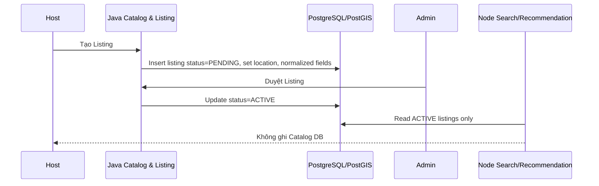
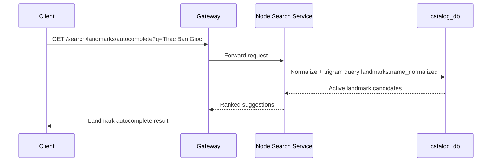
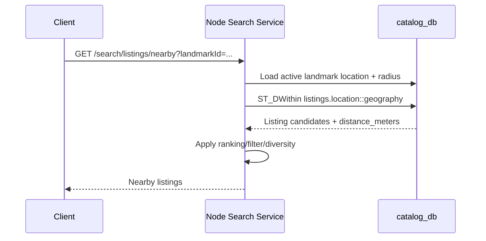
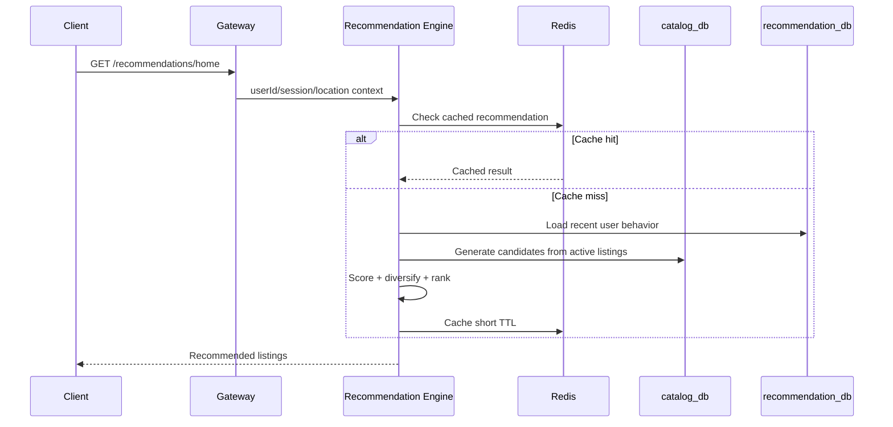
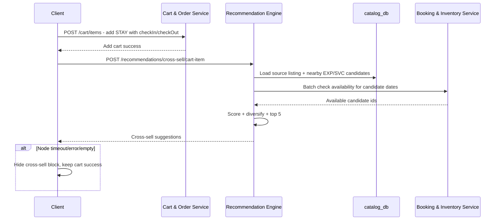

# Kế hoạch xây dựng Node.js Search, Location & Recommendation Service

> Phạm vi tài liệu: mô tả ý tưởng, luồng hoạt động và kế hoạch xây dựng hai khối Node.js trong kiến trúc GoStay: **Search & Location Service** và **Recommendation Engine**.
>
> Nguyên tắc đã chốt: **Java Catalog & Listing là luồng ghi**, còn **Node.js là luồng đọc nâng cao** cho search, location, filter, ranking và gợi ý.

## 1. Mục tiêu tổng thể

Hệ thống cần tách rõ hai loại nghiệp vụ:

- **Catalog & Listing Service - Java Spring Boot**
  - Tạo/sửa/xóa mềm Listing, Landmark, Complex.
  - Quản lý trạng thái `PENDING`, `ACTIVE`, `HIDDEN`, `DELETED`.
  - Ghi dữ liệu chuẩn xuống PostgreSQL/PostGIS.
  - Trả detail tối thiểu của một Listing.

- **Search, Location & Recommendation - Node.js**
  - Đọc dữ liệu Catalog bằng DB user read-only.
  - Tìm kiếm không dấu, autocomplete địa danh, search listing theo từ khóa.
  - Tìm gần theo Landmark/toạ độ/map viewport bằng PostGIS.
  - Xếp hạng kết quả theo độ liên quan, khoảng cách, rating, độ phổ biến, category, complex.
  - Search theo thanh tìm kiếm kiểu Airbnb: địa điểm, thời gian, khách, category tab.
  - Sinh gợi ý cho homepage, hero banner, trang Landmark, trang Province, trang Complex, trang Listing detail và các luồng tìm kiếm.
  - Sinh **gợi ý chéo bán thêm** ngay sau khi user thêm dịch vụ vào giỏ hàng, đặc biệt là luồng STAY -> EXP/SVC.

Tư duy chính: **Java giữ dữ liệu đúng, Node.js biến dữ liệu đúng thành trải nghiệm tìm kiếm và gợi ý tốt**.

## 2. Ý tưởng của Search & Location Service

Search & Location Service là service đọc dữ liệu nhanh, tối ưu cho người dùng đang có ý định tìm kiếm.

Nó trả lời các câu hỏi kiểu:

- Người dùng gõ `Thac Ban Gioc` thì nên gợi ý Landmark nào?
- Người dùng đang ở Đà Lạt thì có dịch vụ nào trong bán kính 3km/5km?
- Người dùng mở bản đồ ở một vùng thì listing nào nằm trong khung nhìn đó?
- Người dùng lọc `STAY`, `EXP`, `SVC`, giá, tỉnh, rating thì kết quả nào phù hợp nhất?
- Người dùng search từ khóa thì listing nào match tốt nhất?

Service này không tạo Listing, không sửa Landmark, không approve dữ liệu. Nó chỉ đọc.

### 2.1. Nguồn dữ liệu chính

Node.js đọc từ `catalog_db` qua role:

- `catalog_node_reader`
- Chỉ có quyền `SELECT`.
- Không được insert/update/delete Catalog DB.

Các bảng Node cần đọc:

- `listings`
- `landmarks`
- `complexes`
- `reviews`

Các field quan trọng:

| Bảng | Field cần cho Node.js |
|---|---|
| `listings` | `id`, `host_id`, `complex_id`, `title`, `title_normalized`, `description`, `category`, `sub_category`, `province`, `base_price`, `price_unit`, `latitude`, `longitude`, `location`, `thumbnail_url`, `average_rating`, `total_reviews`, `status`, `attributes` |
| `landmarks` | `id`, `name`, `name_normalized`, `province`, `latitude`, `longitude`, `location`, `radius_meters`, `is_featured`, `status`, `thumbnail_url` |
| `complexes` | `id`, `host_id`, `name`, `province`, `latitude`, `longitude`, `location`, `status`, `thumbnail_url` |
| `reviews` | `id`, `listing_id`, `user_id`, `rating`, `created_at` |

### 2.2. Quy tắc bắt buộc khi query public

Node.js chỉ trả dữ liệu public khi:

- `listings.status = 'ACTIVE'`
- `landmarks.status = 'ACTIVE'`
- `complexes.status = 'ACTIVE'`
- `location IS NOT NULL` nếu query khoảng cách.
- Không được trả listing `PENDING`, `HIDDEN`, `DELETED`.

### 2.3. Tìm kiếm không dấu

Database đã có:

- `landmarks.name_normalized`
- `listings.title_normalized`
- function `gostay_normalize_search_text(text)`
- trigram index cho normalized text.

Luồng autocomplete:

1. User gõ `Thac Ban Gioc`.
2. Node gọi DB normalize input hoặc normalize local bằng thuật toán giống DB.
3. Query `landmarks.name_normalized` bằng trigram.
4. Chỉ lấy Landmark `ACTIVE`.
5. Sort theo:
   - exact/prefix match trước,
   - similarity cao hơn,
   - featured trước,
   - tỉnh gần context người dùng nếu có.

Ví dụ ý tưởng query:

```sql
WITH q AS (
  SELECT public.gostay_normalize_search_text($1) AS normalized_query
)
SELECT
  lm.id,
  lm.name,
  lm.province,
  lm.latitude,
  lm.longitude,
  similarity(lm.name_normalized, q.normalized_query) AS text_score
FROM public.landmarks lm
CROSS JOIN q
WHERE lm.status = 'ACTIVE'
  AND lm.name_normalized % q.normalized_query
ORDER BY
  CASE WHEN lm.name_normalized LIKE q.normalized_query || '%' THEN 0 ELSE 1 END,
  text_score DESC,
  lm.is_featured DESC NULLS LAST
LIMIT $2;
```

### 2.4. Tìm gần theo mét bằng PostGIS

Database đang giữ `location` dạng `geometry(Point,4326)`, nhưng Node query theo mét bằng:

```sql
location::geography
```

Đã có expression GiST index cho dạng này. Node phải query đúng pattern để tận dụng index.

Ví dụ query quanh toạ độ:

```sql
WITH q AS (
  SELECT ST_SetSRID(ST_MakePoint($1, $2), 4326)::geography AS point
)
SELECT
  l.id,
  l.title,
  l.category,
  l.sub_category,
  l.province,
  l.base_price,
  l.average_rating,
  l.total_reviews,
  l.latitude,
  l.longitude,
  ST_Distance(l.location::geography, q.point) AS distance_meters
FROM public.listings l
CROSS JOIN q
WHERE l.status = 'ACTIVE'
  AND l.location IS NOT NULL
  AND ST_DWithin(l.location::geography, q.point, $3)
ORDER BY distance_meters ASC
LIMIT $4 OFFSET $5;
```

### 2.5. Tìm gần theo Landmark

Luồng:

1. User chọn Landmark, ví dụ `Thác Bản Giốc`.
2. Node lấy `landmarks.location`, `radius_meters`.
3. Nếu client không truyền radius, dùng `radius_meters` của Landmark.
4. Query listing trong bán kính đó.
5. Sort theo score tổng hợp, không chỉ distance.

Điểm quan trọng: Landmark là **ngữ cảnh địa lý**, còn Listing là **dịch vụ có thể bán được**.

### 2.6. Search bar kiểu Airbnb trên trang chủ

Thanh tìm kiếm chính hoạt động giống tư duy Airbnb nhưng áp dụng cho hệ sinh thái đa loại hình của GoStay.

Input chính:

| Trường | Ý nghĩa |
|---|---|
| `Địa điểm` | Landmark, tỉnh/thành, khu du lịch, complex hoặc từ khóa địa danh |
| `Thời gian` | Khoảng ngày đi/lưu trú hoặc ngày trải nghiệm |
| `Khách` | Số khách/người tham gia |
| `Category tab` | `ALL`, `STAY`, `EXP`, `SVC` |

Luật quan trọng:

- Khi user đang ở màn hình chính và **chưa bấm category tab**, trạng thái mặc định là `ALL`.
- `ALL` nghĩa là tìm tất cả dịch vụ quanh khu vực địa danh: nơi lưu trú, trải nghiệm và dịch vụ.
- Khi user bấm `Nơi lưu trú`, chỉ trả `category = 'STAY'`.
- Khi user bấm `Trải nghiệm`, chỉ trả `category = 'EXP'`.
- Khi user bấm `Dịch vụ`, chỉ trả `category = 'SVC'`.
- Search public luôn chỉ trả listing `ACTIVE`.
- Nếu có thời gian/khách, Node phải dùng thông tin đó để lọc availability hoặc gọi Booking & Inventory Service kiểm tra khả dụng.

#### 2.6.1. Trường hợp search 1 - mặc định tìm tất cả loại hình quanh địa danh

Ví dụ user nhập:

```text
Địa điểm: Đà Lạt
Thời gian: 10/07/2026 - 12/07/2026
Khách: 2
Category tab: chưa chọn
```

Node hiểu là:

```text
categoryMode = ALL
```

Kết quả nên gồm:

- `STAY`: khách sạn, homestay, villa còn phòng.
- `EXP`: tour, trekking, hoạt động trải nghiệm còn slot.
- `SVC`: thuê xe, spa, chụp ảnh, ăn uống, dịch vụ hỗ trợ.

Kết quả có thể trả theo 2 dạng:

- **Mixed feed:** trộn các loại hình trong một danh sách và gắn `category`.
- **Grouped feed:** chia section `Nơi lưu trú`, `Trải nghiệm`, `Dịch vụ`.

Khuyến nghị v1: dùng **grouped feed** cho home/search initial result vì dễ hiểu và giống trải nghiệm khám phá. Khi user sort/filter nâng cao thì có thể chuyển sang mixed feed.

#### 2.6.2. Trường hợp search 2 - user bấm category tab

Nếu user bấm tab phía trên:

| Tab UI | Query Node |
|---|---|
| `Nơi lưu trú` | `category=STAY` |
| `Trải nghiệm` | `category=EXP` |
| `Dịch vụ` | `category=SVC` |

Ví dụ user chọn `Trải nghiệm`, nhập `Sa Pa`, ngày `15/07/2026`, khách `2`.

Node chỉ trả:

- Listing `category = 'EXP'`.
- Gần Landmark/khu vực Sa Pa.
- Còn slot hoặc còn inventory phù hợp ngày đó.
- Sort theo distance, popularity, rating, relevance.

#### 2.6.3. Ý nghĩa thời gian và khách theo từng category

| Category | Thời gian | Khách |
|---|---|---|
| `STAY` | `checkIn`, `checkOut` | số khách, dùng để lọc sức chứa/phòng |
| `EXP` | ngày tham gia hoặc khoảng ngày | số người tham gia, dùng để lọc slot |
| `SVC` | ngày dùng dịch vụ hoặc khoảng ngày | số lượng/người dùng, tùy subCategory |
| `ALL` | trip window tổng | áp dụng linh hoạt theo từng loại hình |

Với `ALL`, Node không nên ép mọi category dùng cùng logic. Nó phải coi khoảng ngày là **trip context**, rồi lọc từng nhóm theo cách phù hợp.

#### 2.6.4. Location resolution

Ô `Địa điểm` không nên query listing ngay lập tức bằng text thô. Node cần resolve trước:

1. Nếu match Landmark rõ ràng: dùng `landmarkId`, `location`, `radius_meters`.
2. Nếu match Complex: dùng `complexId`, trả trang/tập dịch vụ thuộc complex hoặc quanh complex.
3. Nếu match tỉnh/thành: dùng province context, ưu tiên Landmark/Complex nổi bật trong tỉnh.
4. Nếu match mơ hồ: trả autocomplete suggestions để user chọn.

Điều này giúp search không bị lệch khi user gõ cùng một tên nhưng có nhiều địa điểm trùng nhau.

## 3. Ý tưởng của Recommendation Engine

Recommendation Engine không chỉ tìm cái người dùng gõ. Nó chủ động đề xuất cái người dùng có khả năng muốn xem/đặt.

Nó trả lời các câu hỏi kiểu:

- Ở homepage nên gợi ý dịch vụ nào cho user này?
- Khi user đang xem một villa ở Đà Lạt, nên gợi ý villa/experience/dịch vụ nào liên quan?
- Khi user chọn Landmark, nên gợi ý những listing nào gần đó và đáng đặt nhất?
- Khi user vừa thêm khách sạn/homestay vào giỏ, nên gợi ý tour, thuê xe, spa, thợ ảnh hoặc dịch vụ vệ tinh nào gần nơi ở và còn lịch trống?
- Khi user chưa đăng nhập, nên gợi ý gì để vẫn hợp lý?
- Khi user đã có hành vi xem/click/search, nên ưu tiên gì?

### 3.1. Recommendation khác Search ở điểm nào?

| Search | Recommendation |
|---|---|
| User chủ động nhập query/filter | Hệ thống chủ động đề xuất |
| Tối ưu match với điều kiện người dùng nhập | Tối ưu khả năng user quan tâm/đặt |
| Cần chính xác, dễ giải thích | Cần ranking thông minh và đa dạng |
| Input thường là keyword/toạ độ/filter | Input có thể là user, session, listing, landmark, hành vi |

### 3.2. Recommendation v1 nên bắt đầu bằng rule-based scoring

Không nên nhảy ngay vào machine learning. Giai đoạn đầu dữ liệu hành vi chưa nhiều, rule-based scoring dễ kiểm soát hơn.

Công thức điểm gợi ý v1:

```text
final_score =
  0.30 * geo_score
+ 0.20 * category_score
+ 0.15 * rating_score
+ 0.10 * popularity_score
+ 0.10 * text_context_score
+ 0.05 * price_fit_score
+ 0.05 * complex_boost
+ 0.05 * freshness_score
- penalty_score
```

Ý nghĩa:

- `geo_score`: gần Landmark/toạ độ/trip context hơn thì điểm cao hơn.
- `category_score`: đúng category user đang xem/search thì điểm cao.
- `rating_score`: rating cao nhưng nên dùng Bayesian average để tránh listing chỉ có 1 review 5 sao leo top.
- `popularity_score`: dựa trên `total_reviews`, click/view/order sau này.
- `text_context_score`: listing title/province/category liên quan đến context.
- `price_fit_score`: giá nằm trong khoảng user hay chọn.
- `complex_boost`: listing cùng Complex hoặc cùng hệ sinh thái Enterprise có thể boost.
- `freshness_score`: listing mới được duyệt có cơ hội xuất hiện.
- `penalty_score`: phạt listing thiếu ảnh, rating thấp, quá xa, ít dữ liệu, bị report.

### 3.3. Candidate generation và ranking

Recommendation nên chia làm 2 bước:

#### Bước 1: Candidate generation

Lấy ra danh sách ứng viên tương đối rộng, ví dụ 200-500 listing:

- Gần Landmark.
- Cùng province.
- Cùng category/subCategory.
- Cùng Complex.
- Listing rating cao.
- Listing mới ACTIVE.
- Listing phổ biến trong khu vực.

#### Bước 2: Ranking

Tính điểm từng ứng viên rồi sort:

- Lọc listing không đủ điều kiện.
- Tính distance.
- Tính rating/popularity.
- Tính category match.
- Tính diversity để không trả toàn bộ cùng một host/complex.
- Trả top N.

### 3.4. Cold start

Khi chưa có dữ liệu user:

- Dùng location context nếu có.
- Dùng province/landmark đang xem.
- Dùng listing nổi bật theo rating và review count.
- Trộn nhiều category để tránh một màu.
- Ưu tiên listing có ảnh, giá rõ, trạng thái ACTIVE, location đầy đủ.

Khi có user behavior:

- Ưu tiên category user hay xem.
- Ưu tiên province/landmark user hay tìm.
- Ưu tiên khoảng giá user thường click/order.
- Giảm điểm listing user đã xem quá nhiều nhưng không click/order.

### 3.5. Cross-selling Engine - hệ thống gợi ý chéo bán thêm

Đây là phần còn thiếu nếu chỉ gọi chung là Recommendation Engine. Theo Project Context, GoStay có triết lý **"Hệ sinh thái Bán chéo"**: không để user chỉ đặt một phòng rồi rời đi, mà phải gợi ý đúng lúc các dịch vụ vệ tinh giúp hoàn thiện chuyến đi.

Cross-selling khác với recommendation thông thường ở chỗ nó được kích hoạt bởi **hành động thêm vào giỏ hàng**, không chỉ bởi hành vi xem trang.

Ví dụ đúng với báo cáo:

1. User xem một Homestay.
2. User chọn `checkIn`, `checkOut`, số khách.
3. User nhấn **Thêm vào giỏ hàng**.
4. Cart/Order thêm thành công item STAY.
5. Frontend gọi Node Recommendation Engine để lấy gợi ý chéo.
6. Node dùng toạ độ Homestay và khoảng ngày lưu trú để tìm EXP/SVC gần đó.
7. Node kiểm tra các dịch vụ đó còn lịch trống trong khung ngày phù hợp.
8. Frontend hiển thị slider/modal: **"Có thể bạn sẽ cần cho chuyến đi này"**.

#### 3.5.1. Mục tiêu kinh doanh

- Tăng AOV - Average Order Value.
- Kết nối Host địa phương với nhau: Host phòng nghỉ, Host thuê xe, Host tour, Host spa, Host chụp ảnh.
- Biến một booking đơn lẻ thành một giỏ hàng du lịch đầy đủ.
- Tận dụng lợi thế `Landmark + PostGIS + Universal Cart`.

#### 3.5.2. Trigger v1

V1 nên làm đúng use case trong báo cáo trước:

| Trigger | Điều kiện |
|---|---|
| User thêm `STAY` vào giỏ | Cart add thành công |
| Listing gốc có `latitude`, `longitude`, `location` | Bắt buộc |
| User đã chọn `checkIn`, `checkOut` | Bắt buộc |
| Node tìm ứng viên | Category `EXP` và `SVC` |
| Bán kính mặc định | 3km quanh listing STAY |
| Kết quả | Top 5 dịch vụ phù hợp nhất |

V2 có thể mở rộng:

| Listing vừa thêm | Gợi ý chéo nên ưu tiên |
|---|---|
| `STAY` | `EXP`, `SVC` gần nơi ở |
| `EXP` | `STAY` gần điểm diễn ra trải nghiệm, `SVC` bổ trợ |
| `SVC` | `STAY` hoặc `EXP` gần đó nếu user chưa có lịch trình |

#### 3.5.3. Candidate cho gợi ý chéo

Candidate generation cho cross-sell không giống "similar listing". Nó phải ưu tiên **khác category nhưng bổ trợ cho chuyến đi**.

Với item gốc là `STAY`, candidate nên là:

- `EXP`: tour, trekking, vé tham quan, hoạt động bản địa.
- `SVC`: thuê xe, spa, massage, chef, makeup, hair styling, photography, catering, prepared meals.
- Cùng Landmark hoặc gần listing STAY.
- Cùng province.
- Cùng Complex nếu STAY thuộc Complex và Complex có dịch vụ nội khu.
- Còn availability trong khoảng ngày lưu trú.
- Không nằm trong cart hiện tại.

#### 3.5.4. Scoring riêng cho cross-sell

```text
cross_sell_score =
  0.30 * availability_score
+ 0.25 * geo_score
+ 0.15 * complement_score
+ 0.10 * rating_score
+ 0.10 * popularity_score
+ 0.05 * complex_boost
+ 0.05 * price_impulse_score
- penalty_score
```

Ý nghĩa:

- `availability_score`: còn lịch trống trong ngày user lưu trú hoặc ngày tham gia.
- `geo_score`: càng gần STAY càng tốt.
- `complement_score`: mức độ bổ trợ cho STAY. Ví dụ thuê xe/tour/spa/chụp ảnh nên cao hơn một STAY khác.
- `rating_score`: rating tốt.
- `popularity_score`: nhiều review/click/order.
- `complex_boost`: dịch vụ cùng Complex/Enterprise được boost nhẹ vì tiện trong hệ sinh thái.
- `price_impulse_score`: dịch vụ giá vừa phải, dễ thêm nhanh vào giỏ.
- `penalty_score`: quá xa, thiếu ảnh, rating thấp, trùng item cart, category không phù hợp.

#### 3.5.5. Availability check

Cross-selling phải kiểm tra lịch trống, nếu không sẽ gợi ý món không mua được.

Có 2 cách triển khai:

- **Phương án A - khuyến nghị v1:** Node sinh candidate từ Catalog DB, sau đó gọi Booking & Inventory Service qua internal API batch availability.
- **Phương án B - v2:** Node được cấp read-only view từ inventory DB để kiểm tra availability nhanh hơn.

V1 nên chọn phương án A để giữ ranh giới database-per-service sạch hơn. Node không ghi inventory, không lock tồn kho. Khi user bấm **Thêm nhanh**, frontend vẫn gọi Cart/Order như luồng thường để validate và thêm item.

#### 3.5.6. Nguyên tắc UX và lỗi

- Cross-sell **không được chặn** luồng thêm giỏ chính.
- Nếu Node lỗi, timeout hoặc trả rỗng, frontend chỉ ẩn khối gợi ý.
- Timeout frontend nên đặt khoảng `800ms - 1000ms`.
- Response nên đủ nhẹ để render slider nhanh.
- Không hiển thị quá nhiều item; v1 chỉ cần Top 5.
- Không gợi ý lại listing vừa thêm hoặc item đã nằm trong cart.

### 3.6. Homepage Recommendation & Discovery Feed

Homepage của GoStay không chỉ là danh sách listing. Nó là màn hình khám phá du lịch theo 4 lớp:

1. Hero banner với 6 địa danh nổi bật.
2. Feed gợi ý quanh vị trí user nếu user cho phép location.
3. Feed gợi ý theo địa danh nổi tiếng nếu user không cho phép location.
4. Section khám phá theo tỉnh/thành, dẫn vào Landmark/Complex/địa điểm du lịch.

#### 3.6.1. Trường hợp gợi ý 1 - Hero banner 6 địa danh nổi bật

Mục tiêu:

- Khi user vào homepage, thứ đầu tiên thấy là các địa danh nổi bật của Việt Nam.
- Hero banner chạy ảnh giống carousel.
- Mỗi slide là một Landmark hoặc địa danh du lịch nổi bật.
- Nên có tối đa 6 item chính để UI mạnh, không loãng.

Nguồn dữ liệu:

- `landmarks.is_featured = true`
- `landmarks.status = 'ACTIVE'`
- `landmarks.thumbnail_url`
- `landmarks.gallery_urls`
- Sau này có thể thêm field `featured_rank`, `hero_title`, `hero_subtitle` nếu cần kiểm soát marketing tốt hơn.

Ranking hero v1:

```text
hero_score =
  0.40 * featured_rank_score
+ 0.25 * popularity_score
+ 0.15 * province_diversity_score
+ 0.10 * image_quality_score
+ 0.10 * seasonal_score
```

Nếu chưa có hành vi/popularity thật, v1 có thể dùng `is_featured`, `total listing quanh landmark`, `review count quanh landmark`, và cấu hình thủ công.

#### 3.6.2. Trường hợp gợi ý 2 - Homepage feed khi user cho phép vị trí

Nếu user cho phép truy cập vị trí, homepage feed phải bắt đầu từ **khu vực gần user nhất**.

Luồng:

1. Frontend xin quyền location.
2. Nếu user đồng ý, gửi `lat`, `lng` lên Node.
3. Node tìm các listing `STAY`, `EXP`, `SVC` gần user.
4. Ưu tiên listing được ưa chuộng, rating tốt, còn phòng/còn slot vào tháng tới.
5. Khi user scroll xuống, feed mở rộng dần bán kính và trộn thêm địa danh nổi tiếng tại Việt Nam.

Chiến lược phân tầng khi scroll:

| Tầng feed | Bán kính/nguồn | Nội dung |
|---|---|---|
| Tầng 1 | gần user nhất | STAY/EXP/SVC phổ biến quanh vị trí user |
| Tầng 2 | mở rộng bán kính | các listing tốt ở khu vực lân cận |
| Tầng 3 | cùng tỉnh/vùng | địa danh, complex và listing nổi bật |
| Tầng 4 | toàn Việt Nam | địa danh nổi tiếng, giảm dần theo độ nổi tiếng |

Điều kiện availability:

- Với `STAY`: còn phòng vào tháng tới hoặc trong khoảng ngày user chọn nếu có.
- Với `EXP/SVC`: còn slot hoặc khả dụng trong tháng tới.
- Nếu chưa tích hợp availability ở v1, response phải gắn cờ `availabilityUnchecked = true` hoặc chỉ dùng wording mềm như "Được ưa chuộng gần bạn", không dùng "còn phòng".

#### 3.6.3. Trường hợp gợi ý 2b - Homepage feed khi user không cho phép vị trí

Nếu user không cấp quyền location:

- Không được để homepage trống.
- Node dùng các địa danh nổi tiếng toàn quốc.
- Feed càng xuống dưới thì độ nổi tiếng giảm dần hoặc chuyển sang các tỉnh/vùng khác để tạo cảm giác khám phá.

Nguồn ranking:

- Landmark `is_featured`.
- Số lượng listing `ACTIVE` quanh Landmark.
- Rating/review count của listing quanh Landmark.
- Complex nổi bật.
- Tính đa dạng vùng miền.
- Cấu hình thủ công cho chiến dịch marketing.

Ví dụ section:

- "Địa danh nổi bật tại Việt Nam"
- "Điểm đến được yêu thích"
- "Khu nghỉ dưỡng và tổ hợp nổi bật"
- "Trải nghiệm đáng thử"
- "Dịch vụ tiện ích cho chuyến đi"

#### 3.6.4. Trường hợp gợi ý 3 - User bấm category tab trên homepage

Khi user bấm một trong ba category:

- `Nơi lưu trú`
- `Trải nghiệm`
- `Dịch vụ`

Feed vẫn dùng chiến lược giống trường hợp 2, nhưng scope chỉ còn category đã chọn.

Ví dụ:

- User cho phép location và bấm `Nơi lưu trú`: gợi ý các STAY gần user, còn phòng tháng tới, rating tốt.
- User cho phép location và bấm `Trải nghiệm`: gợi ý các EXP gần user, còn slot trong tháng tới.
- User không cho phép location và bấm `Dịch vụ`: gợi ý SVC quanh các địa danh nổi tiếng, giảm dần theo popularity.

Nên xem category tab trên homepage là **big tag filter**, không phải search text.

#### 3.6.5. Trường hợp gợi ý 4 - Gợi ý theo tỉnh/thành

Homepage cần có section:

```text
Bạn quan tâm tỉnh thành nào?
```

Mỗi ô lớn là một tỉnh/thành hoặc vùng du lịch quan trọng.

Khi user bấm vào một tỉnh:

1. Node trả danh sách địa điểm du lịch trong tỉnh:
   - Landmark.
   - Khu du lịch.
   - Địa điểm tham quan.
   - Complex.
2. UI hiển thị các ô lớn/card lớn cho từng điểm.
3. Nếu user bấm `Complex`, điều hướng vào trang Complex.
4. Nếu user bấm Landmark/khu du lịch/địa điểm tham quan, điều hướng vào trang Landmark/Destination detail.
5. Bên dưới trang detail hiển thị STAY/EXP/SVC quanh khu vực đó.

Phân biệt entity:

| Entity | Ý nghĩa | Khi click |
|---|---|---|
| `Province` | Tỉnh/thành | mở trang khám phá tỉnh |
| `Landmark` | Địa danh mỏ neo có toạ độ | mở trang địa danh + listing quanh đó |
| `Complex` | Tổ hợp doanh nghiệp | mở trang complex + dịch vụ thuộc complex |
| `Destination` | khái niệm UI cho khu du lịch/địa điểm tham quan | v1 có thể map vào `Landmark`, v2 có bảng riêng nếu cần |

Khuyến nghị v1: dùng `Landmark` để đại diện cho khu du lịch/địa điểm tham quan, vì Landmark đã có toạ độ, ảnh, province, radius và PostGIS index. Chỉ tạo bảng `destinations` riêng khi cần mô tả nhiều loại POI không phải mỏ neo search.

#### 3.6.6. Homepage feed scoring tổng hợp

```text
home_feed_score =
  0.25 * proximity_score
+ 0.20 * popularity_score
+ 0.15 * availability_score
+ 0.15 * rating_score
+ 0.10 * landmark_fame_score
+ 0.05 * category_diversity_score
+ 0.05 * complex_boost
+ 0.05 * freshness_score
- penalty_score
```

Nếu không có location:

```text
home_feed_score =
  0.30 * landmark_fame_score
+ 0.20 * popularity_score
+ 0.15 * rating_score
+ 0.10 * availability_score
+ 0.10 * province_diversity_score
+ 0.05 * category_diversity_score
+ 0.05 * complex_boost
+ 0.05 * freshness_score
- penalty_score
```

Điểm mấu chốt: có location thì ưu tiên **gần user**, không có location thì ưu tiên **địa danh nổi tiếng**.

## 4. Luồng hoạt động tổng thể

### 4.1. Luồng ghi dữ liệu



Điểm quan trọng:

- Host tạo listing mới không được public ngay.
- Node chỉ đọc listing sau khi Admin duyệt `ACTIVE`.
- Nếu listing bị `HIDDEN` hoặc `DELETED`, Node không trả ra public search/recommendation.

### 4.2. Luồng autocomplete Landmark



### 4.3. Luồng nearby theo Landmark



### 4.4. Luồng recommendation homepage



### 4.5. Luồng gợi ý chéo sau khi thêm STAY vào giỏ



Luồng này phải chạy bất đồng bộ từ góc nhìn người dùng. Cart add thành công là kết quả chính; cross-sell chỉ là lớp tăng doanh thu, không được làm treo hoặc rollback cart.

## 5. Đề xuất kiến trúc Node.js service

Nên xây service bằng TypeScript để kiểm soát contract tốt.

### 5.1. Stack đề xuất

| Thành phần | Đề xuất |
|---|---|
| Runtime | Node.js LTS |
| Language | TypeScript |
| Framework | NestJS hoặc Fastify |
| DB access | `pg` hoặc Kysely, ưu tiên raw SQL cho PostGIS |
| Cache | Redis |
| Validation | Zod/Joi/class-validator |
| API docs | OpenAPI/Swagger |
| Logging | Pino |
| Metrics | Prometheus/OpenTelemetry |
| Test | Jest + Testcontainers PostgreSQL/PostGIS |

Gợi ý thực tế: dùng **NestJS + pg/Kysely**. NestJS giúp chia module rõ, còn PostGIS query nên viết SQL có kiểm soát thay vì ORM che mất index.

### 5.2. Module nội bộ

```text
node-search-recommendation-service/
  src/
    app.module.ts
    config/
      env.ts
      database.ts
      redis.ts
    database/
      catalog-read.pool.ts
      recommendation-write.pool.ts
    search/
      search.controller.ts
      search.service.ts
      search.repository.ts
      search.dto.ts
      search-ranking.ts
      location-resolver.ts
    location/
      location.service.ts
      postgis.repository.ts
      distance.ts
    discovery/
      home-feed.controller.ts
      home-feed.service.ts
      hero-landmark.service.ts
      province-discovery.controller.ts
      province-discovery.service.ts
      feed-cursor.ts
    recommendation/
      recommendation.controller.ts
      recommendation.service.ts
      candidate-generator.ts
      scoring.service.ts
      diversity.service.ts
      cross-sell.controller.ts
      cross-sell.service.ts
      cross-sell-candidate-generator.ts
      cross-sell-scoring.ts
      recommendation.dto.ts
    inventory/
      inventory.client.ts
      availability.dto.ts
    behavior/
      behavior.controller.ts
      behavior.service.ts
      behavior.repository.ts
      events.ts
    cache/
      cache-key.ts
      redis-cache.service.ts
    common/
      pagination.ts
      errors.ts
      logger.ts
      auth-context.ts
```

### 5.3. Database connection

Node nên có 2 kết nối tách biệt:

| DB | Quyền | Mục đích |
|---|---|---|
| `catalog_db` | read-only | Đọc Listing, Landmark, Complex, Review |
| `recommendation_db` hoặc schema riêng | read/write | Lưu behavior events, impression, click, user preference, cache materialized data |

Tuyệt đối không để Node dùng user `gotravel_db` có quyền ghi Catalog.

## 6. API contract đề xuất

### 6.1. Search & Location API

| Method | Endpoint | Mục đích |
|---|---|---|
| `GET` | `/api/v1/search/locations/suggest` | Resolve ô địa điểm: Landmark, tỉnh, complex, destination |
| `GET` | `/api/v1/search/landmarks/autocomplete` | Autocomplete Landmark không dấu |
| `GET` | `/api/v1/search/listings` | Search listing theo Airbnb-style query/filter |
| `GET` | `/api/v1/search/listings/nearby` | Tìm listing gần toạ độ hoặc landmark |
| `GET` | `/api/v1/search/map` | Query listing trong bounding box bản đồ |
| `GET` | `/api/v1/search/complexes/nearby` | Tìm Complex gần toạ độ |

Query params gợi ý cho `/search/listings`:

| Param | Ý nghĩa |
|---|---|
| `q` | keyword search |
| `locationQuery` | text user nhập ở ô địa điểm nếu chưa resolve |
| `locationType` | `LANDMARK`, `PROVINCE`, `COMPLEX`, `COORDINATE` |
| `landmarkId` | context Landmark |
| `complexId` | context Complex |
| `lat`, `lng` | toạ độ trung tâm |
| `radiusMeters` | bán kính theo mét |
| `bbox` | bounding box map: `minLng,minLat,maxLng,maxLat` |
| `category` | `ALL`, `STAY`, `EXP`, `SVC`; mặc định `ALL` nếu user chưa bấm tab |
| `subCategory` | sub category nếu là `SVC` |
| `province` | tỉnh/thành |
| `checkIn`, `checkOut` | thời gian lưu trú/trip window |
| `date` | ngày tham gia nếu EXP/SVC chỉ cần một ngày |
| `guests` | số khách/người tham gia |
| `minPrice`, `maxPrice` | khoảng giá |
| `minRating` | rating tối thiểu |
| `sort` | `relevance`, `distance`, `rating`, `price_asc`, `price_desc` |
| `page`, `size` | phân trang |

Quy ước response cho `category=ALL`:

- `mode = "GROUPED"` nếu frontend cần section `Nơi lưu trú`, `Trải nghiệm`, `Dịch vụ`.
- `mode = "MIXED"` nếu frontend cần một danh sách trộn.
- Mặc định v1 nên dùng `GROUPED`.

### 6.2. Recommendation API

| Method | Endpoint | Mục đích |
|---|---|---|
| `GET` | `/api/v1/recommendations/home/hero-landmarks` | 6 địa danh nổi bật cho hero banner |
| `GET` | `/api/v1/recommendations/home` | Gợi ý homepage |
| `GET` | `/api/v1/recommendations/home/feed` | Feed infinite scroll homepage theo vị trí/category |
| `GET` | `/api/v1/recommendations/provinces` | Danh sách tỉnh/thành nổi bật cho section khám phá |
| `GET` | `/api/v1/recommendations/provinces/{province}/destinations` | Landmark/Complex/địa điểm du lịch trong tỉnh |
| `GET` | `/api/v1/recommendations/landmarks/{landmarkId}` | Gợi ý quanh Landmark |
| `GET` | `/api/v1/recommendations/complexes/{complexId}` | Gợi ý hoặc listing thuộc Complex |
| `GET` | `/api/v1/recommendations/listings/{listingId}/similar` | Listing tương tự |
| `POST` | `/api/v1/recommendations/cross-sell/cart-item` | Gợi ý chéo sau khi thêm item vào giỏ |
| `GET` | `/api/v1/recommendations/users/me` | Gợi ý cá nhân hoá |
| `POST` | `/api/v1/recommendations/events` | Ghi behavior event từ frontend/gateway |

Query params gợi ý cho `/recommendations/home/feed`:

| Param | Ý nghĩa |
|---|---|
| `lat`, `lng` | vị trí user nếu được cấp quyền |
| `locationAllowed` | `true/false` để Node chọn chiến lược ranking |
| `category` | `ALL`, `STAY`, `EXP`, `SVC` |
| `availableNextMonth` | ưu tiên còn phòng/còn slot tháng tới |
| `cursor` | cursor infinite scroll |
| `pageSize` | số item/section trả về |

Với `locationAllowed=true`, feed mở rộng dần từ gần tới xa. Với `locationAllowed=false`, feed đi từ địa danh nổi tiếng nhất xuống các địa danh ít nổi tiếng hơn.

Response section gợi ý cho `/recommendations/home/feed`:

```json
{
  "cursor": "opaque-cursor",
  "nextCursor": "opaque-next-cursor",
  "sections": [
    {
      "type": "LISTING_CAROUSEL",
      "title": "Nơi lưu trú được ưa chuộng gần bạn",
      "category": "STAY",
      "items": []
    },
    {
      "type": "DESTINATION_GRID",
      "title": "Địa danh nổi bật tại Việt Nam",
      "items": []
    }
  ]
}
```

Các `section.type` nên hỗ trợ ở v1:

| Type | UI phù hợp |
|---|---|
| `HERO_LANDMARKS` | hero/banner carousel |
| `LISTING_CAROUSEL` | hàng card giống Airbnb |
| `DESTINATION_GRID` | ô lớn tỉnh/thành/địa danh |
| `COMPLEX_CAROUSEL` | các tổ hợp nổi bật |
| `MIXED_RECOMMENDATION` | feed trộn nhiều loại hình |

Request body đề xuất cho `/recommendations/cross-sell/cart-item`:

```json
{
  "sourceListingId": "uuid",
  "sourceCategory": "STAY",
  "checkIn": "2026-07-10",
  "checkOut": "2026-07-12",
  "guests": 2,
  "cartListingIds": ["uuid"],
  "limit": 5
}
```

Response item nên có:

| Field | Ý nghĩa |
|---|---|
| `listingId` | ID dịch vụ được gợi ý |
| `title` | Tên dịch vụ |
| `category`, `subCategory` | Loại dịch vụ |
| `thumbnailUrl` | Ảnh đại diện |
| `basePrice`, `priceUnit` | Giá hiển thị |
| `distanceMeters` | Khoảng cách tới STAY vừa thêm |
| `averageRating`, `totalReviews` | Tín hiệu chất lượng |
| `reason` | Lý do gợi ý ngắn: `NEAR_YOUR_STAY`, `AVAILABLE_DURING_TRIP`, `SAME_COMPLEX` |
| `score` | Điểm ranking nội bộ, có thể ẩn khỏi frontend nếu không cần |

## 7. Kế hoạch xây dựng chi tiết

## Phase 0 - Chốt contract và chuẩn bị

- [ ] Chốt tên service: `SearchAndRecommendation` hoặc `SearchLocationRecommendation`.
- [ ] Chốt port, ví dụ `8085`.
- [ ] Chốt route qua API Gateway.
- [ ] Chốt env:
  - `CATALOG_DB_HOST`
  - `CATALOG_DB_PORT`
  - `CATALOG_DB_NAME`
  - `CATALOG_DB_USER=catalog_node_reader`
  - `CATALOG_DB_PASSWORD`
  - `REDIS_URL`
  - `INVENTORY_SERVICE_URL`
  - `INTERNAL_SERVICE_TOKEN`
- [ ] Chốt response DTO public cho Listing card.
- [ ] Chốt contract batch availability với Booking & Inventory Service.
- [ ] Chốt `ACTIVE only` là rule mặc định cho public query.
- [ ] Chốt không gọi Java Catalog để search public, chỉ đọc DB read-only.

Tiêu chí hoàn thành:

- Có OpenAPI nháp.
- Có tài liệu query contract.
- Có DB user read-only chạy được.
- Không endpoint nào của Java và Node cạnh tranh cùng chức năng public search.

## Phase 1 - Scaffold service Node.js

- [ ] Tạo project TypeScript.
- [ ] Cấu hình lint/format/test.
- [ ] Tạo config loader cho env.
- [ ] Tạo DB pool read-only tới Catalog DB.
- [ ] Tạo internal HTTP client tới Booking & Inventory Service.
- [ ] Tạo Redis connection.
- [ ] Tạo health check:
  - `/health/live`
  - `/health/ready`
- [ ] Tạo logging request id/correlation id.
- [ ] Tạo error response chuẩn.

Tiêu chí hoàn thành:

- Service start được.
- Health check kiểm tra được DB và Redis.
- CI chạy unit test.

## Phase 2 - Catalog read repository

- [ ] Viết repository đọc `landmarks`.
- [ ] Viết repository đọc `listings`.
- [ ] Viết repository đọc `complexes`.
- [ ] Viết query PostGIS dùng `location::geography`.
- [ ] Viết query autocomplete dùng normalized/trigram.
- [ ] Viết query filter cơ bản.
- [ ] Viết test SQL với Testcontainers PostgreSQL/PostGIS.

Tiêu chí hoàn thành:

- Query radius 3km/5km dùng spatial index.
- Query autocomplete dùng trigram index.
- Không query nào trả listing không `ACTIVE`.

## Phase 3 - Search & Location API v1

- [ ] Implement `/search/locations/suggest` để resolve ô `Địa điểm`.
- [ ] Implement `/search/landmarks/autocomplete`.
- [ ] Implement `/search/listings`.
- [ ] Implement `category=ALL` mặc định khi user chưa bấm tab.
- [ ] Implement `category=STAY`, `category=EXP`, `category=SVC` khi user bấm tab.
- [ ] Implement grouped response cho `ALL`:
  - section `Nơi lưu trú`;
  - section `Trải nghiệm`;
  - section `Dịch vụ`.
- [ ] Implement `/search/listings/nearby`.
- [ ] Implement `/search/map`.
- [ ] Implement pagination ổn định.
- [ ] Implement sort:
  - relevance
  - distance
  - rating
  - price
- [ ] Implement filter:
  - category
  - subCategory
  - province
  - price range
  - rating
- [ ] Implement trip context:
  - `checkIn`, `checkOut` cho STAY;
  - `date` hoặc date range cho EXP/SVC;
  - `guests` cho sức chứa/số người.
- [ ] Tích hợp availability check theo category nếu request có thời gian.
- [ ] Implement response `distanceMeters` khi có location context.

Tiêu chí hoàn thành:

- Gõ không dấu vẫn tìm ra Landmark/listing có dấu.
- Search bar có đủ `Địa điểm`, `Thời gian`, `Khách`.
- Khi chưa chọn tab, search trả đủ `STAY`, `EXP`, `SVC` quanh địa danh.
- Khi chọn tab, search chỉ trả đúng category đó.
- Search quanh Landmark trả đúng listing gần nhất.
- Map viewport không trả listing ngoài khung.
- Kết quả không bị duplicate.

## Phase 4 - Recommendation Engine v1

- [ ] Implement candidate generator:
  - by landmark
  - by coordinate
  - by province
  - by category
  - by complex
  - by popularity
- [ ] Implement scoring service:
  - geo score
  - category score
  - rating score
  - popularity score
  - price fit score
  - complex boost
  - freshness score
- [ ] Implement diversity:
  - không để 1 host chiếm toàn bộ top kết quả.
  - không để 1 complex chiếm toàn bộ top kết quả, trừ khi context là complex.
- [ ] Implement endpoint:
  - `/recommendations/home`
  - `/recommendations/landmarks/{landmarkId}`
  - `/recommendations/listings/{listingId}/similar`

Tiêu chí hoàn thành:

- User chưa đăng nhập vẫn có gợi ý hợp lý.
- User có context Landmark nhận listing gần và liên quan.
- Listing detail có gợi ý cùng category/gần vị trí/cùng complex.

## Phase 4.1 - Homepage Hero, Discovery Feed và Province Discovery

- [ ] Implement `/recommendations/home/hero-landmarks`.
- [ ] Trả đúng 6 Landmark nổi bật cho hero banner.
- [ ] Mỗi hero item có:
  - `landmarkId`;
  - `name`;
  - `province`;
  - `thumbnailUrl`;
  - `galleryUrls`;
  - `headline`;
  - `subtitle`.
- [ ] Implement `/recommendations/home/feed`.
- [ ] Với `locationAllowed=true`:
  - đọc `lat`, `lng`;
  - feed tầng 1 gợi ý STAY/EXP/SVC gần user;
  - ưu tiên phổ biến, rating tốt, còn phòng/còn slot tháng tới;
  - cursor càng sâu thì mở rộng bán kính;
  - sau khu vực gần user thì trộn thêm địa danh nổi tiếng ở Việt Nam.
- [ ] Với `locationAllowed=false`:
  - dùng Landmark/Complex nổi tiếng toàn quốc;
  - cursor càng sâu thì giảm dần độ nổi tiếng;
  - đảm bảo đa dạng tỉnh/thành.
- [ ] Khi `category=ALL`, feed trả nhiều loại hình.
- [ ] Khi `category=STAY`, chỉ gợi ý nơi lưu trú.
- [ ] Khi `category=EXP`, chỉ gợi ý trải nghiệm.
- [ ] Khi `category=SVC`, chỉ gợi ý dịch vụ.
- [ ] Implement `/recommendations/provinces`.
- [ ] Implement `/recommendations/provinces/{province}/destinations`.
- [ ] Destination trong tỉnh gồm:
  - Landmark;
  - Complex;
  - khu du lịch/địa điểm tham quan map vào Landmark ở v1.
- [ ] Implement `/recommendations/complexes/{complexId}`.
- [ ] Trang Landmark/Destination detail phải có section STAY/EXP/SVC quanh khu vực đó.

Tiêu chí hoàn thành:

- Homepage có 6 địa danh nổi bật ở hero banner.
- Nếu user cấp vị trí, feed bắt đầu từ dịch vụ gần user rồi mở rộng dần khi scroll.
- Nếu user không cấp vị trí, feed bắt đầu từ địa danh nổi tiếng toàn quốc.
- Category tab trên homepage lọc đúng loại hình trong feed.
- Section tỉnh/thành trả được Landmark/Complex/điểm tham quan.
- Click Complex có dữ liệu để vào trang Complex.
- Click Landmark/địa điểm tham quan có dữ liệu để vào trang detail và hiển thị dịch vụ quanh đó.

## Phase 4.5 - Cross-selling Engine sau Add to Cart

- [ ] Implement endpoint `/recommendations/cross-sell/cart-item`.
- [ ] Validate request:
  - `sourceListingId` bắt buộc.
  - `sourceCategory` v1 chỉ nhận `STAY`.
  - `checkIn`, `checkOut` bắt buộc với `STAY`.
  - `checkOut` phải sau `checkIn`.
  - `limit` mặc định 5, tối đa 10.
- [ ] Load source listing từ Catalog DB.
- [ ] Chỉ xử lý source listing `ACTIVE`.
- [ ] Candidate generation:
  - lấy `EXP` và `SVC`;
  - nằm trong bán kính mặc định 3km;
  - cùng province hoặc cùng Landmark context nếu có;
  - ưu tiên cùng Complex/Enterprise nếu hợp lý;
  - loại bỏ listing đang nằm trong cart.
- [ ] Gọi Booking & Inventory Service batch availability cho candidate.
- [ ] Loại candidate không còn lịch trống trong khoảng user lưu trú.
- [ ] Tính `cross_sell_score`.
- [ ] Trả Top 5 item nhẹ để render slider/modal.
- [ ] Ghi event:
  - `cross_sell_requested`;
  - `cross_sell_shown`;
  - `cross_sell_clicked`;
  - `cross_sell_added_to_cart`.
- [ ] Timeout nội bộ rõ ràng:
  - DB query nên dưới 300ms;
  - availability check nên dưới 500ms;
  - tổng endpoint mục tiêu dưới 800ms.

Tiêu chí hoàn thành:

- Sau khi thêm STAY vào giỏ, frontend nhận được Top 5 EXP/SVC gần đó nếu có.
- Nếu không có candidate hoặc Inventory chậm/lỗi, endpoint trả rỗng hoặc fail nhẹ; cart vẫn đã thêm thành công.
- Không gợi ý item đã nằm trong cart.
- Không gợi ý listing không `ACTIVE`.
- Không gợi ý dịch vụ hết lịch trong ngày user lưu trú.
- Có test case STAY -> EXP/SVC trong bán kính 3km.

## Phase 5 - Behavior tracking

Recommendation tốt lên khi có hành vi. Nên lưu behavior ở DB riêng của Node, không ghi vào Catalog DB.

Event nên có:

| Event | Khi nào ghi |
|---|---|
| `search_performed` | user search keyword/filter |
| `landmark_selected` | user chọn Landmark |
| `home_hero_impressed` | hero landmark được hiển thị |
| `home_hero_clicked` | user click một hero landmark |
| `home_feed_impressed` | một block/feed item homepage được hiển thị |
| `home_feed_clicked` | user click item trong homepage feed |
| `category_tab_selected` | user chọn `STAY`, `EXP`, `SVC` trên homepage/search |
| `province_selected` | user chọn một tỉnh/thành trong section khám phá |
| `destination_selected` | user chọn Landmark/Complex/địa điểm trong tỉnh |
| `listing_impressed` | listing xuất hiện trong kết quả |
| `listing_clicked` | user click listing |
| `listing_viewed` | user mở detail |
| `recommendation_clicked` | user click item được gợi ý |
| `cross_sell_requested` | frontend gọi gợi ý chéo sau add cart |
| `cross_sell_shown` | slider/modal gợi ý chéo được hiển thị |
| `cross_sell_clicked` | user click một item trong gợi ý chéo |
| `cross_sell_added_to_cart` | user thêm nhanh item gợi ý chéo vào cart |
| `order_completed` | sau này nhận event từ Order Service |

Schema gợi ý:

```sql
CREATE TABLE recommendation_events (
  id uuid PRIMARY KEY,
  user_id uuid NULL,
  session_id varchar(100) NULL,
  event_type varchar(50) NOT NULL,
  listing_id uuid NULL,
  landmark_id uuid NULL,
  query text NULL,
  filters jsonb NULL,
  context jsonb NULL,
  created_at timestamp NOT NULL DEFAULT now()
);
```

Tiêu chí hoàn thành:

- Có event tracking tối thiểu.
- Có thể query được user gần đây xem gì/search gì.
- Không chứa thông tin nhạy cảm không cần thiết.

## Phase 6 - Cache và hiệu năng

- [ ] Cache autocomplete ngắn hạn: 1-5 phút.
- [ ] Cache popular recommendations theo province/category: 5-15 phút.
- [ ] Cache listing card payload theo listing id.
- [ ] Cache homepage anonymous recommendation.
- [ ] Không cache quá lâu với query có filter phức tạp.
- [ ] Invalidate mềm bằng TTL, vì Node đọc DB không nhận event realtime ở v1.

Cache key gợi ý:

```text
autocomplete:landmarks:{normalizedQuery}:{province}:{limit}
search:listings:{hashOfQueryParams}
home:hero-landmarks:v1
home:feed:{locationMode}:{category}:{cursor}:{contextHash}
province:list:v1
province:destinations:{province}:{category}:{cursor}
recommend:home:anon:{province}
recommend:home:user:{userId}:{contextHash}
recommend:listing-similar:{listingId}
cross-sell:stay:{sourceListingId}:{checkIn}:{checkOut}:{cartHash}
```

Tiêu chí hoàn thành:

- P95 autocomplete dưới 100ms khi cache hit.
- P95 nearby/search dưới 300ms với dữ liệu vừa.
- Có log slow query.

## Phase 7 - Observability và vận hành

- [ ] Log request id.
- [ ] Log query duration.
- [ ] Log cache hit/miss.
- [ ] Log số candidate trước/sau ranking.
- [ ] Metrics:
  - request count
  - latency p50/p95/p99
  - DB query latency
  - Redis latency
  - cache hit rate
  - recommendation click-through rate
- [ ] Alert khi DB query chậm bất thường.

Tiêu chí hoàn thành:

- Debug được vì sao một listing được gợi ý.
- Biết query nào chậm.
- Biết endpoint nào đang bị gọi nhiều.

## Phase 8 - Test và nghiệm thu

Test bắt buộc:

- [ ] Unit test scoring.
- [ ] Unit test normalize input.
- [ ] Unit test filter parser.
- [ ] Integration test PostGIS với Testcontainers.
- [ ] Integration test autocomplete với dữ liệu tiếng Việt có dấu.
- [ ] Integration test `ACTIVE only`.
- [ ] Contract test response DTO.
- [ ] Load test nearby/search.

Case test quan trọng:

| Case | Kỳ vọng |
|---|---|
| `Thac Ban Gioc` | Match `Thác Bản Giốc` |
| Listing `PENDING` | Không xuất hiện public search |
| Listing `HIDDEN` | Không xuất hiện public search |
| Search chưa chọn category tab | Trả đủ STAY/EXP/SVC quanh địa danh |
| Search chọn `Nơi lưu trú` | Chỉ trả `STAY` |
| Search chọn `Trải nghiệm` | Chỉ trả `EXP` |
| Search chọn `Dịch vụ` | Chỉ trả `SVC` |
| Home hero | Trả đúng 6 Landmark nổi bật |
| Home feed có location | Ưu tiên dịch vụ gần user, còn phòng/còn slot tháng tới |
| Home feed không location | Ưu tiên địa danh nổi tiếng toàn quốc |
| Home category tab | Feed chỉ trả category user chọn |
| Province discovery | Trả Landmark/Complex/địa điểm trong tỉnh |
| Radius 3km | Không trả listing ngoài 3km |
| Sort distance | Listing gần hơn đứng trước nếu cùng score |
| Same complex | Có boost nhưng không lấn át toàn bộ kết quả |
| No user login | Vẫn trả recommendation hợp lý |
| Add STAY to cart | Trả Top 5 EXP/SVC gần STAY nếu còn lịch |
| Candidate hết lịch | Không xuất hiện trong gợi ý chéo |
| Candidate đã có trong cart | Không xuất hiện trong gợi ý chéo |
| Cross-sell timeout | Cart vẫn thành công, frontend ẩn khối gợi ý |

## 8. Thứ tự triển khai khuyến nghị

Làm theo thứ tự này để tránh bị rối:

1. Scaffold service Node.js.
2. Kết nối Catalog DB bằng `catalog_node_reader`.
3. Implement autocomplete Landmark.
4. Implement location resolver cho ô `Địa điểm`.
5. Implement search bar `Địa điểm - Thời gian - Khách`.
6. Implement search `ALL` mặc định và category tab `STAY/EXP/SVC`.
7. Implement nearby theo toạ độ.
8. Implement nearby theo Landmark.
9. Implement listing keyword search và filters.
10. Implement ranking cơ bản cho search result.
11. Implement Hero 6 Landmark nổi bật.
12. Implement homepage feed có/không có vị trí.
13. Implement category feed trên homepage.
14. Implement province discovery và complex/landmark destination flow.
15. Implement Recommendation v1 rule-based.
16. Implement Cross-selling Engine cho luồng STAY -> EXP/SVC sau Add to Cart.
17. Tích hợp batch availability với Booking & Inventory Service.
18. Thêm Redis cache.
19. Thêm behavior tracking.
20. Thêm OpenAPI và contract test.
21. Load test và EXPLAIN ANALYZE các query chính.

## 9. Những lỗi cần tránh

- Không được query public mà quên `status = 'ACTIVE'`.
- Không được để search mặc định chỉ trả STAY; mặc định home search phải là `ALL` khi user chưa chọn tab.
- Không được để category tab chỉ là UI state; tab phải đi vào query Node bằng `category`.
- Không được dùng vị trí user nếu user chưa cấp quyền.
- Không được dùng `geometry` distance nếu muốn đơn vị mét chính xác.
- Không được viết query `location::geography` khác expression index khiến DB không dùng index.
- Không được tự normalize tiếng Việt khác DB nếu chưa kiểm chứng ra cùng kết quả.
- Không được để Node dùng DB user có quyền ghi Catalog.
- Không được duplicate logic search ở Java và Node.
- Không được trả quá nhiều field `attributes` nếu frontend chỉ cần listing card.
- Không được recommendation một danh sách toàn cùng một host/complex nếu không có lý do.
- Không được gọi cross-sell đồng bộ theo cách làm chậm hoặc rollback thao tác thêm giỏ.
- Không được gợi ý chéo dịch vụ hết lịch, đã có trong cart, hoặc cùng item vừa thêm.
- Không được dùng rating trung bình thô mà bỏ qua số lượng review.
- Không được cache kết quả cá nhân hoá quá lâu.

## 10. Định nghĩa hoàn thành v1

Service v1 được coi là hoàn thành khi:

- Autocomplete Landmark không dấu hoạt động tốt.
- Search listing theo keyword/filter hoạt động.
- Search bar kiểu Airbnb hoạt động với `Địa điểm`, `Thời gian`, `Khách`.
- Mặc định search trên homepage trả đủ `STAY`, `EXP`, `SVC` quanh địa danh.
- Category tab lọc đúng `STAY`, `EXP`, `SVC`.
- Nearby theo Landmark/toạ độ dùng PostGIS index.
- Public API chỉ trả `ACTIVE`.
- Hero banner có 6 Landmark nổi bật.
- Homepage feed có vị trí và không vị trí đều có dữ liệu đúng chiến lược.
- Province discovery trả được tỉnh -> Landmark/Complex/địa điểm -> dịch vụ quanh khu vực.
- Recommendation homepage có kết quả cho anonymous user.
- Recommendation theo Landmark có kết quả hợp lý.
- Similar listing ở trang detail hoạt động.
- Cross-selling sau Add to Cart hoạt động cho luồng STAY -> EXP/SVC.
- Cross-selling có kiểm tra availability và fail silent khi timeout/lỗi.
- Có Redis cache cho query phổ biến.
- Có test PostGIS và test tiếng Việt.
- Có OpenAPI cho frontend.
- Có log/metric đủ để debug.

## 11. Kết luận thiết kế

Search & Location Service nên được xem là **read model thông minh** của Catalog.

Recommendation Engine nên được xem là **ranking layer** phía trên Search:

- Search tạo ứng viên tốt.
- Recommendation chấm điểm và sắp xếp thông minh.
- Cross-selling biến recommendation thành công cụ tăng doanh thu đúng lúc, đặc biệt ở khoảnh khắc user vừa thêm STAY vào giỏ.
- Behavior tracking giúp recommendation ngày càng cá nhân hoá hơn.

Ở v1, chỉ cần rule-based scoring tốt, query chuẩn, cache hợp lý và dữ liệu sạch. Khi hệ thống có đủ event view/click/order, có thể nâng lên model học máy hoặc hybrid recommendation sau.
