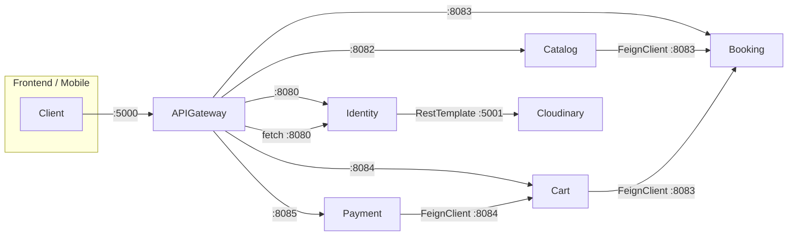

# 🔍 GoStay System Audit Report
> **Ngày kiểm tra:** 2026-05-24 | **Nhánh:** `TestSystem` | **Commit:** `2a5cead`

---

## 📊 Tổng quan Hệ thống

| # | Service | Port | Database | Ngôn ngữ | Build |
|---|---------|------|----------|----------|-------|
| 1 | **Identity** | 8080 | `auth_db` | Java/Spring Boot | ✅ PASS |
| 2 | **CatalogandListing** | 8082 | `cataloglisting` | Java/Spring Boot | ✅ PASS |
| 3 | **BookingandInventory** | 8083 | `bookinginventory` | Java/Spring Boot | ✅ PASS |
| 4 | **CartandOrder** | 8084 | `cartorder` | Java/Spring Boot | ✅ PASS |
| 5 | **PaymentandWallet** | 8085 | `paymentwallet` | Java/Spring Boot | ✅ PASS |
| 6 | **APIGateway** | 5000 | — | Node.js/Express | ✅ OK |
| 7 | **cloudinary-service** | 5001 | — | Node.js | ✅ OK |

> **Tất cả 5 service Java đều compile thành công**, không có lỗi cú pháp hay xung đột sau merge.

---

## 🚨 Lỗi Nghiêm Trọng Đã Phát Hiện & Sửa

### BUG 1: SecurityConfig ROLE double-prefix (CartandOrder + PaymentandWallet) 🔴 CRITICAL

**Vấn đề:**
JWT token từ Identity chứa scope claim: `"ROLE_USER ROLE_HOST"` (đã có prefix `ROLE_`).
Nhưng `CartandOrder` và `PaymentandWallet` cấu hình `setAuthorityPrefix("ROLE_")` → Spring Security nối thêm prefix → authority thành `"ROLE_ROLE_USER"`.

**Hậu quả:** Tất cả `@PreAuthorize("hasRole('ADMIN')")` trong 2 service này **sẽ luôn FAIL** (403 Forbidden).
Hiện tại chưa phát hiện vì Cart/Payment chỉ dùng `isAuthenticated()` nhưng trong tương lai khi thêm role check thì sẽ bể.

**Đã sửa:**
```diff
- grantedAuthoritiesConverter.setAuthorityPrefix("ROLE_");
- grantedAuthoritiesConverter.setAuthoritiesClaimName("scope");
+ grantedAuthoritiesConverter.setAuthorityPrefix(""); // JWT already contains "ROLE_" prefix
```

**Files:**
- [CartandOrder/SecurityConfig.java](file:///Users/nhannt/Desktop/desktop/project/GoStay/CartandOrder/src/main/java/com/GoTravel/CartandOrder/configuration/SecurityConfig.java)
- [PaymentandWallet/SecurityConfig.java](file:///Users/nhannt/Desktop/desktop/project/GoStay/PaymentandWallet/src/main/java/com/gotravel/PaymentandWallet/configuration/SecurityConfig.java)

---

### BUG 2: CatalogandListing SecurityConfig sai permitAll path 🔴 CRITICAL

**Vấn đề:**
SecurityConfig cho phép `/api/public/**` nhưng **KHÔNG CÓ controller nào** dùng prefix đó.
Controller public thực tế dùng `/api/v1/catalog/listings/**`.

**Hậu quả:** API xem listing public (`GET /api/v1/catalog/listings/{id}`) **sẽ trả 401 Unauthorized** cho user chưa đăng nhập → khách hàng không thể xem dịch vụ!

**Đã sửa:**
```diff
- .requestMatchers("/api/public/**").permitAll()
+ .requestMatchers("/api/v1/catalog/listings/**").permitAll()
+ .requestMatchers("/api/v1/internal/**").hasAuthority(InternalServiceTokenFilter.AUTHORITY)
```

**File:** [CatalogandListing/SecurityConfig.java](file:///Users/nhannt/Desktop/desktop/project/GoStay/CatalogandListing/src/main/java/com/Listing/CatalogandListing/configuration/SecurityConfig.java)

---

### BUG 3: Internal endpoints public qua Gateway/backend 🔴 ĐÃ SỬA

`/api/v1/internal/**` và `/api/users/internal/**` không còn public. APIGateway chặn mọi request `/api/v1/internal/**`, các route proxy internal đã bị gỡ, backend yêu cầu authority `INTERNAL_SERVICE` do `InternalServiceTokenFilter` cấp sau khi verify `X-Internal-Service-Token`.

Tất cả service và APIGateway phải dùng cùng `INTERNAL_SERVICE_TOKEN` từ environment; nếu token backend chưa được cấu hình, internal endpoint trả lỗi thay vì mở public.

---

### BUG 4: Admin seed reset mật khẩu hardcoded mỗi lần chạy 🔴 ĐÃ SỬA

`DataSeedForAdmin` không còn tự reset user `admin`, không còn mật khẩu mặc định, và không tự gán role ADMIN cho account đã tồn tại.

Muốn bootstrap admin lần đầu phải bật explicit bằng environment:

```bash
ADMIN_BOOTSTRAP_ENABLED=true
ADMIN_BOOTSTRAP_USERNAME=admin
ADMIN_BOOTSTRAP_EMAIL=admin@example.com
ADMIN_BOOTSTRAP_PASSWORD='StrongPassword123!'
```

Nếu username đã tồn tại, seed sẽ bỏ qua và không sửa password/role của account đó. Password bootstrap bắt buộc tối thiểu 12 ký tự và có chữ thường, chữ hoa, số, ký tự đặc biệt.

---

### BUG 5: SePay webhook public có thể bị giả mạo 🔴 ĐÃ SỬA

`SepayWebhookController` không còn nhận webhook public không xác thực. Mặc định dùng HMAC-SHA256 theo header `X-SePay-Signature` + `X-SePay-Timestamp`; có thể đổi sang API Key bằng `SEPAY_WEBHOOK_AUTH_MODE=API_KEY`.

Các biến cần cấu hình:

```bash
SEPAY_WEBHOOK_AUTH_MODE=HMAC_SHA256
SEPAY_WEBHOOK_SECRET='secret-key-tren-dashboard-sepay'
```

Hoặc:

```bash
SEPAY_WEBHOOK_AUTH_MODE=API_KEY
SEPAY_API_TOKEN='api-key-tren-dashboard-sepay'
```

Webhook chỉ hoàn tất payment khi giao dịch là tiền vào, số tiền chuyển khoản khớp đúng `PaymentRequest.amount`, tài khoản nhận khớp cấu hình, payment còn pending, và SePay transaction id chưa được xử lý. Duplicate webhook được xử lý idempotent.

---

### BUG 6: Client tự gửi giá/amount/hostId và IDOR order/payment 🔴 ĐÃ SỬA

Cart/Order không còn tin `listingTitle`, `thumbnailUrl`, `unitPrice` từ client. CartandOrder gọi Catalog để lấy snapshot tin cậy của listing, tự set title/thumbnail/host/basePrice và tự tính total. Checkout cart cũng refresh lại toàn bộ cart item trước khi tạo order để xử lý các item cũ đã bị sửa giá.

Payment không còn tin `amount` và `hostId` từ request tạo payment. PaymentandWallet gọi internal endpoint của CartandOrder để lấy order summary, kiểm tra order thuộc đúng `X-User-Id`, order đang `PAYMENT_PENDING`, rồi lấy `totalAmount`/`hostId` từ order để tạo QR/payment.

Order/payment detail đã kiểm tra ownership:

- `GET /api/v1/orders/{orderId}` dùng `findByIdAndUserId`.
- `GET /api/v1/payments/{paymentId}` dùng `findByIdAndUserId`.
- `GET /api/v1/payments/order/{orderId}` dùng `findByOrderIdAndUserId`.

---

### BUG 7: Validation thiếu làm sai tồn kho/tổng tiền 🔴 ĐÃ SỬA

`BookNowRequest.item` đã cascade validate bằng `@Valid`; `CartItemRequest` và `UpdateCartItemRequest` validate quantity > 0, ngày không ở quá khứ, và endDate không trước startDate.

Internal inventory lock validate ở cả controller và service. `BatchLockRequest` yêu cầu orderId, danh sách item không rỗng, listingId/date đầy đủ, quantity > 0. `InventoryInternalService` cũng tự guard lại request trước khi trừ tồn kho, nên quantity âm không thể làm tăng `availableQuantity`. Khi cancel lock, lock có quantity null/<=0 sẽ bị reject thay vì cộng/trừ tồn kho sai.

---

### BUG 8: Media delete cho phép xóa ảnh bất kỳ nếu biết publicId 🔴 ĐÃ SỬA

Media service không còn xóa trực tiếp theo `publicId` client gửi lên. Upload mới được đưa vào folder có scope owner như `users/{userId}/...`, `hosts/{userId}/...`, `enterprises/{userId}/...`, `admins/{userId}/...`.

Route delete giờ validate `publicId`, chặn path traversal, kiểm tra role chính xác, và chỉ gọi Cloudinary `destroy` nếu `publicId` nằm trong prefix mà user hiện tại được sở hữu. User/host/enterprise không thể xóa ảnh của account khác và không được xóa private resource; admin/internal service mới có quyền xóa phạm vi rộng hơn.

---

## 🔗 APIGateway Route Coverage (Đã viết lại ĐẦY ĐỦ)

### Identity Service (Port 8080)

| Gateway URL | → Backend URL | Auth | Method |
|------------|---------------|------|--------|
| `/.well-known/jwks.json` | ← same | ❌ | GET |
| `/api/v1/auth/login` | → `/api/auth/login` | ❌ | POST |
| `/api/v1/auth/register` | → `/api/users` | ❌ | POST |
| `/api/v1/me` | → `/api/users/me` | ✅ | GET, PUT |
| `/api/v1/me/profile` | → `/api/users/me/profile` | ✅ | GET, PUT |
| `/api/v1/me/avatar` | → `/api/users/me/avatar` | ✅ | POST |
| `/api/v1/me/upgrade-host` | → `/api/users/me/upgradetohost` | ✅ | POST, DELETE |
| `/api/v1/me/upgrade-enterprise` | → `/api/users/me/upgradetoenterprise` | ✅ | POST |
| `/api/v1/me/host-profile` | → `/api/users/me/host-profile` | ✅ | GET, PUT |
| `/api/v1/me/enterprise-profile` | → `/api/users/me/enterprise-profile` | ✅ | GET, PUT |
| `/api/v1/admin/users` | → `/api/users` | ✅ | GET |
| `/api/v1/admin/users/{id}` | → `/api/users/admin/{id}` | ✅ | DELETE, PATCH |
| `/api/v1/admin/users/{id}/role` | → `/api/users/{id}/upgraderole` | ✅ | POST |
| `/api/v1/admin/accounts/{id}/status` | → `/api/users/accounts/{id}/status` | ✅ | PUT |
| `/api/v1/admin/hosts` | → `/api/users/hosts` | ✅ | GET |
| `/api/v1/admin/hosts/all` | → `/api/users/hosts/all` | ✅ | GET |
| `/api/v1/admin/hosts/{id}` | → `/api/users/hosts/{id}` | ✅ | GET |
| `/api/v1/admin/hosts/{id}/approval` | → `/api/users/{id}/approvalstatus` | ✅ | PUT |
| `/api/v1/admin/hosts/{id}/success` | → `/api/users/{id}/successupgradetohost` | ✅ | POST |
| `/api/users/internal/{id}/status` | Không expose qua Gateway | Internal token | GET |

### CatalogandListing Service (Port 8082) — 11 endpoints

| Gateway URL | Auth | Method | Mô tả |
|------------|------|--------|-------|
| `/api/v1/catalog/listings/{id}` | ❌ | GET | Xem chi tiết listing |
| `/api/v1/catalog/listings/{id}/reviews` | ❌ | GET | Xem đánh giá listing |
| `/api/v1/catalog/reviews` | ✅ | POST | Gửi đánh giá |
| `/api/v1/catalog/host/landmark-suggestions` | ✅ | POST | Đề xuất địa danh |
| `/api/v1/catalog/host/complexes` | ✅ | POST | Tạo khu tổ hợp |
| `/api/v1/catalog/host/listings` | ✅ | POST, GET | Tạo/Xem listing |
| `/api/v1/catalog/host/listings/{id}` | ✅ | PUT, DELETE | Sửa/Xóa listing |
| `/api/v1/catalog/admin/landmark-suggestions` | ✅ | GET | Xem đề xuất |
| `/api/v1/catalog/admin/landmark-suggestions/{id}/status` | ✅ | PUT | Duyệt đề xuất |
| `/api/v1/catalog/admin/landmarks` | ✅ | POST | Tạo landmark |
| `/api/v1/catalog/admin/landmarks/{id}` | ✅ | PUT | Sửa landmark |
| `/api/v1/catalog/admin/landmarks/{id}/status` | ✅ | PATCH | Đổi trạng thái |

### BookingandInventory Service (Port 8083)

| Gateway URL | Auth | Method | Mô tả |
|------------|------|--------|-------|
| `/api/v1/public/inventory/listings/{id}/availability` | ❌ | GET | Kiểm tra phòng trống |
| `/api/v1/host/inventory/listings/{id}/calendars` | ✅ | GET | Xem lịch tháng |
| `/api/v1/host/inventory/listings/{id}/calendars/block` | ✅ | PUT | Đóng/mở ngày |
| `/api/v1/host/inventory/listings/{id}/occupancy-rate` | ✅ | GET | Thống kê công suất |
| `/api/v1/host/inventory/listings/{id}/locks` | ✅ | GET | Xem locks |
| `/api/v1/admin/inventory/listings/{id}/force-update` | ✅ | PUT | Phong tỏa dịch vụ |
| `/api/v1/admin/inventory/listings/{id}/sync` | ✅ | POST | Đồng bộ tồn kho |
| `/api/v1/internal/inventory/**` | Không expose qua Gateway | Service-to-service + internal token | Khởi tạo/lock/confirm/cancel kho |

### CartandOrder Service (Port 8084)

| Gateway URL | Auth | Method | Mô tả |
|------------|------|--------|-------|
| `/api/v1/carts` | ✅ | GET | Xem giỏ hàng |
| `/api/v1/carts/items` | ✅ | POST | Thêm vào giỏ |
| `/api/v1/carts/items/{itemId}` | ✅ | PUT, DELETE | Sửa/xóa item |
| `/api/v1/orders/checkout-cart` | ✅ | POST | Checkout giỏ |
| `/api/v1/orders/book-now` | ✅ | POST | Đặt nhanh |
| `/api/v1/orders/{orderId}` | ✅ | GET | Chi tiết đơn |
| `/api/v1/orders` | ✅ | GET | Lịch sử đơn |
| `/api/v1/orders/{orderId}/cancel` | ✅ | PUT | Hủy đơn |
| `/api/v1/internal/orders/**` | Không expose qua Gateway | Service-to-service + internal token | Ghi nhận kết quả thanh toán |

### PaymentandWallet Service (Port 8085)

| Gateway URL | Auth | Method | Mô tả |
|------------|------|--------|-------|
| `/api/v1/public/payments/sepay-webhook` | ❌ | POST | Nhận webhook SePay |
| `/api/v1/payments/create` | ✅ | POST | Tạo thanh toán + QR |
| `/api/v1/payments/{paymentId}` | ✅ | GET | Chi tiết payment |
| `/api/v1/payments/order/{orderId}` | ✅ | GET | Payment theo đơn |
| `/api/v1/payments/history` | ✅ | GET | Lịch sử thanh toán |
| `/api/v1/payouts/me` | ✅ | GET | Host xem thu nhập |
| `/api/v1/payouts/{payoutId}/mark-paid` | ✅ | PUT | Admin đánh dấu đã trả |
| `/api/v1/internal/payments/**` | Không expose qua Gateway | Service-to-service + internal token | Kiểm tra trạng thái thanh toán |

---

## 🔌 Giao tiếp giữa các Microservices (FeignClient)



| Caller | → Callee | Endpoint gọi | Mục đích |
|--------|----------|-------------|----------|
| CatalogandListing | → BookingandInventory | `POST /api/v1/internal/inventory/initialize` | Khởi tạo kho khi tạo listing |
| CartandOrder | → BookingandInventory | `POST /api/v1/internal/inventory/locks` | Lock phòng khi đặt |
| CartandOrder | → BookingandInventory | `PUT /api/v1/internal/inventory/locks/{id}/confirm` | Chốt phòng |
| CartandOrder | → BookingandInventory | `PUT /api/v1/internal/inventory/locks/{id}/cancel` | Hủy + hoàn phòng |
| PaymentandWallet | → CartandOrder | `PUT /api/v1/internal/orders/{id}/payment-success` | Ghi nhận TT thành công |
| PaymentandWallet | → CartandOrder | `PUT /api/v1/internal/orders/{id}/payment-failed` | Ghi nhận TT thất bại |
| APIGateway | → Identity | `GET /api/users/internal/{id}/status` | Kiểm tra user bị ban? |
| Identity | → cloudinary-service | `POST /api/v1/media/upload` | Upload avatar, CCCD |

Các endpoint internal dùng header `X-Internal-Service-Token`; header này bị strip ở Gateway để client không thể giả mạo.

---

## ✅ Những thứ hoạt động tốt

1. **JWT JWKS** — Tất cả 4 service đều trỏ đúng `jwk-set-uri: http://localhost:8080/.well-known/jwks.json`
2. **Database isolation** — Mỗi service có DB riêng, không đụng nhau
3. **Port allocation** — Không trùng port (8080, 8082, 8083, 8084, 8085)
4. **@EnableFeignClients** — Đã bật trên cả 3 service cần gọi nội bộ
5. **@EnableScheduling** — PaymentandWallet có scheduler hết hạn payment hoạt động đúng
6. **Rate limiting** — APIGateway có rate limit cho login (10/15min) và register (5/1h)
7. **User ban check** — APIGateway middleware kiểm tra user status trước khi forward request
8. **Internal security** — Gateway strip header `x-internal-service-token`, không proxy `/api/v1/internal/**`, backend verify shared internal token trước khi xử lý

---

## ⚠️ Cảnh báo & Gợi ý cải thiện

### 1. `start-all.sh` chưa cập nhật
File `start-all.sh` hiện chỉ khởi động Identity + APIGateway + Cloudinary. Cần thêm 4 service còn lại nếu muốn dùng trên Linux/Codespaces.

### 2. APIGateway thiếu route cho `/api/v1/admin/inventory` và `/api/v1/admin/hosts`
Cả 2 URL prefix `/api/v1/admin` đều match vào Identity route.  
Nhưng nhờ sorting theo URL length (`routes.sort(b.url.length - a.url.length)`), các URL dài hơn như `/api/v1/admin/inventory` sẽ match đúng vào Booking route trước. → **OK, không bị conflict.**

### 3. Chưa có Search Listing API
`CatalogPublicController` hiện chỉ có xem chi tiết 1 listing. Chưa có endpoint tìm kiếm/lọc danh sách listings (theo vùng, giá, loại hình...).

### 4. `.env` file chưa có trong `.gitignore`
File `APIGateway/.env` nên được thêm vào `.gitignore` để tránh leak API token. (Hiện tại `.gitignore` đã có `**/.env` nên OK).

### 5. `HostPayoutController` dùng `mark-paid` bằng tay
Admin phải bấm nút mark-paid cho từng payout. Nên cân nhắc auto-payout hoặc batch processing.

---

## 📁 Files đã chỉnh sửa trong phiên này

| File | Thay đổi |
|------|---------|
| `CatalogandListing/.../SecurityConfig.java` | Fix permitAll path + thêm internal |
| `CartandOrder/.../SecurityConfig.java` | Fix ROLE_ double-prefix |
| `PaymentandWallet/.../SecurityConfig.java` | Fix ROLE_ double-prefix |
| `APIGateway/src/configs/routes/catalog.route.js` | Viết lại đầy đủ 11 endpoints |
| `APIGateway/src/configs/routes/booking.route.js` | Viết lại đầy đủ 9 endpoints |
| `APIGateway/src/configs/routes/cart.route.js` | Viết lại đầy đủ 8 endpoints |
| `APIGateway/src/configs/routes/payment.route.js` | Viết lại đầy đủ 7 endpoints |
| `APIGateway/src/configs/routes/identity.route.js` | Viết lại với docs + endpoint mới |
| `Identity/.../DataSeedForAdmin.java` | Không reset admin; bootstrap có điều kiện qua env |
| `CartandOrder/.../CatalogClient.java` | Lấy listing snapshot server-side từ Catalog |
| `CartandOrder/.../CartService.java` | Bỏ tin giá/title/thumbnail client gửi khi add/update cart |
| `CartandOrder/.../OrderService.java` | Refresh giá từ Catalog, chặn multi-host checkout, check owner order detail |
| `CartandOrder/.../InternalOrderController.java` | Thêm internal order payment summary cho Payment |
| `PaymentandWallet/.../CreatePaymentRequest.java` | `amount`/`hostId` không còn là input tin cậy |
| `PaymentandWallet/.../PaymentController.java` | Check `X-User-Id` khi xem payment detail |
| `PaymentandWallet/.../OrderClient.java` | Lấy order summary nội bộ trước khi tạo payment |
| `PaymentandWallet/.../SepayWebhookController.java` | Verify HMAC/API Key trước khi xử lý webhook |
| `PaymentandWallet/.../PaymentService.java` | Check amount, transfer type, bank account, idempotency trước khi complete |
| `CartandOrder/.../BookNowRequest.java` | Cascade validate nested item |
| `CartandOrder/.../UpdateCartItemRequest.java` | Validate quantity/date khi update cart |
| `BookingandInventory/.../BatchLockRequest.java` | Validate inventory lock item trước controller |
| `BookingandInventory/.../InventoryInternalService.java` | Service-level guard chống quantity âm làm sai tồn kho |
| `PaymentandWallet/src/main/resources/sepay.yaml` | Lấy SePay secret/token từ env, không hardcode rỗng |
| `cloudinary-service/src/utils/mediaOwnership.js` | Thêm scope ownership cho upload/delete media |
| `cloudinary-service/src/middlewares/rbac.middleware.js` | Gắn folder theo role + owner thay vì tin folder public |
| `cloudinary-service/src/controllers/media.controller.js` | Validate ownership trước khi Cloudinary destroy |
| `cloudinary-service/src/constants/error_code.js` | Thêm lỗi publicId không hợp lệ/không có quyền |
| `*/configuration/InternalServiceTokenFilter.java` | Bắt buộc `X-Internal-Service-Token` cho internal endpoint |
| `*/configuration/InternalFeignConfig.java` | Tự gắn internal token cho Feign service-to-service |
| `APIGateway/src/gateway/proxy.routes.js` | Import tất cả route files |
| `APIGateway/.env.example` | Thêm cấu hình mẫu gồm `INTERNAL_SERVICE_TOKEN` |
